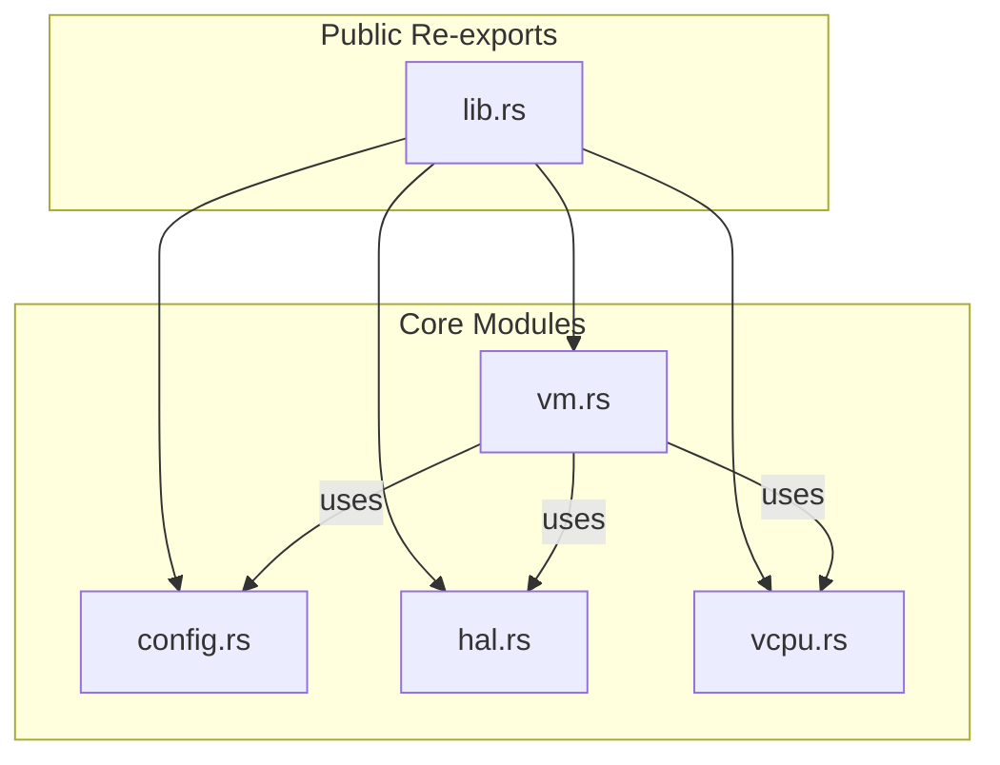

# API Reference

<cite>
**Referenced Files in This Document**   
- [lib.rs](file://src/lib.rs)
- [vm.rs](file://src/vm.rs)
- [config.rs](file://src/config.rs)
- [hal.rs](file://src/hal.rs)
- [vcpu.rs](file://src/vcpu.rs)
</cite>

## Table of Contents
1. [Introduction](#introduction)
2. [Module Organization](#module-organization)
3. [AxVM: Virtual Machine Core](#axvm-virtual-machine-core)
4. [AxVMConfig: VM Configuration](#axvmconfig-vm-configuration)
5. [AxVMHal: Hardware Abstraction Layer](#axvmhal-hardware-abstraction-layer)
6. [AxVCpuRef: vCPU Reference Type](#axvcpuref-vcpu-reference-type)
7. [Cross-References and Usage Examples](#cross-references-and-usage-examples)

## Introduction
The `axvm` crate provides a minimal virtual machine monitor (VMM) for running guest VMs with architecture-independent interfaces. It abstracts hardware virtualization features through pluggable HALs and supports multiple architectures including x86_64, AArch64, and RISC-V. The public API exports core types for VM lifecycle management, configuration, CPU abstraction, and low-level hardware interaction.

This document details all publicly exported interfaces from the `axvm` crate, organized by module and type. Each major component is documented with constructors, methods, fields, and associated constants as defined in the source code. Cross-references between related APIs are provided to illustrate typical usage patterns such as VM creation, vCPU execution, and memory mapping.

**Section sources**
- [lib.rs](file://src/lib.rs#L1-L33)

## Module Organization
The crate's public API surface is structured across several modules:
- `vm`: Contains the main `AxVM` struct and related vCPU references.
- `config`: Defines configuration structures used during VM creation.
- `hal`: Exports the `AxVMHal` trait that must be implemented by the underlying system.
- `vcpu`: Architecture-specific vCPU implementations re-exported for internal use.

Public types are re-exported at the crate root via `lib.rs`, making them accessible directly under the `axvm` namespace. These include `AxVM`, `AxVMRef`, `AxVCpuRef`, and `AxVMHal`.



**Diagram sources**
- [lib.rs](file://src/lib.rs#L1-L33)
- [vm.rs](file://src/vm.rs#L1-L627)
- [config.rs](file://src/config.rs#L1-L195)
- [hal.rs](file://src/hal.rs#L1-L44)
- [vcpu.rs](file://src/vcpu.rs#L1-L30)

**Section sources**
- [lib.rs](file://src/lib.rs#L1-L33)
- [vm.rs](file://src/vm.rs#L1-L627)

## AxVM: Virtual Machine Core

### Structure Definition
```rust
pub struct AxVM<H: AxVMHal, U: AxVCpuHal>
```
Represents a virtual machine instance with architecture-independent interface. Generic over `H` (`AxVMHal`) for platform-specific operations and `U` (`AxVCpuHal`) for vCPU-level interactions.

**Section sources**
- [vm.rs](file://src/vm.rs#L55-L627)

### Constructor
[SPEC SYMBOL](file://src/vm.rs#L66-L318):  
Creates a new VM with the given configuration. Returns an error if the configuration is invalid. The VM is not started until `boot()` is called.

**Parameters:**  
- `config`: An `AxVMConfig` object containing all necessary setup parameters.

**Returns:**  
- `AxResult<AxVMRef<H, U>>`: A reference-counted handle to the newly created VM.

**Error Conditions:**  
- `InvalidInput`: If memory region flags are illegal or translation fails.
- `Unsupported`: If hardware virtualization support is missing.
- `BadState`: If attempting to create a VM while another is already running.

**Cross-Reference:** Accepts `AxVMConfig` produced from `AxVMCrateConfig` via `From` trait implementation.

### Methods
[SPEC SYMBOL](file://src/vm.rs#L322-L330):  
Retrieves the vCPU corresponding to the given `vcpu_id`. Returns `None` if the vCPU does not exist.

[SPEC SYMBOL](file://src/vm.rs#L334-L337):  
Returns a slice of all vCPUs associated with this VM.

[SPEC SYMBOL](file://src/vm.rs#L310-L313):  
Returns the unique identifier of the VM.

[SPEC SYMBOL](file://src/vm.rs#L339-L349):  
Returns the base address of the two-stage address translation page table (EPT root).

[SPEC SYMBOL](file://src/vm.rs#L351-L362):  
Returns guest VM image load region as a list of mutable byte buffers. Useful for loading kernel images into guest memory.

[SPEC SYMBOL](file://src/vm.rs#L364-L367):  
Checks whether the VM is currently running.

[SPEC SYMBOL](file://src/vm.rs#L369-L380):  
Boots the VM by setting the running flag. Fails if hardware lacks virtualization support or VM is already running.

[SPEC SYMBOL](file://src/vm.rs#L382-L398):  
Checks whether the VM is shutting down.

[SPEC SYMBOL](file://src/vm.rs#L390-L405):  
Initiates graceful shutdown of the VM. Once shut down, the VM cannot be restarted.

[SPEC SYMBOL](file://src/vm.rs#L407-L415):  
Returns a reference to the VM’s emulated devices.

[SPEC SYMBOL](file://src/vm.rs#L419-L492):  
Executes a single vCPU loop, handling exits due to MMIO, I/O, sysreg access, or page faults. Automatically resumes execution for handled events.

**Parameters:**  
- `vcpu_id`: ID of the vCPU to run.

**Returns:**  
- `AxResult<AxVCpuExitReason>`: Exit reason when unhandled condition occurs.

[SPEC SYMBOL](file://src/vm.rs#L494-L515):  
Injects an interrupt to one or more target vCPUs.

**Parameters:**  
- `targets`: A `CpuMask` indicating which vCPUs should receive the interrupt.
- `irq`: Interrupt request number to inject.

**Note:** Only supported within the same VM context.

[SPEC SYMBOL](file://src/vm.rs#L517-L520):  
Returns a reference to the original configuration used to create the VM.

[SPEC SYMBOL](file://src/vm.rs#L522-L534):  
Maps a region of host physical memory to guest physical memory with specified flags.

[SPEC SYMBOL](file://src/vm.rs#L536-L539):  
Unmaps a region of guest physical memory.

[SPEC SYMBOL](file://src/vm.rs#L541-L579):  
Reads a value of type `T` from guest physical memory.

**Requirements:**  
- Address must be properly aligned for type `T`.
- Memory must be mapped and accessible.

[SPEC SYMBOL](file://src/vm.rs#L581-L608):  
Writes a value of type `T` to guest physical memory.

[SPEC SYMBOL](file://src/vm.rs#L610-L621):  
Allocates an Inter-VM Communication (IVC) channel with requested size (aligned to 4K).

**Returns:**  
- `(GuestPhysAddr, usize)`: Allocated GPA and actual size.

[SPEC SYMBOL](file://src/vm.rs#L623-L626):  
Releases an allocated IVC channel.

## AxVMConfig: VM Configuration

### Structure Definition
```rust
pub struct AxVMConfig
```
Contains all configuration parameters required to instantiate a VM. Constructed via `From<AxVMCrateConfig>` from TOML-based configuration.

**Section sources**
- [config.rs](file://src/config.rs#L48-L195)

### Fields
- `id`: Unique identifier for the VM.
- `name`: Human-readable name.
- `vm_type`: Type classification (e.g., general-purpose, real-time).
- `cpu_num`: Number of virtual CPUs.
- `phys_cpu_ids`: Optional mapping of vCPU IDs to physical CPU IDs.
- `phys_cpu_sets`: Optional CPU affinity masks per vCPU.
- `cpu_config`: Entry points for BSP and AP.
- `image_config`: Load addresses for kernel, BIOS, DTB, ramdisk.
- `memory_regions`: List of memory regions with mapping types and flags.
- `emu_devices`: Emulated device configurations.
- `pass_through_devices`: Devices passed through directly.
- `spi_list`: List of SPI interrupts to assign in passthrough mode.
- `interrupt_mode`: Whether to use passthrough or virtualized interrupts.

### Methods
[SPEC SYMBOL](file://src/config.rs#L96-L99):  
Returns the VM ID.

[SPEC SYMBOL](file://src/config.rs#L101-L104):  
Returns a clone of the VM name.

[SPEC SYMBOL](file://src/config.rs#L113-L130):  
Generates tuples of `(vcpu_id, pcpu_affinity_mask, physical_id)` for scheduling decisions.

[SPEC SYMBOL](file://src/config.rs#L132-L135):  
Returns a reference to image load configuration.

[SPEC SYMBOL](file://src/config.rs#L137-L140):  
Returns the bootstrap processor entry point in guest physical address.

[SPEC SYMBOL](file://src/config.rs#L143-L146):  
Returns the application processor entry point.

[SPEC SYMBOL](file://src/config.rs#L149-L152):  
Returns a reference to configured memory regions.

[SPEC SYMBOL](file://src/config.rs#L154-L157):  
Adds a new memory region to the configuration.

[SPEC SYMBOL](file://src/config.rs#L159-L164):  
Checks if any memory region contains the specified address range.

[SPEC SYMBOL](file://src/config.rs#L166-L169):  
Returns a reference to emulated device list.

[SPEC SYMBOL](file://src/config.rs#L171-L174):  
Returns a reference to pass-through device list.

[SPEC SYMBOL](file://src/config.rs#L176-L179):  
Adds a new pass-through device.

[SPEC SYMBOL](file://src/config.rs#L181-L184):  
Adds a passthrough SPI interrupt to be assigned on VM creation.

[SPEC SYMBOL](file://src/config.rs#L186-L189):  
Returns a reference to the list of passthrough SPIs.

[SPEC SYMBOL](file://src/config.rs#L191-L194):  
Returns the interrupt delivery mode (passthrough or virtualized).

## AxVMHal: Hardware Abstraction Layer

### Trait Definition
```rust
pub trait AxVMHal: Sized
```
Defines the set of OS/hypervisor-provided services required by the VMM.

**Section sources**
- [hal.rs](file://src/hal.rs#L4-L44)

### Associated Types
[SPEC SYMBOL](file://src/hal.rs#L7-L9):  
Specifies the paging handler implementation responsible for managing second-stage page tables.

### Required Methods
[SPEC SYMBOL](file://src/hal.rs#L12-L15):  
Attempts to allocate a memory region at a specific host physical address. Returns `true` on success.

[SPEC SYMBOL](file://src/hal.rs#L18-L20):  
Deallocates a previously allocated memory region.

[SPEC SYMBOL](file://src/hal.rs#L23-L25):  
Converts a host virtual address to its corresponding physical address.

[SPEC SYMBOL](file://src/hal.rs#L28-L30):  
Returns current time in nanoseconds.

[SPEC SYMBOL](file://src/hal.rs#L33-L35):  
Returns the current VM's identifier.

[SPEC SYMBOL](file://src/hal.rs#L38-L40):  
Returns the current vCPU identifier.

[SPEC SYMBOL](file://src/hal.rs#L43-L45):  
Returns the current physical CPU identifier.

[SPEC SYMBOL](file://src/hal.rs#L48-L51):  
Determines which physical CPU hosts a given vCPU in a specific VM.

[SPEC SYMBOL](file://src/hal.rs#L54-L60):  
Injects an IRQ to a specified vCPU by routing it to its underlying physical CPU.

## AxVCpuRef: vCPU Reference Type

### Type Alias
```rust
pub type AxVCpuRef<U: AxVCpuHal> = Arc<VCpu<U>>
```
A reference-counted smart pointer to a vCPU instance, allowing shared ownership and thread-safe access.

**Section sources**
- [vm.rs](file://src/vm.rs#L31-L33)

### Underlying Implementation
The actual vCPU implementation is architecture-specific and defined via:
- `x86_64`: `x86_vcpu::VmxArchVCpu`
- `aarch64`: `arm_vcpu::Aarch64VCpu`
- `r