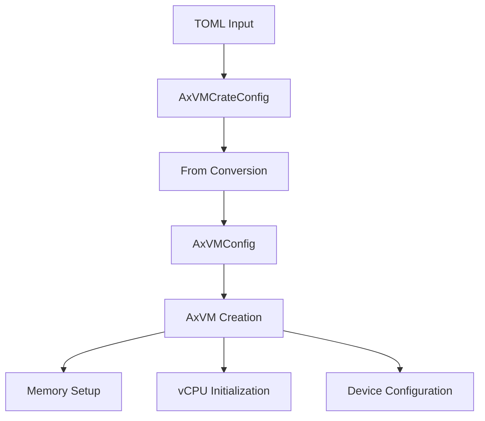
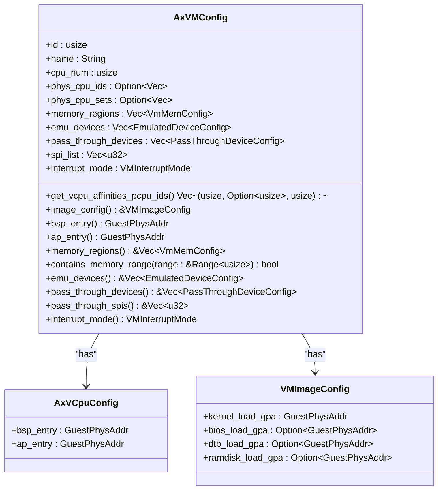
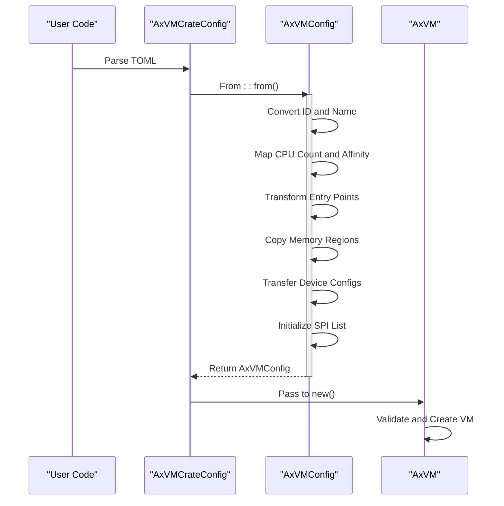

# Configuration API Reference

<cite>
**Referenced Files in This Document**   
- [config.rs](file://src/config.rs)
- [vm.rs](file://src/vm.rs)
</cite>

## Table of Contents
1. [Introduction](#introduction)
2. [Core Components](#core-components)
3. [Architecture Overview](#architecture-overview)
4. [Detailed Component Analysis](#detailed-component-analysis)
5. [Dependency Analysis](#dependency-analysis)
6. [Performance Considerations](#performance-considerations)
7. [Troubleshooting Guide](#troubleshooting-guide)
8. [Conclusion](#conclusion)

## Introduction
This document provides comprehensive API documentation for the `AxVMConfig` struct and associated conversion traits defined in `config.rs`. It details the configuration structure used to define virtual machine parameters including guest memory size, vCPU count, device specifications, and architecture-specific settings. The document explains the transformation from high-level TOML-based `AxVMCrateConfig` to runtime-ready `AxVMConfig`, covering validation logic, error handling, and integration with dependent components such as memory management and device initialization.

## Core Components
The core configuration system revolves around the `AxVMConfig` struct which serves as the central data structure for defining VM properties. This struct is derived from `AxVMCrateConfig`, a TOML-parsable configuration format, through a well-defined `From` trait implementation. Key components include CPU configuration (`AxVCpuConfig`), image loading addresses (`VMImageConfig`), memory regions, emulated and pass-through devices, and interrupt mode settings. These configurations are consumed during VM creation in `vm.rs` to initialize address spaces, set up vCPUs, and configure device models.

**Section sources**
- [config.rs](file://src/config.rs#L0-L195)

## Architecture Overview
The configuration architecture follows a two-stage pattern where high-level user-provided TOML configurations are first parsed into `AxVMCrateConfig`, then converted into the runtime-optimized `AxVMConfig`. This separation allows for flexible input formats while ensuring efficient access patterns during VM instantiation. The resulting `AxVMConfig` is used by the `AxVM` constructor to establish memory mappings, initialize vCPUs with appropriate entry points, and configure both emulated and pass-through devices according to the specified interrupt mode.



**Diagram sources **
- [config.rs](file://src/config.rs#L66-L103)
- [vm.rs](file://src/vm.rs#L43-L73)

## Detailed Component Analysis

### AxVMConfig Structure Analysis
The `AxVMConfig` struct encapsulates all necessary parameters for VM creation. It contains identifiers (ID and name), CPU specifications (count and physical CPU affinities), memory region definitions, device configurations, and interrupt handling modes. The configuration supports both emulated devices and direct hardware pass-through, enabling flexible deployment scenarios from full emulation to near-native performance.

#### Class Diagram of Configuration Components


**Diagram sources **
- [config.rs](file://src/config.rs#L33-L64)
- [config.rs](file://src/config.rs#L0-L31)
- [config.rs](file://src/config.rs#L33-L64)

### From<AxVMCrateConfig> Implementation Analysis
The conversion from `AxVMCrateConfig` to `AxVMConfig` performs several critical transformations and validations. During this process, kernel entry points are mapped to both BSP and AP vCPU entries, memory regions are carried over directly, and device configurations are transferred without modification. The implementation ensures type safety through explicit conversions using `GuestPhysAddr::from()` and maintains architectural flexibility by abstracting interrupt mode handling.

#### Sequence Diagram of Configuration Conversion


**Diagram sources **
- [config.rs](file://src/config.rs#L66-L103)
- [vm.rs](file://src/vm.rs#L43-L73)

### Configuration Validation and Error Handling
Validation occurs primarily during the `AxVM::new()` construction phase rather than in the configuration conversion itself. The system checks for valid memory mapping flags, warns about improper DEVICE flag usage, and validates physical memory allocation. Errors are propagated using the `AxResult` type with specific error kinds like `InvalidInput` for malformed configurations and `Unsupported` for missing hardware virtualization support.

#### Flowchart of Configuration Validation Process
```mermaid
flowchart TD
    Start([Configuration Provided]) --> Convert["Convert AxVMCrateConfig to AxVMConfig"]
    Convert --> CreateVM["Call AxVM::new(config)"]
    CreateVM --> CheckHardware{"Hardware Virtualization Supported?"}
    CheckHardware -->|No| ReturnError1["Return Unsupported Error"]
    CheckHardware -->|Yes| CheckRunning{"VM Already Running?"}
    CheckRunning -->|Yes| ReturnError2["Return BadState Error"]
    CheckRunning -->|No| SetupMemory["Setup Memory Regions"]
    SetupMemory --> ValidateFlags["Validate Mapping Flags"]
    ValidateFlags --> CheckDeviceFlag{"DEVICE Flag Present?"}
    CheckDeviceFlag -->|Yes| Warn["Warn and Skip"]
    CheckDeviceFlag -->|No| Continue
    Warn --> Continue
    Continue --> SetupDevices["