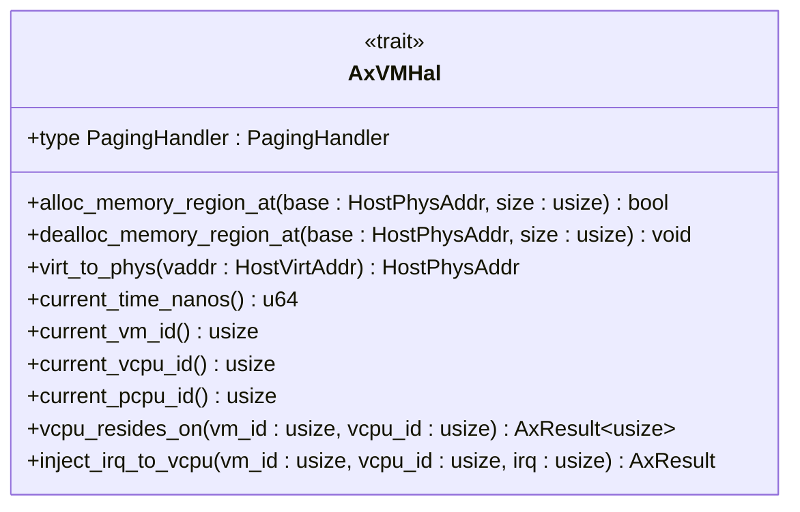
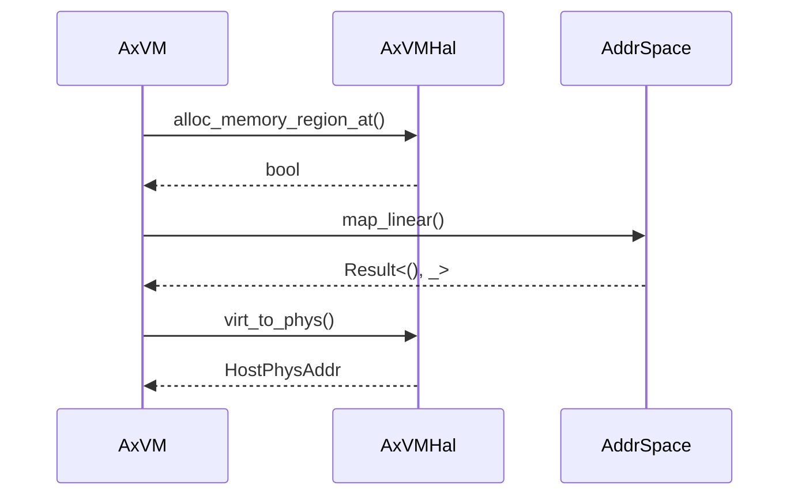

# Hardware Abstraction Layer API Reference

<cite>
**Referenced Files in This Document**   
- [hal.rs](file://src/hal.rs)
- [vm.rs](file://src/vm.rs)
- [vcpu.rs](file://src/vcpu.rs)
- [config.rs](file://src/config.rs)
- [lib.rs](file://src/lib.rs)
</cite>

## Table of Contents
1. [Introduction](#introduction)
2. [AxVMHal Trait Overview](#axvmhal-trait-overview)
3. [Associated Types](#associated-types)
4. [Required Methods](#required-methods)
5. [Implementation Guidance](#implementation-guidance)
6. [Integration with VM Operations](#integration-with-vm-operations)
7. [Architecture-Specific Requirements](#architecture-specific-requirements)
8. [Mock Implementation Example](#mock-implementation-example)

## Introduction

The `AxVMHal` trait defines the contract between the axvm virtual machine monitor and the underlying host hypervisor or kernel. It provides a hardware abstraction layer that enables axvm to operate across different platforms while maintaining consistent interfaces for critical operations such as memory management, timekeeping, and interrupt delivery. This documentation details all required associated types, methods, and their semantics, along with implementation guidance for various hypervisor backends.

**Section sources**
- [hal.rs](file://src/hal.rs#L0-L43)

## AxVMHal Trait Overview

The `AxVMHal` trait serves as the fundamental interface through which axvm interacts with the host system's virtualization capabilities. Implementors of this trait must provide implementations for all required methods, ensuring proper integration between the virtual machine monitor and the underlying hypervisor or kernel. The trait is designed to be architecture-independent while allowing for platform-specific optimizations.



**Diagram sources**
- [hal.rs](file://src/hal.rs#L0-L43)

**Section sources**
- [hal.rs](file://src/hal.rs#L0-L43)

## Associated Types

### PagingHandler

The `PagingHandler` associated type represents the low-level OS-dependent helpers required for physical address management. This type must implement the `page_table_multiarch::PagingHandler` trait, providing the necessary functionality for managing page tables in a multi-architecture environment.

This associated type enables the integration of architecture-specific paging mechanisms while maintaining a consistent interface within the axvm framework. The choice of paging handler directly impacts memory management performance and compatibility with the underlying hardware architecture.

**Section sources**
- [hal.rs](file://src/hal.rs#L6-L9)

## Required Methods

### alloc_memory_region_at

Allocates a memory region at the specified physical address.

**Preconditions:**
- The base address and size must represent a valid physical memory range
- The caller must have appropriate permissions to allocate the requested memory

**Postconditions:**
- Returns `true` if the memory region was successfully allocated
- Returns `false` if allocation failed

**Error Behavior:**
- Returns `false` on failure without panicking
- No specific error information is returned; success/failure is indicated by boolean return value

**Parameters:**
- `base`: The physical address where the memory region should be allocated
- `size`: The size of the memory region in bytes

**Section sources**
- [hal.rs](file://src/hal.rs#L12-L15)

### dealloc_memory_region_at

Deallocates a memory region at the specified physical address.

**Preconditions:**
- The memory region must have been previously allocated via `alloc_memory_region_at`
- The base address and size must exactly match the original allocation

**Postconditions:**
- The specified memory region is deallocated and made available for reuse
- No return value indicates successful completion

**Error Behavior:**
- Should handle invalid deallocation requests gracefully
- No panic expected under normal circumstances

**Parameters:**
- `base`: The physical address of the memory region to deallocate
- `size`: The size of the memory region in bytes

**Section sources**
- [hal.rs](file://src/hal.rs#L18-L20)

### virt_to_phys

Converts a virtual address to its corresponding physical address.

**Preconditions:**
- The virtual address must be valid and mapped in the current address space
- The caller must have appropriate permissions to access the virtual address

**Postconditions:**
- Returns the physical address corresponding to the input virtual address
- The conversion is deterministic for a given virtual address

**Error Behavior:**
- Should not panic; behavior for unmapped addresses is implementation-defined
- Typically returns a default value or triggers a page fault for invalid addresses

**Parameters:**
- `vaddr`: The virtual address to convert to physical

**Section sources**
- [hal.rs](file://src/hal.rs#L23-L25)

### current_time_nanos

Returns the current time in nanoseconds.

**Preconditions:**
- System clock must be initialized and running
- No specific preconditions on caller state

**Postconditions:**
- Returns a monotonically increasing timestamp
- Successive calls return equal or greater values

**Error Behavior:**
- Should never fail or panic
- Returns best-effort time value even in error conditions

**Return Value:**
- Current time measured in nanoseconds since an arbitrary epoch

**Section sources**
- [hal.rs](file://src/hal.rs#L28-L30)

### current_vm_id

Returns the identifier of the currently executing VM.

**Preconditions:**
- A VM must be currently active
- Caller must be executing within a VM context

**Postconditions:**
- Returns the unique identifier of the current VM
- Value remains stable during the lifetime of the VM execution

**Error Behavior:**
- Should not panic; behavior when no VM is active is implementation-defined
- May return a sentinel value (e.g., 0) when outside VM context

**Return Value:**
- Unique identifier of the current VM as a `usize`

**Section sources**
- [hal.rs](file://src/hal.rs#L33-L35)

### current_vcpu_id

Returns the identifier of the currently executing virtual CPU.

**Preconditions:**
- Execution must be occurring on a vCPU
- Virtualization must be active

**Postconditions:**
- Returns the unique identifier of the current vCPU
- Value remains stable during the current execution context

**Error Behavior:**
- Should not panic; may return a default value when not on a vCPU
- Implementation should ensure graceful degradation

**Return Value:**
- Unique identifier of the current vCPU as a `usize`

**Section sources**
- [hal.rs](file://src/hal.rs#L38-L40)

### current_pcpu_id

Returns the identifier of the currently executing physical CPU.

**Preconditions:**
- System must have multiple physical CPUs or cores
- Caller must have access to CPU identification information

**Postconditions:**
- Returns the unique identifier of the current physical CPU
- Value corresponds to the actual hardware CPU executing the code

**Error Behavior:**
- Should not panic; single-CPU systems may return a constant value
- Must provide consistent results across calls on the same CPU

**Return Value:**
- Identifier of the current physical CPU as a `usize`

**Section sources**
- [hal.rs](file://src/hal.rs#L43-L45)

### vcpu_resides_on

Determines the physical CPU where the specified VCPU of the current VM resides.

**Preconditions:**
- The specified VM and vCPU must exist
- Virtualization infrastructure must be properly initialized

**Postconditions:**
- Returns the physical CPU ID hosting the specified vCPU
- Operation completes successfully or returns an appropriate error

**Error Behavior:**
- Returns `AxResult<usize>` with error if the VCPU is not found
- Error propagation follows standard axvm error handling patterns
- Common errors include invalid VM ID or vCPU ID

**Parameters:**
- `vm_id`: Identifier of the VM containing the target vCPU
- `vcpu_id`: Identifier of the vCPU whose location is being queried

**Return Value:**
- `AxResult<usize>` containing the physical CPU ID on success

**Section sources**
- [hal.rs](file://src/hal.rs#L48-L54)

### inject_irq_to_vcpu

Injects an IRQ to the specified VCPU.

**Preconditions:**
- The specified VM and vCPU must exist
- The calling context must have permission to inject interrupts
- Virtualization infrastructure must be operational

**Postconditions:**
- IRQ is delivered to the target vCPU
- Operation completes successfully or returns an appropriate error

**Error Behavior:**
- Returns `AxResult` with error if the VCPU is not found
- Errors are propagated according to standard axvm conventions
- Implementation should avoid panicking on invalid inputs

**Parameters:**
- `vm_id`: Identifier of the VM containing the target vCPU
- `vcpu_id`: Identifier of the vCPU receiving the interrupt
- `irq`: Interrupt request number to inject

**Implementation Note:**
The method should locate the physical CPU where the specified VCPU resides and inject the IRQ using `axvcpu::AxVCpu::inject_interrupt`.

**Return Value:**
- `AxResult` indicating success or failure

**Section sources**
- [hal.rs](file://src/hal.rs#L57-L65)

## Implementation Guidance

When implementing the `AxVMHal` trait for different hypervisor backends, consider the following guidelines:

1. **Memory Management**: Ensure that `alloc_memory_region_at` and `dealloc_memory_region_at` integrate with the host system's memory allocator, respecting alignment requirements and avoiding conflicts with existing allocations.

2. **Address Translation**: The `virt_to_phys` implementation should leverage the host system's MMU and page table structures, handling both cached and uncached mappings appropriately.

3. **Timekeeping**: `current_time_nanos` should use high-resolution timers available on the platform, ensuring monotonicity and minimal overhead.

4. **CPU Identification**: Implementations should accurately reflect the underlying hardware topology, with `current_pcpu_id` returning stable identifiers that correspond to actual physical cores.

5. **Interrupt Delivery**: The `inject_irq_to_vcpu` method must correctly route interrupts through the appropriate hardware mechanisms (e.g., APIC, GIC) based on the architecture.

6. **Error Handling**: All methods should follow consistent error reporting patterns, with particular attention to the `Result`-returning methods that must provide meaningful error information.

**Section sources**
- [hal.rs](file://src/hal.rs#L0-L65)
- [vm.rs](file://src/vm.rs#L489-L538)

## Integration with VM Operations

The `AxVMHal` trait integrates with core VM operations through several key pathways:

### Memory Mapping
During VM creation in `AxVM::new`, the HAL's memory allocation functions are used to set up guest memory regions. When `map_region` is called, it ultimately relies on the underlying paging infrastructure provided by the `PagingHandler`.



**Diagram sources**
- [vm.rs](file://src/vm.rs#L150-L170)
- [hal.rs](file://src/hal.rs#L12-L25)

### Boot Process
The VM boot process utilizes multiple HAL methods:
1. Time retrieval via `current_time_nanos` for logging and diagnostics
2. CPU identification for vCPU placement decisions
3. Memory allocation for setting up the initial VM address space

### Interrupt Delivery
The interrupt injection workflow involves:
1. `AxVM::inject_interrupt_to_vcpu` determining target vCPUs
2. Using `H::current_vm_id()` to verify execution context
3. Calling `H::inject_irq_to_vcpu()` to deliver the actual interrupt

**Section sources**
- [vm.rs](file://src/vm.rs#L489-L538)
- [vm.rs](file://src/vm.rs#L150-L170)

## Architecture-Specific Requirements

Different architectures impose specific requirements on `AxVMHal` implementations:

### x86_64
- Requires integration with Intel VT-x or AMD-V virtualization extensions
- Interrupt delivery must work with APIC/IOAPIC hardware
- Physical CPU IDs correspond to APIC IDs
- Memory management should support EPT (Extended Page Tables)

### aarch64
- Must integrate with ARM Virtualization Extensions
- Interrupt delivery requires GIC (Generic Interrupt Controller) support
- Physical CPU IDs correspond to MPIDR_EL1 values
- Memory management should support Stage-2 translation

### riscv64
- Requires SiFive CLINT or equivalent timer/interrupt controller
- Physical CPU IDs correspond to Hart IDs
- Memory management should support Sv48 or Sv39 page tables
- Interrupt delivery must work with PLIC (Platform-Level Interrupt Controller)

Each architecture-specific implementation must adapt the generic HAL interface to these hardware requirements while maintaining the same semantic guarantees.

**Section sources**
- [vcpu.rs](file://src/vcpu.rs#L0-L29)
- [vm.rs](file://src/vm.rs#L226-L252)

## Mock Implementation Example

A mock implementation of `AxVMHal` for testing purposes might look like:

```rust
struct MockHal {
    vm_id: usize,
    vcpu_id: usize,
    pcpu_id: usize,
    time_offset: u64,
}

impl AxVMHal for MockHal {
    type PagingHandler = MockPagingHandler;

    fn alloc_memory_region_at(_base: HostPhysAddr, _size: usize) -> bool {
        true // Always succeed in mock environment
    }

    fn dealloc_memory_region_at(_base: HostPhysAddr, _size: usize) {
        // No-op in mock environment
    }

    fn virt_to_phys(vaddr: HostVirtAddr) -> HostPhysAddr {
        // Identity mapping for simplicity
        HostPhysAddr::from(vaddr.as_usize())
    }

    fn current_time_nanos() -> u64 {
        // Simple incrementing counter
        use core::sync::atomic::{AtomicU64, Ordering};
        static COUNTER: AtomicU64 = AtomicU64::new(0);
        COUNTER.fetch_add(1000, Ordering::Relaxed)
    }

    fn current_vm_id() -> usize {
        1 // Fixed VM ID for testing
    }

    fn current_vcpu_id() -> usize {
        0 // Fixed vCPU ID for testing
    }

    fn current_pcpu_id() -> usize {
        0 // Fixed physical CPU ID for testing
    }

    fn vcpu_resides_on(_vm_id: usize, vcpu_id: usize) -> AxResult<usize> {
        Ok(vcpu_id % 4) // Distribute vCPUs across 4 physical CPUs
    }

    fn inject_irq_to_vcpu(_vm_id: usize, _vcpu_id: usize, _irq: usize) -> AxResult {
        Ok(()) // Always succeed in mock environment
    }
}
```

This mock implementation provides predictable behavior suitable for unit testing, with simplified logic that maintains the required interface contracts while avoiding dependencies on actual hardware.

**Section sources**
- [hal.rs](file://src/hal.rs#L0-L65)
- [vm.rs](file://src/vm.rs#L489-L538)