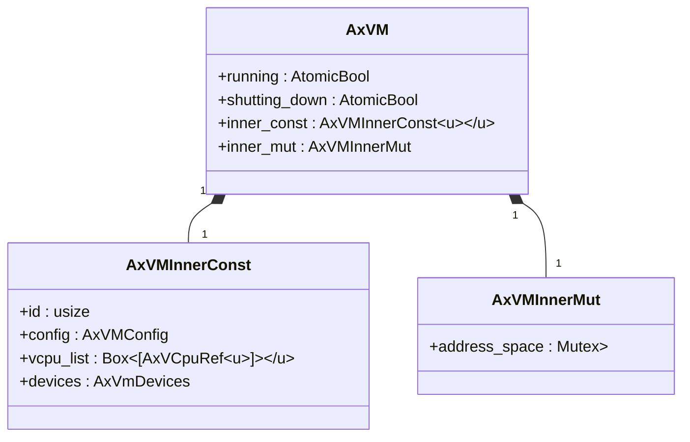
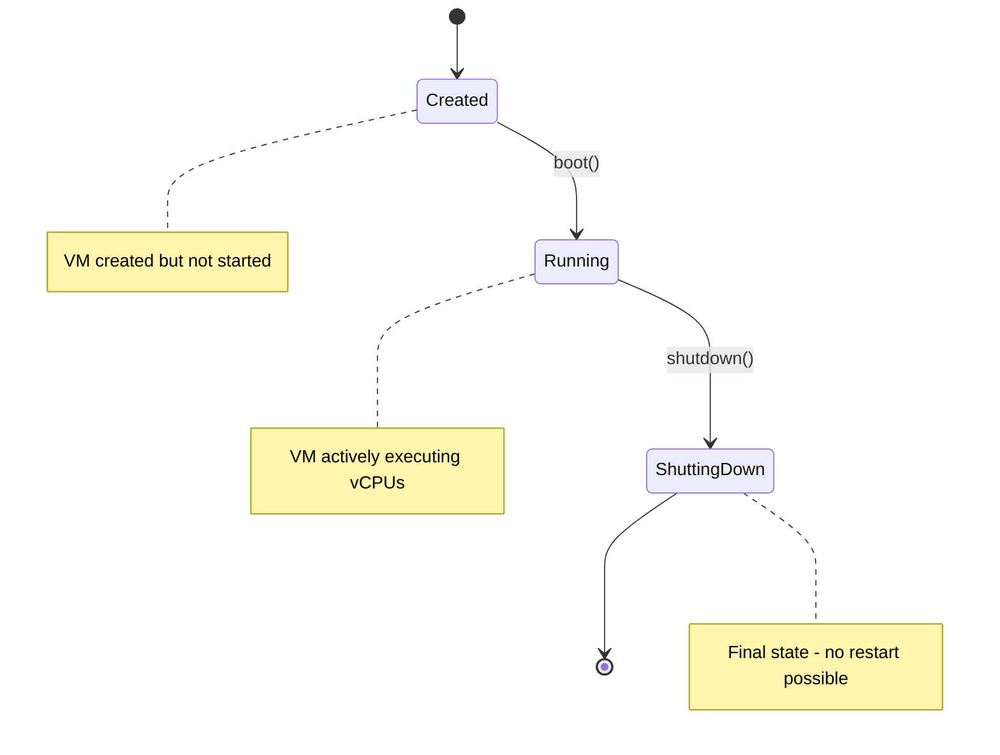

# VM API Reference

<cite>
**Referenced Files in This Document**   
- [vm.rs](file://src/vm.rs)
- [config.rs](file://src/config.rs)
- [hal.rs](file://src/hal.rs)
- [vcpu.rs](file://src/vcpu.rs)
- [lib.rs](file://src/lib.rs)
</cite>

## Table of Contents
1. [Introduction](#introduction)
2. [Core Components](#core-components)
3. [VM Lifecycle Management](#vm-lifecycle-management)
4. [Memory Management APIs](#memory-management-apis)
5. [Device and I/O Handling](#device-and-io-handling)
6. [State Transitions and Error Conditions](#state-transitions-and-error-conditions)
7. [Thread Safety and RAII Behavior](#thread-safety-and-raii-behavior)
8. [Integration with AxVMHal](#integration-with-axvmhal)
9. [Usage Examples](#usage-examples)

## Introduction
The AxVM struct provides a virtual machine monitor (VMM) interface for managing guest VMs within the ArceOS hypervisor framework. It encapsulates core virtualization resources including vCPUs, memory address spaces, and device configurations. The API enables creation, configuration, execution, and lifecycle management of VMs through a thread-safe, reference-counted design using Arc. This documentation details all public methods of the AxVM struct and related components, focusing on their integration points with AxVMConfig, AxVCpuRef, AddrSpace, and AxVmDevices.

**Section sources**
- [vm.rs](file://src/vm.rs#L55-L627)
- [config.rs](file://src/config.rs#L0-L195)

## Core Components

### AxVM Structure Overview
The AxVM struct represents a virtual machine instance with architecture-independent interfaces. It is parameterized by two traits: H implementing AxVMHal for hardware abstraction and U implementing AxVCpuHal for vCPU operations. The structure maintains both immutable (inner_const) and mutable (inner_mut) state components protected by appropriate synchronization primitives.



**Diagram sources**
- [vm.rs](file://src/vm.rs#L55-L73)

**Section sources**
- [vm.rs](file://src/vm.rs#L55-L73)

### Configuration Integration
The AxVM relies on AxVMConfig for initialization parameters, which is derived from AxVMCrateConfig parsed from TOML files. The configuration includes CPU topology, memory regions, device setups, and interrupt modes. During VM creation, these settings are validated and used to initialize vCPUs and memory mappings.

**Section sources**
- [config.rs](file://src/config.rs#L33-L195)
- [vm.rs](file://src/vm.rs#L75-L253)

## VM Lifecycle Management

### Creation with new()
The `AxVM::new()` method creates a new VM instance from a provided AxVMConfig. It validates hardware virtualization support, initializes vCPUs based on configuration, sets up memory regions according to mapping types (MapIdentical or MapAlloc), configures passthrough devices, and prepares emulated devices. The method returns an `AxResult<AxVMRef<H, U>>`, where failure can occur due to invalid configuration or unsupported hardware features.

[SPEC SYMBOL](file://src/vm.rs#L75-L253)

### Booting with boot()
The `AxVM::boot()` method transitions the VM into a running state by setting the internal running flag. Prerequisites include verified hardware virtualization support and ensuring the VM isn't already running. Upon successful boot, the VM's vCPUs can be executed via `run_vcpu()`.

[SPEC SYMBOL](file://src/vm.rs#L363-L378)

### Execution with run_vcpu()
The `AxVM::run_vcpu(vcpu_id)` method executes a specific vCPU identified by its ID. It performs input validation, binds the vCPU to the current physical CPU, and enters a loop handling various exit reasons such as MMIO operations, I/O accesses, system register interactions, and page faults. The method returns an `AxResult<AxVCpuExitReason>` indicating why execution was interrupted.

[SPEC SYMBOL](file://src/vm.rs#L403-L488)

### Shutdown with shutdown()
The `AxVM::shutdown()` method initiates graceful termination by setting the shutting_down flag. A VM can only be shut down once, and after shutdown, it cannot be reinitialized or booted again. This one-way state transition ensures resource cleanup integrity.

[SPEC SYMBOL](file://src/vm.rs#L379-L402)

## Memory Management APIs

### Address Space Operations
The VM manages guest physical memory through an AddrSpace instance protected by a Mutex. Key methods include:
- `ept_root()`: Returns the host physical address of the two-stage translation page table root
- `map_region()`: Maps host physical memory to guest physical addresses with specified flags
- `unmap_region()`: Removes mappings from guest physical memory

These operations integrate with the underlying paging handler defined by the AxVMHal trait.

[SPEC SYMBOL](file://src/vm.rs#L348-L361)

### Guest Memory Access
Direct read/write access to guest memory is provided through:
- `read_from_guest_of<T>()`: Reads a typed object from guest physical address with alignment checking
- `write_to_guest_of<T>()`: Writes a typed object to guest physical address
- `get_image_load_region()`: Retrieves mutable byte buffers for loading VM images at specified GPAs

These methods handle potentially non-contiguous physical memory layouts through segmented buffer representations.

[SPEC SYMBOL](file://src/vm.rs#L539-L582)

## Device and I/O Handling

### Device Management
The VM exposes device interaction through:
- `get_devices()`: Provides access to emulated and passthrough devices
- Automatic handling of MMIO, I/O port, and system register exits during vCPU execution
- Architecture-specific setup for interrupt controllers (GICD on aarch64)

Device configurations are initialized from AxVMConfig during VM creation, with special handling for passthrough versus emulated modes.

[SPEC SYMBOL](file://src/vm.rs#L403-L424)

### Interrupt Injection
The `inject_interrupt_to_vcpu()` method allows injecting interrupts to target vCPUs using a CpuMask. It verifies that the operation occurs within the same VM context and delegates to the AxVMHal implementation for actual IRQ injection on the physical CPU hosting the target vCPU.

[SPEC SYMBOL](file://src/vm.rs#L489-L507)

### Inter-VM Communication
IVC (Inter-VM Communication) channels can be allocated and released through:
- `alloc_ivc_channel()`: Reserves guest physical memory for communication with size aligned to 4K
- `release_ivc_channel()`: Frees previously allocated IVC channel memory

These methods interface with AxVmDevices for resource tracking.

[SPEC SYMBOL](file://src/vm.rs#L583-L600)

## State Transitions and Error Conditions

### State Model
The VM follows a strict state progression:
1. Created (initial state after new())
2. Running (after successful boot())
3. Shutting Down (after shutdown())

Transitions are guarded by AtomicBool flags preventing invalid operations like double-booting or reinitialization.



**Diagram sources**
- [vm.rs](file://src/vm.rs#L363-L402)

### Error Handling
Common error conditions include:
- `Unsupported`: Hardware lacks virtualization capabilities
- `BadState`: Attempting invalid state transitions (e.g., booting running VM)
- `InvalidInput`: Invalid vCPU IDs or unaligned memory access
- `HypervisorError`: Underlying hypervisor operation failures

Error propagation occurs through AxResult wrappers with descriptive messages containing VM identifiers.

**Section sources**
- [vm.rs](file://src/vm.rs#L363-L402)
- [vm.rs](file://src/vm.rs#L540-L547)

## Thread Safety and RAII Behavior

### Concurrency Design
The AxVM employs several thread-safety mechanisms:
- `Arc` references for shared ownership across threads
- `AtomicBool` for lock-free state flags (running, shutting_down)
- `Mutex` protection for address space modifications
- `Send` and `Sync` implementations for inner components

This design allows concurrent access from multiple threads while protecting critical sections.

```mermaid
classDiagram
AxVM <|-- Send
AxVM <|-- Sync
AxVM ..> Arc : uses
AxVM ..> AtomicBool : uses
AxVM ..> Mutex : uses
note right of AxVM
Thread-safe through\ncombination of Arc, Atomic,\nand Mutex protections
end note
```

**Diagram sources**
- [vm.rs](file://src/vm.rs#L43-L44)
- [vm.rs](file://src/vm.rs#L60-L61)

### Resource Management
RAII principles are followed through:
- Automatic cleanup via Drop traits in underlying components
- Reference counting preventing premature deallocation
- Guaranteed resource release when VM references go out of scope

The design ensures that system resources are properly managed without requiring explicit destruction calls.

**Section sources**
- [vm.rs](file://src/vm.rs#L43-L44)

## Integration with AxVMHal

### HAL Interface Requirements
The AxVM depends on the AxVMHal trait for low-level operations:
- Physical memory allocation/deallocation
- Virtual-to-physical address translation
- Timekeeping and CPU identification
- Cross-vCPU interrupt injection

Implementations must provide architecture-specific paging handlers and satisfy all required methods.

```mermaid
classDiagram
class AxVMHal {
<<trait>>
+PagingHandler : PagingHandler
+alloc_memory_region_at()
+dealloc_memory_region_at()
+virt_to_phys()
+current_time_nanos()
+current_vm_id()
+current_vcpu_id()
+current_pcpu_id()
+vcpu_resides_on()
+inject_irq_to_vcpu()
}
AxVM ..> AxVMHal : depends on
note right of AxVMHal
Must be implemented by\nunderlying hypervisor/kernel
end note
```

**Diagram sources**
- [hal.rs](file://src/hal.rs#L0-L43)

### Conditional Compilation
Architecture-specific behavior is handled through conditional compilation:
- aarch64: Uses VGicD for SPI assignment and sysreg devices for virtual timers
- riscv64: Utilizes RISCVVCpu with hart_id configuration
- x86_64: Employs VmxArchVCpu with default create config

Feature flags like 'vmx' and '4-level-ept' enable platform-specific optimizations.

[SPEC SYMBOL](file://src/vm.rs#L254-L283)
[SPEC SYMBOL](file://Cargo.toml#L8-L10)

## Usage Examples

### Complete VM Lifecycle
```rust
// Configuration setup (typically from TOML)
let config = AxVMConfig::from(crate_config);

// VM creation
let vm = AxVM::new(config).expect("Failed to create VM");

// Boot sequence
vm.boot().expect("Failed to boot VM");

// Run primary vCPU
match vm.run_vcpu(0) {
    Ok(exit_reason) => println!("vCPU exited due to {:?}", exit_reason),
    Err(e) => eprintln!("Execution failed: {}", e),
}

// Graceful shutdown
vm.shutdown().expect("Failed to shutdown VM");
```

### Memory Mapping Example
```rust
// Map host memory to guest
vm.map_region(
    GuestPhysAddr::from(0x10000000),
    HostPhysAddr::from(0x80000000),
    0x1000000,
    MappingFlags::READ | MappingFlags::WRITE
).expect("Failed to map memory");

// Read structure from guest memory
let value: u64 = vm.read_from_guest_of(GuestPhysAddr::from(0x10000000))
    .expect("Failed to read guest memory");
```

### Device Interaction Pattern
```rust
// Handle MMIO exit in run_vcpu loop
match exit_reason {
    Ax