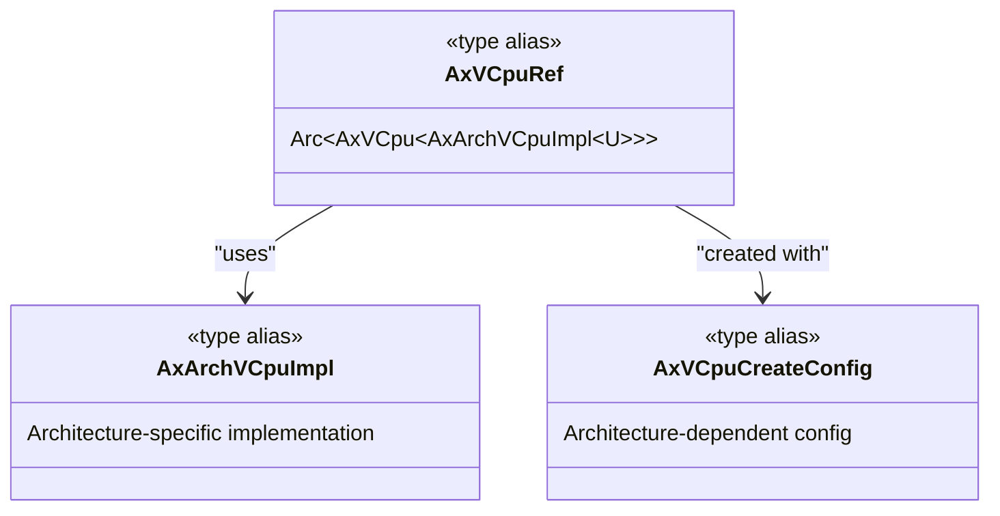
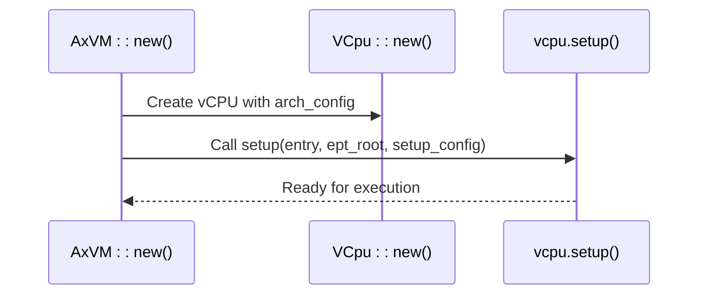

# vCPU API Reference

<cite>
**Referenced Files in This Document**
- [vcpu.rs](file://src/vcpu.rs)
- [vm.rs](file://src/vm.rs)
- [config.rs](file://src/config.rs)
- [hal.rs](file://src/hal.rs)
- [lib.rs](file://src/lib.rs)
</cite>

## Table of Contents
1. [Introduction](#introduction)
2. [Core vCPU Types and Aliases](#core-vcpu-types-and-aliases)
3. [Architecture-Specific Implementation Selection](#architecture-specific-implementation-selection)
4. [vCPU Lifecycle Management](#vcpu-lifecycle-management)
5. [Execution Control and VM Exit Handling](#execution-control-and-vm-exit-handling)
6. [Interrupt Injection Mechanisms](#interrupt-injection-mechanisms)
7. [Register Access and State Management](#register-access-and-state-management)
8. [vCPU Binding and Thread Affinity](#vcpu-binding-and-thread-affinity)
9. [Lifetime and Thread Safety Guarantees](#lifetime-and-thread-safety-guarantees)
10. [Dependencies and External Crates](#dependencies-and-external-crates)

## Introduction
This document provides a comprehensive reference for the virtual CPU (vCPU) public interfaces defined in `vcpu.rs` within the ArceOS hypervisor framework. It details the architecture-agnostic abstractions and their concrete implementations for x86_64, RISC-V 64, and AArch64 platforms. The focus is on the core types `AxVCpuRef`, `AxArchVCpuImpl`, and the architecture-specific vCPU structs, along with their associated methods for creation, execution control, interrupt handling, and register access. The document also explains the conditional compilation logic that selects the appropriate backend, the interaction between vCPUs and the VM execution loop, and the safety guarantees provided by the API.

## Core vCPU Types and Aliases

The `axvm` crate defines several key type aliases to provide a clean, architecture-independent interface for managing vCPUs. The primary abstraction is `AxVCpuRef<U>`, which represents a reference-counted handle to a vCPU instance. This type is an alias for `Arc<AxVCpu<AxArchVCpuImpl<U>>>`, where `U` is a generic parameter constrained by the `AxVCpuHal` trait, representing the underlying hardware abstraction layer.



**Diagram sources**
- [vm.rs](file://src/vm.rs#L28-L31)
- [vcpu.rs](file://src/vcpu.rs#L4-L21)

**Section sources**
- [vm.rs](file://src/vm.rs#L28-L31)
- [vcpu.rs](file://src/vcpu.rs#L4-L21)

## Architecture-Specific Implementation Selection

The selection of the underlying vCPU implementation is determined at compile time using conditional compilation based on the target architecture. The `cfg_if!` macro in `vcpu.rs` exports the appropriate types from architecture-specific crates (`x86_vcpu`, `riscv_vcpu`, `arm_vcpu`) and aliases them as `AxArchVCpuImpl`. This allows the rest of the codebase to interact with a uniform interface regardless of the platform.

For **x86_64**, `AxArchVCpuImpl` is aliased to `VmxArchVCpu` from the `x86_vcpu` crate, and `AxVCpuCreateConfig` is defined as a unit type `()`. For **RISC-V 64**, it is aliased to `RISCVVCpu`, and `AxVCpuCreateConfig` becomes `RISCVVCpuCreateConfig`. For **AArch64**, it is aliased to `Aarch64VCpu`, and two configuration types are exposed: `Aarch64VCpuCreateConfig` as `AxVCpuCreateConfig` and `Aarch64VCpuSetupConfig` as `AxVCpuSetupConfig`. The `has_hardware_support` function is also re-exported from the respective backend to check for virtualization extensions.

```mermaid
graph TD
Start([Target Architecture]) --> Decision{Which Arch?}
Decision -- x86_64 --> X86[Use VmxArchVCpu<br/>AxVCpuCreateConfig = ()]
Decision -- riscv64 --> RISCV[Use RISCVVCpu<br/>AxVCpuCreateConfig = RISCVVCpuCreateConfig]
Decision -- aarch64 --> AARCH64[Use Aarch64VCpu<br/>AxVCpuCreateConfig = Aarch64VCpuCreateConfig<br/>AxVCpuSetupConfig = Aarch64VCpuSetupConfig]
X86 --> End([AxArchVCpuImpl Defined])
RISCV --> End
AARCH64 --> End
```

**Diagram sources**
- [vcpu.rs](file://src/vcpu.rs#L1-L29)

**Section sources**
- [vcpu.rs](file://src/vcpu.rs#L1-L29)

## vCPU Lifecycle Management

The lifecycle of a vCPU begins with its creation during VM initialization in the `AxVM::new` method. Each vCPU is constructed using the `VCpu::new` function, which takes parameters including the VM ID, vCPU ID, physical CPU affinity mask, and an architecture-specific creation configuration (`AxVCpuCreateConfig`). This configuration is populated based on the target architecture; for example, on AArch64, it includes the MPIDR_EL1 value and the DTB address.

After creation, vCPUs are stored in the VM's `vcpu_list`. Before a VM can run, its vCPUs must be set up via the `setup` method, which is called during `AxVM::new`. The setup process involves providing the guest entry point (BSP or AP), the EPT root (for nested page tables), and a setup configuration. On AArch64, this configuration (`AxVCpuSetupConfig`) controls features like interrupt and timer passthrough, while other architectures use a default setup configuration.



**Diagram sources**
- [vm.rs](file://src/vm.rs#L69-L106)
- [vm.rs](file://src/vm.rs#L283-L330)

**Section sources**
- [vm.rs](file://src/vm.rs#L69-L106)
- [vm.rs](file://src/vm.rs#L283-L330)
- [config.rs](file://src/config.rs#L66-L103)

## Execution Control and VM Exit Handling

The primary method for executing a vCPU is `AxVM::run_vcpu`, which retrieves a specific vCPU by ID and invokes its `bind` and `run` methods. The `bind` method associates the vCPU with the current physical CPU thread, establishing the execution context. The `run` method then enters the low-level VM execution loop (e.g., `VMLAUNCH`/`VMRESUME` on x86, `VMSAVE`/`VMLOAD` on RISC-V, `HVC` on AArch64), which runs until a VM exit occurs.

The `run_vcpu` method implements a loop to handle VM exits gracefully. When a vCPU exits, it returns an `AxVCpuExitReason`. The `AxVM` handles common exit reasons such as MMIO, I/O port, and system register accesses by delegating to the VM's device manager. If the exit is handled (e.g., by emulating a device read), the loop continues, and the vCPU resumes execution. If the exit cannot be handled by the VMM (e.g., a halt instruction), the loop breaks, and the exit reason is returned to the caller.

```mermaid
flowchart TD
    Start([run_vcpu(vcpu_id)]) --> Bind["vcpu.bind()"]
    Bind --> RunLoop["loop:"]
    RunLoop --> Run["vcpu.run()"]
    Run --> Exit{"VM Exit?"}
    Exit -->|Yes| Handle["Match exit_reason"]
    Handle --> MmioRead["MMIO Read?"]
    MmioRead -->|Yes| EmulateRead["get_devices().handle_mmio_read()"]
    EmulateRead --> SetGPR["vcpu.set_gpr(reg, val)"]
    SetGPR --> Continue["continue loop"]
    Handle --> MmioWrite["MMIO Write?"]
    MmioWrite -->|Yes