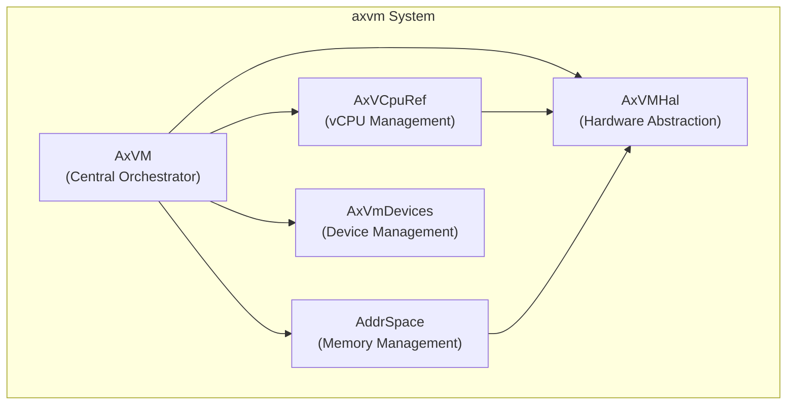
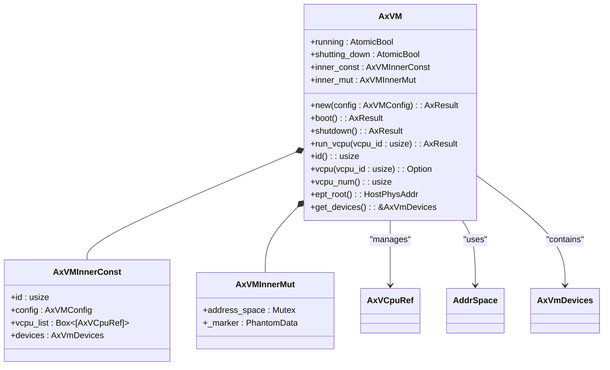
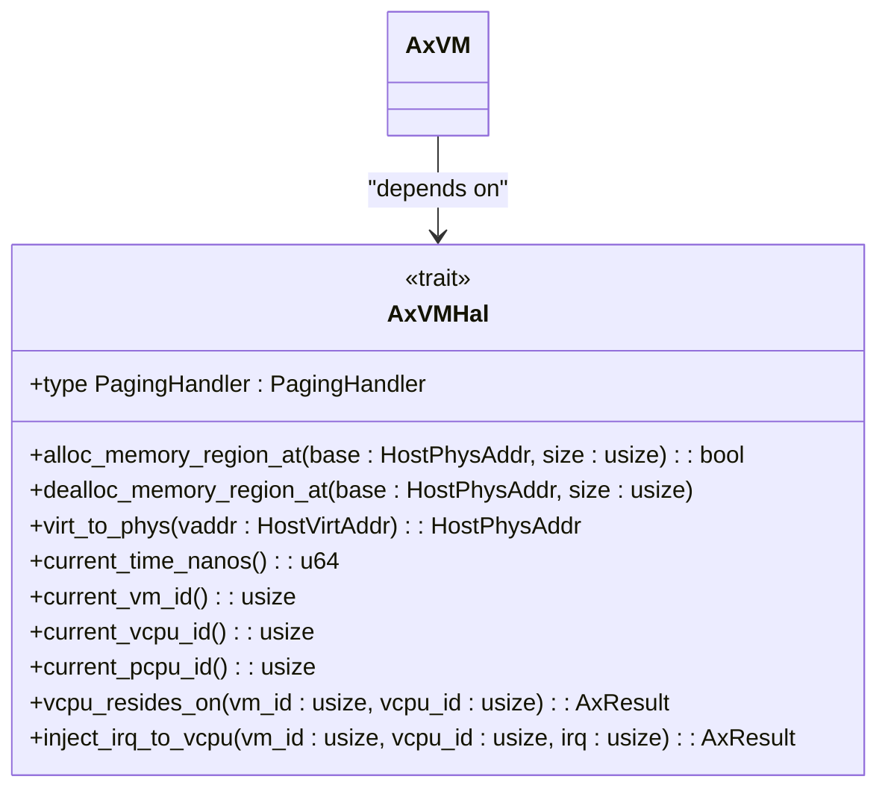
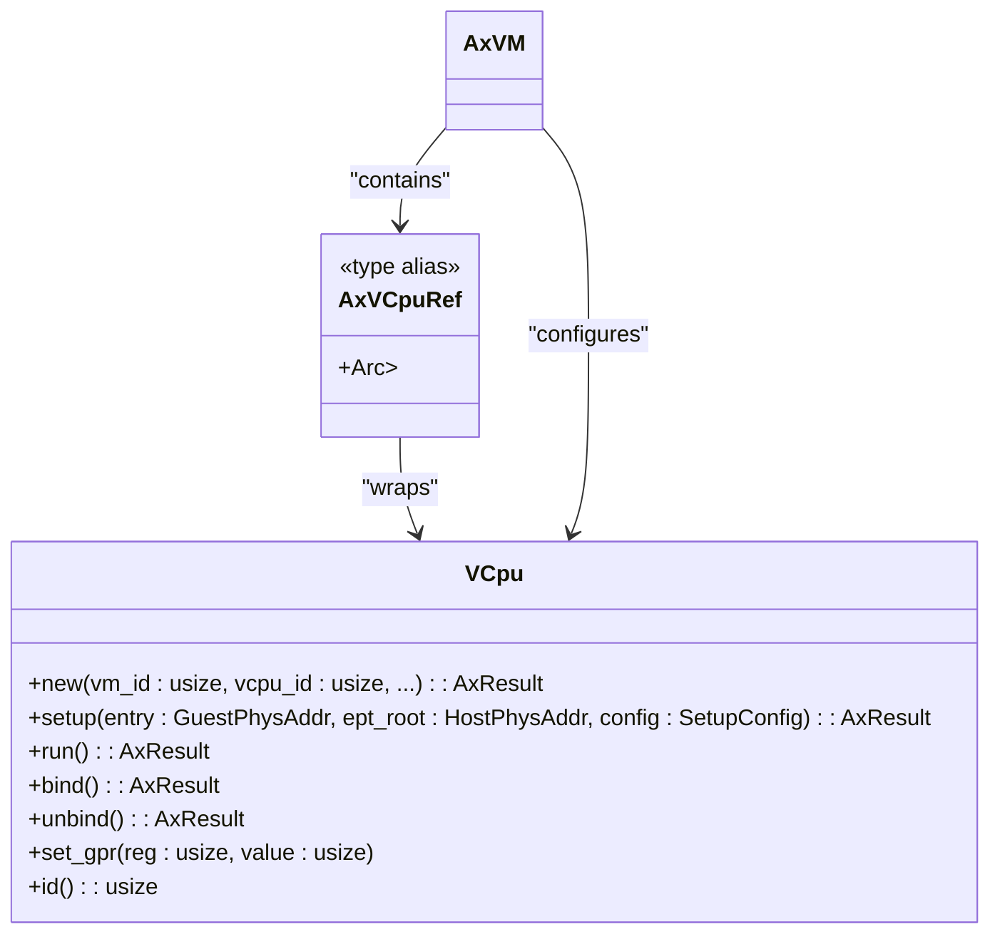
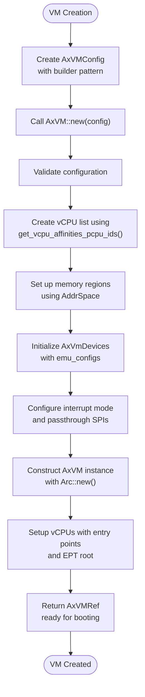

# Architecture Overview

<cite>
**Referenced Files in This Document**   
- [lib.rs](file://src/lib.rs)
- [config.rs](file://src/config.rs)
- [hal.rs](file://src/hal.rs)
- [vcpu.rs](file://src/vcpu.rs)
- [vm.rs](file://src/vm.rs)
</cite>

## Table of Contents
1. [Introduction](#introduction)
2. [Core Components](#core-components)
3. [Architecture Overview](#architecture-overview)
4. [Detailed Component Analysis](#detailed-component-analysis)
5. [Data Flow and Execution Model](#data-flow-and-execution-model)
6. [Architectural Patterns](#architectural-patterns)
7. [Trade-offs and Design Philosophy](#trade-offs-and-design-philosophy)

## Introduction
The axvm system is a minimal virtual machine monitor (VMM) designed for running guest VMs with a strong emphasis on modularity, safety, and architectural separation. The system implements a component-based architecture that clearly separates architecture-independent core logic from architecture-specific implementations. This documentation provides a comprehensive overview of the system's design, focusing on its key components, data flows, and architectural patterns.

## Core Components
The axvm system consists of several key components that work together to provide virtualization capabilities:
- **AxVM**: The central orchestrator that manages the overall VM lifecycle and state
- **AxVMHal**: The hardware abstraction layer that provides OS-dependent interfaces
- **AxVCpuRef**: The reference-counted vCPU management component responsible for vCPU lifecycle
- **AddrSpace**: The address space manager handling two-stage memory translation
- **AxVmDevices**: The device management system handling both emulated and pass-through devices

These components are organized in a modular fashion, allowing for clear separation of concerns and extensibility across different hardware architectures.

**Section sources**
- [lib.rs](file://src/lib.rs#L1-L32)
- [vm.rs](file://src/vm.rs#L43-L73)

## Architecture Overview
The axvm system follows a modular component-based architecture with a clear separation between architecture-independent core logic and architecture-specific implementations. At the heart of the system is the AxVM struct, which serves as the central orchestrator for all VM operations. The architecture is designed around three primary layers:

1. **Core Logic Layer**: Contains architecture-independent components like AxVM and AddrSpace
2. **Hardware Abstraction Layer**: Provides the AxVMHal trait that defines OS-dependent interfaces
3. **Architecture-Specific Layer**: Implements architecture-dependent functionality through conditional compilation

This layered approach enables the system to support multiple architectures (x86_64, RISC-V, and AArch64) while maintaining a consistent interface and behavior across platforms.

**Diagram sources**
- [lib.rs](file://src/lib.rs#L1-L32)
- [vm.rs](file://src/vm.rs#L43-L73)
- [hal.rs](file://src/hal.rs#L0-L43)

**Section sources**
- [lib.rs](file://src/lib.rs#L1-L32)
- [vm.rs](file://src/vm.rs#L43-L73)

## Detailed Component Analysis

### AxVM: Central Orchestrator
The AxVM struct is the main structure representing a virtual machine and serves as the central orchestrator for all VM operations. It manages the VM's lifecycle, configuration, and coordination between various components.

**Diagram sources**
- [vm.rs](file://src/vm.rs#L43-L73)

**Section sources**
- [vm.rs](file://src/vm.rs#L43-L73)

### AxVMHal: Hardware Abstraction Boundary
The AxVMHal trait defines the hardware abstraction boundary, specifying the interfaces that the underlying software (kernel or hypervisor) must implement. This trait enables the system to be independent of the specific operating environment while providing necessary low-level services.

**Diagram sources**
- [hal.rs](file://src/hal.rs#L0-L43)

**Section sources**
- [hal.rs](file://src/hal.rs#L0-L43)

### AxVCpuRef: vCPU Lifecycle Management
The AxVCpuRef component handles vCPU lifecycle management through reference counting and proper resource cleanup. It represents a reference to a vCPU and provides methods for vCPU setup, execution, and teardown.

**Diagram sources**
- [vm.rs](file://src/vm.rs#L0-L44)
- [vcpu.rs](file://src/vcpu.rs#L0-L29)

**Section sources**
- [vm.rs](file://src/vm.rs#L0-L44)
- [vcpu.rs](file://src/vcpu.rs#L0-L29)

## Data Flow and Execution Model

### VM Creation Process
The VM creation process follows the builder pattern, starting with configuration and progressing through initialization to final construction. The flow begins with an AxVMConfig object that contains all necessary parameters for VM creation.

**Diagram sources**
- [config.rs](file://src/config.rs#L33-L64)
- [vm.rs](file://src/vm.rs#L69-L106)

**Section sources**
- [config.rs](file://src/config.rs#L33-L64)
- [vm.rs](file://src/vm.rs#L69-L106)

### vCPU Execution Loop
The vCPU execution loop handles the core virtualization workflow, managing exits