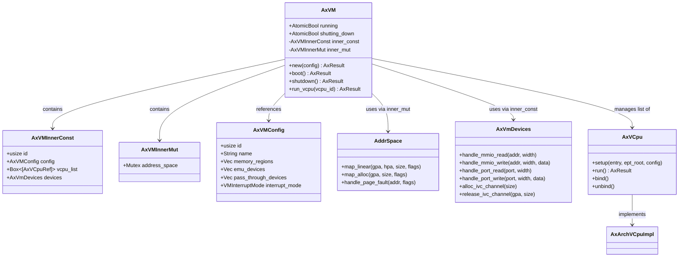
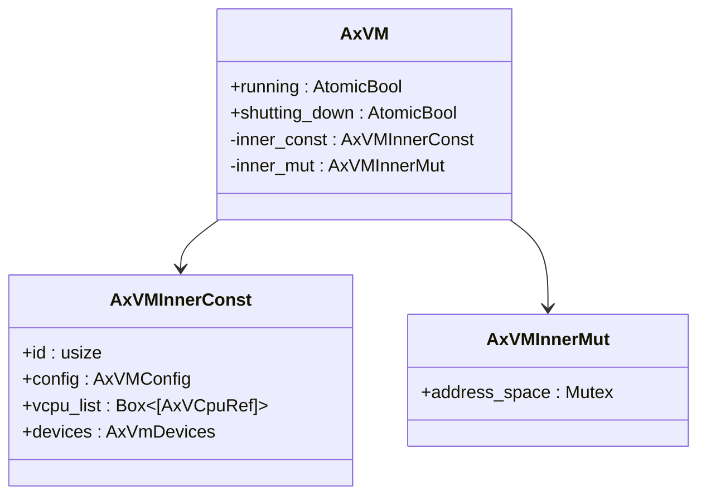
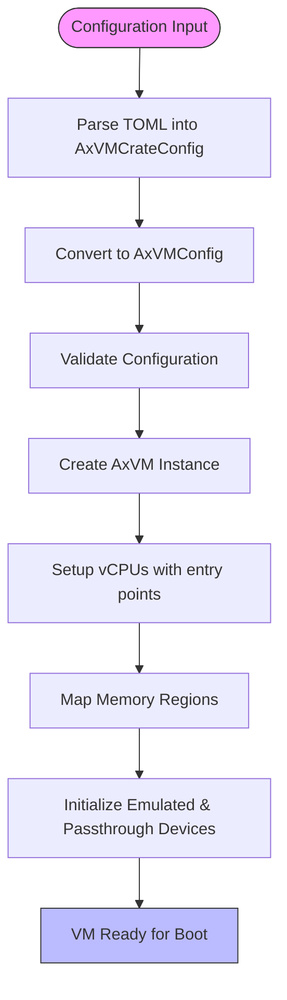
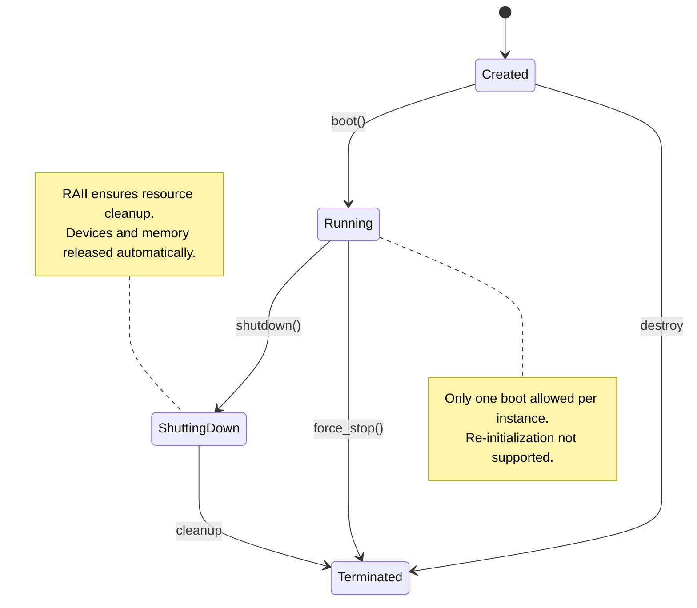
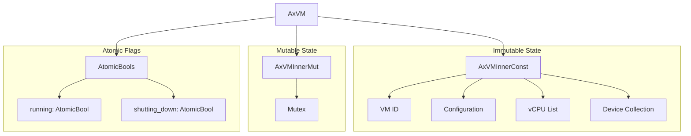
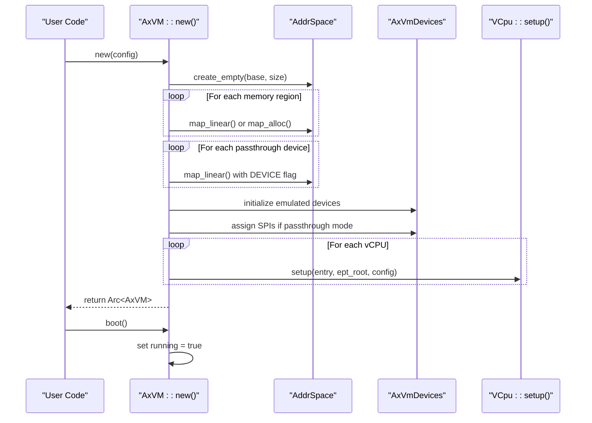

# VM Core Architecture

<cite>
**Referenced Files in This Document**
- [vm.rs](file://src/vm.rs)
- [config.rs](file://src/config.rs)
- [lib.rs](file://src/lib.rs)
- [README.md](file://README.md)
</cite>

## Table of Contents
1. [Introduction](#introduction)
2. [Core Components](#core-components)
3. [Architecture Overview](#architecture-overview)
4. [Detailed Component Analysis](#detailed-component-analysis)
5. [VM Lifecycle Management](#vm-lifecycle-management)
6. [Concurrency and State Isolation](#concurrency-and-state-isolation)
7. [Resource Management and RAII](#resource-management-and-raii)
8. [Data Flow and Error Handling](#data-flow-and-error-handling)
9. [Integration Points](#integration-points)
10. [Design Trade-offs and Safety Considerations](#design-trade-offs-and-safety-considerations)

## Introduction
AxVM is the central virtual machine orchestrator within the ArceOS hypervisor ecosystem, responsible for managing vCPUs, memory address spaces, and device collections. It serves as a minimal yet robust VM monitor (VMM) that abstracts hardware virtualization capabilities while ensuring thread-safe operation through Rust's ownership model and atomic concurrency primitives. The architecture emphasizes safety, modularity, and clean separation between immutable configuration and mutable runtime state.

**Section sources**
- [README.md](file://README.md#L0-L7)
- [lib.rs](file://src/lib.rs#L6)

## Core Components
The AxVM core consists of several key components: the `AxVM` struct as the central coordinator, `AxVMConfig` for declarative setup, `AxVMInnerConst` and `AxVMInnerMut` for state segregation, and integration with external crates such as `axaddrspace`, `axdevice`, and `axvcpu`. These components work together to provide a safe, efficient, and extensible virtualization layer.

**Section sources**
- [vm.rs](file://src/vm.rs#L55-L627)
- [config.rs](file://src/config.rs#L48-L195)

## Architecture Overview



**Diagram sources**
- [vm.rs](file://src/vm.rs#L55-L627)
- [config.rs](file://src/config.rs#L48-L195)

## Detailed Component Analysis

### AxVM Struct Analysis
The `AxVM` struct acts as the primary orchestrator of VM resources, encapsulating both static and dynamic state. It provides methods for booting, running vCPUs, handling I/O, and managing memory mappings.

#### Class Diagram: AxVM Internal Structure



**Diagram sources**
- [vm.rs](file://src/vm.rs#L55-L627)

**Section sources**
- [vm.rs](file://src/vm.rs#L55-L627)

### AxVMConfig Builder Pattern
The `AxVMConfig` struct implements a builder pattern for constructing VM configurations from TOML-based inputs via `AxVMCrateConfig`. It enables flexible, type-safe configuration of VM parameters including CPU topology, memory layout, and device assignments.



**Diagram sources**
- [config.rs](file://src/config.rs#L48-L195)

**Section sources**
- [config.rs](file://src/config.rs#L48-L195)

## VM Lifecycle Management
The VM lifecycle is governed by atomic boolean flags: `running` and `shutting_down`. These ensure thread-safe transitions between states without requiring heavy locking mechanisms.



**Diagram sources**
- [vm.rs](file://src/vm.rs#L269-L270)
- [vm.rs](file://src/vm.rs#L363-L398)

**Section sources**
- [vm.rs](file://src/vm.rs#L363-L398)

## Concurrency and State Isolation
AxVM separates its state into two distinct components:
- `AxVMInnerConst`: Immutable after creation, contains vCPU list, device collection, and configuration.
- `AxVMInnerMut`: Mutable state protected by a `Mutex`, primarily the guest address space.

This design allows concurrent access to read-only components while safely serializing modifications to shared resources like page tables.



**Diagram sources**
- [vm.rs](file://src/vm.rs#L30-L54)
- [vm.rs](file://src/vm.rs#L55-L627)

**Section sources**
- [vm.rs](file://src/vm.rs#L30-L54)

## Resource Management and RAII
AxVM leverages Rust’s RAII (Resource Acquisition Is Initialization) pattern to ensure automatic cleanup of system resources upon VM destruction. All managed objects—vCPUs, memory mappings, and devices—are wrapped in `Arc` (atomic reference counting), guaranteeing deallocation when the last reference drops.

Key RAII-managed resources include:
- Guest physical memory mappings via `AddrSpace`
- Device handles in `AxVmDevices`
- vCPU execution contexts

No explicit teardown function is required; dropping the `Arc<AxVM>` triggers deterministic cleanup.

**Section sources**
- [vm.rs](file://src/vm.rs#L269-L270)
- [vm.rs](file://src/vm.rs#L55-L627)

## Data Flow and Error Handling
The data flow during VM creation, booting, and execution follows a strict sequence with comprehensive error propagation using `AxResult`.

#### Sequence Diagram: VM Boot Process



Error handling is performed at multiple levels:
- Configuration validation returns `AxErr(InvalidInput)`
- Hardware capability checks return `AxErr(Unsupported)`
- State conflicts (e.g., double boot) return `AxErr(BadState)`
- I/O operations propagate device-specific errors

All errors are handled gracefully without panicking unless safety invariants are violated.

**Diagram sources**
- [vm.rs](file://src/vm.rs#L100-L280)

**Section sources**
- [vm.rs](file://src/vm.rs#L100-L280)

## Integration Points

### Address Space Integration
AxVM integrates with `axaddrspace` to implement two-stage address translation:
1. **GVA → GPA**: Handled by guest OS page tables.
2. **GPA → HPA**: Managed by `AddrSpace` using nested paging (EPT on x86, NPT on AMD, Stage 2 on AArch64).

The base and size of the address space are defined by constants:
- `VM_ASPACE_BASE`: 0x0
- `VM_ASPACE_SIZE`: 0x7fff_ffff_f000 (~512 GB)

Memory regions are mapped using either:
- `MapIdentical`: Direct GPA-to-HPA mapping
- `MapAlloc`: Allocate backing host memory dynamically

Passthrough devices are mapped with `MappingFlags::DEVICE` to prevent caching and enable MMIO semantics.

**Section sources**
- [vm.rs](file://src/vm.rs#L23-L24)
- [vm.rs](file://src/vm.rs#L106)

### Device Handling via AxVmDevices
AxVM delegates all I/O operations to `AxVmDevices`, which supports both emulated and passthrough devices. On vCPU exit due to MMIO, PIO, or sysreg access, control flows back to the VMM:

```mermaid
flowchart TD
A[VCpu::run()] --> B{Exit Reason?}
B --> |MmioRead| C[handle_mmio_read()]
B --> |MmioWrite| D[handle_mmio_write()]
B --> |IoRead| E[handle_port_read()]
B --> |IoWrite| F[handle_port_write()]
B --> |SysRegRead| G[handle_sys_reg_read()]
B --> |SysRegWrite| H[handle_sys_reg_write()]
B --> |PageFault| I[handle_page_fault()]
C --> J[Return value to vCPU]
D --> K[Complete write]
E --> L[Set RAX/EAX]
F --> M[Complete write]
G --> N[Set GPR]
H --> O[Update register]
I --> P[Fix page table]
style C fill:#dfd,stroke:#333
style D fill:#dfd,stroke:#333
style E fill:#dfd,stroke:#333
style F fill:#dfd,stroke:#333
style G fill:#dfd,stroke:#333
style H fill:#dfd,stroke:#333
style I fill:#dfd,stroke:#333
```

**Diagram sources**
- [vm.rs](file://src/vm.rs#L45