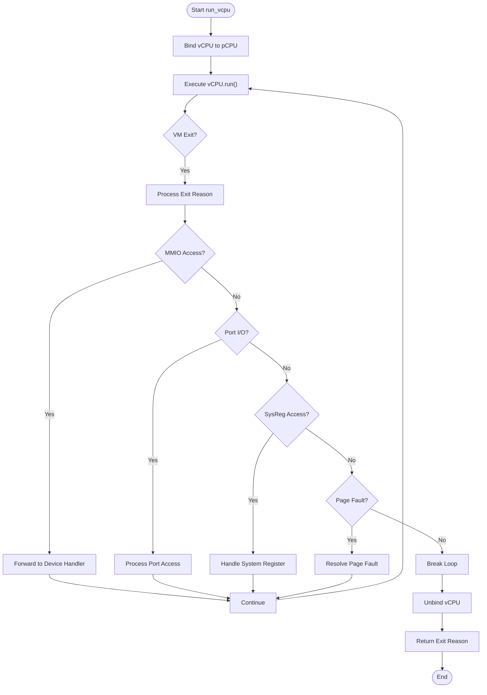

# vCPU Architecture and Implementation

<cite>
**Referenced Files in This Document**   
- [vcpu.rs](file://src/vcpu.rs)
- [vm.rs](file://src/vm.rs)
- [config.rs](file://src/config.rs)
- [lib.rs](file://src/lib.rs)
</cite>

## Table of Contents
1. [Introduction](#introduction)
2. [Layered Architecture Design](#layered-architecture-design)
3. [Adapter Pattern for Multi-Architecture Support](#adapter-pattern-for-multi-architecture-support)
4. [vCPU Execution Loop and Exit Handling](#vcpu-execution-loop-and-exit-handling)
5. [BSP/AP Entry Point Setup and Configuration](#bspap-entry-point-setup-and-configuration)
6. [vCPU to Physical CPU Binding Mechanism](#vcpu-to-physical-cpu-binding-mechanism)
7. [Exit Reason Enumeration Abstraction](#exit-reason-enumeration-abstraction)
8. [Performance Considerations in State Management](#performance-considerations-in-state-management)

## Introduction
This document provides comprehensive architectural documentation for the vCPU subsystem within the AxVM hypervisor framework. It details the design principles, implementation patterns, and cross-architecture support mechanisms that enable virtual CPU execution across x86_64, RISC-V, and AArch64 platforms. The system employs a layered architecture with clear separation between architecture-independent interfaces and architecture-specific implementations, enabling portable virtualization logic while maintaining hardware-specific optimizations.

## Layered Architecture Design

The vCPU subsystem implements a strict layered design where `AxVCpu` provides architecture-independent interfaces while `AxArchVCpuImpl` handles architecture-specific details through conditional compilation. This separation allows higher-level VM management code to interact with vCPUs without knowledge of underlying hardware specifics.

At the core of this design is the abstraction provided by the `axvcpu` crate, which defines common traits such as `AxVCpu`, `AxArchVCpu`, and `AxVCpuHal`. The `AxVM` structure utilizes these abstractions to manage vCPUs uniformly regardless of target architecture. Architecture-specific implementations are conditionally compiled based on the target platform, ensuring only relevant code is included in each build.

The type aliases defined in `vm.rs` establish the relationship between generic vCPU types and their architecture-specific counterparts:
```rust
type VCpu<U: AxVCpuHal> = AxVCpu<AxArchVCpuImpl<U>>;
pub type AxVCpuRef<U: AxVCpuHal> = Arc<VCpu<U>>;
```

This pattern enables type-safe, generic programming over vCPUs while delegating low-level operations to architecture-specific modules.

**Section sources**
- [vcpu.rs](file://src/vcpu.rs#L1-L29)
- [vm.rs](file://src/vm.rs#L43-L62)

## Adapter Pattern for Multi-Architecture Support

The system employs an adapter pattern to unify x86_64, riscv64, and aarch64 vCPU implementations under a common API. This is achieved through conditional compilation directives in `vcpu.rs`, which map architecture-specific types to standardized names used throughout the codebase.

For x86_64 targets, the adapter uses `VmxArchVCpu` from the `x86_vcpu` crate; for RISC-V, it uses `RISCVVCpu` from `riscv_vcpu`; and for AArch64, it uses `Aarch64VCpu` from `arm_vcpu`. Each architecture-specific implementation adheres to the `AxArchVCpu` trait, providing consistent methods for vCPU creation, setup, execution, and state management.

The adapter also standardizes configuration structures:
- On AArch64: `Aarch64VCpuCreateConfig` includes MPIDR_EL1 and DTB address
- On RISC-V: `RISCVVCpuCreateConfig` includes hart ID and DTB address  
- On x86_64: Uses default configuration with no additional parameters

This approach allows the same high-level VM creation logic to work across architectures while accommodating hardware-specific initialization requirements.

**Section sources**
- [vcpu.rs](file://src/vcpu.rs#L1-L29)
- [vm.rs](file://src/vm.rs#L69-L106)

## vCPU Execution Loop and Exit Handling

The vCPU execution loop is implemented in the `run_vcpu()` method of the `AxVM` struct. This function orchestrates the entire lifecycle of vCPU execution, including binding to physical CPUs, handling VM exits, and processing device I/O interceptions.

The execution flow follows a structured pattern:
1. Retrieve the specified vCPU by ID
2. Bind the vCPU to its designated physical CPU
3. Enter a loop where the vCPU executes guest code until a VM exit occurs
4. Handle the exit reason appropriately
5. Continue execution if the exit was handled, otherwise return control to the caller

Device I/O interception is handled through a match statement on `AxVCpuExitReason`, supporting various access types:
- MMIO reads/writes intercepted and forwarded to device handlers
- Port I/O operations (IoRead/IoWrite) processed through port handlers
- System register accesses (SysRegRead/SysRegWrite) managed via sysreg devices
- Nested page faults resolved by the address space manager

Unhandled exit reasons break the loop and are returned to the caller for further processing, typically resulting in VM termination or suspension.



**Diagram sources**
- [vm.rs](file://src/vm.rs#L403-L487)

**Section sources**
- [vm.rs](file://src/vm.rs#L403-L487)

## BSP/AP Entry Point Setup and Configuration

The vCPU setup process initializes both Bootstrap Processors (BSP) and Application Processors (AP) with architecture-specific configurations. During VM creation in the `new()` method of `AxVM`, each vCPU is configured based on its role and target architecture.

BSP vCPUs (vcpu_id == 0) receive the BSP entry point from the VM configuration, while APs receive the AP entry point. This distinction supports SMP initialization sequences where the primary processor starts at one address and secondary processors wait at another.

Architecture-specific setup parameters include:
- **AArch64**: Configures MPIDR_EL1 register using the physical CPU ID from configuration, sets up virtual timer devices when interrupt passthrough is disabled
- **RISC-V**: Assigns hart ID based on vCPU ID, configures DTB load address
- **x86_64**: Uses default configuration with no additional parameters

The setup process also integrates with interrupt controllers, particularly on AArch64 where SPIs (Shared Peripheral Interrupts) are assigned to specific CPUs when operating in passthrough mode. Virtual timer devices are added to the device model when passthrough is disabled, enabling emulated timer functionality.

**Section sources**
- [vm.rs](file://src/vm.rs#L283-L330)
- [config.rs](file://src/config.rs#L100-L134)

## vCPU to Physical CPU Binding Mechanism

The binding mechanism associates vCPUs with physical CPUs through configuration-driven affinity settings. The `get_vcpu_affinities_pcpu_ids()` method in `AxVMConfig` returns tuples containing vCPU ID, optional physical CPU affinity mask, and physical ID.

Binding occurs during `run_vcpu()` execution when `vcpu.bind()` is called before entering the execution loop. The binding ensures that a vCPU consistently runs on its designated physical CPU, which has implications for scheduling and performance:

- Prevents unnecessary context switches between physical cores
- Maintains cache locality for vCPU state
- Enables predictable interrupt delivery patterns
- Supports real-time scheduling requirements

When no explicit affinity is set, vCPUs may be scheduled on any available physical CPU. However, explicit binding is recommended for production workloads to ensure deterministic behavior. The unbinding operation (`vcpu.unbind()`) occurs after the execution loop terminates, releasing the physical CPU for other tasks.

**Section sources**
- [vm.rs](file://src/vm.rs#L424-L426)
- [config.rs](file://src/config.rs#L100-L134)

## Exit Reason Enumeration Abstraction

The exit reason enumeration abstracts hardware-specific VM exit codes into portable representations through the `AxVCpuExitReason` type. This abstraction enables architecture-independent handling of virtualization events while preserving essential information for device emulation and system management.

Common exit reasons include:
- `MmioRead`/`MmioWrite`: Memory-mapped I/O accesses requiring emulation
- `IoRead`/`IoWrite`: Port I/O operations needing interception
- `SysRegRead`/`SysRegWrite`: System register accesses that must be virtualized
- `NestedPageFault`: Guest page faults requiring resolution
- Architecture-specific exits mapped to generic categories

Each architecture's `AxArchVCpuImpl` translates its native exit codes into this standardized enumeration. For example, x86 VM-exits, RISC-V SBI calls, and AArch64 HVC/SMC instructions are all translated into appropriate `AxVCpuExitReason` variants. This allows the same device emulation and exception handling logic to work across platforms without modification.

The abstraction also facilitates logging and debugging by providing human-readable representations of exit