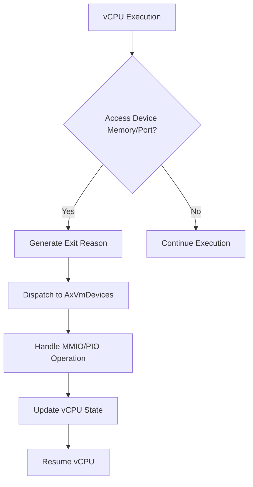
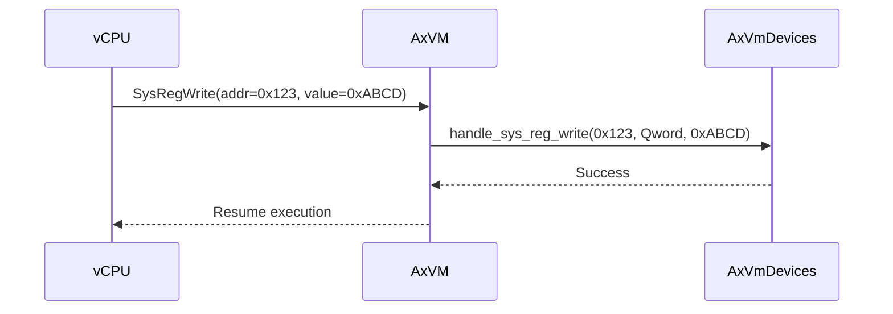
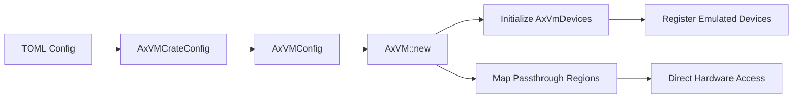

# Device Management

<cite>
**Referenced Files in This Document**   
- [vm.rs](file://src/vm.rs)
- [config.rs](file://src/config.rs)
- [hal.rs](file://src/hal.rs)
</cite>

## Table of Contents
1. [Introduction](#introduction)
2. [Device Registration and Management](#device-registration-and-management)
3. [I/O Handling Mechanisms](#io-handling-mechanisms)
4. [System Register Access Interception](#system-register-access-interception)
5. [Configuration-Driven Device Setup](#configuration-driven-device-setup)
6. [Dynamic Device Attachment](#dynamic-device-attachment)
7. [Device Exit Dispatching Logic](#device-exit-dispatching-logic)
8. [Timing-Sensitive Emulation Challenges](#timing-sensitive-emulation-challenges)
9. [Performance Trade-offs: Emulation vs Passthrough](#performance-trade-offs-emulation-vs-passthrough)

## Introduction
The AxVM crate provides virtual machine resource management within the ArceOS hypervisor framework, focusing on vCPU, memory, and device handling. This document details the mechanisms for emulated and passthrough device management in AxVM, including device registration through `AxVmDevices`, I/O trapping for MMIO and PIO accesses, system register interception, and configuration-driven setup via `AxVMCrateConfig`. The analysis covers how device exits are dispatched from vCPUs to appropriate handlers, synchronization challenges between vCPUs and device models, and performance implications of different virtualization strategies.

## Device Registration and Management
Devices within the AxVM structure are managed through the `AxVmDevices` container, which is initialized during VM creation with configurations derived from `AxVMCrateConfig`. The `AxVmDevices` instance holds both emulated and system register devices, allowing centralized dispatching of I/O operations triggered by vCPU exits. During VM initialization in `AxVM::new`, the device manager is constructed using emulated device configurations and conditionally populated with system register devices based on interrupt mode.

Passthrough devices are not directly stored in `AxVmDevices` but are instead mapped into the guest physical address space with `MappingFlags::DEVICE`, enabling direct access without interception. Emulated devices, however, rely on trap-and-emulate semantics where MMIO, PIO, and system register accesses trigger vCPU exits that are then handled by corresponding methods in `AxVmDevices`.

**Section sources**
- [vm.rs](file://src/vm.rs#L220-L230)
- [config.rs](file://src/config.rs#L150-L155)

## I/O Handling Mechanisms
I/O operations in AxVM follow a trap-and-emulate workflow initiated by vCPU exits due to MMIO or PIO accesses. When a vCPU encounters an access to a memory-mapped I/O region or port-mapped I/O instruction, it generates an exit reason such as `AxVCpuExitReason::MmioRead`, `AxVCpuExitReason::MmioWrite`, `AxVCpuExitReason::IoRead`, or `AxVCpuExitReason::IoWrite`. These exits are processed in the `run_vcpu` method, where they are dispatched to the VM's device manager via `get_devices()`.

For MMIO operations, the `handle_mmio_read` and `handle_mmio_write` methods of `AxVmDevices` are invoked with the guest physical address, access width, and data (for writes). Similarly, PIO operations use `handle_port_read` and `handle_port_write`. Successful handling returns control to the vCPU after updating register state, while unhandled exits propagate back to the caller for further processing.



**Diagram sources**
- [vm.rs](file://src/vm.rs#L435-L458)

**Section sources**
- [vm.rs](file://src/vm.rs#L435-L458)

## System Register Access Interception
System register accesses are intercepted and forwarded to device handlers through dedicated exit reasons: `AxVCpuExitReason::SysRegRead` and `AxVCpuExitReason::SysRegWrite`. On architectures like AArch64, these exits occur when guest code reads from or writes to architectural system registers that are virtualized. The `run_vcpu` loop processes these exits by invoking `handle_sys_reg_read` and `handle_sys_reg_write` on the `AxVmDevices` instance.

In non-passthrough mode, virtual timer devices are automatically added to `AxVmDevices` using `get_sysreg_device()`, ensuring that timer-related system register accesses are properly emulated. This mechanism enables precise control over timekeeping in guest VMs while maintaining isolation from host hardware.



**Diagram sources**
- [vm.rs](file://src/vm.rs#L459-L472)
- [vcpu.rs](file://src/vcpu.rs#L25-L30)

**Section sources**
- [vm.rs](file://src/vm.rs#L459-L472)

## Configuration-Driven Device Setup
Device configuration in AxVM originates from `AxVMCrateConfig`, typically parsed from a TOML file, and is converted into `AxVMConfig` during VM creation. Emulated devices are specified in the configuration and passed to `AxVmDevices` via `AxVmDeviceConfig`. Passthrough devices are defined separately and used to establish direct mappings in the guest address space.

During `AxVM::new`, passthrough device regions are aligned to 4K boundaries, sorted, and merged if overlapping before being mapped with `MappingFlags::DEVICE`. This ensures efficient translation while preventing conflicts. The interrupt mode—either virtualized or passthrough—affects whether additional virtual devices (like timers) are attached to the VM.



**Diagram sources**
- [config.rs](file://src/config.rs#L66-L103)
- [vm.rs](file://src/vm.rs#L150-L220)

**Section sources**
- [config.rs](file://src/config.rs#L66-L103)
- [vm.rs](file://src/vm.rs#L150-L220)

## Dynamic Device Attachment
While most devices are statically configured at VM creation, AxVM supports dynamic allocation of inter-VM communication (IVC) channels through `alloc_ivc_channel` and `release_ivc_channel`. These methods interact with `AxVmDevices` to reserve guest physical address ranges for shared memory communication between VMs. The allocated regions are managed internally by the device subsystem, demonstrating a limited form of runtime device attachment.

Although full dynamic device plug-in/plug-out is not currently implemented, the architecture allows for future extensions where devices could be added or removed post-boot, particularly for emulated peripherals or paravirtualized interfaces.

**Section sources**
- [vm.rs](file://src/vm.rs#L584-L615)

## Device Exit Dispatching Logic
The core logic for dispatching device exits resides in the `run_vcpu` method of `AxVM`. After a vCPU exit, the exit reason is matched against known device-related causes. Each handled case invokes the appropriate method on `get_devices()`, updates vCPU register state if needed, and continues the loop. Unhandled exits break the loop and are returned to the caller for higher-level processing.

This pattern centralizes device interaction within the VM object while delegating actual emulation logic to `AxVmDevices`. The use of an infinite loop with early termination ensures that multiple consecutive traps (e.g., in tight I/O loops) are handled efficiently without returning to external schedulers.

```mermaid
flowchart TD
    Start([Enter run_vcpu]) --> Loop{Loop Start}
    Loop --> Exit[Get vCPU Exit Reason]
    Exit --> MMIORead{MMIO Read?}
    MMIORead -->|Yes| HandleMMIORead[Call handle_mmio_read]
    HandleMMIORead --> SetGPR[Set GPR Value]
    SetGPR --> Continue[Continue Loop]
    
    MMIORead -->|No| MMIOWrite{MMIO Write?}
    MMIOWrite -->|Yes| HandleMMIOWrite[Call handle_mmio_write]
    HandleMMIOWrite --> Continue
    
    MMIOWrite -->|No| PIORead{PIO Read?}
    PIORead -->|Yes| HandlePIORead[Call handle_port_read]
    HandlePIORead --> SetEAX[Set RAX/AX/AL]
   