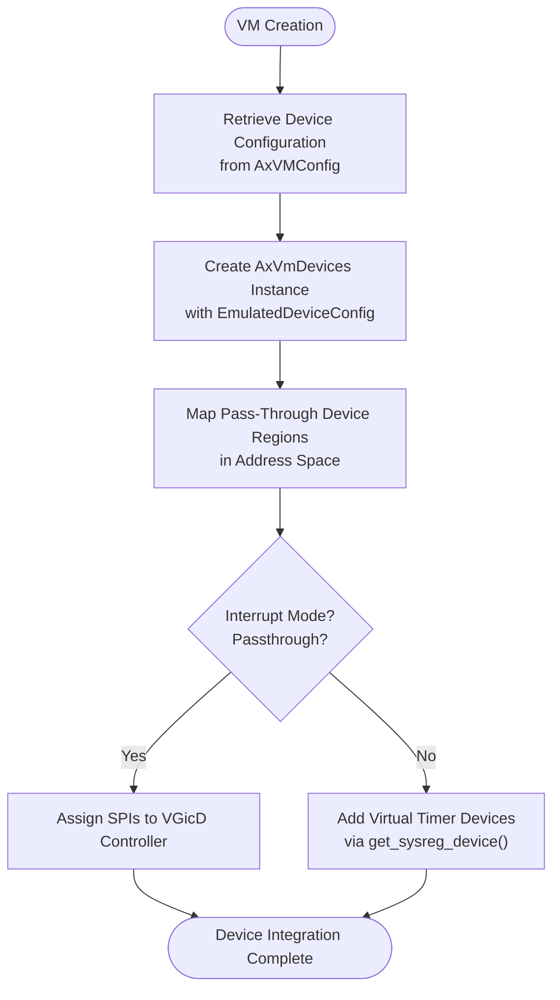
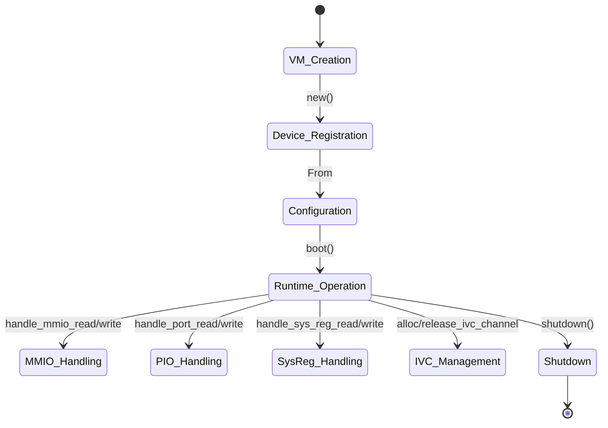

# Emulated Devices

<cite>
**Referenced Files in This Document**   
- [vm.rs](file://src/vm.rs)
- [config.rs](file://src/config.rs)
- [vcpu.rs](file://src/vcpu.rs)
</cite>

## Table of Contents
1. [Introduction](#introduction)
2. [Device Integration and Management](#device-integration-and-management)
3. [Lifecycle of Device Emulation](#lifecycle-of-device-emulation)
4. [Trap-and-Emulate Mechanism](#trap-and-emulate-mechanism)
5. [Common Emulated Device Types](#common-emulated-device-types)
6. [Challenges in Device Emulation](#challenges-in-device-emulation)
7. [Best Practices for Custom Device Implementation](#best-practices-for-custom-device-implementation)

## Introduction
The AxVM framework provides a structured approach to emulating hardware devices within virtual machines. This document details how emulated devices are integrated into the AxVmDevices structure, managed by the AxVM instance, and interact with vCPUs through trap-and-emulate mechanisms. The system supports both memory-mapped I/O (MMIO) and port I/O (PIO) operations, handling them via vCPU exits triggered by EPT violations or explicit I/O instruction interception.

**Section sources**
- [vm.rs](file://src/vm.rs#L0-L627)
- [config.rs](file://src/config.rs#L0-L195)

## Device Integration and Management
Emulated devices are initialized during VM creation through the `AxVM::new` function, where device configurations from `AxVMConfig` are used to instantiate an `AxVmDevices` object. This object serves as the central registry for all emulated devices associated with a VM instance.

The integration process begins when the VM configuration's `emu_devices()` method provides a list of `EmulatedDeviceConfig` structures that define the properties and behaviors of each emulated device. These configurations are passed to the `AxVmDevices::new` constructor, which initializes the appropriate device models based on type and configuration parameters.

Pass-through devices are also mapped during initialization, with their memory regions registered in the VM's address space using `MappingFlags::DEVICE`. For AArch64 architecture, special handling occurs based on interrupt mode: in passthrough mode, SPIs (Shared Peripheral Interrupts) are assigned to the VGicD controller if present; otherwise, virtual timer devices are added to handle system register accesses.



**Diagram sources**
- [vm.rs](file://src/vm.rs#L190-L283)

**Section sources**
- [vm.rs](file://src/vm.rs#L190-L283)
- [config.rs](file://src/config.rs#L131-L194)

## Lifecycle of Device Emulation
The lifecycle of device emulation spans from VM creation through runtime operation until shutdown. During VM initialization, devices are instantiated based on configuration data parsed from `AxVMCrateConfig`, which is converted to `AxVMConfig` via the `From<AxVMCrateConfig>` implementation.

At runtime, device access is mediated through the `run_vcpu` method, which processes vCPU exit reasons and dispatches I/O operations to the appropriate device handlers. The lifecycle includes:
1. **Registration**: Devices are registered during VM construction via `AxVmDevices::new`
2. **Configuration**: Device-specific setup occurs based on `EmulatedDeviceConfig`
3. **Runtime Handling**: I/O operations are trapped and dispatched to device models
4. **Resource Management**: IVC channels can be allocated/released via `alloc_ivc_channel` and `release_ivc_channel`

The `get_devices()` method provides access to the `AxVmDevices` instance throughout the VM's lifetime, enabling consistent interaction with emulated devices across different vCPUs.



**Diagram sources**
- [vm.rs](file://src/vm.rs#L403-L626)

**Section sources**
- [vm.rs](file://src/vm.rs#L403-L626)
- [config.rs](file://src/config.rs#L66-L103)

## Trap-and-Emulate Mechanism
The trap-and-emulate mechanism forms the core of device interaction in AxVM, leveraging hardware virtualization features to intercept privileged operations and emulate device behavior. When a vCPU executes an instruction that accesses an emulated device, it triggers a VM exit whose reason determines the subsequent handling path.

The `run_vcpu` function contains a loop that processes various exit reasons through pattern matching:
- **MMIO Access**: Triggers on EPT violations for device memory regions
- **Port I/O**: Intercepts IN/OUT instructions on x86 systems
- **System Register Access**: Handles architectural register reads/writes

For each intercepted operation, the framework calls the corresponding handler in `AxVmDevices`, such as `handle_mmio_read`, `handle_port_write`, etc. After processing, control flow returns to the vCPU unless the exit was unhandled, in which case it propagates back to the caller.

```mermaid
sequenceDiagram
participant VCPU as vCPU
participant VM as AxVM
participant DEVICES as AxVmDevices
VCPU->>VM : run()
VM->>VCPU : Execute guest code
Note over VCPU,VM : MMIO/PIO access triggers VM exit
VM->>VM : Match exit_reason
alt MMIO Read
VM->>DEVICES : handle_mmio_read(addr, width)
DEVICES-->>VM : Return value
VM->>VCPU : set_gpr(reg, value)
end
alt MMIO Write
VM->>DEVICES : handle_mmio_write(addr, width, data)
DEVICES-->>VM : Success/Failure
end
alt Port I/O Read
VM->>DEVICES : handle_port_read(port, width)
DEVICES-->>VM : Return value
VM->>VCPU : set_gpr(0, value)
end
alt System Register Access
VM->>DEVICES : handle_sys_reg_read/write(addr, value)
DEVICES-->>VM : Handle register access
end
else Unhandled Exit
VM-->>VCPU : Return exit reason
end
loop Continue execution
VM->>VCPU : Continue running
end
```

**Diagram sources**
- [vm.rs](file://src/vm.rs#L424-L487)

**Section sources**
- [vm.rs](file://src/vm.rs#L424-L487)

## Common Emulated Device Types
While specific device implementations reside outside the core AxVM crate, the framework supports several categories of emulated devices through standardized interfaces:

### Memory-Mapped Devices
These devices occupy specific GPA ranges marked with `MappingFlags::DEVICE`. Accesses generate EPT violations that are translated into `MmioRead`/`MmioWrite` exit reasons and handled by corresponding methods in `AxVmDevices`.

### Port I/O Devices
Primarily relevant on x86 architectures, these devices use dedicated I/O instructions (IN/OUT). The framework intercepts `IoRead`/`IoWrite` exits and routes them to `handle_port_read`/`handle_port_write` methods.

### System Register Devices
On AArch64, certain system registers may be virtualized, particularly in non-passthrough interrupt modes. The `get_sysreg_device` function provides access to virtual timer devices that handle system register accesses through `SysRegRead`/`SysRegWrite` exits.

### Inter-VM Communication (