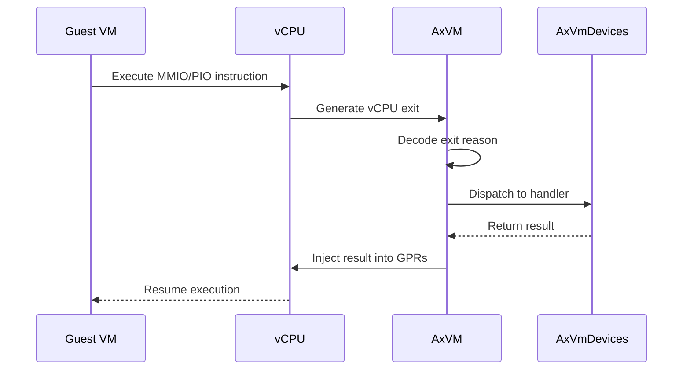
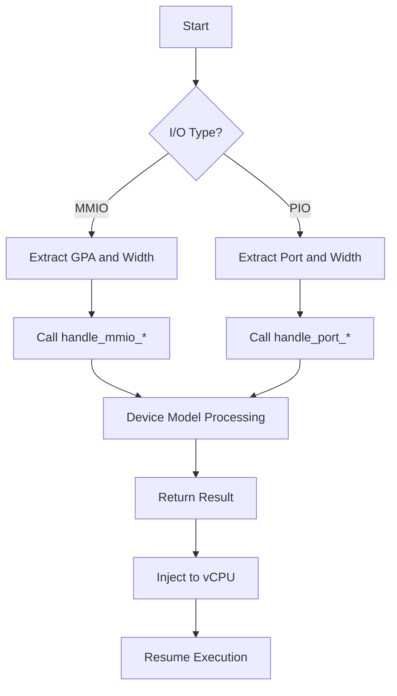

# I/O Handling

<cite>
**Referenced Files in This Document**
- [vm.rs](file://src/vm.rs)
- [config.rs](file://src/config.rs)
- [vcpu.rs](file://src/vcpu.rs)
</cite>

## Table of Contents
1. [Introduction](#introduction)
2. [I/O Exit Generation and Dispatching](#i/o-exit-generation-and-dispatching)
3. [MMIO and PIO Handling Mechanisms](#mmio-and-pio-handling-mechanisms)
4. [Exit Dispatching Logic in vm.rs](#exit-dispatching-logic-in-vmrs)
5. [Read vs Write Operations and Operand Handling](#read-vs-write-operations-and-operand-handling)
6. [Alignment Considerations and Edge Cases](#alignment-considerations-and-edge-cases)
7. [Performance Optimization Strategies](#performance-optimization-strategies)
8. [Troubleshooting Common I/O Issues](#troubleshooting-common-i/o-issues)

## Introduction
The AxVM hypervisor implements a robust I/O handling mechanism through Memory-Mapped I/O (MMIO) and Port I/O (PIO) operations, enabling virtual machines to interact with emulated and pass-through devices. When guest code performs I/O operations on designated memory or port addresses, these accesses trigger vCPU exits that are intercepted by the hypervisor and dispatched to appropriate device handlers. This document details the complete flow from vCPU execution to exit interception, decoding, handler invocation, and result injection back into the vCPU state. The system supports various operand sizes, handles alignment constraints, and manages edge cases such as unaligned accesses and overlapping device regions.

## I/O Exit Generation and Dispatching
In AxVM, I/O operations generate vCPU exits through hardware-assisted virtualization features. When a guest attempts to access MMIO or PIO regions, the underlying virtualization extensions (such as Intel VT-x, AMD-V, or ARM Virtualization Host Extensions) trap these operations and transfer control to the hypervisor. The vCPU exit mechanism is implemented in the `run_vcpu` method of the `AxVM` struct, where each exit reason is matched against known I/O operation types. For MMIO operations, exits occur on reads and writes to memory regions marked with the `MappingFlags::DEVICE` flag during VM setup. For PIO operations, exits are generated when the guest executes IN/OUT instructions targeting specific port ranges. These exits are then decoded and dispatched to registered device models through the `AxVmDevices` interface.

**Diagram sources**
- [vm.rs](file://src/vm.rs#L424-L487)

**Section sources**
- [vm.rs](file://src/vm.rs#L403-L487)

## MMIO and PIO Handling Mechanisms
AxVM distinguishes between MMIO and PIO operations based on their addressing mechanisms and exit reasons. MMIO operations use memory addresses within the guest physical address space that are mapped to device registers, while PIO operations use dedicated port addresses accessed via special CPU instructions. During VM creation, pass-through device regions are identified and merged if overlapping, then mapped into the guest address space with `MappingFlags::DEVICE`. The `handle_mmio_read` and `handle_mmio_write` methods process MMIO operations by extracting the target address and width from the exit reason, forwarding them to the appropriate device model. Similarly, PIO operations are handled through `handle_port_read` and `handle_port_write`, which receive port numbers and data widths. Both mechanisms ensure proper isolation between guest and host resources while maintaining compatibility with standard device driver interfaces.

**Diagram sources**
- [vm.rs](file://src/vm.rs#L190-L226)
- [vm.rs](file://src/vm.rs#L424-L487)

**Section sources**
- [vm.rs](file://src/vm.rs#L190-L226)
- [vm.rs](file://src/vm.rs#L424-L487)

## Exit Dispatching Logic in vm.rs
The exit dispatching logic in `vm.rs` centers around the `run_vcpu` function, which processes vCPU exits in a loop until an unhandled exit occurs. Each exit reason is pattern-matched against various I/O operation types, including `MmioRead`, `MmioWrite`, `IoRead`, and `IoWrite`. For MMIO reads, the handler extracts the target address, access width, and destination register, then calls `handle_mmio_read` on the VM's device collection. The returned value is injected into the specified general-purpose register using `set_gpr`. MMIO writes follow a similar path but don't require result injection. PIO operations have simpler semantics: read results are always placed in the first general-purpose register (EAX/RAX), while writes forward data directly to the device. Unhandled exits break the loop and propagate to the caller for higher-level processing.

**Section sources**
- [vm.rs](file://src/vm.rs#L424-L487)

## Read vs Write Operations and Operand Handling
AxVM differentiates between read and write operations in both MMIO and PIO contexts, with distinct handling patterns for each. Read operations require result injection back into the vCPU state, while write operations only need successful completion acknowledgment. For MMIO reads, the `MmioRead` exit reason includes the destination register identifier, allowing precise result placement. The access width (8, 16, 32, or 64 bits) is converted to `AccessWidth` enum and passed to the device handler. MMIO writes include the data value in the exit reason, which is forwarded along with address and width information. PIO reads return values are always placed in the first general-purpose register (register 0), following x86/x64 conventions, though this behavior is noted as needing width-specific handling improvements. PIO writes similarly forward port, width, and data information to the appropriate handler.

**Section sources**
- [vm.rs](file://src/vm.rs#L424-L487)

## Alignment Considerations and Edge Cases
The AxVM implementation handles several edge cases related to I/O operations, particularly concerning alignment and region management. During VM setup, pass-through device regions are aligned to 4K boundaries using `align_down_4k` and `align_up_4k` functions before being mapped into the guest address space. Overlapping device regions are automatically merged to prevent conflicts and ensure coherent device access. While the current implementation doesn't explicitly check for unaligned accesses within the I/O handlers themselves, the underlying memory management system may enforce alignment requirements depending on the architecture. Repeated string I/O instructions (such as REP MOVS) would generate multiple sequential exits, processed individually by the dispatching loop. The system assumes that device models handle any internal alignment requirements for multi-byte operations beyond simple width specifications.

**Section sources**
- [vm.rs](file://src/vm.rs#L190-L226)
- [vm.rs](file://src/vm.rs#L424-L487)

## Performance Optimization Strategies
AxVM employs several strategies to optimize I/O handling performance despite the inherent overhead of vCPU exits. The tight dispatching loop in `run_vcpu` minimizes context switching overhead by processing multiple consecutive I/O operations without returning to higher-level control flow. Device access metadata is implicitly cached through the persistent `AxVmDevices` instance maintained by each VM, avoiding repeated device lookups. The use of direct function calls rather than message passing reduces invocation overhead between the VM core and device models. Memory mapping optimizations include merging overlapping device regions and using linear mappings for pass-through devices, reducing page table complexity. Future improvements could include explicit caching of decoded instruction metadata, batching of related I/O operations, and selective disabling of exits for frequently accessed device registers that maintain predictable states.

**Section sources**
- [vm.rs](file://src/vm.rs#L190-L226)
- [vm.rs](file://src/vm.rs#L424-L487)

## Troubleshooting Common I/O Issues
Common I/O-related issues in AxVM typically manifest as hangs or incorrect device responses. Hangs often occur when device handlers fail to return properly from `handle_mmio_read`, `handle_mmio_write`, `handle_port_read`, or `handle_port_write` calls, causing the vCPU to remain trapped in the exit dispatching loop. Incorrect responses usually stem from mismatched access widths between guest expectations and device implementations, or improper result injection in read operations. Debugging should begin by verifying that all device regions are properly configured in the VM configuration and that no overlapping mappings conflict with memory regions. The trace output from `run_vcpu` provides valuable insight into exit frequency and types, helping identify whether expected I/O operations are being intercepted correctly. Ensuring that all device handlers respect the specified access widths and properly handle edge cases like unaligned accesses is crucial for stable operation.

**Section sources**
- [vm.rs](file://src/vm.rs#L424-L487)
- [config.rs](file://src/config.rs#L66-L103)