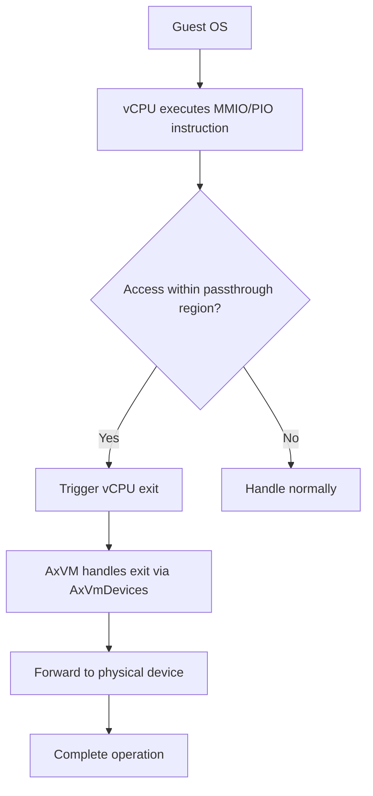
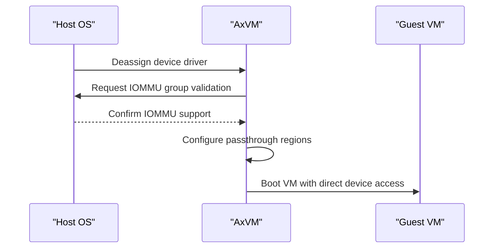
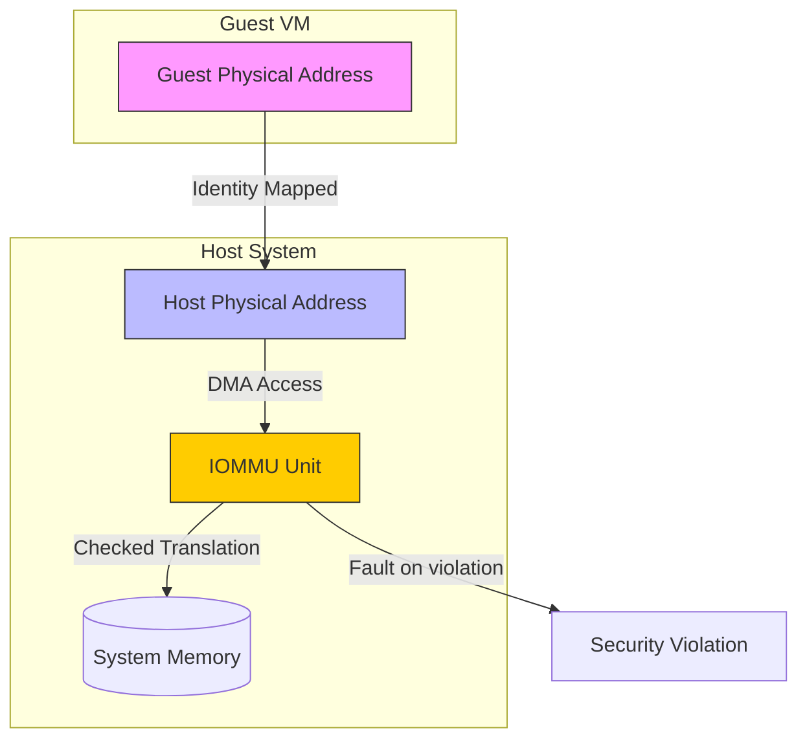
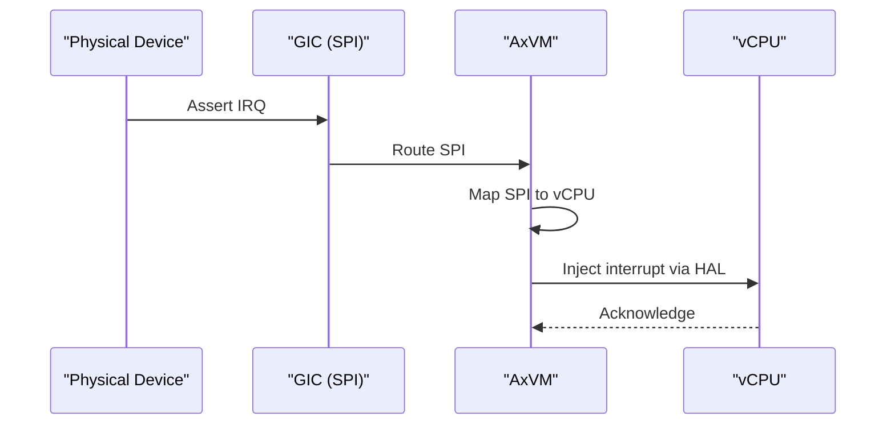

# Passthrough Devices

<cite>
**Referenced Files in This Document**
- [vm.rs](file://src/vm.rs)
- [config.rs](file://src/config.rs)
- [hal.rs](file://src/hal.rs)
</cite>

## Table of Contents
1. [Introduction](#introduction)
2. [Device Passthrough Overview](#device-passthrough-overview)
3. [Configuration and Initialization](#configuration-and-initialization)
4. [IOMMU and Memory Mapping](#iommu-and-memory-mapping)
5. [Interrupt Handling](#interrupt-handling)
6. [Data Flow for MMIO and PIO Access](#data-flow-for-mmio-and-pio-access)
7. [vCPU Exit Handling for Passthrough Devices](#vcpu-exit-handling-for-passthrough-devices)
8. [Performance Benefits and Limitations](#performance-benefits-and-limitations)
9. [Security and Isolation](#security-and-isolation)
10. [Debugging Common Issues](#debugging-common-issues)

## Introduction
This document provides a comprehensive analysis of the device passthrough functionality in AxVM, a minimal virtual machine monitor (VMM) designed to run guest VMs with direct access to physical hardware. The focus is on how AxVM enables secure and efficient passthrough of physical devices to guest VMs by leveraging hardware-assisted virtualization features such as IOMMU, DMA remapping, and interrupt routing. The implementation ensures isolation between host and guest while minimizing software intervention during device access.

**Section sources**
- [vm.rs](file://src/vm.rs#L1-L50)
- [lib.rs](file://src/lib.rs#L1-L10)

## Device Passthrough Overview
AxVM supports direct assignment of physical devices to guest VMs through its device passthrough mechanism. This allows guest operating systems to interact with hardware devices (e.g., network cards, storage controllers) as if they were running natively, significantly reducing overhead compared to full emulation. The `AxVmDevices` module manages both emulated and passthrough devices, with special handling for memory-mapped I/O (MMIO) and port I/O (PIO) operations that trigger vCPU exits when accessing passthrough regions.

The passthrough functionality relies on proper configuration via `PassThroughDeviceConfig`, which specifies the device's base guest physical address (GPA), host physical address (HPA), and length. These configurations are processed during VM creation to establish direct mappings in the guest’s address space.

**Diagram sources**
- [vm.rs](file://src/vm.rs#L400-L450)
- [config.rs](file://src/config.rs#L60-L87)

**Section sources**
- [vm.rs](file://src/vm.rs#L174-L185)
- [config.rs](file://src/config.rs#L171-L177)

## Configuration and Initialization
Passthrough devices are configured using the `AxVMConfig` structure, which includes a list of `PassThroughDeviceConfig` entries. Each entry defines the device's GPA, HPA, size, and name. During VM initialization, these configurations are used to set up linear mappings in the guest’s address space with appropriate permissions (`DEVICE | READ | WRITE | USER`).

Before assigning a device to a VM, the host must deassign the device from its driver (e.g., using VFIO on Linux) to prevent conflicts. Additionally, the device must belong to an IOMMU group that supports DMA remapping to ensure memory safety during direct memory access.

**Diagram sources**
- [config.rs](file://src/config.rs#L171-L177)
- [vm.rs](file://src/vm.rs#L174-L185)

**Section sources**
- [config.rs](file://src/config.rs#L171-L177)
- [vm.rs](file://src/vm.rs#L174-L185)

## IOMMU and Memory Mapping
The integration of IOMMU through the HAL (Hardware Abstraction Layer) is critical for secure device passthrough. AxVM uses the `AxVMHal` trait to interface with platform-specific IOMMU services, ensuring that DMA operations initiated by passthrough devices are translated and isolated correctly. The `map_linear` function in `AddrSpace` establishes identity mappings between GPA and HPA for passthrough regions, allowing the guest to directly address physical device registers.

DMA remapping ensures that devices cannot access arbitrary host memory, enforcing strict boundaries defined by the VMM. This is achieved by programming the IOMMU page tables to allow access only to designated memory regions associated with the assigned device.

**Diagram sources**
- [vm.rs](file://src/vm.rs#L174-L185)
- [hal.rs](file://src/hal.rs#L1-L45)

**Section sources**
- [vm.rs](file://src/vm.rs#L174-L185)
- [hal.rs](file://src/hal.rs#L1-L45)

## Interrupt Handling
Interrupt routing for passthrough devices depends on the architecture and interrupt mode. In passthrough mode (`VMInterruptMode::Passthrough`), interrupts from physical devices (such as SPIs on ARM GIC) are directly injected into target vCPUs. On AArch64, AxVM locates the virtual GIC distributor (VGicD) among emulated devices and assigns specific SPIs to the VM’s CPU ID.

For MSI and legacy interrupts, the underlying HAL must support injection via `inject_irq_to_vcpu`. This ensures that hardware interrupts are delivered efficiently without requiring full emulation of interrupt controllers unless necessary.

**Diagram sources**
- [vm.rs](file://src/vm.rs#L200-L230)
- [hal.rs](file://src/hal.rs#L40-L44)

**Section sources**
- [vm.rs](file://src/vm.rs#L200-L230)

## Data Flow for MMIO and PIO Access
When a vCPU accesses a passthrough device via MMIO or PIO, it triggers a vCPU exit due to unmapped or trapped memory/port access. Unlike fully emulated devices, passthrough devices require minimal software intervention because the mapping already exists in hardware (via IOMMU and stage-2 translation). The exit handler forwards the request directly to the physical device through the `AxVmDevices` interface.

This reduces latency and CPU overhead, approaching native performance for device I/O operations. The data flow involves:
1. vCPU attempts MMIO read/write at GPA.
2. Hardware detects access to passthrough region → vCPU exit.
3. AxVM extracts operation details