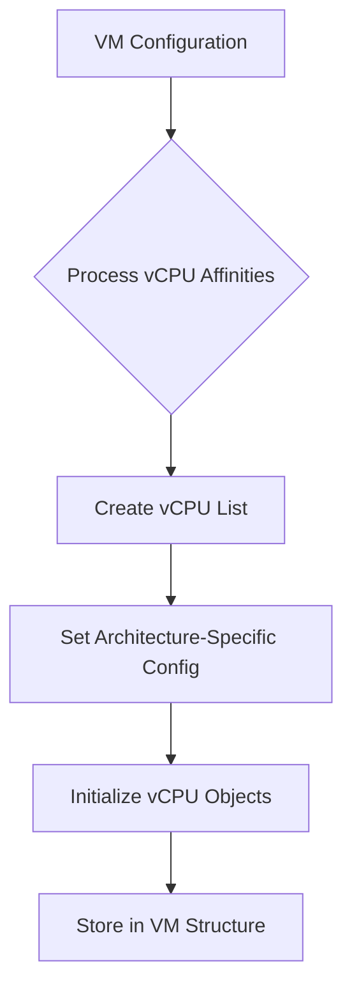
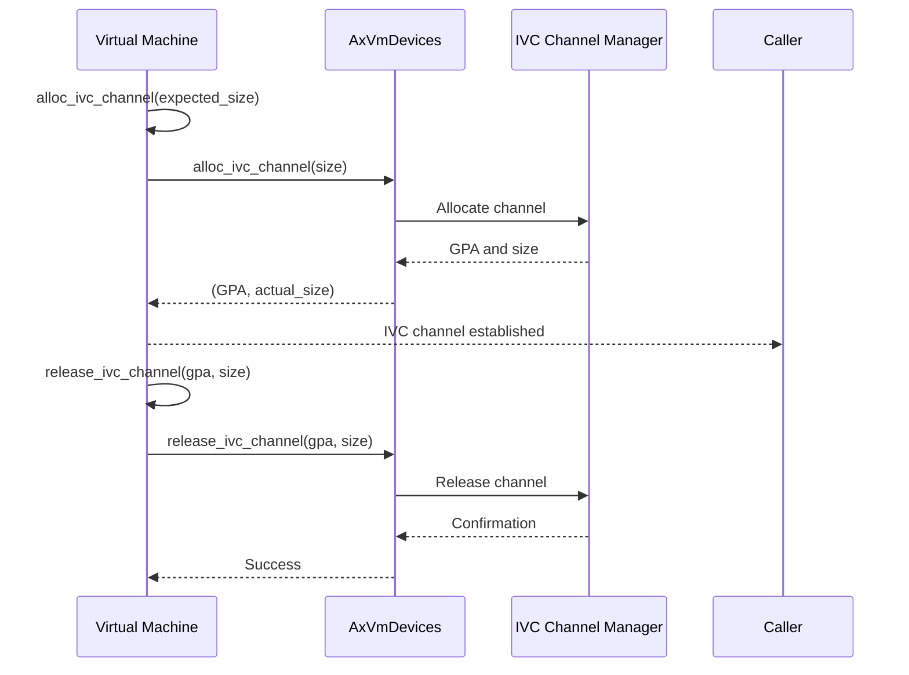
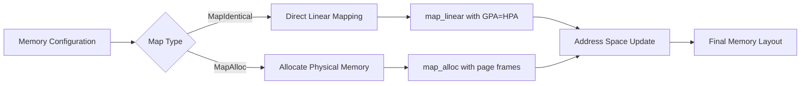
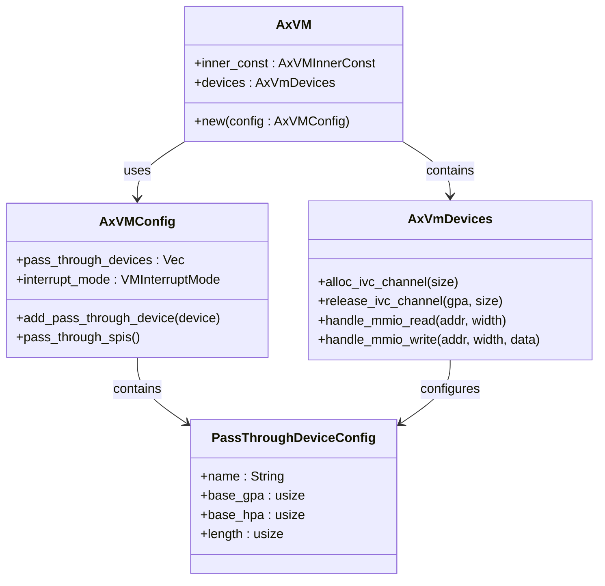
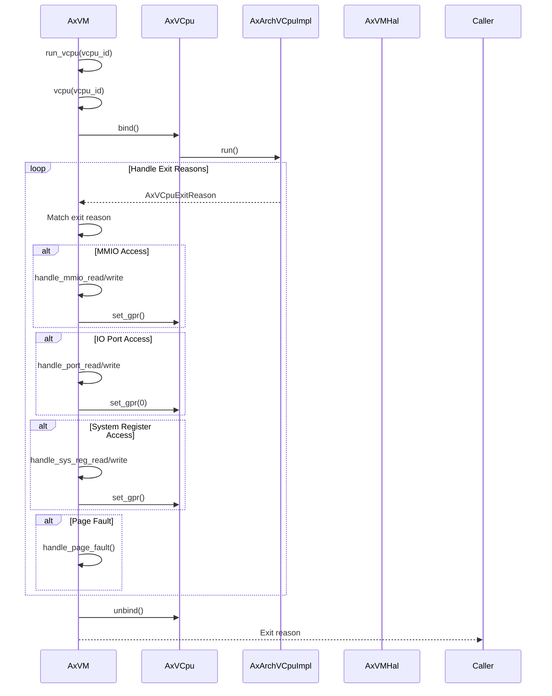

# Advanced VM Patterns

<cite>
**Referenced Files in This Document**   
- [vm.rs](file://src/vm.rs)
- [vcpu.rs](file://src/vcpu.rs)
- [config.rs](file://src/config.rs)
- [hal.rs](file://src/hal.rs)
- [lib.rs](file://src/lib.rs)
</cite>

## Table of Contents
1. [Introduction](#introduction)
2. [Multi-vCPU Configuration Management](#multi-vcpu-configuration-management)
3. [Inter-VM Communication via IVC Channels](#inter-vm-communication-via-ivc-channels)
4. [Dynamic Memory Region Remapping](#dynamic-memory-region-remapping)
5. [Selective Device Passthrough Implementation](#selective-device-passthrough-implementation)
6. [Architecture-Agnostic vCPU Execution Control](#architecture-agnostic-vcpu-execution-control)
7. [Runtime Modifications and Interrupt Injection](#runtime-modifications-and-interrupt-injection)
8. [Performance Monitoring and VM Exit Optimization](#performance-monitoring-and-vm-exit-optimization)

## Introduction
This document details advanced virtual machine patterns implemented in the AxVM hypervisor framework, focusing on multi-vCPU configurations, inter-VM communication, dynamic memory management, and device passthrough mechanisms. The analysis leverages core components from vm.rs and vcpu.rs to demonstrate how these advanced features are implemented using architecture-agnostic APIs while maintaining high performance and security.

## Multi-vCPU Configuration Management
The AxVM system supports sophisticated multi-vCPU configurations through its flexible VM creation API. During VM initialization, vCPU affinity settings are processed from the configuration object, allowing precise control over physical CPU allocation.

**Diagram sources**
- [vm.rs](file://src/vm.rs#L69-L106)
- [config.rs](file://src/config.rs#L100-L134)

The system processes vCPU affinities by first retrieving the configuration through `get_vcpu_affinities_pcpu_ids()`, which returns a vector of tuples containing vCPU ID, physical CPU affinity mask, and physical ID. Each vCPU is then created with architecture-specific configuration parameters that vary based on target architecture (aarch64, riscv64, or x86_64).

**Section sources**
- [vm.rs](file://src/vm.rs#L69-L106)
- [config.rs](file://src/config.rs#L100-L134)

## Inter-VM Communication via IVC Channels
The AxVM framework provides secure inter-VM communication through IVC (Inter-VM Communication) channels, enabling controlled data exchange between isolated virtual machines.

**Diagram sources**
- [vm.rs](file://src/vm.rs#L584-L615)
- [vm.rs](file://src/vm.rs#L617-L626)

The IVC channel mechanism operates through two primary methods: `alloc_ivc_channel()` and `release_ivc_channel()`. When allocating a channel, the requested size is aligned to 4K boundaries using `align_up_4k()` before delegation to the underlying device manager. The allocation request is forwarded to `AxVmDevices`, which manages the actual IVC resources and returns a guest physical address (GPA) for the allocated channel.

**Section sources**
- [vm.rs](file://src/vm.rs#L584-L626)

## Dynamic Memory Region Remapping
The AxVM system implements dynamic memory region remapping capabilities, allowing runtime modifications to the VM's memory layout through both identical mapping and allocated mapping strategies.

**Diagram sources**
- [vm.rs](file://src/vm.rs#L108-L188)

Two distinct memory mapping approaches are supported: `MapIdentical` performs direct linear mapping where guest physical addresses (GPA) are mapped directly to host physical addresses (HPA) at the same location, while `MapAlloc` allocates new physical memory pages for the guest. The system validates mapping flags and excludes DEVICE flags from regular memory regions, directing such mappings to the pass-through device configuration instead.

For pass-through devices, the system aligns base addresses and lengths to 4K boundaries, sorts regions by GPA, and merges overlapping regions to create an optimal memory map. Each merged region is then mapped with DEVICE, READ, WRITE, and USER permissions enabled.

**Section sources**
- [vm.rs](file://src/vm.rs#L108-L226)

## Selective Device Passthrough Implementation
The AxVM framework supports selective device passthrough, allowing specific hardware devices to be directly exposed to guest VMs while maintaining isolation for other system resources.

**Diagram sources**
- [config.rs](file://src/config.rs#L170-L194)
- [vm.rs](file://src/vm.rs#L152-L226)

Device passthrough is configured through the `AxVMConfig` structure, which maintains a list of `PassThroughDeviceConfig` objects. Each configuration specifies the device name, guest physical address (GPA), host physical address (HPA), and length. During VM creation, these configurations are processed to establish direct memory mappings for the devices.

The interrupt passthrough mode is determined by the `VMInterruptMode` setting. In passthrough mode on aarch64 architectures, SPIs (Shared Peripheral Interrupts) are assigned to specific CPUs through the VGicD (Virtual Generic Interrupt Controller Distributor) interface. For non-passthrough mode, virtual timer devices are set up using `get_sysreg_device()` to provide emulated timing services to the guest.

**Section sources**
- [config.rs](file://src/config.rs#L170-L194)
- [vm.rs](file://src/vm.rs#L152-L254)

## Architecture-Agnostic vCPU Execution Control
The AxVM system provides architecture-agnostic interfaces for vCPU management, enabling consistent control across different processor architectures while handling architecture-specific details transparently.

**Diagram sources**
- [vm.rs](file://src/vm.rs#L424-L487)
- [vcpu.rs](file://src/vcpu.rs#L0-L29)

The vCPU execution model follows a structured approach where `run_vcpu()` initiates execution of a specific vCPU by ID. The process begins with binding the vCPU to the current physical CPU context, followed by entering the architecture-specific execution loop. The vCPU may exit for various reasons including MMIO accesses, IO port operations, system register accesses, or page faults.

The VM handles each exit reason appropriately:
- MMIO reads/writes are delegated to the device manager
- IO port operations update general-purpose registers (GPRs)
- System register accesses modify architectural state
- Nested page faults trigger memory management operations

After handling the exit (or determining it requires propagation), the vCPU is unbound from the physical CPU context before returning the exit reason to the caller.

**Section sources**
- [vm.rs](file