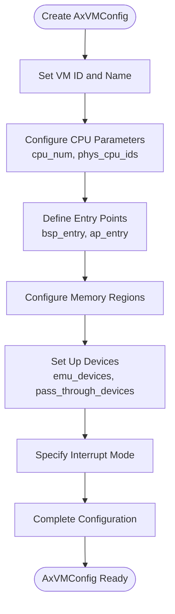
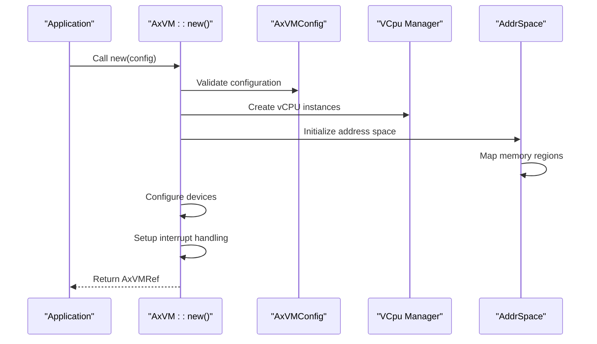
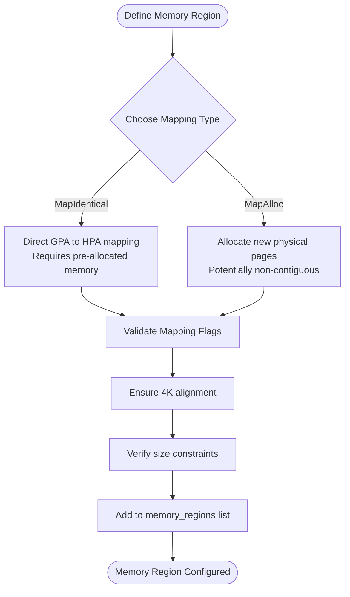
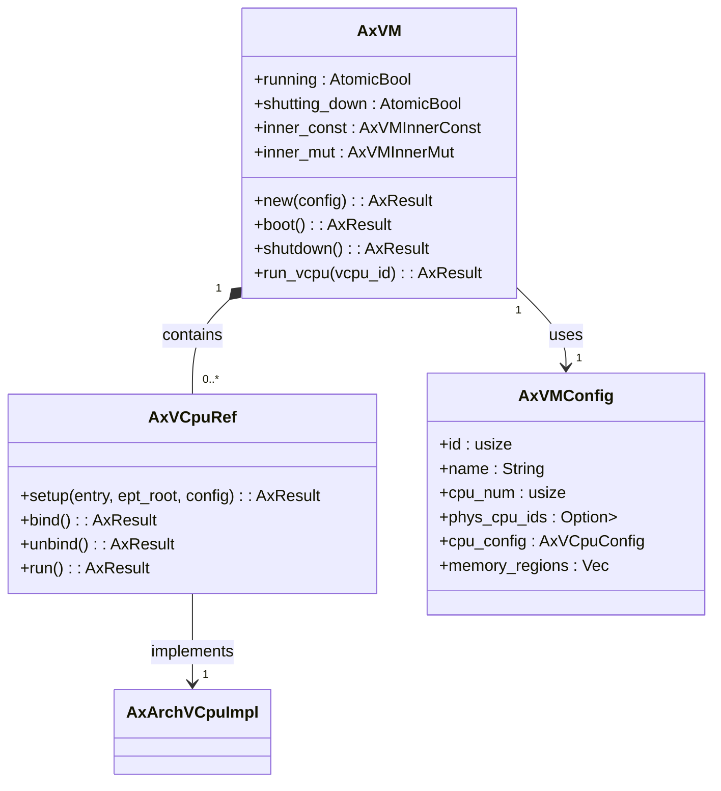

# Basic VM Setup

<cite>
**Referenced Files in This Document **   
- [lib.rs](file://src/lib.rs)
- [config.rs](file://src/config.rs)
- [vm.rs](file://src/vm.rs)
- [hal.rs](file://src/hal.rs)
</cite>

## Table of Contents
1. [Introduction](#introduction)
2. [VM Configuration with AxVMConfig](#vm-configuration-with-axvmconfig)
3. [Creating and Initializing the VM](#creating-and-initializing-the-vm)
4. [Memory Region Configuration](#memory-region-configuration)
5. [vCPU Attachment and Management](#vcpu-attachment-and-management)
6. [Booting and Running the VM](#booting-and-running-the-vm)
7. [Graceful Shutdown Process](#graceful-shutdown-process)
8. [HAL Integration Requirements](#hal-integration-requirements)
9. [Error Handling and Common Pitfalls](#error-handling-and-common-pitfalls)

## Introduction
This guide provides a comprehensive walkthrough for setting up a minimal virtual machine using the axvm library. The process involves configuring an AxVM instance through AxVMConfig, instantiating the VM, attaching vCPUs, and managing execution lifecycle. The documentation covers essential configuration parameters, memory mapping strategies, vCPU management, and proper error handling patterns. Special attention is given to integration points with the HAL (Hardware Abstraction Layer) and common configuration pitfalls that may prevent successful VM operation.

## VM Configuration with AxVMConfig
The foundation of VM setup begins with the AxVMConfig structure, which encapsulates all necessary configuration parameters for VM creation. This configuration object serves as the blueprint for the virtual machine's resources and behavior. Key configuration elements include VM identification, CPU topology, memory layout, device assignments, and interrupt handling modes.

The AxVMConfig structure is typically populated from higher-level configuration sources and contains critical settings such as the number of vCPUs, entry points for bootstrap and application processors, memory region specifications, and device configurations. The configuration process ensures that all required resources are properly defined before VM instantiation.

**Diagram sources**
- [config.rs](file://src/config.rs#L33-L64)

**Section sources**
- [config.rs](file://src/config.rs#L0-L195)

## Creating and Initializing the VM
VM creation is accomplished through the AxVM::new() method, which takes an AxVMConfig instance as input and returns a reference-counted AxVMRef. This method performs comprehensive validation of the configuration and initializes all VM components. The creation process follows a structured sequence: validate hardware support, parse configuration parameters, allocate resources, and prepare execution environment.

During initialization, the VM constructor processes vCPU affinity settings, creates vCPU instances according to the specified count, and establishes the address space for guest memory management. The method also handles device configuration, including both emulated and pass-through devices, and sets up interrupt routing based on the specified interrupt mode.

**Diagram sources**
- [vm.rs](file://src/vm.rs#L73-L283)

**Section sources**
- [vm.rs](file://src/vm.rs#L73-L283)
- [lib.rs](file://src/lib.rs#L25-L32)

## Memory Region Configuration
Proper memory region configuration is critical for VM functionality. The axvm library supports two primary memory mapping types through the VmMemMappingType enumeration: MapIdentical and MapAlloc. Each type serves different use cases and has specific requirements for successful operation.

MapIdentical creates a direct 1:1 mapping between guest physical addresses (GPA) and host physical addresses (HPA), which is suitable for scenarios where memory needs to be shared directly with the host. MapAlloc allocates new physical memory pages for the guest, providing isolation but potentially resulting in non-contiguous physical memory allocation.

When defining memory regions, it's essential to specify appropriate mapping flags that define access permissions (read, write, execute) and memory characteristics. The configuration must ensure that memory regions do not overlap and that sufficient physical memory is available for allocation.

**Diagram sources**
- [vm.rs](file://src/vm.rs#L100-L150)
- [config.rs](file://src/config.rs#L150-L170)

**Section sources**
- [vm.rs](file://src/vm.rs#L100-L150)
- [config.rs](file://src/config.rs#L150-L170)

## vCPU Attachment and Management
vCPU management in axvm involves creating and binding virtual CPUs to the VM instance during initialization. The system supports attaching multiple vCPUs, with each vCPU having configurable affinities to physical CPU cores. The first vCPU (ID 0) serves as the Bootstrap Processor (BSP), while additional vCPUs function as Application Processors (APs).

vCPU creation requires architecture-specific configuration parameters that vary by target platform (x86_64, riscv64, aarch64). These parameters include processor identifiers (MPIDR_EL1 for ARM, hart_id for RISC-V) and device tree blob addresses. During setup, each vCPU is configured with its entry point, page table root, and architecture-specific setup parameters.

The vCPU subsystem handles binding and unbinding operations that associate vCPUs with physical execution contexts. This mechanism ensures that vCPU state is properly managed during execution and context switches.

**Diagram sources**
- [vm.rs](file://src/vm.rs#L43-L73)
- [vcpu.rs](file://src/vcpu.rs#L0-L29)

**Section sources**
- [vm.rs](file://src/vm.rs#L283-L330)
- [vcpu.rs](file://src/vcpcu.rs#L0-L29)

## Booting and Running the VM
The VM boot process is initiated through the boot() method, which performs final validation and transitions the VM to