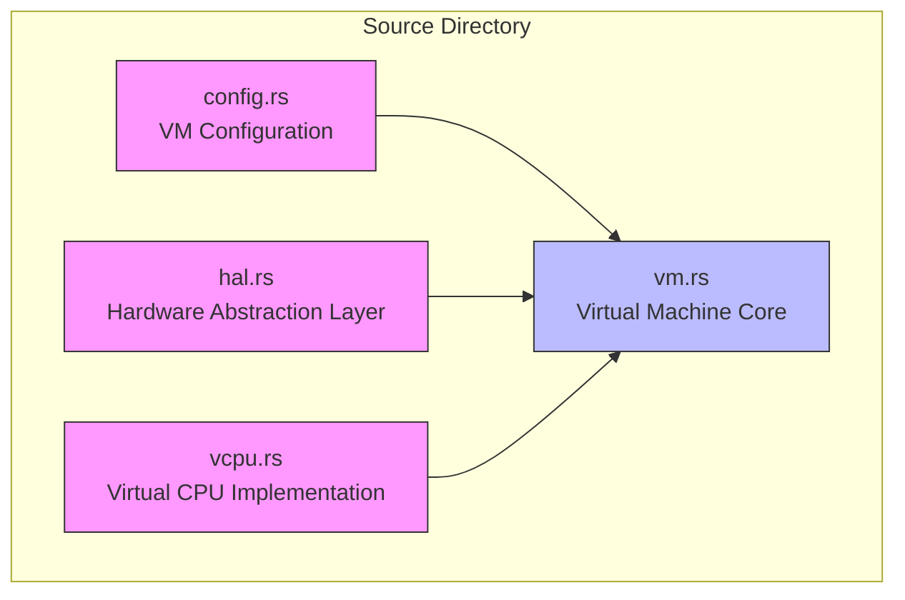
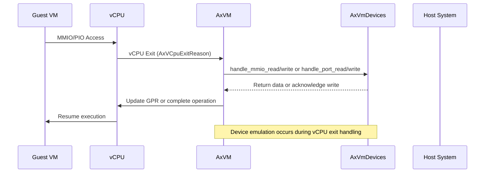
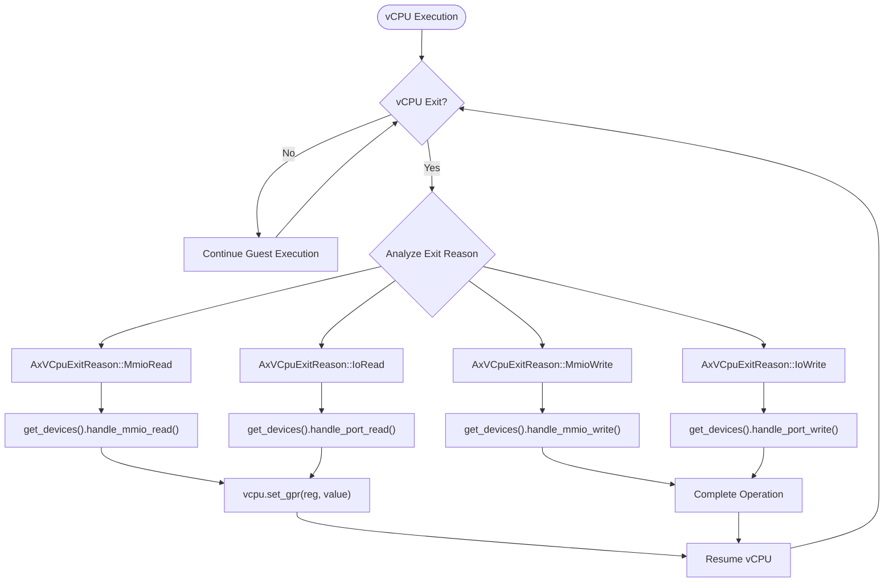
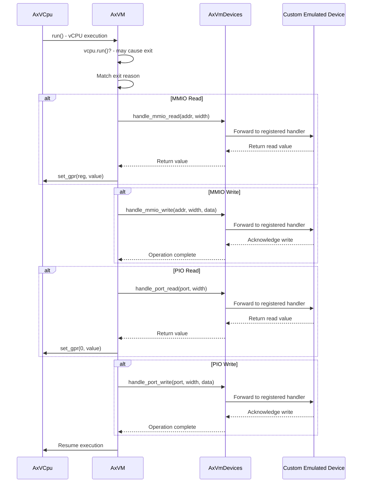

# Custom Device Emulation

<cite>
**Referenced Files in This Document **   
- [vm.rs](file://src/vm.rs)
- [hal.rs](file://src/hal.rs)
- [config.rs](file://src/config.rs)
</cite>

## Table of Contents
1. [Introduction](#introduction)
2. [Project Structure](#project-structure)
3. [Core Components](#core-components)
4. [Architecture Overview](#architecture-overview)
5. [Detailed Component Analysis](#detailed-component-analysis)
6. [Dependency Analysis](#dependency-analysis)
7. [Performance Considerations](#performance-considerations)
8. [Troubleshooting Guide](#troubleshooting-guide)
9. [Conclusion](#conclusion)

## Introduction
This document provides a comprehensive guide to implementing custom device emulation within the axvm framework. It demonstrates how to intercept MMIO (Memory-Mapped I/O) or PIO (Port I/O) accesses from guest VMs by handling vCPU exits in the VM execution loop. The implementation focuses on creating a simple emulated device that integrates with the existing device handling infrastructure, showcasing bidirectional communication patterns between guest and host systems while addressing synchronization requirements and performance implications.

## Project Structure
The axvm project is structured around virtual machine resource management, with core components organized into distinct modules for configuration, hardware abstraction, virtual CPU operations, and VM management. The primary source files are located in the `src` directory, each serving specific responsibilities in the virtualization stack.



**Diagram sources **
- [vm.rs](file://src/vm.rs)
- [config.rs](file://src/config.rs)
- [hal.rs](file://src/hal.rs)

**Section sources**
- [vm.rs](file://src/vm.rs)
- [config.rs](file://src/config.rs)

## Core Components
The axvm framework's core components enable virtual machine creation, configuration, and execution with support for device emulation. Key elements include the AxVM structure for VM management, AxVMHal trait for hardware abstraction, and device handling mechanisms for intercepting I/O operations. The system leverages the AxVmDevices collection to manage both emulated and pass-through devices, providing hooks for custom device implementations through the VM execution loop.

**Section sources**
- [vm.rs](file://src/vm.rs#L0-L627)
- [hal.rs](file://src/hal.rs#L0-L44)

## Architecture Overview
The axvm architecture implements a hypervisor layer that manages virtual machines through a combination of hardware-assisted virtualization and software-based device emulation. When a guest VM attempts to access I/O devices via MMIO or PIO instructions, the processor triggers a VM exit, transferring control to the hypervisor's execution loop where these operations are intercepted and handled.



**Diagram sources **
- [vm.rs](file://src/vm.rs#L424-L487)

## Detailed Component Analysis

### Device Emulation Flow
The device emulation process begins when a guest VM executes an instruction that accesses a memory-mapped I/O region or port I/O address. The hardware virtualization extensions trap this operation, causing a vCPU exit that is captured by the AxVM's run_vcpu method. The exit reason determines whether the access is MMIO or PIO, and the appropriate handler in AxVmDevices is invoked.



**Diagram sources **
- [vm.rs](file://src/vm.rs#L424-L487)

#### For API/Service Components:


**Diagram sources **
- [vm.rs](file://src/vm.rs#L424-L487)

### AxVMHal Integration
Custom device emulation requires implementing the AxVMHal trait, which provides the interface between the hypervisor and underlying hardware or host system. This trait enables device handlers to access host resources, manage physical memory, and perform time-sensitive operations necessary for accurate device emulation.

```mermaid
classDiagram
    class AxVMHal {
        <<trait>>
        +type PagingHandler
        +alloc_memory_region_at(base, size) bool
        +dealloc_memory_region_at(base, size)
        +virt_to_phys(vaddr) HostPhysAddr
        +current_time_nanos() u64
        +current_vm_id() usize
        +current_vcpu_id() usize
        +current_pcpu_id() usize
        +vcpu_resides_on(vm_id, vcpu_id) AxResult~usize~
        +inject_irq_to_vcpu(vm_id, vcpu_id, irq) AxResult
    }
    
    class CustomDeviceHandler {
        -device_state: DeviceState
        +handle_mmio_read(addr, width) AxResult~usize~
        +handle_mmio_write(addr, width, data) AxResult
        +handle_port_read(port, width) AxResult~usize~
        +handle_port_write(port, width, data)