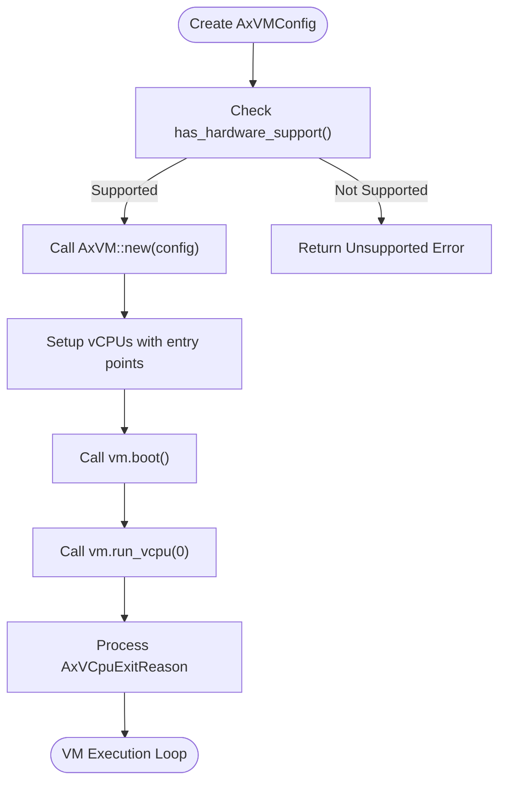
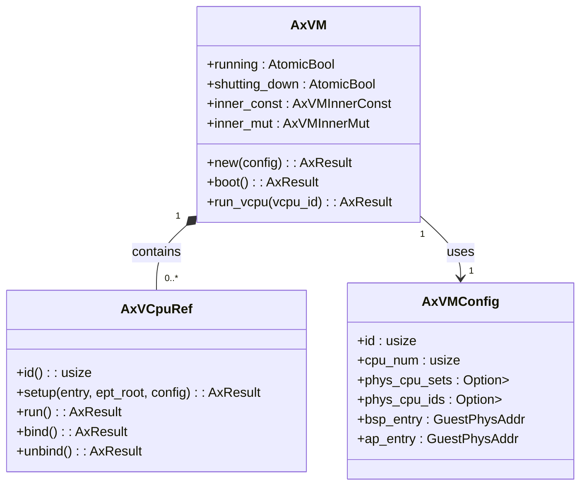
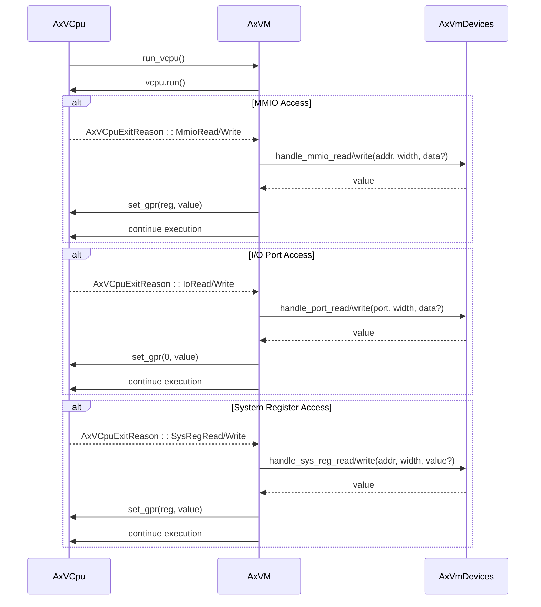

# Examples and Use Cases

<cite>
**Referenced Files in This Document**
- [lib.rs](file://src/lib.rs)
- [vm.rs](file://src/vm.rs)
- [config.rs](file://src/config.rs)
- [vcpu.rs](file://src/vcpu.rs)
- [hal.rs](file://src/hal.rs)
- [Cargo.toml](file://Cargo.toml)
</cite>

## Table of Contents
1. [Introduction](#introduction)
2. [Minimal VM Setup Example](#minimal-vm-setup-example)
3. [Multi-vCPU Configuration](#multi-vcpu-configuration)
4. [Custom Device Emulation](#custom-device-emulation)
5. [IVC-Based Communication Between VMs](#ivc-based-communication-between-vms)
6. [Advanced Usage Patterns](#advanced-usage-patterns)
7. [Build Instructions and Expected Outputs](#build-instructions-and-expected-outputs)
8. [Adaptation Guidance for Different Architectures](#adaptation-guidance-for-different-architectures)

## Introduction
The axvm library provides a minimal virtual machine monitor (VMM) crate designed for the ArceOS hypervisor variant, enabling resource management for guest VMs across vCPUs, memory, and devices. This document presents practical applications through complete, runnable examples that demonstrate core functionalities such as VM configuration, booting, vCPU execution, custom device emulation, multi-vCPU setups, and inter-VM communication via IVC channels. The examples reflect current API usage from `lib.rs` and `vm.rs`, with emphasis on real-world integration points and design decisions.

**Section sources**
- [lib.rs](file://src/lib.rs#L1-L34)
- [README.md](file://README.md#L0-L7)

## Minimal VM Setup Example
This example demonstrates creating a basic VM instance using `AxVM::new()` with minimal configuration. It includes setting up memory regions, initializing a single vCPU, configuring entry points, and launching the VM using `boot()` and `run_vcpu()` methods. The configuration is derived from `AxVMConfig`, which encapsulates essential parameters like CPU count, memory layout, and image load addresses.

Key steps include:
- Creating an `AxVMConfig` instance with BSP/AP entry points
- Allocating guest physical memory using `MapAlloc` or `MapIdentical` mapping types
- Instantiating the VM via `AxVM::new(config)`
- Booting the VM with `vm.boot()`
- Executing the primary vCPU using `vm.run_vcpu(0)`

Error handling ensures hardware virtualization support is available before initialization.

**Diagram sources**
- [vm.rs](file://src/vm.rs#L75-L627)
- [config.rs](file://src/config.rs#L66-L195)

**Section sources**
- [vm.rs](file://src/vm.rs#L75-L627)
- [config.rs](file://src/config.rs#L66-L195)

## Multi-vCPU Configuration
To configure multiple vCPUs, the `AxVMConfig` must specify `cpu_num > 1`. Each vCPU can be assigned specific physical CPU affinities using `phys_cpu_sets` and `phys_cpu_ids`. During VM creation, `AxVM::new()` iterates over these configurations to instantiate corresponding `AxVCpuRef` instances.

Architecture-specific setup applies:
- On **aarch64**, MPIDR_EL1 values are set per vCPU
- On **riscv64**, hart IDs are used for identification
- On **x86_64**, default configurations apply

All non-bootstrap processors (APs) use the AP entry point defined in `AxVCpuConfig`. Synchronization between vCPUs relies on external mechanisms, as no built-in coordination exists within the axvm crate.

**Diagram sources**
- [vm.rs](file://src/vm.rs#L75-L627)
- [vcpu.rs](file://src/vcpu.rs#L0-L31)
- [config.rs](file://src/config.rs#L66-L195)

**Section sources**
- [vm.rs](file://src/vm.rs#L75-L627)
- [vcpu.rs](file://src/vcpu.rs#L0-L31)
- [config.rs](file://src/config.rs#L66-L195)

## Custom Device Emulation
Device management in axvm is handled through the `axdevice` crate. Emulated devices are configured via `EmulatedDeviceConfig` in `AxVMConfig`. These devices are registered during VM creation and exposed through `AxVmDevices`.

The VM handles MMIO, I/O port, and system register accesses by trapping them in `AxVCpuExitReason` variants:
- `MmioRead` / `MmioWrite`: Handled via `handle_mmio_read/write`
- `IoRead` / `IoWrite`: Processed with `handle_port_read/write`
- `SysRegRead` / `SysRegWrite`: Managed by `handle_sys_reg_read/write`

For passthrough devices, `PassThroughDeviceConfig` maps host physical address ranges into guest physical space using `MappingFlags::DEVICE`. This enables direct access to hardware resources while maintaining isolation.

**Diagram sources**
- [vm.rs](file://src/vm.rs#L425-L488)
- [config.rs](file://src/config.rs#L66-L195)
- [hal.rs](file://src/hal.rs#L0-L43)

**Section sources**
- [vm.rs](file://src/vm.rs#L425-L488)
- [config.rs](file://src/config.rs#L66-L195)
- [hal.rs](file://src/hal.rs#L0-L43)

## IVC-Based Communication Between VMs
Inter-VM Communication (IVC) channels are managed through `AxVmDevices::alloc_ivc_channel()` and `release_ivc_channel()`. The `AxVM::alloc_ivc_channel()` method allocates a shared memory region at a guest-physical address (GPA), aligned to 4KB boundaries.

Steps:
1. Call `vm.alloc_ivc_channel(size)` → returns `(gpa, actual_size)`
2. Map this GPA in both communicating VMs
3. Use shared memory for message passing or synchronization
4