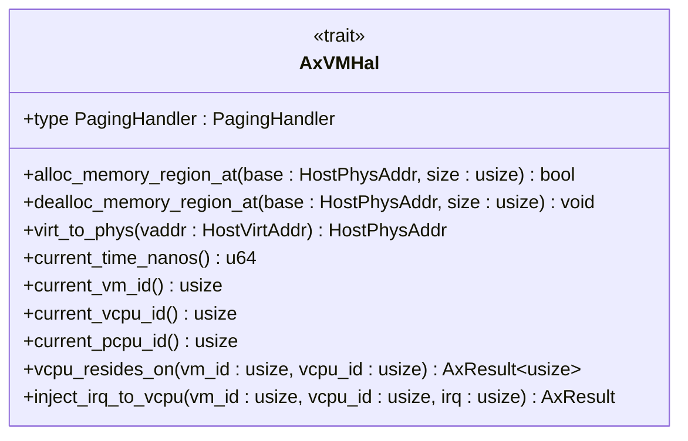
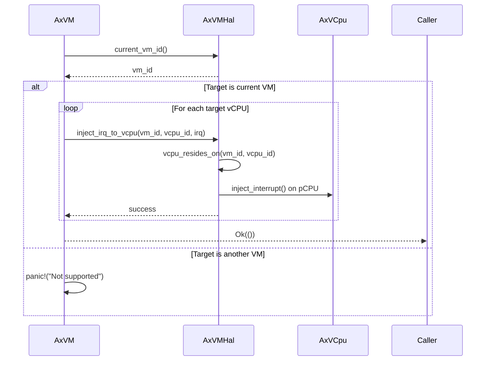

# Hardware Abstraction Layer

<cite>
**Referenced Files in This Document**   
- [hal.rs](file://src/hal.rs)
- [vm.rs](file://src/vm.rs)
</cite>

## Table of Contents
1. [Introduction](#introduction)
2. [AxVMHal Trait Overview](#axvmhal-trait-overview)
3. [Memory Management Methods](#memory-management-methods)
4. [Interrupt Injection Method](#interrupt-injection-method)
5. [Time Services Method](#time-services-method)
6. [CPU Identification Methods](#cpu-identification-methods)
7. [Implementation Semantics and Usage Patterns](#implementation-semantics-and-usage-patterns)
8. [Error Handling and Thread Safety](#error-handling-and-thread-safety)
9. [Integration Guidance for Kernel Environments](#integration-guidance-for-kernel-environments)

## Introduction

The AxVMHal trait defines the hardware abstraction layer interface between the virtual machine monitor (VMM) and the underlying kernel or hypervisor environment. This contract enables the VMM to operate independently of specific hardware platforms by delegating low-level operations to the implementing system. The trait provides essential services for memory management, interrupt handling, timekeeping, and CPU identification that are critical for VM operation. Implementations of this trait must provide reliable and efficient access to physical resources while maintaining isolation between virtual machines.

## AxVMHal Trait Overview

The AxVMHal trait establishes a comprehensive interface for hypervisor/kernel interaction, defining methods that cover the fundamental operations required for virtual machine management. These methods enable the VMM to allocate and manage physical memory, handle interrupts, access timing information, and identify CPU topology. The trait is designed to be implemented by the underlying operating system or hypervisor, allowing the VMM to remain platform-agnostic while still accessing necessary hardware resources through well-defined contracts.

**Diagram sources**
- [hal.rs](file://src/hal.rs#L0-L44)

**Section sources**
- [hal.rs](file://src/hal.rs#L0-L44)

## Memory Management Methods

### alloc_memory_region_at

This method allocates a contiguous region of physical memory at a specified base address with the given size. It returns `true` if the allocation is successful, indicating that the requested memory region has been reserved for the VM's use. This function is critical during VM initialization when setting up memory mappings for guest physical address spaces. The implementation must ensure that the requested physical address range is available and not already allocated to other system components.

[SPEC SYMBOL](file://src/hal.rs#L11-L13)

### dealloc_memory_region_at

Responsible for releasing a previously allocated memory region, this method frees the physical memory at the specified base address and size. Proper implementation ensures that memory resources are reclaimed when VMs are destroyed or resized, preventing memory leaks in the host system. The deallocation should be atomic and thread-safe, as multiple VM operations might occur concurrently.

[SPEC SYMBOL](file://src/hal.rs#L14-L16)

### virt_to_phys

Converts a host virtual address to its corresponding physical address. This translation is essential for establishing direct memory mappings between host and guest physical addresses, particularly when implementing pass-through devices or shared memory regions. The implementation typically leverages the host's page table structures to perform the address translation efficiently.

[SPEC SYMBOL](file://src/hal.rs#L17-L19)

**Section sources**
- [hal.rs](file://src/hal.rs#L11-L19)

## Interrupt Injection Method

### inject_irq_to_vcpu

This method injects an interrupt request (IRQ) to a specified virtual CPU within a VM. The implementation must locate the physical CPU where the target vCPU is currently executing and deliver the interrupt on that physical processor using the appropriate architecture-specific mechanism (`axvcpu::AxVCpu::inject_interrupt`). The method returns an error if the target vCPU cannot be found, ensuring proper error propagation for failed interrupt deliveries.

[SPEC SYMBOL](file://src/hal.rs#L40-L44)

**Section sources**
- [hal.rs](file://src/hal.rs#L40-L44)

## Time Services Method

### current_time_nanos

Provides the current system time in nanoseconds, serving as the primary timing source for VM operations. This high-resolution timestamp is used for various purposes including scheduling decisions, timeout calculations, and providing time information to guest operating systems. Implementations should ensure monotonicity and minimal jitter to maintain accurate timekeeping within virtualized environments.

[SPEC SYMBOL](file://src/hal.rs#L20-L22)

**Section sources**
- [hal.rs](file://src/hal.rs#L20-L22)

## CPU Identification Methods

### current_vm_id

Returns the identifier of the currently active virtual machine. This method enables context-aware operations within the VMM, allowing components to determine which VM they are servicing. The VM ID is crucial for routing interrupts, managing resources, and maintaining isolation between multiple concurrent virtual machines.

[SPEC SYMBOL](file://src/hal.rs#L23-L25)

### current_vcpu_id

Provides the identifier of the currently executing virtual CPU. This information is essential for maintaining per-vCPU state and ensuring that operations are applied to the correct virtual processor instance. The vCPU ID helps coordinate activities across multiple virtual processors within a single VM.

[SPEC SYMBOL](file://src/hal.rs#L26-L28)

### current_pcpu_id

Returns the identifier of the current physical CPU core. This method supports NUMA-aware scheduling and resource allocation by exposing the underlying physical topology to the VMM. Knowledge of the physical CPU ID enables optimized placement of VM components and efficient inter-processor communication.

[SPEC SYMBOL](file://src/hal.rs#L29-L31)

### vcpu_resides_on

Determines which physical CPU hosts a specific vCPU of a given VM. This method returns an error if the specified vCPU cannot be located, ensuring robust error handling for migration scenarios or when vCPUs are temporarily offline. The information provided by this method is critical for delivering interrupts to the correct physical processor where the target vCPU is actively running.

[SPEC SYMBOL](file://src/hal.rs#L32-L36)

**Section sources**
- [hal.rs](file://src/hal.rs#L23-L36)

## Implementation Semantics and Usage Patterns

The AxVMHal methods are invoked throughout the VM lifecycle to support various operations. During VM creation in the `AxVM::new` method, `alloc_memory_region_at` is called to reserve physical memory for guest RAM regions before establishing page table mappings. When a page fault occurs in nested virtualization scenarios, the VMM may need to allocate additional physical pages to satisfy guest memory demands.

Interrupt injection through `inject_irq_to_vcpu` is utilized in the `AxVM::inject_interrupt_to_vcpu` method when delivering external interrupts to virtual CPUs. The implementation first verifies that the operation targets the current VM using `current_vm_id`, then iterates through the target vCPU set, invoking `inject_irq_to_vcpu` for each destination.

**Diagram sources**
- [vm.rs](file://src/vm.rs#L489-L515)
- [hal.rs](file://src/hal.rs#L40-L44)

**Section sources**
- [vm.rs](file://src/vm.rs#L489-L515)
- [hal.rs](file://src/hal.rs#L40-L44)

## Error Handling and Thread Safety

Implementations of AxVMHal methods must adhere to strict error handling and concurrency requirements. Methods returning `AxResult` should propagate errors appropriately, particularly `vcpu_resides_on` and `inject_irq_to_vcpu` which may fail when targeting non-existent or migrated vCPUs. The `alloc_memory_region_at` method uses a boolean return to indicate success or failure, requiring careful checking by callers.

All methods must be thread-safe as they may be invoked concurrently from different physical CPUs or VM contexts. Atomic operations and appropriate locking mechanisms should be employed where necessary to prevent race conditions, especially for memory allocation/deallocation operations that modify global resource tables