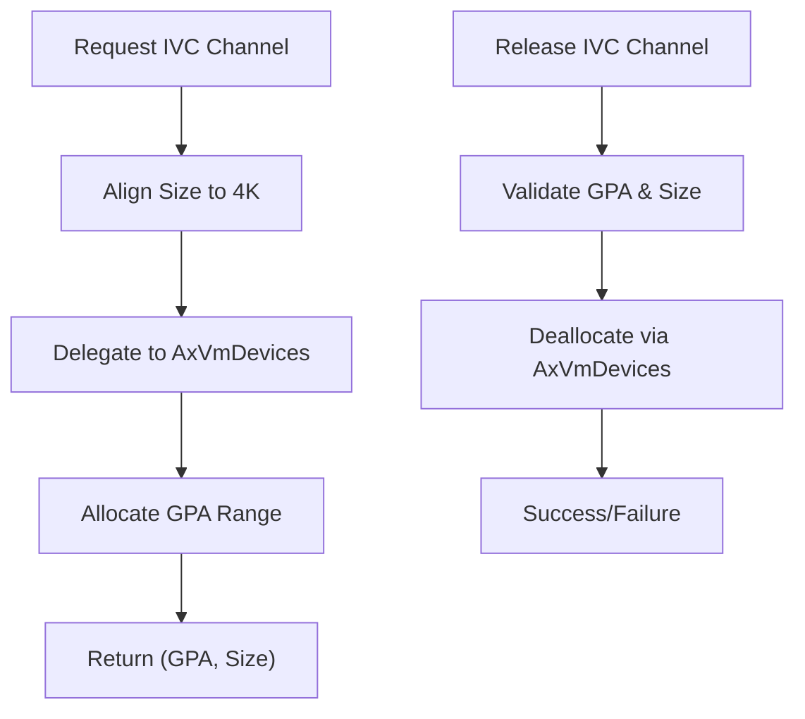

# Inter-VM Communication

<cite>
**Referenced Files in This Document **   
- [vm.rs](file://src/vm.rs)
- [config.rs](file://src/config.rs)
- [hal.rs](file://src/hal.rs)
</cite>

## Table of Contents
1. [Introduction](#introduction)
2. [IVC Channel Allocation Mechanism](#ivc-channel-allocation-mechanism)
3. [Message Framing and Data Transfer](#message-framing-and-data-transfer)
4. [Synchronization and Cross-VM Coordination](#synchronization-and-cross-vm-coordination)
5. [Integration with VM Execution Model](#integration-with-vm-execution-model)
6. [Security Considerations](#security-considerations)
7. [Performance Characteristics](#performance-characteristics)
8. [Usage Examples from vm.rs](#usage-examples-from-vmrs)
9. [Limitations and Constraints](#limitations-and-constraints)

## Introduction
Inter-VM Communication (IVC) in the ArceOS environment enables secure and efficient data exchange between isolated virtual machines (VMs). The IVC mechanism is designed to facilitate controlled communication while preserving strong isolation boundaries. It operates through dedicated memory regions allocated specifically for inter-VM data transfer, managed by the hypervisor-level VMM (Virtual Machine Monitor) implemented in the `axvm` crate.

The implementation leverages guest physical address (GPA) mapping and device abstraction layers to provide a reliable channel interface. While direct cross-VM interrupt injection is currently restricted, future enhancements may enable such capabilities for tighter coordination.

**Section sources**
- [vm.rs](file://src/vm.rs#L584-L626)
- [config.rs](file://src/config.rs#L1-L195)

## IVC Channel Allocation Mechanism
IVC channels are allocated via dedicated methods on the `AxVM` structure that manage guest-accessible memory regions reserved for communication purposes. The allocation process ensures proper alignment and uses the VM's device management subsystem to reserve GPA ranges.

When an IVC channel is requested using `alloc_ivc_channel`, the system aligns the expected size to 4KB boundaries and delegates the actual GPA assignment to the `AxVmDevices` component. This abstraction allows flexible backend implementations while maintaining consistent semantics across architectures.

Channels are released explicitly using `release_ivc_channel`, which deallocates the associated GPA range and removes it from the active device map. This explicit lifecycle management prevents resource leaks and supports dynamic reconfiguration of communication topologies.



**Diagram sources **
- [vm.rs](file://src/vm.rs#L604-L615)

**Section sources**
- [vm.rs](file://src/vm.rs#L604-L615)

## Message Framing and Data Transfer
Data transfer over IVC channels occurs through shared memory regions mapped into the guest physical address space. Once a channel is allocated, both communicating VMs can access the same underlying host memory via their respective GPAs, enabling zero-copy or low-overhead data sharing depending on the backend implementation.

Messages must be framed externally by higher-layer protocols since the IVC layer itself does not impose any specific message format. Producers write structured data directly into the shared buffer using standard memory operations, while consumers read from the same region after synchronization signals indicate availability.

The `read_from_guest_of` and `write_to_guest_of` methods in `AxVM` support type-safe access to guest memory, ensuring proper alignment and bounds checking when transferring typed objects across the boundary.

**Section sources**
- [vm.rs](file://src/vm.rs#L545-L583)

## Synchronization and Cross-VM Coordination
Currently, the IVC implementation does not include built-in synchronization primitives beyond basic memory access. Coordination between VMs must be achieved through external mechanisms such as polling, doorbell registers emulated via MMIO, or future interrupt-based signaling.

Although `inject_interrupt_to_vcpu` exists for intra-VM use, injecting interrupts into vCPUs of other VMs is explicitly unsupported at this time. This limitation restricts true asynchronous notification patterns but enhances security by preventing unintended side-channel signaling.

Future extensions could introduce controlled cross-VM interrupt delivery as a feature to improve latency-sensitive communication scenarios.

**Section sources**
- [vm.rs](file://src/vm.rs#L515-L543)
- [hal.rs](file://src/hal.rs#L38-L43)

## Integration with VM Execution Model
IVC operates within the normal execution flow of the VM without requiring special vCPU exits for data transfer operations. Memory accesses to IVC regions are handled transparently through the two-stage address translation (EPT/Stage-2 page tables), just like any other guest memory access.

However, if the IVC region overlaps with emulated device MMIO ranges, corresponding MMIO exits will occur and be trapped by the VMM. These exits are then dispatched to the `AxVmDevices` handler infrastructure, allowing interception and processing of control-plane operations related to the channel.

No out-of-band communication path exists; all data flows through the established GPA mappings under full hypervisor supervision.

**Section sources**
- [vm.rs](file://src/vm.rs#L465-L513)

## Security Considerations
Security in IVC centers around strict isolation enforcement and controlled resource sharing:

- **Isolation Boundaries**: Each IVC channel is explicitly allocated and visible only to VMs granted access. The hypervisor enforces access control via GPA mapping policies.
- **Data Integrity**: Shared buffers rely on correct usage by guest software. No cryptographic integrity protection is provided at the IVC layer.
- **Access Control**: Only the VM that allocates a channel can release it, preventing unauthorized deallocation.
- **Memory Safety**: All accesses go through translated byte buffers with validation, reducing risks of out-of-bounds access.

The design assumes trust between participating VMs, making it suitable for tightly coupled trusted components rather than untrusted third parties.

**Section sources**
- [vm.rs](file://src/vm.rs#L545-L583)
- [vm.rs](file://src/vm.rs#L604-L626)

## Performance Characteristics
IVC performance is primarily determined by memory access patterns and backend implementation:

- **Latency**: Minimal for data transfer, limited mainly by cache coherence and memory bandwidth. No syscall or trap overhead for payload reads/writes.
- **Throughput**: High, approaching native memory bandwidth when large contiguous transfers are used.
- **Scalability**: Limited by number of available GPA ranges and underlying allocator efficiency.

Since no serialization or copying occurs within the VMM for pure memory-backed channels, performance closely matches direct memory access speeds once setup is complete.

**Section sources**
- [vm.rs](file://src/vm.rs#L545-L583)

## Usage Examples from vm.rs
The primary usage pattern involves allocating an IVC channel during VM initialization and using standard memory operations for communication:

```rust
let (gpa, size) = vm.alloc_ivc_channel(8192)?;
// Share gpa with peer VM via out-of-band mechanism
// Use read_from_guest_of/write_to_guest_of for structured access
vm.write_to_guest_of(gpa, &my_message)?;
// Signal peer via separate mechanism (e.g., doorbell MMIO)
```

To release the channel:
```rust
vm.release_ivc_channel(gpa, size)?;
```

These operations integrate seamlessly with the existing VM lifecycle and device model.

**Section sources**
- [vm.rs](file://src/vm.rs#L604-L626)

## Limitations and Constraints
Several limitations affect current IVC usability:

- **Channel数量**: Limited by the addressing capability of `AxVmDevices` and available GPA space. Exact limits depend on platform configuration.
- **Message Size**: Minimum allocation unit is 4KB due to page alignment requirements. Smaller logical messages must be packed manually.
- **Cross-VM Interrupts**: Not supported; coordination requires polling or external signaling.
- **Automatic Discovery**: No mechanism for VMs to discover each other’s IVC endpoints; requires static configuration or external orchestration.
- **Lifetime Management**: Channels persist until explicitly released; no automatic cleanup on VM shutdown.

These constraints reflect a minimal viable implementation focused on safety and simplicity, with room for enhancement based on use case demands.

**Section sources**
- [vm.rs](file://src/vm.rs#L604-L626)
- [config.rs](file://src/config.rs#L1-L195)