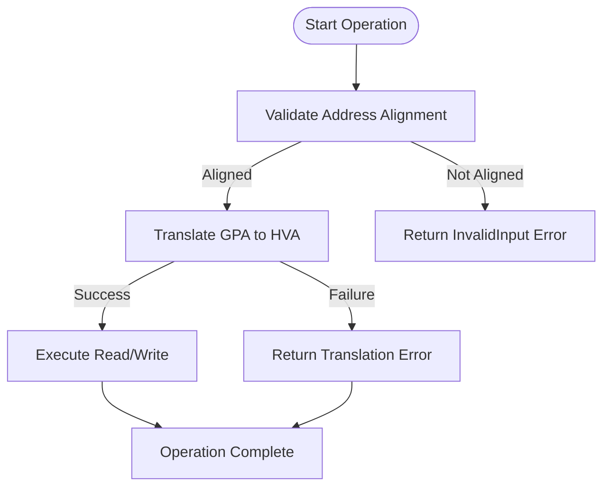
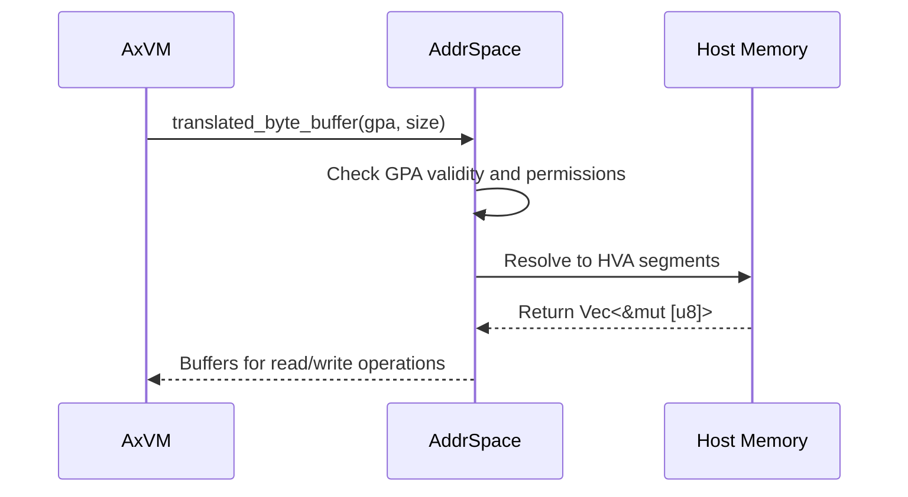
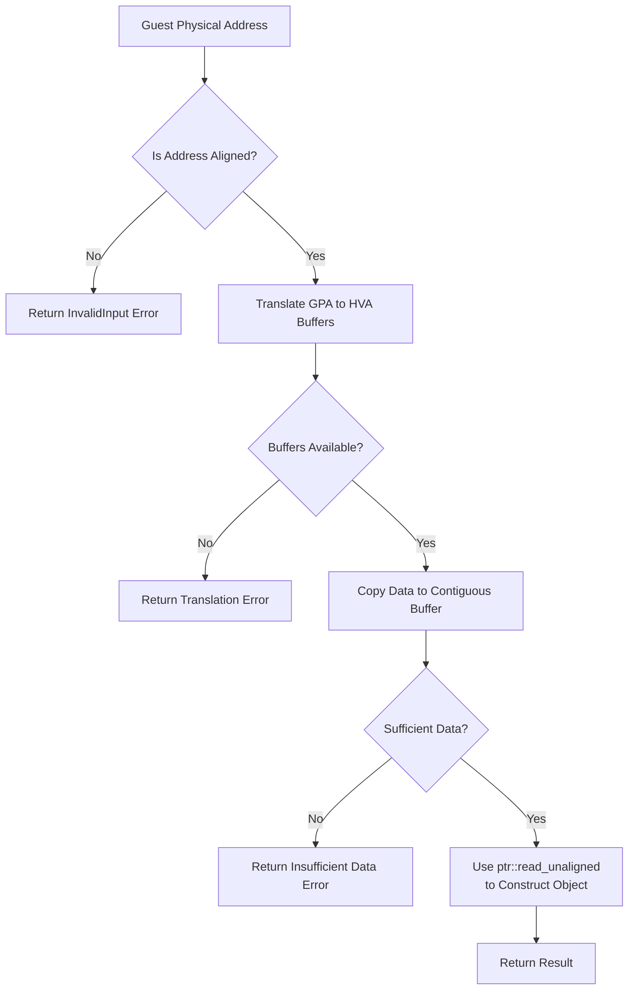
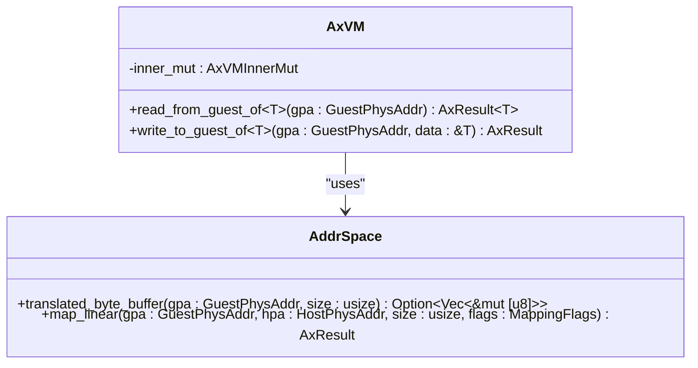

# Guest Memory Access Control

<cite>
**Referenced Files in This Document**   
- [vm.rs](file://src/vm.rs)
- [hal.rs](file://src/hal.rs)
- [config.rs](file://src/config.rs)
</cite>

## Table of Contents
1. [Introduction](#introduction)
2. [Core Memory Access Methods](#core-memory-access-methods)
3. [Address Translation and Buffer Management](#address-translation-and-buffer-management)
4. [Safety and Security Mechanisms](#safety-and-security-mechanisms)
5. [Fragmented Memory Handling](#fragmented-memory-handling)
6. [Usage Examples and Internal Applications](#usage-examples-and-internal-applications)
7. [Security Risks and Mitigations](#security-risks-and-mitigations)
8. [Best Practices for Guest Memory Operations](#best-practices-for-guest-memory-operations)

## Introduction
The axvm hypervisor provides secure mechanisms for accessing guest virtual machine memory through type-safe interfaces. These operations are critical for VM initialization, inter-VM communication, and device emulation. The system ensures memory safety through alignment checks, bounds validation, and proper use of Rust's ownership model to prevent common vulnerabilities such as buffer overflows or information leakage.

**Section sources**
- [vm.rs](file://src/vm.rs#L540-L615)

## Core Memory Access Methods
The `read_from_guest_of<T>()` and `write_to_guest_of<T>()` methods provide generic, type-safe access to guest physical memory. These functions operate on a specified `GuestPhysAddr` and ensure that data transfers maintain the integrity of the underlying type `T`.

The read operation validates address alignment before proceeding with translation, while the write operation performs similar validation through the same translation pathway. Both methods return `AxResult` types to handle potential failures in address translation or memory access permissions.

**Diagram sources**
- [vm.rs](file://src/vm.rs#L540-L547)
- [vm.rs](file://src/vm.rs#L581-L584)

**Section sources**
- [vm.rs](file://src/vm.rs#L540-L615)

## Address Translation and Buffer Management
Memory access relies on the `translated_byte_buffer()` method from the `AddrSpace` module, which translates guest physical addresses (GPA) into host virtual addresses (HVA). This translation accounts for potentially non-contiguous physical memory mappings by returning a vector of byte slices.

The translation process respects the VM's configured memory regions and mapping flags, ensuring that only properly mapped areas can be accessed. Each buffer segment corresponds to a contiguous region of host memory that backs the requested guest memory range.

**Diagram sources**
- [vm.rs](file://src/vm.rs#L332-L366)
- [vm.rs](file://src/vm.rs#L549-L582)

**Section sources**
- [vm.rs](file://src/vm.rs#L332-L366)
- [vm.rs](file://src/vm.rs#L549-L582)

## Safety and Security Mechanisms
Several layers of protection ensure safe guest memory access:

1. **Alignment Checking**: Before any access, the system verifies that the guest physical address is properly aligned for the target type using `core::mem::align_of::<T>()`.
2. **Bounds Validation**: The translation layer confirms that the full requested size is available across the returned buffer segments.
3. **Unaligned Access Protection**: When constructing the final object from raw bytes, `ptr::read_unaligned` is used to safely handle cases where compiler assumptions about alignment might not hold after reconstruction.
4. **Translation Validation**: A `None` result from `translated_byte_buffer()` indicates either invalid GPA or insufficient permissions, both of which abort the operation.

These checks prevent undefined behavior that could lead to crashes or security vulnerabilities during cross-address-space data transfer.

**Diagram sources**
- [vm.rs](file://src/vm.rs#L540-L547)
- [vm.rs](file://src/vm.rs#L549-L582)

**Section sources**
- [vm.rs](file://src/vm.rs#L540-L582)

## Fragmented Memory Handling
Due to the possibility of non-contiguous physical memory allocation, guest memory regions may map to multiple disjoint host memory segments. The `Vec<&'static mut [u8]>` return type from `translated_byte_buffer()` explicitly accommodates this fragmentation.

During read operations, data is incrementally collected from each buffer chunk until the full object size is satisfied. Write operations similarly distribute the source data across available chunks. This approach allows correct handling of objects that span page boundaries or reside in fragmented memory regions without requiring contiguous backing memory.

The system maintains correctness by tracking copied byte counts and ensuring complete data transfer before finalizing operations.

**Section sources**
- [vm.rs](file://src/vm.rs#L549-L582)

## Usage Examples and Internal Applications
Internally, these memory access primitives support various critical operations:

- Loading kernel images via `get_image_load_region()`, which uses `translated_byte_buffer()` directly to obtain mutable references to image load regions.
- Initializing VM state by reading configuration structures from guest memory.
- Implementing inter-VM communication channels (IVC) where shared memory buffers must be safely accessed.
- Device emulation requiring access to guest memory-mapped I/O regions.

External components can leverage these same mechanisms for secure introspection or debugging, provided they operate within the constraints of the VM's memory mapping configuration.

**Diagram sources**
- [vm.rs](file://src/vm.rs#L540-L615)
- [vm.rs](file://src/vm.rs#L108-L150)

**Section sources**
- [vm.rs](file://src/vm.rs#L332-L366)
- [vm.rs](file://src/vm.rs#L540-L615)

## Security Risks and Mitigations
Failure in access control mechanisms could lead to severe security consequences:

- **Information Leakage**: Improper reads could expose host memory contents to guest-controlled code.
- **Memory Corruption**: Unchecked writes might corrupt host kernel data structures.
- **Privilege Escalation**: Exploitation of memory access flaws could allow guest-to-host escapes.

Mitigations include:
- Strict validation of all guest-provided addresses
- Use of capability-based access patterns
- Runtime enforcement of memory mapping policies
- Leveraging Rust's ownership and borrowing rules to prevent dangling pointers and use-after-free conditions

The hypervisor also isolates VM address spaces through two-stage page tables (EPT/NPT), adding hardware-enforced isolation beyond software checks.

**Section sources**
- [vm.rs](file://src/vm.rs#L540-L615)
- [hal.rs](file://src/hal.rs#L0-L43)

## Best Practices for Guest Memory Operations
To ensure secure and reliable guest memory access:

1. Always validate that guest addresses fall within declared memory regions using configuration metadata.
2. Prefer using typed access (`read_from_guest_of<T>()`) over raw byte manipulation when possible.
3. Ensure proper synchronization when accessing shared memory regions between vCPUs.
4. Validate translation results before assuming buffer availability.
5. Use `align_up_4k()` and `align_down_4k()` utilities when working with page-aligned operations.
6. Minimize exposure of direct memory access APIs to untrusted components.
7. Log suspicious access patterns for monitoring and intrusion detection.

By following these practices and leveraging the built-in safety features of the axvm framework, developers can implement robust and secure virtualization solutions.

**Section sources**
- [vm.rs](file://src/vm.rs#L540-L615)
- [config.rs](file://src/config.rs#L131-L168)