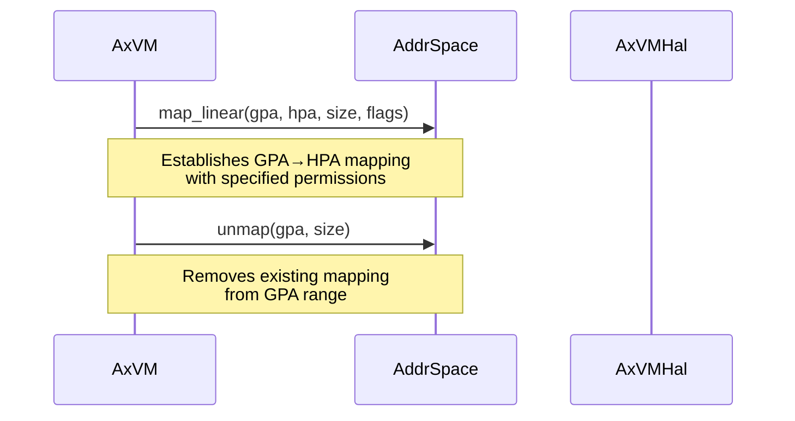
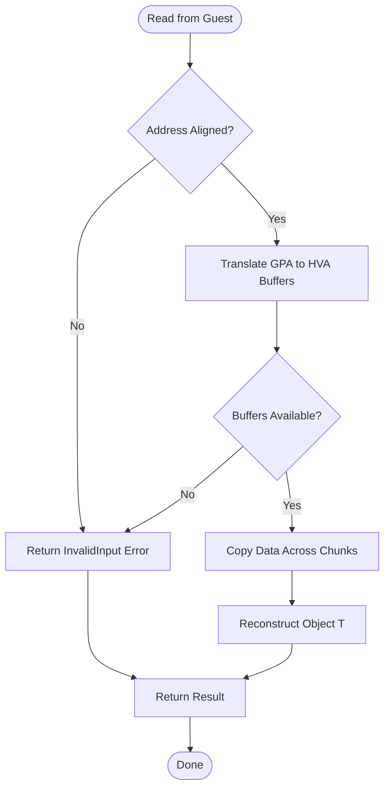

# Memory Management

<cite>
**Referenced Files in This Document**
- [vm.rs](file://src/vm.rs)
- [hal.rs](file://src/hal.rs)
- [config.rs](file://src/config.rs)
</cite>

## Table of Contents
1. [Introduction](#introduction)
2. [Two-Stage Address Translation Process](#two-stage-address-translation-process)
3. [Memory Region Mapping and Unmapping](#memory-region-mapping-and-unmapping)
4. [Page Fault Handling](#page-fault-handling)
5. [Guest Memory Access Operations](#guest-memory-access-operations)
6. [Safety and Security Mechanisms](#safety-and-security-mechanisms)
7. [HAL Integration for Physical Memory Services](#hal-integration-for-physical-memory-services)
8. [Performance Implications](#performance-implications)
9. [Example: VM Memory Setup Sequence](#example-vm-memory-setup-sequence)

## Introduction
This document provides a comprehensive analysis of memory virtualization and guest memory access within the `axvm` hypervisor framework. It details the two-stage address translation process, memory region management via mapping and unmapping operations, page fault handling, secure guest memory access, integration with the Hardware Abstraction Layer (HAL), and performance considerations. The implementation leverages nested page tables to enable efficient and secure virtual machine execution.

**Section sources**
- [vm.rs](file://src/vm.rs#L0-L627)
- [hal.rs](file://src/hal.rs#L0-L44)
- [config.rs](file://src/config.rs#L0-L195)

## Two-Stage Address Translation Process
The system implements a two-stage address translation mechanism using nested page tables to translate guest virtual addresses (GVA) into host physical addresses (HPA). The process involves:

1. **Guest Virtual → Guest Physical**: The guest operating system performs first-level address translation using its own page tables.
2. **Guest Physical → Host Physical**: The hypervisor uses nested page tables managed by the `AddrSpace` component to map guest physical addresses (GPA) to host physical addresses (HPA).

This approach isolates guest memory views from the underlying host while enabling direct hardware-assisted translation through virtualization extensions such as Intel EPT or AMD NPT.

The root of the nested page table structure is accessible via the `ept_root()` method, which returns the host physical address of the top-level page table used for GPA-to-HPA translation.

```mermaid
flowchart TD
GVA["Guest Virtual Address"] --> |Guest Page Tables| GPA["Guest Physical Address"]
GPA --> |Nested Page Tables<br/>(EPT/NPT)| HPA["Host Physical Address"]
subgraph "VM Execution Context"
GVA
GPA
end
subgraph "Host System"
HPA
end
style GVA fill:#f9f,stroke:#333
style GPA fill:#bbf,stroke:#333
style HPA fill:#f96,stroke:#333
```

**Diagram sources**
- [vm.rs](file://src/vm.rs#L332-L336)

## Memory Region Mapping and Unmapping
Memory regions are configured during VM creation based on the `AxVMConfig` and can be dynamically modified post-initialization using `map_region()` and `unmap_region()`.

### Memory Mapping Types
During initialization, memory regions are set up according to their `VmMemMappingType`:
- **MapIdentical**: Maps guest physical addresses directly to identical host physical addresses if allocation succeeds via `H::alloc_memory_region_at()`. Falls back to linear mapping otherwise.
- **MapAlloc**: Allocates physical memory frames (non-contiguously) and maps them into guest physical space using `map_alloc()`.

Pass-through device memory regions are automatically aligned to 4KB boundaries and merged if overlapping before being mapped with `DEVICE`, `READ`, `WRITE`, and `USER` flags.

### Dynamic Mapping Interface
The following methods allow runtime modification of memory mappings:

#### `map_region()`
Maps a range of host physical memory to guest physical memory with specified permissions.

```rust
pub fn map_region(
    &self,
    gpa: GuestPhysAddr,
    hpa: HostPhysAddr,
    size: usize,
    flags: MappingFlags,
) -> AxResult<()>
```

#### `unmap_region()`
Removes a previously established memory mapping for a given guest physical address range.

```rust
pub fn unmap_region(&self, gpa: GuestPhysAddr, size: usize) -> AxResult<()>
```

Both functions operate under a mutex lock on the `AddrSpace`, ensuring thread-safe updates to the nested page table structure.



**Diagram sources**
- [vm.rs](file://src/vm.rs#L522-L538)

**Section sources**
- [vm.rs](file://src/vm.rs#L108-L211)
- [vm.rs](file://src/vm.rs#L522-L538)

## Page Fault Handling
Page faults occurring in the VM context are trapped and handled by the hypervisor using the `NestedPageFault` exit reason. When a guest accesses an unmapped or protected memory region, the CPU generates a VM exit that is processed in the `run_vcpu()` loop.

The fault handler delegates to the `AddrSpace` instance to resolve the fault:
```rust
AxVCpuExitReason::NestedPageFault { addr, access_flags } => 
    self.inner_mut.address_space.lock().handle_page_fault(*addr, *access_flags),
```

If the page fault cannot be resolved (e.g., invalid access, missing mapping), it results in a failure returned to the caller. Valid faults (such as demand paging or lazy allocation) may trigger memory allocation via the HAL interface.

This mechanism enables features like lazy memory allocation, copy-on-write, and secure memory isolation between VMs.

**Section sources**
- [vm.rs](file://src/vm.rs#L477-L479)

## Guest Memory Access Operations
The system provides safe interfaces for reading from and writing to guest physical memory from the hypervisor context.

### `read_from_guest_of<T>()`
Safely reads a value of type `T` from a guest physical address:
- Validates alignment requirements for type `T`.
- Uses `translated_byte_buffer()` to obtain host virtual access to the underlying memory.
- Copies data across potentially discontiguous physical pages.
- Employs `ptr::read_unaligned()` for safety when reconstructing the object.

Returns appropriate errors for misaligned addresses or insufficient buffer space.

### `write_to_guest_of<T>()`
Writes a value of type `T` to a guest physical address:
- Translates the GPA to one or more host virtual buffers.
- Splits the write operation across buffer chunks if necessary.
- Ensures all bytes are copied correctly even across page boundaries.

These operations abstract away the complexity of non-contiguous physical backing storage while maintaining type safety and memory protection.



**Diagram sources**
- [vm.rs](file://src/vm.rs#L540-L582)

**Section sources**
- [vm.rs](file://src/vm.rs#L540-L582)
- [vm.rs](file://src/vm.rs#L584-L615)

## Safety and Security Mechanisms
Several mechanisms prevent unauthorized access and ensure memory safety:

- **Permission