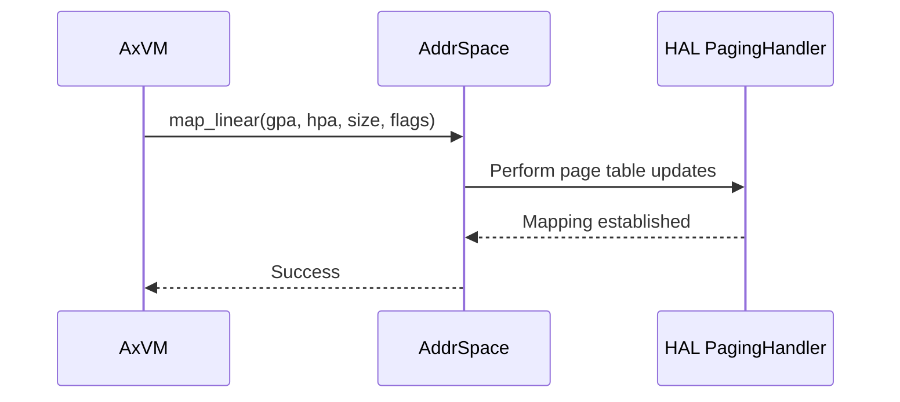
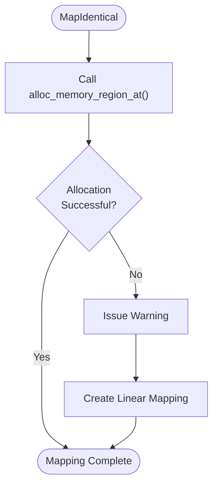
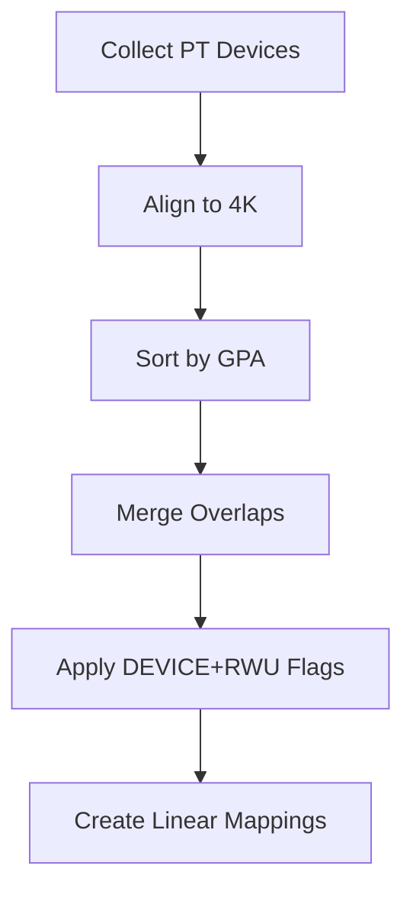

# Memory Mapping

<cite>
**Referenced Files in This Document**
- [vm.rs](file://src/vm.rs)
- [hal.rs](file://src/hal.rs)
- [config.rs](file://src/config.rs)
</cite>

## Table of Contents
1. [Introduction](#introduction)
2. [Memory Region Mapping APIs](#memory-region-mapping-apis)
3. [Mapping Flags and Permissions](#mapping-flags-and-permissions)
4. [Memory Mapping Strategies: MapIdentical vs MapAlloc](#memory-mapping-strategies-mapidentical-vs-mapalloc)
5. [Pass-Through Device Memory Setup](#pass-through-device-memory-setup)
6. [Alignment Requirements and Utilities](#alignment-requirements-and-utilities)
7. [Error Handling and Validation](#error-handling-and-validation)
8. [Safe Usage Patterns and Debugging](#safe-usage-patterns-and-debugging)

## Introduction
The axvm hypervisor provides a robust memory management system for virtual machines, enabling precise control over guest physical to host physical address mappings. This document details the core mechanisms for establishing and managing linear memory mappings through the `map_region()` and `unmap_region()` APIs. It covers configuration-driven setup during VM initialization, supported memory flags, alignment requirements, and safe usage patterns. The system integrates with the underlying HAL (Hardware Abstraction Layer) to manage physical memory allocation and enforce access permissions.

## Memory Region Mapping APIs

The primary interfaces for managing memory mappings in axvm are `map_region()` and `unmap_region()`, which establish and remove linear mappings between guest and host physical addresses.

**Diagram sources**
- [vm.rs](file://src/vm.rs#L489-L538)

The `map_region()` method creates a direct linear mapping from a guest physical address (GPA) to a host physical address (HPA) with specified access permissions. Conversely, `unmap_region()` removes an existing mapping for a given GPA range. These operations are thread-safe, utilizing a mutex to protect the address space during modifications.

**Section sources**
- [vm.rs](file://src/vm.rs#L489-L538)

## Mapping Flags and Permissions

axvm supports several memory mapping flags that define access permissions and memory characteristics:

- **READ**: Allows read access from the guest
- **WRITE**: Allows write access from the guest
- **EXECUTE**: Allows instruction execution from the guest
- **DEVICE**: Marks the region as device memory (MMIO), bypassing cache
- **USER**: Grants user-mode access in the guest

These flags are combined using bitwise operations and validated during mapping creation. The `MappingFlags` type uses bit flags to allow flexible permission combinations while ensuring atomic operations.

Device memory regions automatically include READ, WRITE, and USER permissions, as shown in the pass-through device setup code. Importantly, the DEVICE flag should not be used in regular memory regions; it is reserved for hardware pass-through devices configured separately.

**Section sources**
- [vm.rs](file://src/vm.rs#L108-L150)
- [vm.rs](file://src/vm.rs#L190-L226)

## Memory Mapping Strategies: MapIdentical vs MapAlloc

axvm supports two distinct strategies for memory region mapping during VM setup: `MapIdentical` and `MapAlloc`.

### MapIdentical Strategy
The `MapIdentical` strategy attempts to allocate host physical memory at the same address as the guest physical address. It first calls `H::alloc_memory_region_at()` through the HAL interface to reserve the physical memory. If allocation fails, it proceeds with the mapping anyway, issuing a warning. This approach enables direct physical address correspondence between guest and host.

**Diagram sources**
- [vm.rs](file://src/vm.rs#L108-L150)
- [hal.rs](file://src/hal.rs#L15-L18)

### MapAlloc Strategy
The `MapAlloc` strategy allocates physical memory without requiring a specific address. It uses `map_alloc()` to assign contiguous guest virtual to non-contiguous physical pages, providing more flexibility in memory management but potentially sacrificing performance due to lack of physical contiguity.

The choice between strategies depends on system requirements: `MapIdentical` is preferred when physical address coherence is needed (e.g., for DMA operations), while `MapAlloc` offers better memory utilization in constrained environments.

**Section sources**
- [vm.rs](file://src/vm.rs#L152-L188)

## Pass-Through Device Memory Setup

For pass-through devices, axvm processes device configurations to create appropriate memory mappings. The system collects all pass-through device regions, aligns them to 4K boundaries, sorts by guest physical address, and merges overlapping regions to prevent conflicts.

Each device region is mapped with DEVICE, READ, WRITE, and USER flags, ensuring proper MMIO semantics. The merging algorithm prevents overlapping mappings by combining adjacent or intersecting regions into single entries.

**Section sources**
- [vm.rs](file://src/vm.rs#L185-L226)

## Alignment Requirements and Utilities

All memory operations in axvm enforce 4K alignment, matching standard page sizes across architectures. The system uses `align_down_4k()` and `align_up_4k()` functions from the `memory_addr` crate to ensure proper alignment:

- `align_down_4k()`: Rounds down to the nearest 4K boundary
- `align_up_4k()`: Rounds up to the nearest 4K boundary

These utilities are applied to both base addresses and sizes during memory region setup. For example, pass-through device base GPAs are aligned downward, while lengths are aligned upward to ensure complete coverage of the requested region. Similarly, IVC (Inter-VM Communication) channel allocation uses `align_up_4k()` to ensure size compliance.

**Section sources**
- [vm.rs](file://src/vm.rs#L6)
- [vm.rs](file://src/vm.rs#L185-L186)
- [vm.rs](file://src/vm.rs#L612)

## Error Handling and Validation

The memory mapping system includes comprehensive validation to prevent unsafe configurations:

1. **Flag Validation**: The system checks for illegal flag combinations using `MappingFlags::from_bits()`. Invalid flag sets result in `InvalidInput` errors.
2. **DEVICE Flag Warning**: Using the DEVICE flag in regular memory regions triggers a warning, as this is typically reserved for pass-through devices.
3. **Overlap Prevention**: The pass-through device setup merges overlapping regions to prevent conflicting mappings.
4. **Alignment Enforcement**: All operations use alignment utilities to ensure 4K boundary compliance.

Potential errors include invalid flag combinations, failed memory allocation (for `MapIdentical`), and translation failures when accessing mapped regions. The system returns descriptive error codes to aid debugging.

**Section sources**
- [vm.rs](file://src/vm.rs#L108-L118)

## Safe Usage Patterns and Debugging

When working with axvm memory mappings, follow these best practices:

1. **Use Configuration-Driven Setup**: Define memory regions in VM configuration rather than manual mapping when possible
2. **Prefer MapAlloc for General Memory**: Use `MapAlloc` unless physical address identity is required
3. **Separate Device and RAM Regions**: Configure pass-through devices separately from regular memory
4. **Validate Flags**: Ensure only valid flag combinations are used
5. **Handle Allocation Failures**: Be prepared for `MapIdentical` allocation failures by treating them as warnings rather than fatal errors

For debugging mapping issues:
- Check system logs for DEVICE flag warnings
- Verify alignment of all memory regions
- Confirm that pass-through device regions do not overlap with RAM regions
- Validate that sufficient physical memory is available for `MapIdentical` allocations

The system's modular design allows for safe dynamic remapping through `map_region()` and `unmap_region()` while maintaining isolation between VMs.

**Section sources**
- [vm.rs](file://src/vm.rs#L489-L538)
- [vm.rs](file://src/vm.rs#L108-L150)