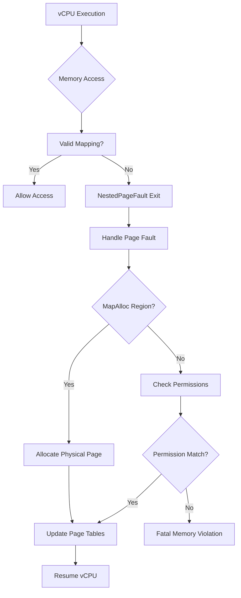

# Page Fault Handling

<cite>
**Referenced Files in This Document**   
- [vm.rs](file://src/vm.rs)
- [hal.rs](file://src/hal.rs)
</cite>

## Table of Contents
1. [Introduction](#introduction)
2. [Page Fault Conditions and Triggers](#page-fault-conditions-and-triggers)
3. [Nested Page Fault Handling Mechanism](#nested-page-fault-handling-mechanism)
4. [Interaction with HAL Paging Subsystem](#interaction-with-hal-paging-subsystem)
5. [Error Propagation and Recovery](#error-propagation-and-recovery)
6. [Performance Considerations and Mitigation Strategies](#performance-considerations-and-mitigation-strategies)

## Introduction
This document details the nested page fault handling mechanism within the axvm hypervisor. It explains how `NestedPageFault` exit reasons from vCPUs are processed by invoking `handle_page_fault()` on the VM's address space, and describes the interaction between the virtual machine and the underlying Hardware Abstraction Layer (HAL) during fault resolution. The documentation covers conditions under which page faults occur, including first-touch allocation scenarios and improper access permissions, along with error recovery mechanisms and performance optimization strategies.

## Page Fault Conditions and Triggers
Page faults in axvm occur when a vCPU attempts to access guest physical memory that is either unmapped or accessed with incorrect permissions. Two primary scenarios trigger page faults:

1. **First-touch allocation with MapAlloc regions**: When memory regions are configured with `VmMemMappingType::MapAlloc`, physical pages are allocated on-demand when first accessed by the guest. This lazy allocation strategy defers physical memory commitment until actual use.

2. **Improper access permissions**: Access violations occur when a vCPU attempts to read, write, or execute memory without appropriate permissions as defined by `MappingFlags`. These flags control read, write, execute, and device access characteristics for each memory region.

Memory regions are established during VM creation through configuration-driven setup, where different mapping types determine whether memory is pre-allocated (`MapIdentical`) or allocated upon first access (`MapAlloc`).

**Section sources**
- [vm.rs](file://src/vm.rs#L108-L188)

## Nested Page Fault Handling Mechanism
The nested page fault handling process is implemented within the `run_vcpu()` method of the `AxVM` struct. When a vCPU generates a `NestedPageFault` exit reason, the hypervisor intercepts this event and delegates fault resolution to the VM's address space manager.

The exit handling loop in `run_vcpu()` explicitly processes `NestedPageFault` events by calling `handle_page_fault()` on the VM's address space with the faulting address and required access flags. This method resolves the fault by either allocating new physical pages (in the case of `MapAlloc` regions) or validating existing mappings against the requested access type.

**Diagram sources **
- [vm.rs](file://src/vm.rs#L452-L487)

**Section sources**
- [vm.rs](file://src/vm.rs#L424-L487)

## Interaction with HAL Paging Subsystem
During page fault resolution, the VM interacts with the underlying HAL's paging subsystem through the `PagingHandler` trait. For `MapAlloc` regions, when a first-touch allocation is required, the system allocates physical pages via the HAL's memory management interfaces.

The `AxVMHal` trait defines the contract between the hypervisor and the underlying platform, specifying that implementations must provide a `PagingHandler` associated type. This handler manages physical page allocation and deallocation operations. While direct calls to allocate individual pages aren't visible in the provided code, the infrastructure supports delegation to the HAL for memory management tasks.

Physical page allocation occurs transparently through the address space management layer, which coordinates with the HAL to obtain backing store for guest virtual memory. The two-stage address translation (EPT/SLPT) ensures isolation between guest-physical and host-physical addresses while enabling efficient memory sharing and protection.

**Section sources**
- [vm.rs](file://src/vm.rs#L43-L73)
- [hal.rs](file://src/hal.rs#L1-L43)

## Error Propagation and Recovery
The page fault handling system distinguishes between resolvable faults and fatal memory access violations. Resolvable faults include legitimate first-touch allocations in `MapAlloc` regions and temporary unavailability of mapped pages. These are handled transparently by the hypervisor, which either allocates missing pages or updates access permissions before resuming the vCPU.

Fatal memory access violations occur when:
- Access is attempted to unmapped regions not designated for dynamic allocation
- Permission requirements exceed those granted in the memory mapping
- Access occurs to device memory regions with incorrect width or alignment

The recovery mechanism follows a structured approach:
1. Intercept `NestedPageFault` exit reason
2. Attempt resolution via `handle_page_fault()`
3. If resolution succeeds, resume vCPU execution
4. If resolution fails, propagate the error and potentially terminate the VM

Unrecoverable faults result in error propagation back through the vCPU execution loop, ultimately leading to VM shutdown if critical memory integrity violations are detected.

**Section sources**
- [vm.rs](file://src/vm.rs#L452-L487)

## Performance Considerations and Mitigation Strategies
Frequent page faults can significantly impact VM performance due to the overhead of exit handling and page table updates. The current implementation faces potential performance challenges from:

- **On-demand allocation overhead**: Each first-touch access triggers a VM exit, increasing latency
- **Non-contiguous allocation**: `map_alloc` may allocate non-contiguous physical pages, affecting TLB efficiency
- **Lock contention**: The `Mutex<AddrSpace>` could become a bottleneck under high fault rates

To mitigate these issues, several strategies can be employed:

1. **Pre-allocation**: Configure critical memory regions with `MapIdentical` instead of `MapAlloc` to avoid first-touch penalties
2. **Large page mappings**: Utilize larger page sizes where supported to reduce page table entries and TLB pressure
3. **Memory hinting**: Implement prefetching mechanisms to anticipate memory access patterns
4. **Batched allocation**: Allocate multiple pages simultaneously during initialization to improve locality

These mitigation techniques help balance memory efficiency with performance requirements, allowing administrators to optimize based on workload characteristics.

**Section sources**
- [vm.rs](file://src/vm.rs#L152-L188)