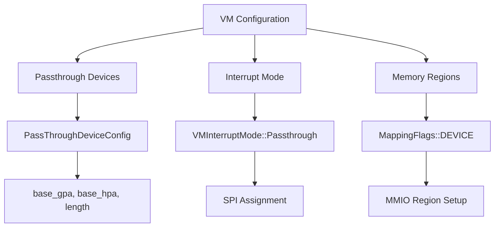
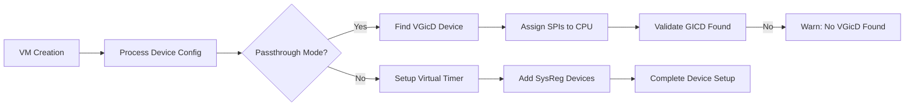
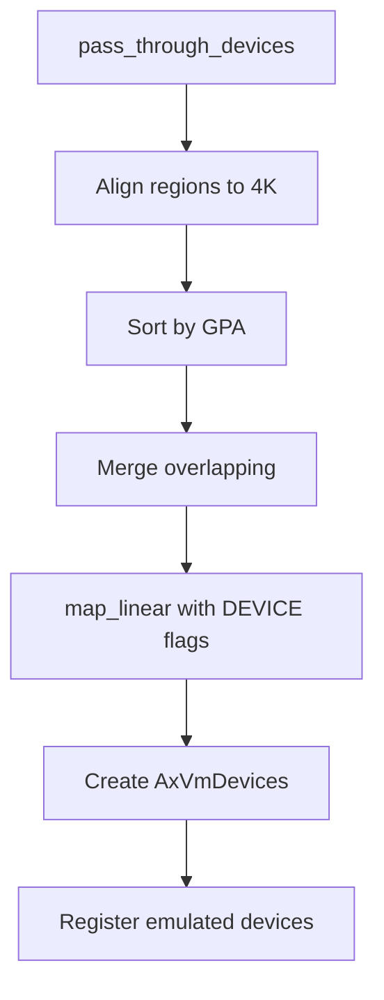

# Device I/O and Passthrough Issues

<cite>
**Referenced Files in This Document**
- [vm.rs](file://src/vm.rs)
- [config.rs](file://src/config.rs)
- [hal.rs](file://src/hal.rs)
- [vcpu.rs](file://src/vcpu.rs)
</cite>

## Table of Contents
1. [Introduction](#introduction)
2. [VM Configuration for Device Passthrough](#vm-configuration-for-device-passthrough)
3. [Tracing vCPU Exits from PIO/MMIO Accesses](#tracing-vcpu-exits-from-piommio-accesses)
4. [Validating Device Handler Routing in AxVmDevices](#validating-device-handler-routing-in-axvmdevices)
5. [Diagnosing Unhandled System Register Accesses](#diagnosing-unhandled-system-register-accesses)
6. [Debugging Malformed IVC Channel Setups](#debugging-malformed-ivc-channel-setups)
7. [Verifying Passthrough Device Configuration](#verifying-passthrough-device-configuration)
8. [MSI Routing and DMA Address Validation](#msi-routing-and-dma-address-validation)
9. [Device Registration and I/O Handler Chaining Example](#device-registration-and-io-handler-chaining-example)
10. [HAL Implementation Gaps in Interrupt Injection](#hal-implementation-gaps-in-interrupt-injection)
11. [Physical Device Access Control Issues](#physical-device-access-control-issues)
12. [Comprehensive Debugging Workflows](#comprehensive-debugging-workflows)

## Introduction
This document provides practical troubleshooting guidance for device emulation and passthrough problems in the AxVM hypervisor environment. It covers common issues such as stalled I/O operations, missing MMIO responses, and failed interrupt delivery. The focus is on diagnostic techniques for tracing vCPU exits, validating device handler routing, and verifying passthrough configurations. By understanding the interaction between VM configuration, device handling, and hardware abstraction layers, administrators can effectively diagnose and resolve device-related issues in virtualized environments.

## VM Configuration for Device Passthrough
Proper VM configuration is essential for successful device passthrough operations. The `AxVMConfig` structure defines critical parameters for passthrough devices and interrupt modes.



**Diagram sources**
- [config.rs](file://src/config.rs#L170-L194)
- [vm.rs](file://src/vm.rs#L190-L226)

**Section sources**
- [config.rs](file://src/config.rs#L33-L64)
- [vm.rs](file://src/vm.rs#L108-L150)

## Tracing vCPU Exits from PIO/MMIO Accesses
vCPU exits caused by PIO/MMIO accesses are fundamental to device emulation. The `run_vcpu` method in `AxVM` handles these exits by inspecting the exit reason and dispatching to appropriate device handlers.

When a vCPU encounters an MMIO or PIO access that it cannot handle directly, it triggers an exit that is captured and processed by the VMM. The exit reason determines which handler is invoked:

```mermaid
sequenceDiagram
participant vCPU
participant AxVM
participant AxVmDevices
vCPU->>AxVM : run() returns exit reason
AxVM->>AxVM : Match exit reason
alt MMIO Read
AxVM->>AxVmDevices : handle_mmio_read(addr, width)
AxVmDevices-->>AxVM : Return value
AxVM->>vCPU : set_gpr(reg, value)
end
alt MMIO Write
AxVM->>AxVmDevices : handle_mmio_write(addr, width, data)
AxVmDevices-->>AxVM : Success/Failure
end
alt PIO Read
AxVM->>AxVmDevices : handle_port_read(port, width)
AxVmDevices-->>AxVM : Return value
AxVM->>vCPU : set_gpr(0, value)
end
alt PIO Write
AxVM->>AxVmDevices : handle_port_write(port, width, data)
AxVmDevices-->>AxVM : Success/Failure
end
else Unhandled
AxVM-->>vCPU : Return unhandled exit reason
end
```

**Diagram sources**
- [vm.rs](file://src/vm.rs#L424-L487)

**Section sources**
- [vm.rs](file://src/vm.rs#L403-L424)

## Validating Device Handler Routing in AxVmDevices
The correct routing of device accesses to their respective handlers is critical for proper device functionality. The `AxVmDevices` structure manages both emulated and passthrough devices, ensuring that I/O requests are directed to the appropriate handlers.

During VM creation, device configurations are processed and registered with the `AxVmDevices` instance. For passthrough mode on AArch64, SPIs (Shared Peripheral Interrupts) must be properly assigned to the VGicD (Virtual Generic Interrupt Controller Distributor):



**Diagram sources**
- [vm.rs](file://src/vm.rs#L226-L283)

**Section sources**
- [vm.rs](file://src/vm.rs#L254-L283)

## Diagnosing Unhandled System Register Accesses
Unhandled system register accesses can cause vCPU exits that are not properly processed, leading to VM stalls or crashes. The system register handling mechanism in AxVM routes these accesses through the `AxVmDevices` interface.

System register reads and writes are handled similarly to MMIO operations but use dedicated exit reasons:

```mermaid
flowchart TD
A[System Register Access] --> B{Exit Reason}
B --> C[AxVCpuExitReason::SysRegRead]
B --> D[AxVCpuExitReason::SysRegWrite]
C --> E[handle_sys_reg_read(addr)]
D --> F[handle_sys_reg_write(addr, value)]
E --> G[Set GPR with result]
F --> H[Return success/failure]
G --> I[vCPU continues execution]
H --> I
```

Diagnostic steps for unhandled system register accesses:
1. Enable trace logging to capture exit reasons
2. Verify that system register devices are properly registered
3. Check that the `get_sysreg_device` function returns expected devices
4. Validate that the `add_sys_reg_dev` method is called during VM setup

**Diagram sources**
- [vm.rs](file://src/vm.rs#L452-L487)

**Section sources**
- [vcpu.rs](file://src/vcpu.rs#L0-L29)

## Debugging Malformed IVC Channel Setups
Inter-VM Communication (IVC) channels require careful setup to ensure proper memory allocation and address translation. Issues with IVC channel configuration can lead to communication failures between VMs.

The IVC channel allocation process involves:
1. Aligning the requested size to 4K boundaries
2. Allocating a guest physical address through `AxVmDevices`
3. Returning the GPA and actual size to the caller

```mermaid
flowchart TD
A[alloc_ivc_channel] --> B[align_up_4k(expected_size)]
B --> C[devices.alloc_ivc_channel(size)]
C --> D{Success?}
D --> |Yes| E[Return (gpa, size)]
D --> |No| F[Propagate error]
E --> G[Channel ready for use]
```

Common issues include:
- Incorrect size alignment
- Failure to allocate GPA space
- Memory mapping conflicts
- Improper deallocation in `release_ivc_channel`

**Diagram sources**
- [vm.rs](file://src/vm.rs#L584-L615)

**Section sources**
- [vm.rs](file://src/vm.rs#L617-L626)

## Verifying Passthrough Device Configuration
Passthrough device configuration must be validated at multiple levels to ensure proper operation. This includes memory region setup, interrupt configuration, and device registration.

The passthrough device setup process:
1. Collect all passthrough device regions
2. Align base addresses and lengths to 4K boundaries
3. Sort regions by guest physical address
4. Merge overlapping regions
5. Map linear regions with DEVICE flags



Validation checklist:
- Ensure no memory regions include DEVICE flag (use pass_through_devices instead)
- Verify region alignment and merging logic
- Confirm proper mapping flags (READ, WRITE, USER)
- Check for address space conflicts

**Section sources**
- [vm.rs](file://src/vm.rs#L152-L226)

## MSI Routing and DMA Address Validation
Message Signaled Interrupts (MSI) and Direct Memory Access (DMA) require special attention in passthrough configurations. Proper routing ensures interrupts reach the correct vCPUs and DMA operations access valid memory regions.

For AArch64 systems in passthrough mode:
- SPIs are assigned to specific CPUs via the VGicD
- CPU ID is derived from VM ID (with known limitation)
- Interrupt affinity is configured with priority parameters

DMA considerations:
- Ensure host physical addresses are correctly mapped
- Validate address translation through the two-stage page tables
- Check for proper memory protection flags
- Verify coherency between host and guest views

```mermaid
flowchart LR
A[SPI List] --> B[VGicD Device]
B --> C[assign_irq(spi+32, cpu_id)]
C --> D[Interrrupt routed to vCPU]
E[DMA Request] --> F[Address Translation]
F --> G[Check Mapping Flags]
G --> H[Execute Operation]
```

**Section sources**
- [vm.rs](file://src/vm.rs#L226-L252)

## Device Registration and I/O Handler Chaining Example
Proper device registration follows a specific pattern demonstrated in the `vm.rs` file. The example shows how emulated devices are configured and how I/O handlers are chained together.

Device registration workflow:
1. Create `AxVmDeviceConfig` with emulated device configurations
2. Initialize `AxVmDevices` with the configuration
3. Add system register devices if needed
4. Register with the VM instance

I/O handler chaining occurs when multiple devices may respond to the same address range. The system processes handlers in registration order until one successfully handles the request.

```mermaid
flowchart TD
A[Emulated Devices] --> B[AxVmDeviceConfig]
B --> C[AxVmDevices::new()]
C --> D{Passthrough Mode?}
D --> |No| E[Add SysReg Devices]
E --> F[Register with VM]
F --> G[Handler Chain Established]
```

Key methods involved:
- `AxVmDevices::new()` - Creates device manager
- `add_sys_reg_dev()` - Adds system register handlers
- `handle_mmio_read/write()` - Dispatches to registered devices
- `handle_port_read/write()` - Handles PIO operations

**Section sources**
- [vm.rs](file://src/vm.rs#L190-L226)

## HAL Implementation Gaps in Interrupt Injection
The `AxVMHal` trait defines critical interfaces for interrupt injection and physical resource management. Incomplete implementations can lead to failed interrupt delivery and system instability.

Required HAL methods for interrupt handling:
- `current_vm_id()` - Identifies current VM context
- `inject_irq_to_vcpu()` - Injects IRQ to specified vCPU
- `vcpu_resides_on()` - Maps vCPU to physical CPU

```mermaid
flowchart TD
A[inject_interrupt_to_vcpu] --> B[Check current_vm_id]
B --> C{Same VM?}
C --> |No| D[Panic: Cross-VM injection]
C --> |Yes| E[Iterate target vCPUs]
E --> F[H::inject_irq_to_vcpu()]
F --> G[Interrupt delivered]
```

Common implementation gaps:
- Not supporting cross-VM interrupt injection
- Incorrect vCPU to pCPU mapping
- Failure to locate physical CPU for target vCPU
- Missing panic handling for unsupported operations

**Section sources**
- [hal.rs](file://src/hal.rs#L0