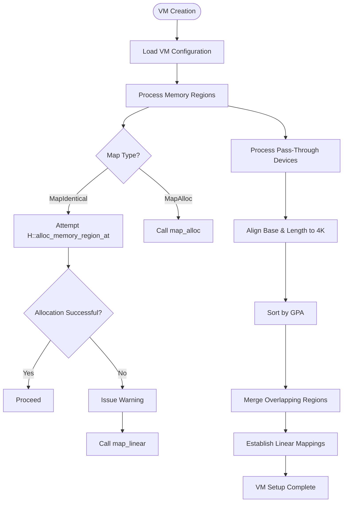
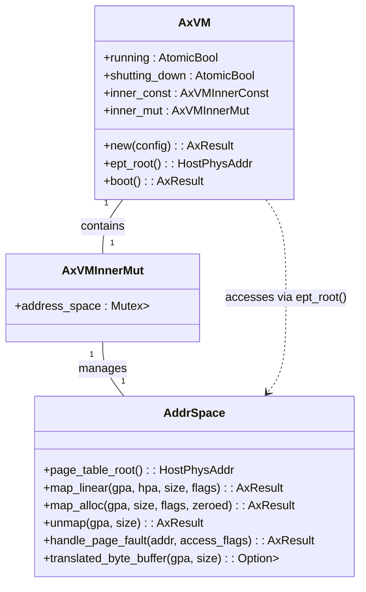
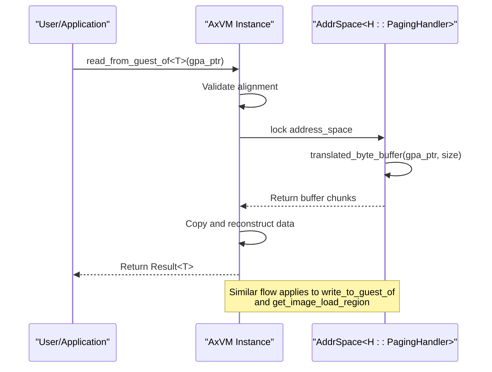

# Memory Mapping and Translation Failures

<cite>
**Referenced Files in This Document**   
- [vm.rs](file://src/vm.rs)
- [hal.rs](file://src/hal.rs)
- [config.rs](file://src/config.rs)
</cite>

## Table of Contents
1. [Introduction](#introduction)
2. [Memory Region Configuration and Initialization](#memory-region-configuration-and-initialization)
3. [Two-Stage Address Translation Setup](#two-stage-address-translation-setup)
4. [Diagnosing map_region/unmap_region Failures](#diagnosing-map_regionunmap_region-failures)
5. [Overlapping Memory Regions and Permission Mismatches](#overlapping-memory-regions-and-permission-mismatches)
6. [Guest-to-Host Physical Address Translation Tracing](#guest-to-host-physical-address-translation-tracing)
7. [Page Fault Handling Path Analysis](#page-fault-handling-path-analysis)
8. [HAL Responsibilities in Memory Management](#hal-responsibilities-in-memory-management)
9. [TLB Coherency Issues Across vCPUs](#tlb-coherency-issues-across-vcpus)

## Introduction
This document provides comprehensive guidance on troubleshooting memory-related issues in virtualized environments, focusing on page fault loops, failed region mapping, and incorrect address translation. It explains how to validate two-stage address translation setup by examining nested page table configurations and host physical address resolution. The content covers diagnosing failures in memory mapping operations, detecting overlapping regions, identifying permission mismatches, and using logging mechanisms to trace address translations. Special emphasis is placed on the role of the Hardware Abstraction Layer (HAL) in ensuring proper memory management and page table configuration.

## Memory Region Configuration and Initialization

The VM initialization process begins with configuring memory regions through the `AxVMConfig` structure, which defines both RAM and device memory mappings. During VM creation in `vm.rs`, memory regions are processed based on their mapping type (`VmMemMappingType::MapIdentical` or `VmMemMappingType::MapAlloc`). For identical mapping, the system attempts to allocate host physical memory at the same address as guest physical address using `H::alloc_memory_region_at`. If this fails, it falls back to linear mapping while issuing a warning about allocation failure.

Pass-through devices require special handling where their memory regions are aligned to 4K boundaries and merged if overlapping. The system processes these regions by first collecting all pass-through device configurations, aligning base addresses and lengths, sorting by guest physical address, and then merging any overlapping ranges before establishing linear mappings with appropriate device flags.

**Diagram sources**
- [vm.rs](file://src/vm.rs#L108-L226)

**Section sources**
- [vm.rs](file://src/vm.rs#L108-L226)
- [config.rs](file://src/config.rs#L131-L168)

## Two-Stage Address Translation Setup

Two-stage address translation is established during VM initialization through the creation of an empty address space with defined base and size constants (`VM_ASPACE_BASE` and `VM_ASPACE_SIZE`). The nested page table configuration is managed by the `AddrSpace` component, which maintains the stage 2 page table root accessible via the `ept_root()` method. This returns the host physical address of the page table root, serving as the foundation for guest-to-host address translation.

During vCPU setup, each virtual CPU is configured with the VM's page table root through the `setup()` call, passing `result.ept_root()` as a parameter. This ensures that all vCPUs within the VM share the same stage 2 translation context. The actual page table management is abstracted through the HAL's `PagingHandler` associated type, allowing architecture-specific implementations while maintaining a consistent interface.

Validation of the two-stage translation setup can be performed by verifying that the `ept_root()` returns a valid non-zero address after VM creation but before booting. Additionally, successful memory region mappings confirm that the underlying page tables are properly initialized and accessible.

**Diagram sources**
- [vm.rs](file://src/vm.rs#L332-L366)

**Section sources**
- [vm.rs](file://src/vm.rs#L69-L106)
- [vm.rs](file://src/vm.rs#L283-L330)

## Diagnosing map_region/unmap_region Failures

The `map_region` and `unmap_region` methods provide direct interfaces for dynamic memory mapping operations after VM creation. These functions operate on the VM's address space mutex, calling the underlying `map_linear` and `unmap` methods of the `AddrSpace` structure. Failures in these operations typically stem from invalid parameters, insufficient resources, or conflicts with existing mappings.

When diagnosing `map_region` failures, check that:
1. The guest physical address (GPA) and size are properly aligned to page boundaries
2. The requested mapping does not overlap with existing critical regions
3. The HAL implementation can satisfy the host physical address requirements
4. Sufficient contiguous virtual address space exists in the host

For `unmap_region` failures, verify that:
1. The specified GPA range exactly matches a previously established mapping
2. No active references exist to the memory region being unmapped
3. The operation occurs when the VM is not actively running

Error handling should capture the specific error codes returned by these methods, which may indicate invalid input parameters, resource exhaustion, or internal consistency violations in the page table structures.

**Section sources**
- [vm.rs](file://src/vm.rs#L489-L538)

## Overlapping Memory Regions and Permission Mismatches

Overlapping memory regions are automatically detected and resolved during VM initialization through the merging algorithm applied to pass-through device regions. The system sorts regions by guest physical address and iteratively merges any overlapping or adjacent ranges. However, manual `map_region` calls bypass this protection and can create conflicts.

Permission mismatches occur when access flags specified during mapping do not align with the intended usage. The system validates mapping flags early in the initialization process, specifically checking for inappropriate use of the `DEVICE` flag in regular memory regions. Different memory types require specific flag combinations:

- RAM regions: Typically use `READ | WRITE` with optional `EXECUTE`
- Device regions: Require `DEVICE | READ | WRITE | USER`
- Code regions: Should include `EXECUTE` permission
- Read-only data: Should exclude `WRITE` permission

To detect permission issues, monitor for page faults with access violation reasons, particularly when the faulting instruction attempts operations not permitted by the mapping flags. Regular auditing of active mappings against expected usage patterns can prevent such mismatches.

**Section sources**
- [vm.rs](file://src/vm.rs#L108-L150)
- [vm.rs](file://src/vm.rs#L190-L226)

## Guest-to-Host Physical Address Translation Tracing

Address translation tracing is facilitated through several mechanisms in the VM implementation. The `get_image_load_region` method provides visibility into how guest physical addresses translate to host virtual addresses by returning byte buffers corresponding to the translated memory. This function uses `translated_byte_buffer` internally, which performs the actual GPA-to-HVA conversion.

Logging plays a crucial role in tracing translation operations. The system emits informational messages during memory region setup, showing the GPA range and mapping flags. For pass-through devices, trace-level logging displays both guest and host physical address mappings. These logs enable administrators to verify that expected translations are occurring correctly.

Additional diagnostic capabilities come from the `read_from_guest_of` and `write_to_guest_of` methods, which perform address translation as part of their operation. By attempting reads/writes at various GPAs and observing success/failure patterns, one can map out the effective translation behavior across the guest physical address space.

**Diagram sources**
- [vm.rs](file://src/vm.rs#L540-L582)

**Section sources**
- [vm.rs](file://src/vm.rs#L540-L582)
- [vm.rs](file://src/vm.rs#L332-L366)

## Page Fault Handling Path Analysis

Page fault handling occurs through the `NestedPageFault` exit reason in the vCPU run loop. When a guest triggers a page fault, the hypervisor intercepts this as an `AxVCpuExitReason::NestedPageFault` containing the faulting address and access flags. This event is handled by delegating to the address space's `handle_page_fault` method.

The page fault handling path follows a structured sequence:
1. vCPU execution generates page fault
2. Hypervisor traps the fault and exits to VM context
3. Exit reason identified as `NestedPageFault`
4. `handle_page_fault` invoked on address space
5. Page table updated to resolve fault
6. vCPU resumes execution

Anomalies in this path can manifest as infinite page fault loops, which typically indicate either incorrect page table updates, missing memory allocations, or hardware issues. Monitoring the frequency and addresses of page faults can help identify such problems. Proper implementation should resolve most faults within a single handling cycle unless demand paging or complex remapping is involved.

**Section sources**
- [vm.rs](file://src/vm.rs#L452-L487)

## HAL Responsibilities in Memory Management

The Hardware Abstraction Layer (HAL) plays a critical role in providing valid physical memory ranges and managing page tables through the `AxVMHal` trait. Key responsibilities include:

- **Memory Allocation**: Implementing `alloc_memory_region_at` to reserve specific host physical address ranges for VM use
- **Address Translation**: Providing `virt_to_phys` for converting host virtual to physical addresses
- **Interrupt Management**: Handling IRQ injection to vCPUs via `inject_irq_to_vcpu`
- **System Information**: Supplying current VM, vCPU, and pCPU identifiers

The HAL must ensure that allocated memory regions remain stable for the lifetime of the VM and that physical address mappings are consistent across all vCPUs. Failure in any of these responsibilities can lead to memory corruption, access violations, or system instability.

Particularly important is the `alloc_memory_region_at` method, which allows the hypervisor to place VM memory at predictable physical locations. When this allocation fails, the system falls back to potentially fragmented memory layouts, which may impact performance and reliability.

**Section sources**
- [hal.rs](file://src/hal.rs#L0-L43)

## TLB Coherency Issues Across vCPUs

While not explicitly addressed in the current implementation, TLB coherency across vCPUs is a critical consideration for multi-vCPU VMs. Since each vCPU may maintain its own TLB cache, modifications to page tables must be accompanied by appropriate TLB invalidation operations broadcast to all relevant processors.

Potential strategies for resolving TLB coherency issues include:
1. Implementing cross-vCPU TLB shootdown mechanisms during page table updates
2. Using global page mappings where appropriate to reduce invalidation overhead
3. Synchronizing page table modifications with vCPU state transitions
4. Leveraging hardware-assisted coherency features when available

The current codebase lacks explicit TLB management operations, suggesting that coherency relies on architectural defaults or will be implemented in future versions. Monitoring for stale translations after memory remapping operations can help detect TLB coherency problems in practice.

**Section sources**
- [vm.rs](file://src/vm.rs#L489-L538)
- [hal.rs](file://src/hal.rs#L0-L43)