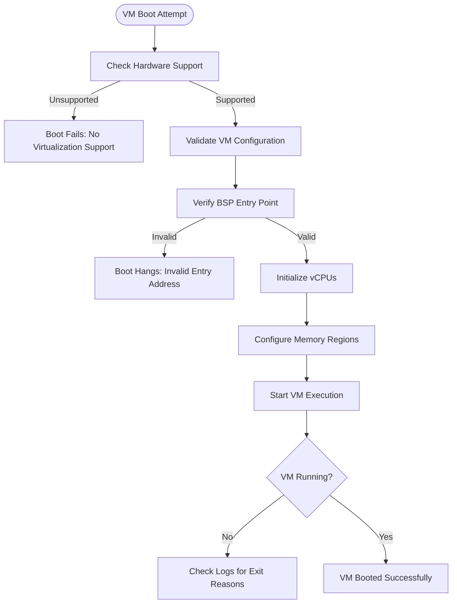
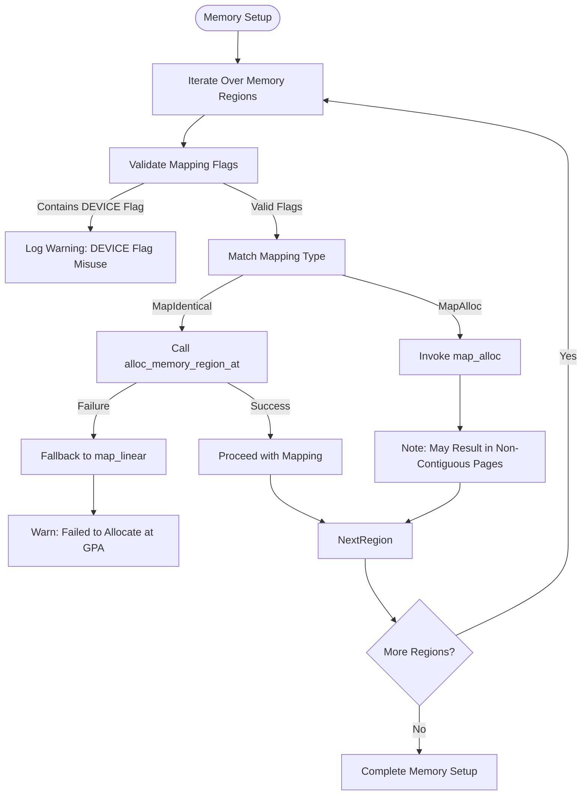
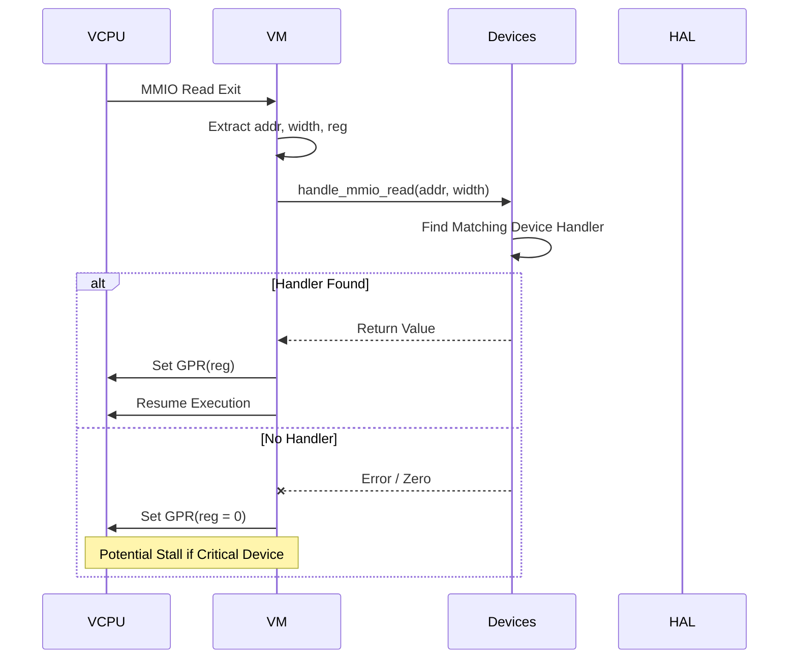
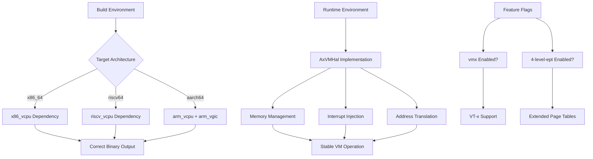

# Troubleshooting

<cite>
**Referenced Files in This Document **   
- [vm.rs](file://src/vm.rs)
- [vcpu.rs](file://src/vcpu.rs)
- [hal.rs](file://src/hal.rs)
- [config.rs](file://src/config.rs)
</cite>

## Table of Contents
1. [VM Boot Hangs](#vm-boot-hangs)
2. [vCPU Exit Loops](#vcpu-exit-loops)
3. [Memory Allocation Failures](#memory-allocation-failures)
4. [Device I/O Stalls](#device-io-stalls)
5. [Environmental Issues](#environmental-issues)

## VM Boot Hangs

When a virtual machine fails to boot and appears to hang during startup, the issue typically stems from incorrect configuration parameters or missing hardware support. The most common causes include invalid entry points for the Bootstrap Processor (BSP) or Application Processors (AP), improper memory mappings, or lack of virtualization extensions on the host.

To diagnose this issue, first verify that the BSP entry point is correctly specified in the VM configuration. The `AxVMConfig` structure contains the `bsp_entry` field which must point to a valid guest physical address where the kernel image is loaded. Check the `image_config().kernel_load_gpa` value in the configuration to ensure it matches the expected load address.

Next, confirm that the underlying hardware supports virtualization by calling `has_hardware_support()` from `lib.rs`. If this returns false, the VM cannot be booted due to missing CPU features.

Additionally, inspect the vCPU setup process in `vm.rs`. During VM creation, each vCPU is configured with an entry point based on whether it's the BSP (`vcpu.id() == 0`) or AP. A mismatch here can cause the guest OS to fail immediately upon execution.



**Diagram sources **
- [vm.rs](file://src/vm.rs#L69-L106)
- [config.rs](file://src/config.rs#L66-L103)

**Section sources**
- [vm.rs](file://src/vm.rs#L363-L404)
- [config.rs](file://src/config.rs#L131-L168)

## vCPU Exit Loops

A vCPU exit loop occurs when a virtual CPU repeatedly exits from guest mode without making forward progress, often due to unhandled exit reasons or misconfigured device emulation. These loops can be identified through log analysis using the configured logging framework, particularly by examining traces of `AxVCpuExitReason`.

The primary code path responsible for handling vCPU exits is located in `vm.rs` within the `run_vcpu` method. This function processes various exit types such as MMIO reads/writes, I/O operations, system register accesses, and nested page faults. When an exit reason is not properly handled—indicated by the `handled` flag remaining false—the loop breaks and returns control to the caller.

Common culprits include:
- Unimplemented MMIO handlers for emulated devices
- Incorrect interrupt routing causing spurious exits
- Missing passthrough timer configuration on AArch64

For debugging, add trace points around the exit handling logic using `trace!("{exit_reason:#x?}")`. Use conditional breakpoints to capture specific exit codes and analyze their frequency. On AArch64 systems, ensure that virtual timers are properly set up when not using interrupt passthrough mode by verifying calls to `get_sysreg_device()`.

```mermaid
sequenceDiagram
participant VCPU as AxVCpu
participant VM as AxVM
participant Devices as AxVmDevices
VCPU->>VM : run()
VM->>VM : Handle Exit Loop
loop Exit Handling
VM->>VM : Read Exit Reason
alt Handled Exit Type
VM->>Devices : Handle Device Access
Devices-->>VM : Return Data
VM->>VCPU : Set GPR/Register
VM->>VM : Continue Execution
else Unhandled Exit
break Exit Loop
end
end
VM-->>VCPU : Return Exit Reason
```

**Diagram sources **
- [vm.rs](file://src/vm.rs#L424-L487)
- [vcpu.rs](file://src/vcpu.rs#L0-L29)

**Section sources**
- [vm.rs](file://src/vm.rs#L403-L424)
- [vm.rs](file://src/vm.rs#L489-L538)

## Memory Allocation Failures

Memory allocation failures manifest when the VM cannot map required regions into its address space, leading to crashes or failed initialization. These issues arise from either insufficient host memory, incorrect mapping flags, or conflicts between identical and allocated mappings.

In `vm.rs`, memory regions are processed during VM creation via two strategies: `MapIdentical` and `MapAlloc`. For `MapIdentical`, the system attempts to allocate at a specific host physical address using `H::alloc_memory_region_at()`. If this fails, a warning is logged but the mapping proceeds with potentially suboptimal results.

Key diagnostic steps:
1. Verify that `MappingFlags::DEVICE` is not mistakenly used in regular memory regions; it should only appear in pass-through device configurations.
2. Ensure that overlapping pass-through device regions are properly merged before mapping.
3. Confirm that HAL implementation correctly handles `alloc_memory_region_at`.

Use `read_from_guest_of` and `write_to_guest_of` methods to test accessibility of mapped regions. Add debug assertions to check alignment requirements and buffer sizes during translation.



**Diagram sources **
- [vm.rs](file://src/vm.rs#L108-L188)
- [hal.rs](file://src/hal.rs#L0-L43)

**Section sources**
- [vm.rs](file://src/vm.rs#L108-L150)
- [vm.rs](file://src/vm.rs#L152-L188)

## Device I/O Stalls

Device I/O stalls occur when emulated or pass-through devices fail to respond to access requests, causing the vCPU to hang indefinitely. These issues are typically rooted in incorrect device configuration, missing interrupt routing, or improper binding between vCPUs and pCPUs.

The root cause often lies in how MMIO and I/O port accesses are handled in the `run_vcpu` loop. Each exit due to MMIO read/write triggers a call to `handle_mmio_read` or `handle_mmio_write` through the device manager. If no handler exists for the given address range, the operation will fail silently or return zero, potentially stalling device initialization.

Critical areas to investigate:
- Correctness of `pass_through_devices` configuration in `AxVMConfig`
- Proper assignment of SPIs (Shared Peripheral Interrupts) on AArch64 via VGicD
- Accurate base GPA-to-HPA translations for pass-through regions

On AArch64 platforms, ensure that when `VMInterruptMode::Passthrough` is enabled, the GIC distributor (VGicD) is present in the device list and SPIs are assigned using `gicd.assign_irq()`. Failure to do so results in unrouteable interrupts and stalled I/O completion.

Debugging techniques include adding trace logs before and after device handler invocations, setting breakpoints on `handle_mmio_read/write`, and validating that `translated_byte_buffer` returns valid HVA segments for device memory.



**Diagram sources **
- [vm.rs](file://src/vm.rs#L424-L450)
- [vm.rs](file://src/vm.rs#L254-L283)

**Section sources**
- [vm.rs](file://src/vm.rs#L452-L487)
- [config.rs](file://src/config.rs#L170-L194)

## Environmental Issues

Environmental factors such as incorrect target architecture compilation or missing kernel services can prevent axvm from functioning correctly. These issues are often subtle and require careful inspection of build configurations and runtime dependencies.

One critical aspect is the conditional compilation based on `target_arch`. The `vcpu.rs` file uses `cfg_if!` macros to select appropriate implementations (`VmxArchVCpu` for x86_64, `RISCVVCpu` for riscv64, `Aarch64VCpu` for aarch64). Compiling for the wrong architecture leads to undefined behavior or linkage errors.

Another common pitfall is the absence of required kernel services that implement the `AxVMHal` trait. This trait defines essential functions like `alloc_memory_region_at`, `virt_to_phys`, and `inject_irq_to_vcpu`. If these are not properly implemented by the hosting environment (e.g., hypervisor or OS layer), memory management and interrupt delivery will fail.

Ensure that:
- The correct feature flags are enabled in `Cargo.toml` (e.g., `vmx` for Intel VT-x)
- Target-specific dependencies (`x86_vcpu`, `riscv_vcpu`, `arm_vcpu`) are available
- All `AxVMHal` methods have concrete implementations
- Time source (`current_time_nanos`) is monotonic and accurate

Runtime verification can be performed by calling `has_hardware_support()` early in initialization and checking `current_vm_id()` and `current_vcpu_id()` for consistency.



**Diagram sources **
- [vcpu.rs](file://src/vcpu.rs#L0-L29)
- [hal.rs](file://src/hal.rs#L0-L43)
- [Cargo.toml](file://Cargo.toml#L0-L39)

**Section sources**
- [vcpu.rs](file://src/vcpu.rs#L0-L29)
- [hal.rs](file://src/hal.rs#L0-L43)
- [lib.rs](file://src/lib.rs#L0-L32)