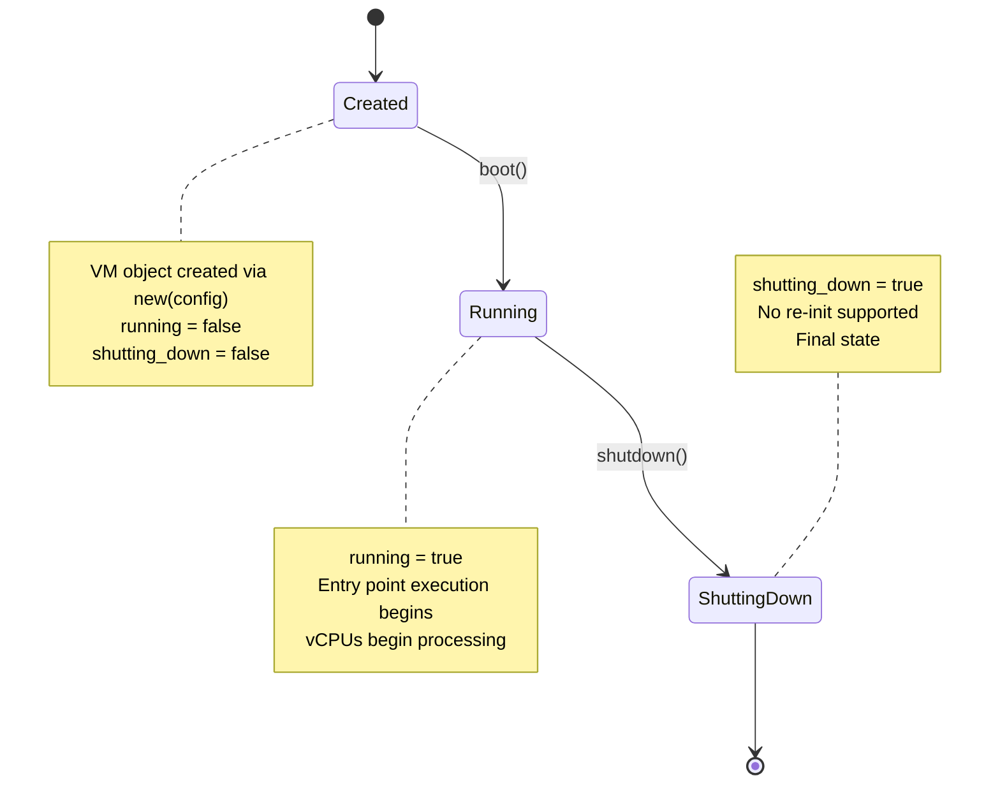

# VM Lifecycle Issues

<cite>
**Referenced Files in This Document**   
- [vm.rs](file://src/vm.rs)
- [config.rs](file://src/config.rs)
- [hal.rs](file://src/hal.rs)
- [vcpu.rs](file://src/vcpu.rs)
</cite>

## Table of Contents
1. [Introduction](#introduction)
2. [VM State Transitions and Lifecycle Management](#vm-state-transitions-and-lifecycle-management)
3. [Common Root Causes of VM Lifecycle Problems](#common-root-causes-of-vm-lifecycle-problems)
4. [Step-by-Step Diagnostics for VM Initialization Failures](#step-by-step-diagnostics-for-vm-initialization-failures)
5. [Troubleshooting Boot Hangs](#troubleshooting-boot-hangs)
6. [Diagnosing Unresponsive Shutdowns](#diagnosing-unresponsive-shutdowns)
7. [Runtime Checks and Debug Logging](#runtime-checks-and-debug-logging)
8. [Architecture-Specific Boot Requirements](#architecture-specific-boot-requirements)
9. [Solutions and Best Practices](#solutions-and-best-practices)

## Introduction
This document provides comprehensive troubleshooting guidance for virtual machine (VM) lifecycle issues in the AxVM hypervisor framework. It focuses on diagnosing and resolving problems related to boot hangs, failed initialization, and unresponsive shutdowns. The analysis covers state transition tracing through debug logs, identification of common root causes such as misconfigured memory regions or invalid entry points, and step-by-step diagnostic procedures. Special attention is given to architecture-specific considerations and proper implementation of HAL services for time and identity management.

## VM State Transitions and Lifecycle Management
The AxVM framework manages VM lifecycle through atomic boolean flags that track operational states. These states are critical for understanding and diagnosing lifecycle issues.



**Diagram sources**
- [vm.rs](file://src/vm.rs#L43-L73)
- [vm.rs](file://src/vm.rs#L363-L404)

**Section sources**
- [vm.rs](file://src/vm.rs#L43-L73)
- [vm.rs](file://src/vm.rs#L363-L404)

The VM lifecycle follows a strict sequence: creation → boot → running → shutdown. Once a VM transitions to the shutting_down state, it cannot be restarted due to the absence of re-initialization support. The `boot()` and `shutdown()` methods validate these state transitions using atomic checks to prevent race conditions and invalid state changes.

## Common Root Causes of VM Lifecycle Problems
Several configuration and implementation issues commonly lead to VM lifecycle failures. Understanding these root causes is essential for effective troubleshooting.

### Misconfigured Memory Regions
Improper memory region configurations can prevent successful VM initialization. The system validates memory mapping flags during setup, rejecting illegal combinations:

```mermaid
flowchart TD
    A[Start Memory Setup] --> B{Check DEVICE Flag}
    B -->|Present| C[Warn: Use pass_through_devices]
    B -->|Absent