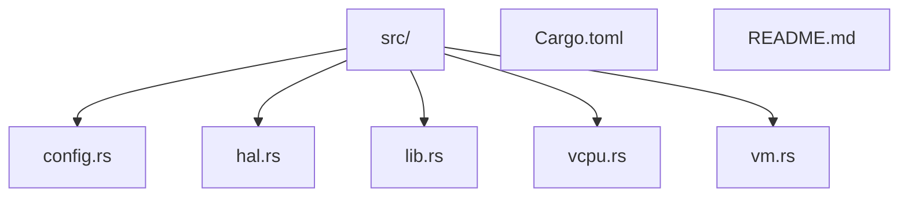
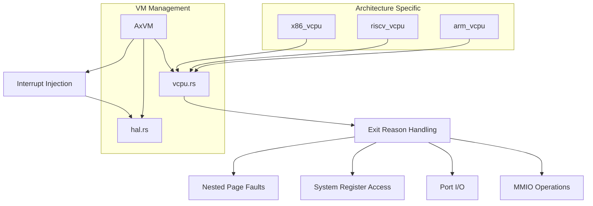
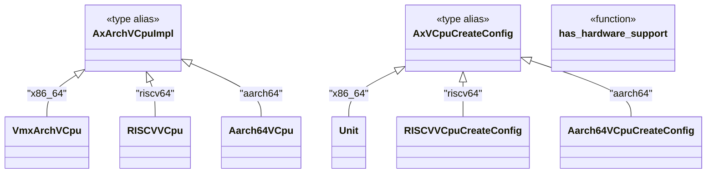
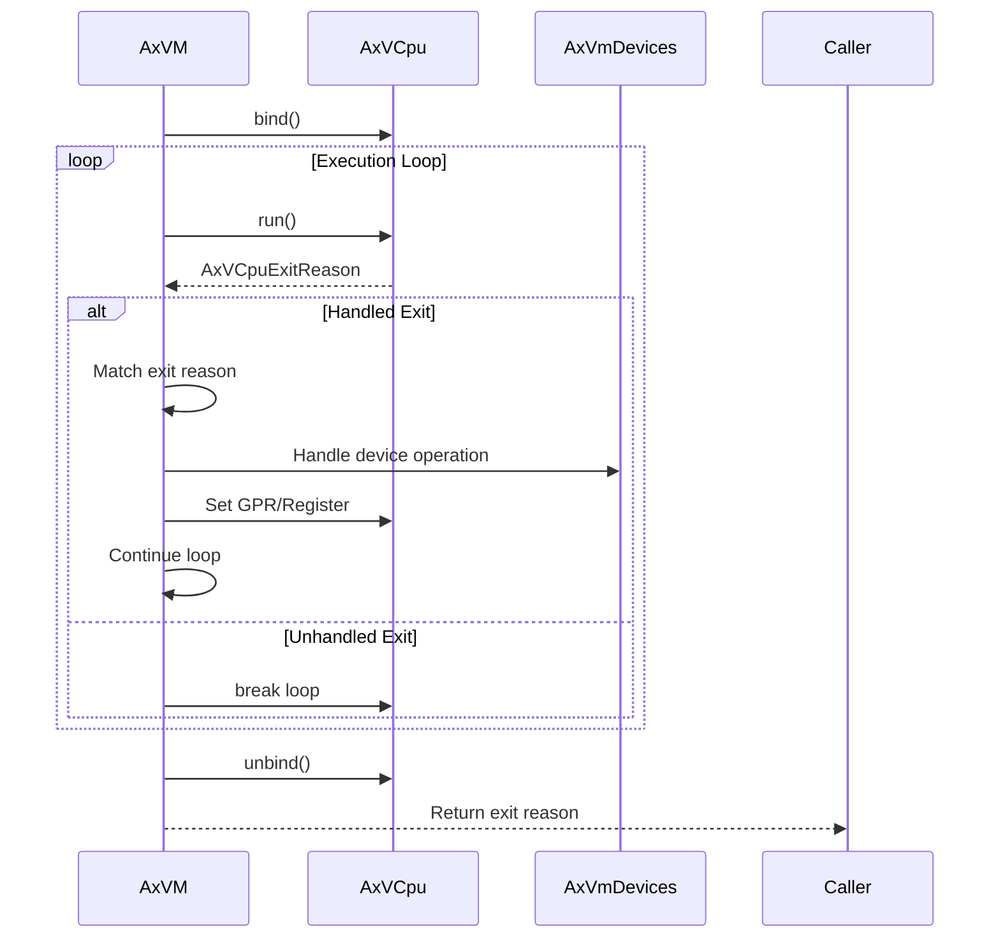
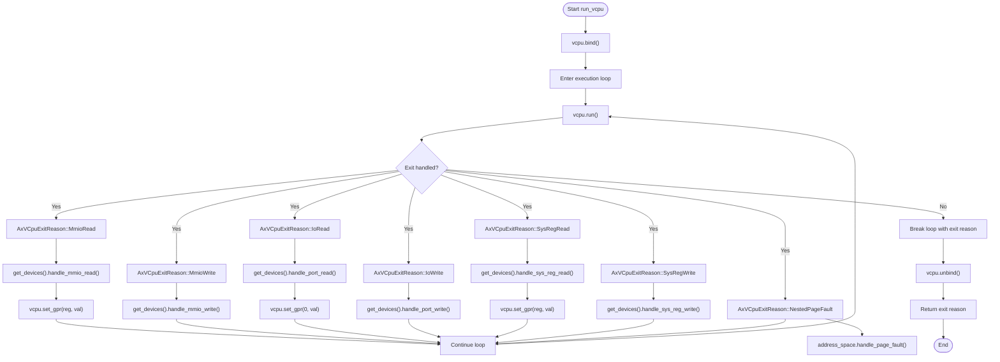
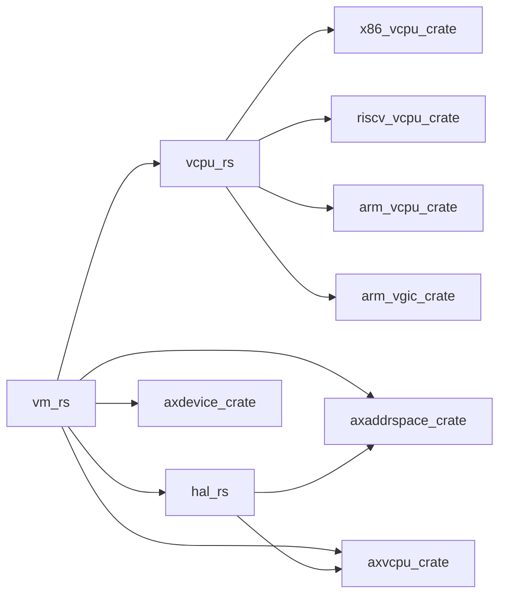

# vCPU Execution Problems

<cite>
**Referenced Files in This Document**   
- [vcpu.rs](file://src/vcpu.rs)
- [vm.rs](file://src/vm.rs)
- [hal.rs](file://src/hal.rs)
</cite>

## Table of Contents
1. [Introduction](#introduction)
2. [Project Structure](#project-structure)
3. [Core Components](#core-components)
4. [Architecture Overview](#architecture-overview)
5. [Detailed Component Analysis](#detailed-component-analysis)
6. [Dependency Analysis](#dependency-analysis)
7. [Performance Considerations](#performance-considerations)
8. [Troubleshooting Guide](#troubleshooting-guide)
9. [Conclusion](#conclusion)

## Introduction
This document provides comprehensive guidance for diagnosing and resolving vCPU-related issues in the axvm hypervisor framework. It focuses on interpreting vCPU exit reason codes, analyzing execution flow through `run_vcpu()`, identifying stuck exit handlers, and verifying correct vCPU state restoration. The analysis covers architecture-specific implementations for x86_64, riscv64, and aarch64 targets, with emphasis on debugging techniques such as logging exit reasons, validating register states, and checking interrupt injection paths.

## Project Structure

**Diagram sources**
- [vcpu.rs](file://src/vcpu.rs)
- [vm.rs](file://src/vm.rs)

**Section sources**
- [vcpu.rs](file://src/vcpu.rs)
- [vm.rs](file://src/vm.rs)

## Core Components

The core components for vCPU execution management include the architecture-dependent vCPU implementations defined in `vcpu.rs` and the VM lifecycle management in `vm.rs`. The system uses conditional compilation to select appropriate vCPU implementations based on target architecture (x86_64, riscv64, or aarch64). Each vCPU implementation provides architecture-specific configuration types and setup parameters that are crucial for proper initialization and execution.

**Section sources**
- [vcpu.rs](file://src/vcpu.rs#L0-L29)
- [vm.rs](file://src/vm.rs#L69-L106)

## Architecture Overview

**Diagram sources**
- [vcpu.rs](file://src/vcpu.rs#L0-L29)
- [vm.rs](file://src/vm.rs#L403-L487)

## Detailed Component Analysis

### vCPU Implementation Analysis

The vCPU implementation uses conditional compilation to provide architecture-specific types and configurations. For x86_64 targets, it uses VmxArchVCpu with empty configuration, while riscv64 and aarch64 targets have more complex configuration requirements including hart_id/mpidr_el1 and DTB addresses.

**Diagram sources**
- [vcpu.rs](file://src/vcpu.rs#L0-L29)

**Section sources**
- [vcpu.rs](file://src/vcpu.rs#L0-L29)

### VM Execution Flow Analysis

The `run_vcpu()` function implements the main execution loop for virtual CPUs, handling various exit reasons and dispatching them to appropriate handlers. The function follows a structured pattern of binding the vCPU to a physical CPU, entering an execution loop, processing exit reasons, and unbinding upon completion.

**Diagram sources**
- [vm.rs](file://src/vm.rs#L403-L487)

**Section sources**
- [vm.rs](file://src/vm.rs#L403-L487)

### Exit Reason Handling Analysis

The system handles multiple types of vCPU exit reasons, each requiring specific processing logic. The handler loop processes MMIO operations, port I/O, system register access, and nested page faults, while passing through unhandled exits to the caller.

**Diagram sources**
- [vm.rs](file://src/vm.rs#L424-L487)

**Section sources**
- [vm.rs](file://src/vm.rs#L424-L487)

## Dependency Analysis

**Diagram sources**
- [vm.rs](file://src/vm.rs#L13)
- [vcpu.rs](file://src/vcpu.rs#L0-L29)
- [hal.rs](file://src/hal.rs#L0-L43)

**Section sources**
- [vm.rs](file://src/vm.rs#L13)
- [vcpu.rs](file://src/vcpu.rs#L0-L29)
- [hal.rs](file://src/hal.rs#L0-L43)

## Performance Considerations
The vCPU execution model employs a tight loop for handling exits, which can impact performance if exit handlers are not optimized. Frequent MMIO operations or unhandled exits can lead to increased overhead. The use of tracing macros (`trace!("{exit_reason:#x?}")`) provides visibility into exit patterns but should be disabled in production builds to minimize performance impact.

## Troubleshooting Guide

When diagnosing vCPU-related issues, focus on the following areas:

1. **Infinite exit loops**: Check if exit handlers are properly marking exits as handled. Ensure MMIO operations are being processed correctly.
2. **Failed vCPU binding**: Verify physical CPU affinity settings in the VM configuration and ensure the HAL implementation correctly handles vCPU to pCPU mapping.
3. **Unexpected termination**: Examine unhandled exit reasons and ensure all required device emulation is available.
4. **Timer interrupt issues**: For aarch64 targets, verify virtual timer setup in non-passthrough mode and check sysreg device registration.
5. **Inter-processor communication**: Validate interrupt injection paths through the HAL's `inject_irq_to_vcpu` method.

Common mistakes in HAL implementation include incorrect physical address translation, improper current VM ID reporting, and faulty interrupt injection logic.

**Section sources**
- [vm.rs](file://src/vm.rs#L489-L538)
- [hal.rs](file://src/hal.rs#L0-L43)

## Conclusion
Effective diagnosis of vCPU execution problems requires understanding the interaction between architecture-specific implementations, the VM execution loop, and the HAL interface. By analyzing exit reason codes, verifying proper handler implementation, and ensuring correct state restoration, most vCPU-related issues can be systematically resolved. The use of conditional compilation guards allows for targeted debugging of architecture-specific bugs in x86_64, riscv64, and aarch64 targets.