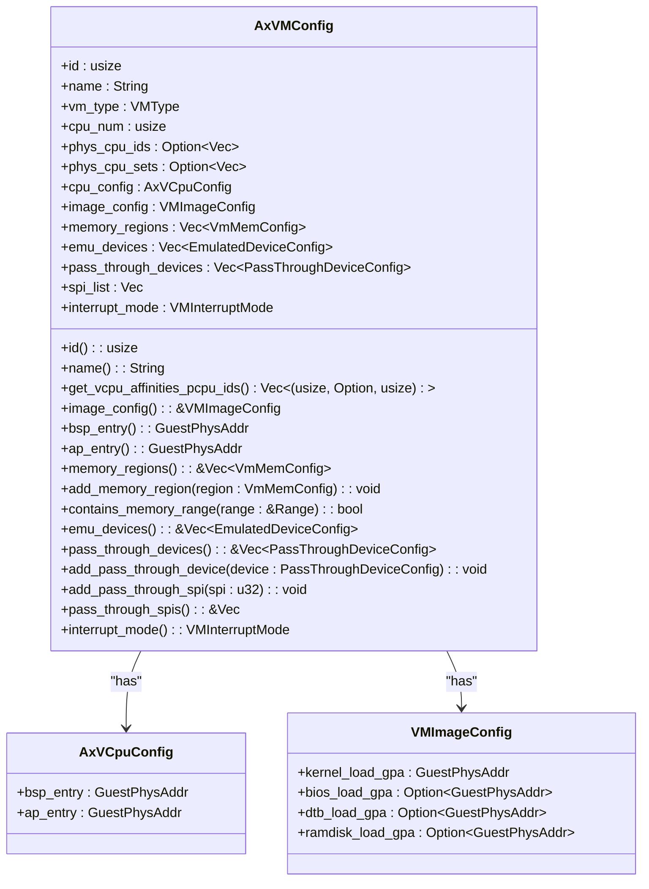
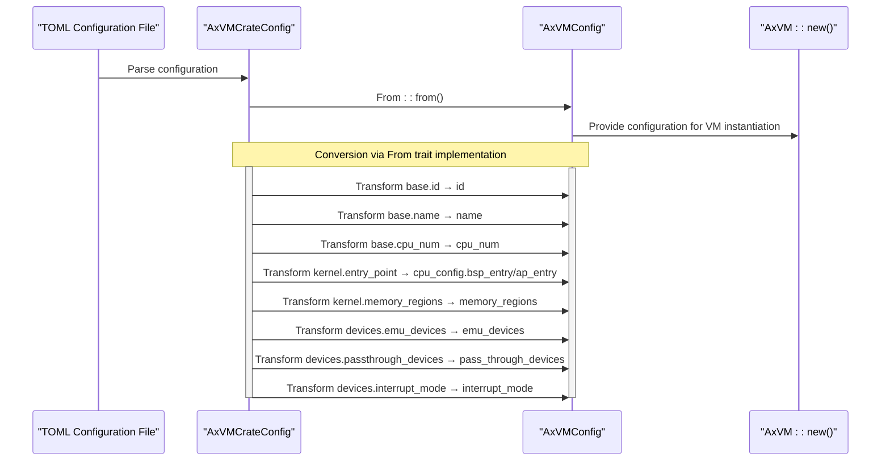
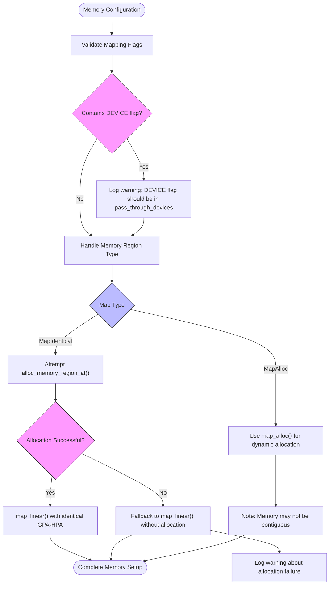

# VM Configuration System

<cite>
**Referenced Files in This Document **   
- [config.rs](file://src/config.rs)
- [vm.rs](file://src/vm.rs)
</cite>

## Table of Contents
1. [Introduction](#introduction)
2. [Core Configuration Structure](#core-configuration-structure)
3. [Configuration Conversion Process](#configuration-conversion-process)
4. [Memory Configuration and Management](#memory-configuration-and-management)
5. [vCPU Configuration and Provisioning](#vcpu-configuration-and-provisioning)
6. [Device Mapping Configuration](#device-mapping-configuration)
7. [IVC Channel Management](#ivc-channel-management)
8. [Configuration Validation and Error Handling](#configuration-validation-and-error-handling)
9. [Performance and Security Implications](#performance-and-security-implications)

## Introduction
The VM configuration system provides a structured approach to defining virtual machine parameters before instantiation. The system centers around the `AxVMConfig` structure, which serves as the runtime representation of VM configuration. This document details how `AxVMConfig` is derived from higher-level configurations, its key components including memory layout, vCPU count, device mappings, and IVC channels, and how these parameters are validated and translated into runtime structures during VM creation via `AxVM::new()`.

**Section sources**
- [config.rs](file://src/config.rs#L0-L195)
- [vm.rs](file://src/vm.rs#L0-L627)

## Core Configuration Structure
The `AxVMConfig` structure defines all essential parameters for VM instantiation, including identification, CPU configuration, memory regions, device mappings, and interrupt settings. It serves as the central configuration object that encapsulates all necessary information for creating a functional virtual machine instance.

**Diagram sources **
- [config.rs](file://src/config.rs#L33-L64)
- [config.rs](file://src/config.rs#L15-L28)

**Section sources**
- [config.rs](file://src/config.rs#L33-L64)

## Configuration Conversion Process
The configuration system implements a conversion pattern where `AxVMCrateConfig` (typically derived from TOML configuration files) is transformed into `AxVMConfig` through the `From` trait implementation. This conversion process extracts and transforms configuration data from the source format into the runtime-ready structure used for VM creation.

**Diagram sources **
- [config.rs](file://src/config.rs#L66-L103)

**Section sources**
- [config.rs](file://src/config.rs#L66-L103)

## Memory Configuration and Management
The memory configuration system handles both RAM regions and passthrough devices, with distinct processing paths for different memory mapping types. The system validates memory flags and sets up appropriate mappings in the VM's address space during initialization.

**Diagram sources **
- [vm.rs](file://src/v