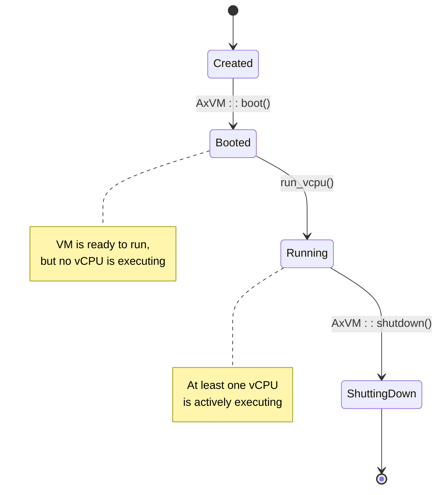
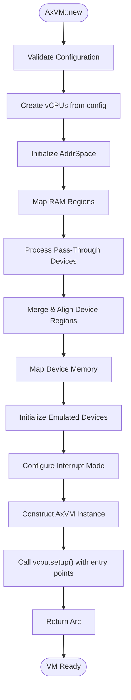
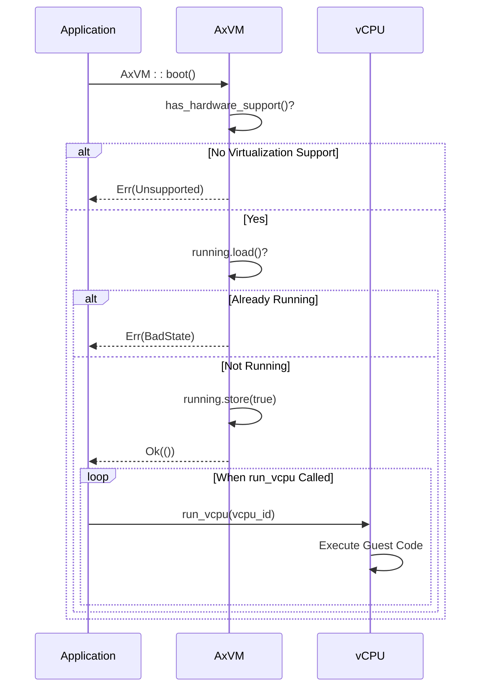
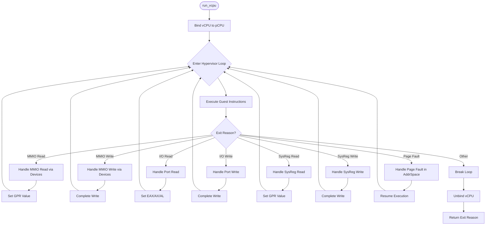
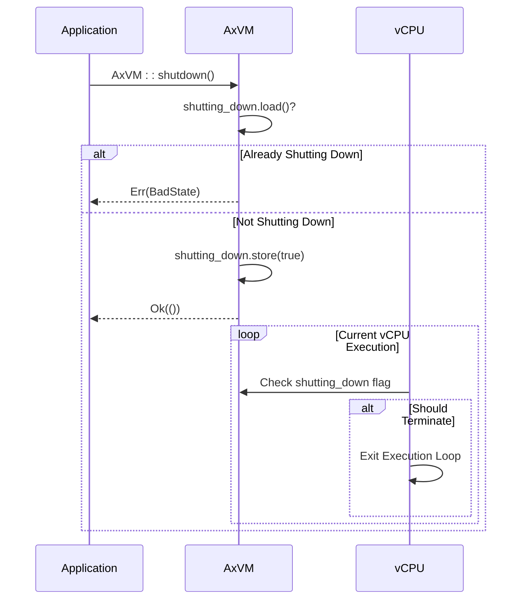

# VM Lifecycle Management

<cite>
**Referenced Files in This Document**
- [vm.rs](file://src/vm.rs)
- [vcpu.rs](file://src/vcpu.rs)
- [config.rs](file://src/config.rs)
- [lib.rs](file://src/lib.rs)
- [Cargo.toml](file://Cargo.toml)
- [README.md](file://README.md)
</cite>

## Table of Contents
1. [Introduction](#introduction)
2. [VM Lifecycle Overview](#vm-lifecycle-overview)
3. [VM Creation with AxVM::new()](#vm-creation-with-axvmnew)
4. [Booting the VM with AxVM::boot()](#booting-the-vm-with-axvmboot)
5. [Running State and run_vcpu() Execution Flow](#running-state-and-run_vcpu-execution-flow)
6. [Graceful Shutdown via AxVM::shutdown()](#graceful-shutdown-via-axvmshutdown)
7. [Thread Safety and Concurrency Control](#thread-safety-and-concurrency-control)
8. [Error Handling and Common Issues](#error-handling-and-common-issues)
9. [Performance Implications](#performance-implications)
10. [Conclusion](#conclusion)

## Introduction
The `AxVM` struct is central to virtual machine lifecycle management within the ArceOS hypervisor framework. It encapsulates all resources required for a guest VM, including vCPUs, memory mappings, and device configurations. This document details the complete lifecycle of an `AxVM` instance from creation through booting, execution, and shutdown. The implementation emphasizes resource isolation, thread safety, and integration with architecture-specific hypervisor components via the HAL (Hardware Abstraction Layer). The design supports multiple architectures (x86_64, aarch64, riscv64) through conditional compilation and modular dependencies.

**Section sources**
- [README.md](file://README.md#L0-L7)
- [lib.rs](file://src/lib.rs#L0-L33)

## VM Lifecycle Overview
The lifecycle of an `AxVM` instance consists of four distinct states: Created, Booted, Running, and Shutting Down. Transitions between these states are controlled by atomic flags that ensure thread-safe operations across concurrent vCPU threads. The VM begins in the *Created* state after successful initialization via `AxVM::new()`, where all resources are allocated but not yet activated. Calling `boot()` transitions the VM to the *Booted* state, enabling execution. Once running, vCPUs execute guest code until a halt condition or external shutdown request occurs. The `shutdown()` method initiates a graceful termination sequence, preventing further execution and preparing the VM for cleanup. The system currently does not support re-initialization after shutdown.



**Diagram sources**
- [vm.rs](file://src/vm.rs#L56-L57)
- [vm.rs](file://src/vm.rs#L269-L270)

**Section sources**
- [vm.rs](file://src/vm.rs#L5-L57)

## VM Creation with AxVM::new()
The `AxVM::new()` function initializes a new virtual machine instance based on the provided `AxVMConfig`. This process involves setting up vCPUs, configuring memory regions, and initializing devices. Each vCPU is created using architecture-specific configuration parameters derived from the target platform (aarch64, riscv64, x86_64). Memory regions are mapped according to their type—either identity-mapped (`MapIdentical`) or dynamically allocated (`MapAlloc`)—with appropriate access permissions. Pass-through devices are integrated into the address space with 4K-aligned boundaries, and overlapping regions are merged to optimize mapping efficiency. Emulated devices are instantiated through `AxVmDevices`, which handles both MMIO and port I/O operations. On aarch64, interrupt routing is configured based on the VM's interrupt mode, either assigning SPIs to the GIC distributor in passthrough mode or setting up virtual timers otherwise.



**Diagram sources**
- [vm.rs](file://src/vm.rs#L78-L267)

**Section sources**
- [vm.rs](file://src/vm.rs#L78-L267)
- [config.rs](file://src/config.rs#L94-L195)

## Booting the VM with AxVM::boot()
The `AxVM::boot()` method activates a previously created VM by setting the `running` atomic flag. Prior to booting, the system verifies hardware virtualization support and ensures the VM is not already running. If either check fails, an appropriate error is returned (`Unsupported` or `BadState`). Upon success, the VM transitions to the running state, allowing vCPUs to begin execution when scheduled. Notably, calling `boot()` does not immediately start instruction execution; it merely enables the capability for vCPUs to run via subsequent calls to `run_vcpu()`. This separation allows fine-grained control over when execution begins, supporting use cases such as delayed startup or coordinated multi-VM initialization.



**Diagram sources**
- [vm.rs](file://src/vm.rs#L274-L287)

**Section sources**
- [vm.rs](file://src/vm.rs#L274-L287)

## Running State and run_vcpu() Execution Flow
During the running state, vCPUs execute guest instructions through the `run_vcpu()` method. This function binds the calling physical CPU to the specified vCPU, enters the hypervisor execution loop, and handles exits due to various reasons such as MMIO accesses, I/O operations, or page faults. For each exit, the hypervisor emulates the requested operation by delegating to the appropriate device handler. For example, MMIO reads/writes are processed by `handle_mmio_read/write`, while port I/O uses `handle_port_read/write`. System register accesses are similarly intercepted and handled. Unhandled exit reasons (e.g., HLT, shutdown requests) are propagated back to the caller, allowing higher-level logic to respond appropriately. The loop continues until an unhandled exit occurs, at which point the vCPU unbinds and returns the exit reason.



**Diagram sources**
- [vm.rs](file://src/vm.rs#L318-L387)

**Section sources**
- [vm.rs](file://src/vm.rs#L318-L387)
- [vcpu.rs](file://src/vcpu.rs#L0-L30)

## Graceful Shutdown via AxVM::shutdown()
The `AxVM::shutdown()` method initiates a controlled termination of the VM by setting the `shutting_down` atomic flag. Before proceeding, it checks whether the VM is already in the shutdown phase, returning a `BadState` error if so. Once initiated, the shutdown flag prevents any new vCPU executions and signals existing ones to terminate gracefully. Although the current implementation does not enforce immediate cessation of running vCPUs, the flag serves as a coordination mechanism for higher-level shutdown logic. After shutdown, the VM cannot be rebooted, as re-initialization is not supported. Future enhancements may include suspend/resume functionality and full re-init capabilities.



**Diagram sources**
- [vm.rs](file://src/vm.rs#L290-L316)

**Section sources**
- [vm.rs](file://src/vm.rs#L290-L316)

## Thread Safety and Concurrency Control
The `AxVM` struct employs atomic booleans (`AtomicBool`) to manage shared state across threads, ensuring safe concurrent access to the `running` and `shutting_down` flags without requiring locks for read operations. The `inner_mut` field, which contains the `AddrSpace`, is protected by a `spin::Mutex`, providing exclusive access during memory mapping and unmapping operations. vCPU instances themselves are wrapped in `Arc`, enabling safe sharing across multiple execution contexts. The use of `Send` and `Sync` trait bounds on `AxVMInnerConst<U>` ensures that the VM can be safely transferred and accessed across CPU boundaries. These mechanisms collectively enable robust multithreaded operation while minimizing contention overhead.

```mermaid
classDiagram
    class AxVM {
        +running: AtomicBool
        +shutting_down: AtomicBool
        +inner_const: AxVMInnerConst~U~
        +inner_mut: AxVMInnerMut~H~
    }
    
    class AxVMInnerConst {
        +id: usize
        +config: AxVMConfig
        +vcpu_list: Box[AxVCpuRef~U~]
        +devices: AxVmDevices
    }
    
    class AxVMInnerMut {
        +address_space: Mutex~AddrSpace~
    }
    
    class AddrSpace {
        +page_table_root(): HostPhysAddr
        +map_linear()
        +unmap()
        +handle_page_fault()
    }
    
    AxVM "1" --> "1" AxVMInnerConst
    AxVM "1" --> "1" AxVMInnerMut
    AxVMInnerMut --> AddrSpace : "guarded