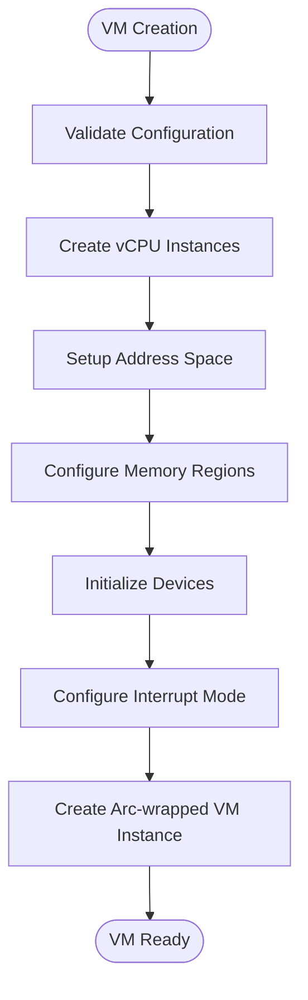
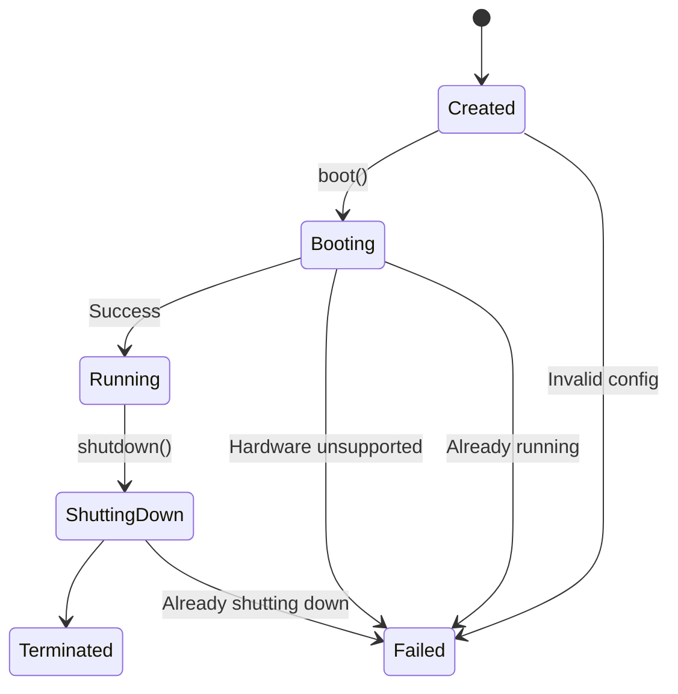
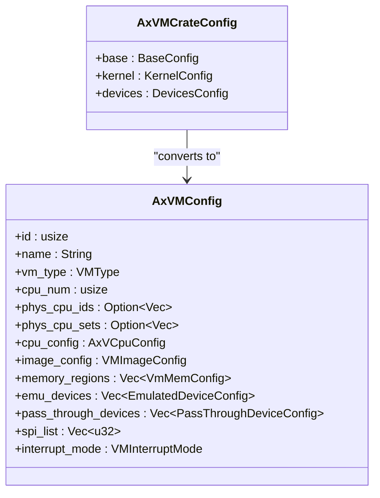
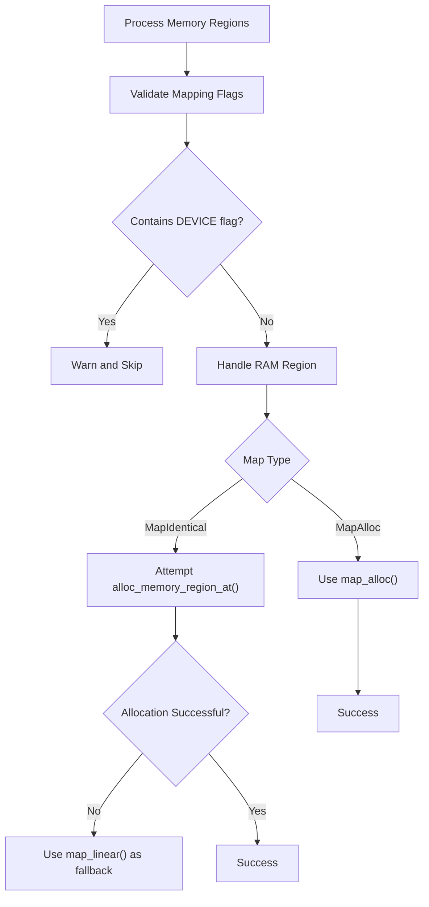
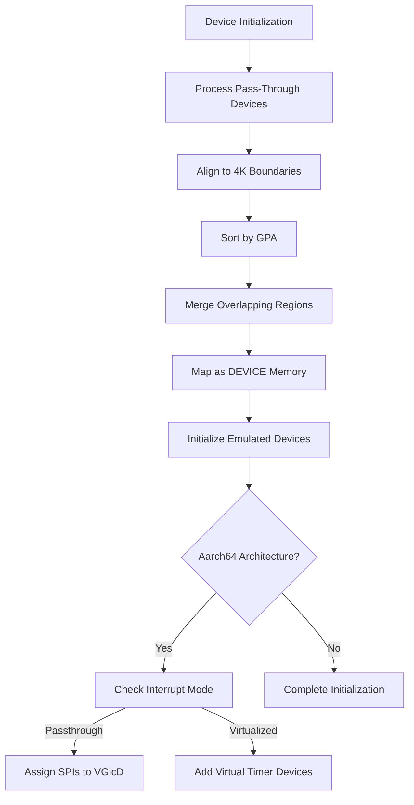
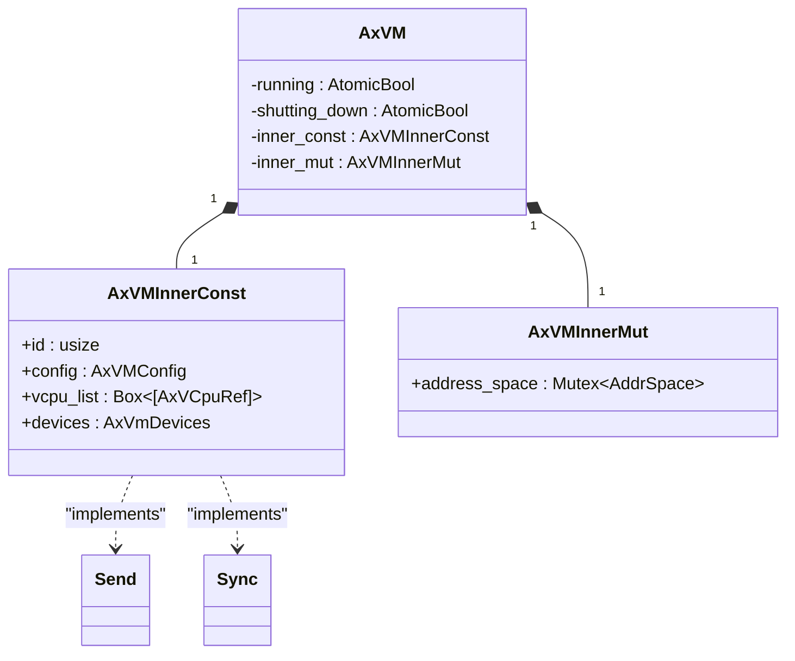

# VM Management

<cite>
**Referenced Files in This Document**   
- [vm.rs](file://src/vm.rs)
- [config.rs](file://src/config.rs)
- [vcpu.rs](file://src/vcpu.rs)
- [hal.rs](file://src/hal.rs)
</cite>

## Table of Contents
1. [Introduction](#introduction)
2. [VM Lifecycle Management](#vm-lifecycle-management)
3. [Configuration Management](#configuration-management)
4. [Memory Region Mapping](#memory-region-mapping)
5. [vCPU Provisioning and Device Attachment](#vcpu-provisioning-and-device-attachment)
6. [Internal State Tracking and Thread Safety](#internal-state-tracking-and-thread-safety)
7. [Performance Considerations](#performance-considerations)
8. [Common Issues and Debugging Strategies](#common-issues-and-debugging-strategies)

## Introduction
The AxVM crate provides virtual machine resource management capabilities for the ArceOS hypervisor variant. It manages critical VM components including vCPUs, memory, and devices through a structured lifecycle from creation to shutdown. The system is designed with architecture independence in mind, supporting multiple target architectures while maintaining a consistent interface for VM management operations.

## VM Lifecycle Management

The AxVM struct serves as the central entity for managing a virtual machine's complete lifecycle, encompassing creation, booting, running state maintenance, and graceful shutdown procedures. The lifecycle follows a strict sequence that prevents re-initialization after shutdown.

### VM Creation via AxVM::new()
VM creation begins with the `AxVM::new()` method, which takes an `AxVMConfig` parameter containing all necessary configuration details. The method performs several critical initialization steps:

1. **vCPU Initialization**: Creates vCPU instances based on the configuration's CPU count and affinity settings
2. **Address Space Setup**: Establishes an empty address space with defined base and size parameters
3. **Memory Configuration**: Processes memory regions according to their mapping types (MapIdentical or MapAlloc)
4. **Device Configuration**: Initializes both emulated and pass-through devices based on the configuration
5. **Interrupt Mode Handling**: Configures interrupt handling based on whether passthrough mode is enabled

The creation process returns an `Arc<AxVM>` reference, enabling shared ownership across different components while ensuring thread-safe access to the VM instance.

**Diagram sources**
- [vm.rs](file://src/vm.rs#L69-L283)

**Section sources**
- [vm.rs](file://src/vm.rs#L64-L283)

### Booting Process
The booting process is initiated through the `boot()` method, which transitions the VM from a configured state to an active running state. Before setting the running flag, the method performs two critical checks:

1. **Hardware Support Verification**: Confirms that the underlying hardware supports virtualization features
2. **State Validation**: Ensures the VM is not already running to prevent duplicate boot attempts

When these conditions are satisfied, the method sets the `running` atomic boolean to true, allowing vCPUs to begin execution. The boot process is logged for debugging purposes, providing visibility into VM startup sequences.

### Running State
Once booted, the VM enters its running state, which is tracked by the `running` AtomicBool field. During this phase, vCPUs can be executed using the `run_vcpu()` method, which handles various exit reasons including MMIO operations, I/O operations, system register accesses, and page faults.

The running state allows for concurrent operations while maintaining thread safety through appropriate synchronization mechanisms. The VM remains in this state until either a shutdown is requested or an unrecoverable error occurs.

### Graceful Shutdown via AxVM::shutdown()
The shutdown process is managed through the `shutdown()` method, which initiates a graceful termination of the VM. The method first verifies that the VM is not already shutting down, then sets the `shutting_down` AtomicBool to true.

A key limitation documented in the code is that the "re-init" process is not implemented, meaning a VM can only be booted once. After shutdown, the VM cannot be restarted, enforcing a single-use lifecycle pattern. This design decision simplifies state management but requires careful consideration in applications that need VM reuse.

**Diagram sources**
- [vm.rs](file://src/vm.rs#L363-L404)

**Section sources**
- [vm.rs](file://src/vm.rs#L363-L404)

## Configuration Management

### AxVMConfig Structure
The `AxVMConfig` structure serves as the primary configuration container for VM creation, encapsulating all necessary parameters for VM initialization. It is constructed from a higher-level `AxVMCrateConfig` (typically derived from a TOML configuration file) through the `From` trait implementation.

Key configuration elements include:
- **Basic Attributes**: ID, name, and VM type
- **CPU Configuration**: Number of vCPUs, physical CPU affinities, and entry points
- **Memory Configuration**: Memory regions with their mapping types and flags
- **Device Configuration**: Emulated devices and pass-through devices
- **Interrupt Configuration**: Interrupt mode (passthrough or virtualized) and SPI assignments

### Conversion from AxVMCrateConfig
The conversion from `AxVMCrateConfig` to `AxVMConfig` involves several transformation steps that adapt high-level configuration data into runtime-ready structures:

1. **ID and Name Propagation**: Direct copying of base identifiers and names
2. **VM Type Conversion**: Transforming string-based VM type specifications into enum values
3. **CPU Configuration**: Setting up BSP and AP entry points from kernel configuration
4. **Image Configuration**: Converting load addresses for kernel, BIOS, DTB, and ramdisk
5. **Device Configuration**: Transferring emulated and pass-through device configurations

This conversion process ensures that configuration data from external sources is properly validated and transformed into a format suitable for VM creation.

**Diagram sources**
- [config.rs](file://src/config.rs#L66-L103)

**Section sources**
- [config.rs](file://src/config.rs#L66-L194)

## Memory Region Mapping

### map_region/unmap_region Operations
The AxVM provides dynamic memory management capabilities through the `map_region()` and `unmap_region()` methods, allowing runtime modification of the VM's memory layout.

The `map_region()` method establishes a linear mapping between guest physical addresses (GPA) and host physical addresses (HPA) with specified size and access flags. This operation is performed on the VM's address space, which is protected by a spin mutex to ensure thread safety during concurrent access.

The `unmap_region()` method removes existing mappings for a specified GPA range, effectively deallocating that portion of the guest address space. Both operations interact with the underlying paging infrastructure through the `AddrSpace` abstraction.

### Memory Region Types
The system supports two primary memory mapping strategies:

**MapIdentical**: Creates identity mappings where guest and host physical addresses are the same. This approach attempts to allocate memory at specific addresses using the HAL's `alloc_memory_region_at()` function, falling back to standard mapping if allocation fails.

**MapAlloc**: Allocates physical memory dynamically without requiring specific address placement. This method may result in non-contiguous physical memory allocations but provides greater flexibility in memory-constrained environments.

During VM creation, memory regions are processed sequentially, with validation of mapping flags to prevent improper use of the DEVICE flag, which is reserved for pass-through devices.

**Diagram sources**
- [vm.rs](file://src/vm.rs#L108-L150)

**Section sources**
- [vm.rs](file://src/vm.rs#L489-L538)

## vCPU Provisioning and Device Attachment

### vCPU Creation and Setup
vCPU provisioning occurs during VM creation, where the system iterates through the configured number of vCPUs and creates corresponding `AxVCpuRef` instances. Each vCPU is initialized with:

- **VM and vCPU IDs**: Identifiers for the parent VM and the specific vCPU
- **Physical CPU Affinity**: Scheduling constraints specifying which physical CPUs the vCPU can run on
- **Architecture-Specific Configuration**: Parameters tailored to the target architecture (Aarch64, RISC-V, or x86_64)

After creation, vCPUs undergo setup where they are configured with entry points (BSP for vCPU 0, AP for others), the extended page table root, and architecture-specific setup parameters. For Aarch64 targets, this includes passthrough configuration for interrupts and timers.

### Device Attachment Mechanisms
The system supports two types of device attachment:

**Pass-Through Devices**: Physical devices directly exposed to the VM with minimal virtualization overhead. These are configured through the `pass_through_devices` list in the VM configuration, with their memory regions automatically aligned to 4K boundaries and overlapping regions merged for efficiency.

**Emulated Devices**: Software-implemented devices that provide functionality without requiring physical hardware. These are initialized from the `emu_devices` configuration list and managed by the `AxVmDevices` component.

For Aarch64 architecture, special handling exists for interrupt controllers (VGicD) in passthrough mode, where SPIs (Shared Peripheral Interrupts) are assigned to specific CPU IDs. In non-passthrough mode, virtual timer devices are set up to provide timing services to the guest.

**Diagram sources**
- [vm.rs](file://src/vm.rs#L190-L254)

**Section sources**
- [vm.rs](file://src/vm.rs#L190-L283)

## Internal State Tracking and Thread Safety

### Running vs Shutting Down States
The AxVM struct maintains two atomic boolean fields to track its operational state:

- **running**: Indicates whether the VM is currently active and processing work
- **shutting_down**: Signals that a shutdown has been initiated and no new operations should begin

These states are implemented using `AtomicBool` with `Relaxed` ordering, providing lightweight synchronization suitable for state tracking without the overhead of stronger memory ordering constraints. The separation of these states allows for clear distinction between normal operation and the shutdown phase.

The state management enforces important constraints:
- Prevents booting an already running VM
- Prohibits multiple concurrent shutdown attempts
- Ensures hardware virtualization support exists before booting

### Thread Safety Considerations
Thread safety is achieved through a combination of atomic operations and mutex protection:

- **Atomic State Variables**: The `running` and `shutting_down` flags use atomic operations to prevent race conditions during state transitions
- **Mutex-Protected Resources**: The address space is protected by a spin mutex (`Mutex<AddrSpace>`) to ensure exclusive access during memory operations
- **Send/Sync Implementations**: The `AxVMInnerConst` struct implements both `Send` and `Sync` traits, indicating it can be safely transferred between threads and shared across threads

The current implementation notes the potential for using more efficient locking mechanisms in the future, suggesting that the spin mutex might be optimized for better performance in high-concurrency scenarios.

**Diagram sources**
- [vm.rs](file://src/vm.rs#L43-L73)

**Section sources**
- [vm.rs](file://src/vm.rs#L43-L73)

## Performance Considerations

Several configuration choices have significant performance implications:

**Memory Mapping Strategy**: 
- `MapIdentical` provides optimal performance when memory can be allocated at desired addresses, as it enables direct physical address correspondence
- `MapAlloc` introduces potential fragmentation and may require additional page table manipulations, potentially impacting TLB efficiency

**Interrupt Mode Selection**:
- Passthrough mode offers lower latency for device interrupts but requires more complex setup and hardware support
- Virtualized mode provides better isolation but may introduce additional overhead due to interrupt virtualization

**vCPU Affinity Configuration**:
- Properly configured CPU affinities can improve cache locality and reduce context switching overhead
- Random assignment may lead to suboptimal performance due to increased cache misses

**Device Passthrough**:
- Pass-through devices minimize virtualization overhead and provide near-native performance
- Emulated devices offer greater flexibility but at the cost of performance due to software interpretation

## Common Issues and Debugging Strategies

### Failed Boots Due to Invalid Configurations
Common causes of boot failures include:
- Missing hardware virtualization support
- Attempting to boot an already running VM
- Invalid memory region configurations
- Incorrect device configurations

Debugging strategies involve checking system logs for error messages, verifying hardware capabilities, and validating configuration files against