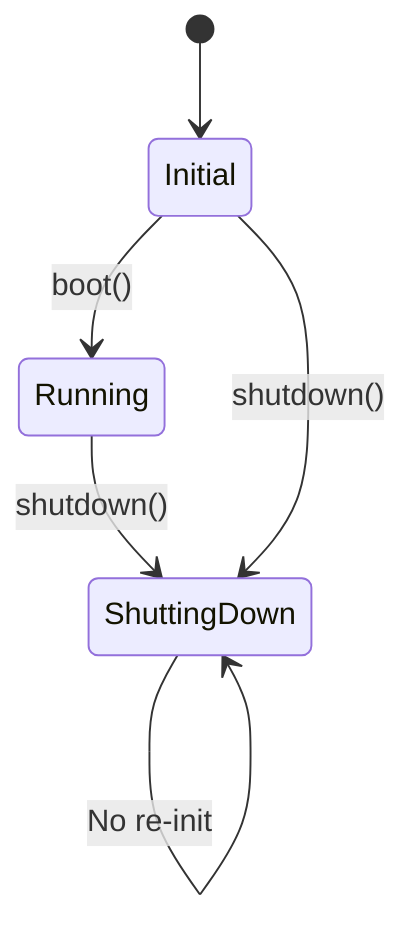
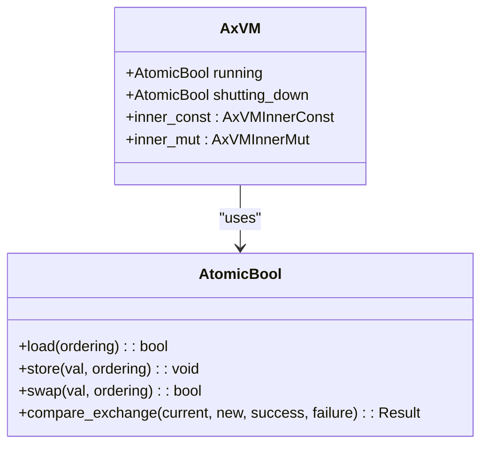
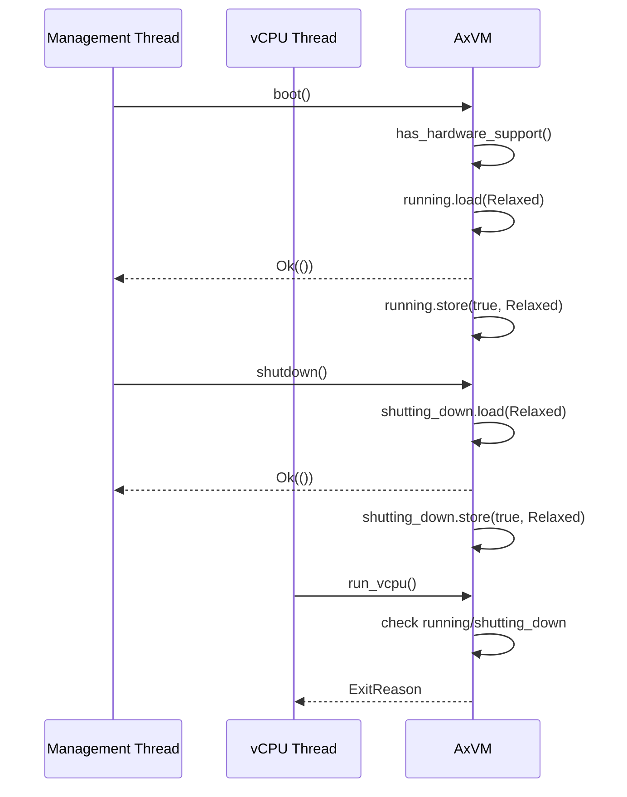
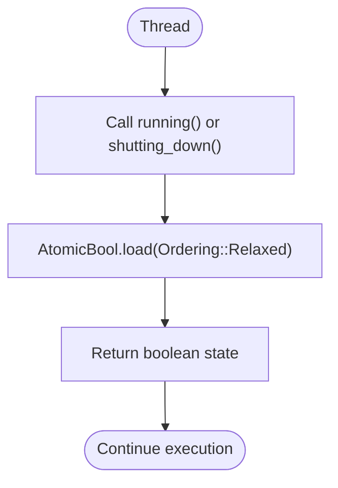
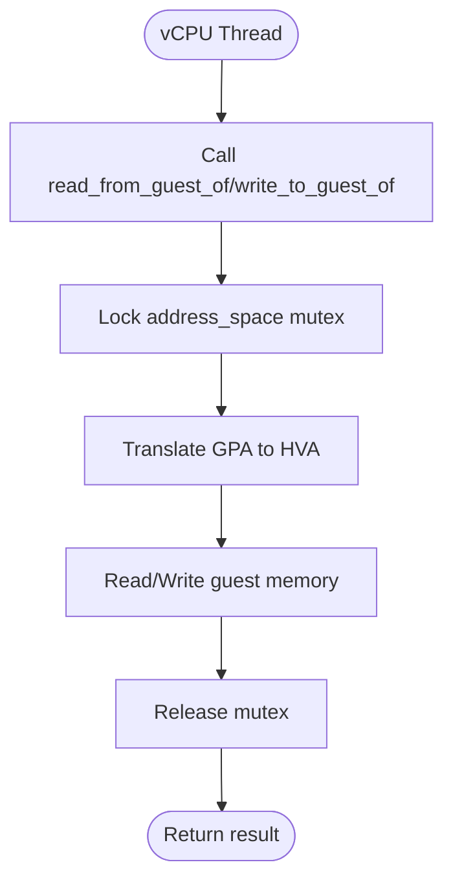
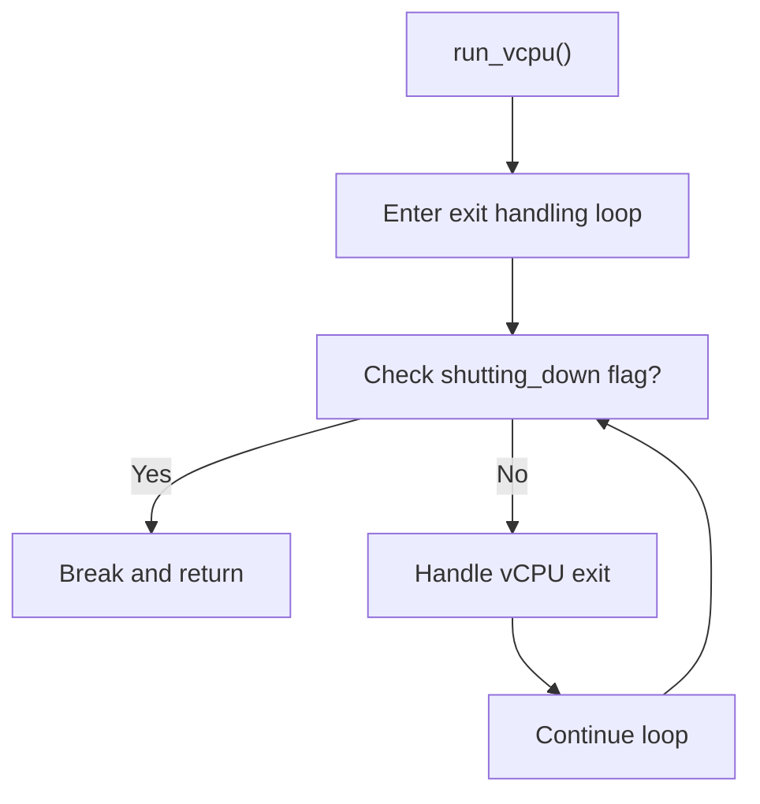

# VM State Tracking and Concurrency

<cite>
**Referenced Files in This Document**   
- [vm.rs](file://src/vm.rs)
- [hal.rs](file://src/hal.rs)
</cite>

## Table of Contents
1. [Introduction](#introduction)
2. [VM State Enumeration and Lifecycle Management](#vm-state-enumeration-and-lifecycle-management)
3. [Concurrency Control Mechanisms](#concurrency-control-mechanisms)
4. [State Transition Synchronization](#state-transition-synchronization)
5. [Thread-Safe Access Patterns](#thread-safe-access-patterns)
6. [Common Concurrency Issues and Mitigation](#common-concurrency-issues-and-mitigation)
7. [Performance Considerations](#performance-considerations)
8. [Conclusion](#conclusion)

## Introduction
The AxVM struct implements a virtual machine monitor with robust state tracking and concurrency control mechanisms. This document details the internal state management, thread safety patterns, and synchronization strategies used to coordinate vCPU operations and management interfaces in a multi-threaded environment.

## VM State Enumeration and Lifecycle Management

The AxVM struct maintains two primary atomic boolean flags to track its operational state: `running` and `shutting_down`. These states govern allowable operations and ensure proper lifecycle management.

The `running` flag indicates whether the VM is currently active and executing vCPUs. It is initialized to false during VM creation and transitioned to true only when the `boot()` method is called. The `shutting_down` flag signals that the VM has initiated shutdown procedures and prevents re-entry into running state.

These states form a simple but effective state machine:
- **Initial**: Both flags are false
- **Running**: `running` = true, `shutting_down` = false
- **Shutting Down**: `running` may be true or false, `shutting_down` = true

Once a VM enters the shutting down state, it cannot be restarted, implementing a one-time boot policy as noted in the TODO comments for future re-init implementation.



**Diagram sources**
- [vm.rs](file://src/vm.rs#L56-L57)
- [vm.rs](file://src/vm.rs#L269-L270)

**Section sources**
- [vm.rs](file://src/vm.rs#L363-L404)

## Concurrency Control Mechanisms

The AxVM implementation employs multiple concurrency control mechanisms to ensure thread-safe access across vCPU threads and management interfaces.

### Atomic State Flags
The VM uses `AtomicBool` from Rust's standard library to manage its `running` and `shutting_down` states. These atomic types provide lock-free, thread-safe operations with relaxed memory ordering:



**Diagram sources**
- [vm.rs](file://src/vm.rs#L56-L57)
- [vm.rs](file://src/vm.rs#L5-L6)

### Interior Mutability with Spin Locks
For mutable state that requires exclusive access, AxVM uses interior mutability patterns with spin locks. The `address_space` field in `AxVMInnerMut` is protected by a `spin::Mutex`, allowing safe mutation through shared references:

```mermaid
classDiagram
class AxVMInnerMut {
+Mutex<AddrSpace> address_space
+_marker : PhantomData
}
class Mutex<T> {
+lock() : &mut T
+try_lock() : Option<&mut T>
}
class AddrSpace {
+map_linear()
+unmap()
+handle_page_fault()
+translated_byte_buffer()
}
AxVMInnerMut --> Mutex : "contains"
Mutex --> AddrSpace : "guards"
```

**Diagram sources**
- [vm.rs](file://src/vm.rs#L48)
- [vm.rs](file://src/vm.rs#L9)

The comment "// Todo: use more efficient lock" suggests awareness of potential performance bottlenecks with this approach, indicating consideration for future optimization.

**Section sources**
- [vm.rs](file://src/vm.rs#L43-L73)

## State Transition Synchronization

Critical operations like booting and shutdown are synchronized through atomic state checks and updates, ensuring consistent state transitions.

### Boot Operation
The `boot()` method follows a strict sequence:
1. Verify hardware virtualization support
2. Check current state via `running()` accessor
3. Atomically update `running` flag if not already running

This prevents race conditions where multiple threads might attempt to boot the same VM simultaneously.

### Shutdown Operation
The `shutdown()` method implements similar safeguards:
1. Check `shutting_down()` status
2. Atomically set `shutting_down` flag if not already shutting down

Both operations use `Ordering::Relaxed` for atomic operations, prioritizing performance over strict memory ordering guarantees, which is appropriate given the simple state transitions.



**Diagram sources**
- [vm.rs](file://src/vm.rs#L363-L404)
- [vm.rs](file://src/vm.rs#L403-L424)

**Section sources**
- [vm.rs](file://src/vm.rs#L363-L404)

## Thread-Safe Access Patterns

The AxVM struct implements several patterns to ensure safe concurrent access from vCPU threads and management interfaces.

### Read Operations
State queries like `running()` and `shutting_down()` use atomic loads with relaxed ordering, allowing efficient read-only access without blocking:



### Write Operations
State modifications occur only through controlled methods (`boot`, `shutdown`) that perform validation before atomic updates.

### Data Access Synchronization
Memory operations like `read_from_guest_of` and `write_to_guest_of` acquire the address space mutex, ensuring exclusive access during translation and buffer operations:



**Diagram sources**
- [vm.rs](file://src/vm.rs#L48)
- [vm.rs](file://src/vm.rs#L549-L582)

**Section sources**
- [vm.rs](file://src/vm.rs#L549-L615)

## Common Concurrency Issues and Mitigation

### Deadlock Prevention During Shutdown
The current implementation avoids deadlocks during shutdown by using non-blocking atomic flags rather than complex locking hierarchies. However, the `run_vcpu` loop could potentially block shutdown if handling many consecutive intercepted operations.

Mitigation strategy: The shutdown flag is checked at the beginning of each vCPU exit handling cycle, allowing graceful termination:



### Race Condition Prevention
Race conditions in state checks are prevented through atomic operations and careful method design:
- Double-check pattern in `boot()` and `shutdown()`
- Atomic load-before-store semantics
- Single-writer principle for state flags

The use of `Arc<AxVM>` ensures that all threads operate on the same VM instance, preventing reference-counting related races.

**Section sources**
- [vm.rs](file://src/vm.rs#L363-L404)
- [vm.rs](file://src/vm.rs#L489-L538)

## Performance Considerations

### Lock Granularity
The current implementation uses coarse-grained locking with a single mutex protecting the entire address space. While simple, this could become a bottleneck under high vCPU loads where multiple vCPUs frequently trigger page faults or access guest memory.

The comment "// Todo: use more efficient lock" acknowledges this limitation and suggests potential improvements such as:
- Fine-grained locking per memory region
- Reader-writer locks for read-heavy workloads
- Lock-free data structures for specific operations

### Scalability Under High vCPU Loads
With TEMP_MAX_VCPU_NUM set to 64, the system supports substantial parallelism. However, the global address space mutex represents a potential scalability bottleneck.

Performance characteristics:
- **State checks**: O(1), lock-free (atomic operations)
- **Memory operations**: O(n) where n is number of memory segments, with mutex contention
- **vCPU execution**: Minimal overhead in fast path, higher overhead during exits

The use of `Relaxed` memory ordering optimizes performance for state checks at the cost of weaker consistency guarantees, which is acceptable given the simple state machine.

**Section sources**
- [vm.rs](file://src/vm.rs#L48)
- [vm.rs](file://src/vm.rs#L43)

## Conclusion
The Ax