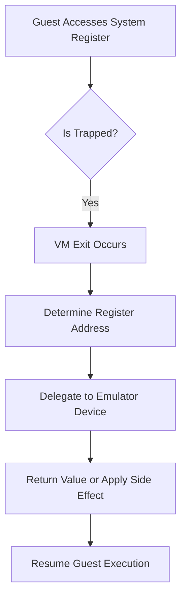

# Architecture-Specific vCPU Implementations

<cite>
**Referenced Files in This Document**   
- [vcpu.rs](file://src/vcpu.rs)
- [vm.rs](file://src/vm.rs)
- [Cargo.toml](file://Cargo.toml)
</cite>

## Table of Contents
1. [Introduction](#introduction)
2. [Architecture Abstraction through Conditional Compilation](#architecture-abstraction-through-conditional-compilation)
3. [Trait-Based Interface: AxArchVCpuImpl](#trait-based-interface-axarchvcpuimpl)
4. [Backend Comparison: x86_64, RISC-V, AArch64](#backend-comparison-x86_64-risc-v-aarch64)
5. [VM Entry/Exit Procedures](#vm-entryexit-procedures)
6. [Register State Management](#register-state-management)
7. [System Register Access Patterns](#system-register-access-patterns)
8. [Implementation Examples](#implementation-examples)
9. [Cross-Platform Consistency Challenges](#cross-platform-consistency-challenges)
10. [Adding Support for New Architectures](#adding-support-for-new-architectures)
11. [External Crate Dependencies](#external-crate-dependencies)

## Introduction
This document provides a comprehensive analysis of architecture-specific virtual CPU (vCPU) implementations within the `axvm` hypervisor framework. The system leverages conditional compilation and trait abstraction to support multiple architectures—x86_64, RISC-V, and AArch64—through a unified interface. By abstracting low-level hardware differences behind the `AxArchVCpuImpl` trait, the framework enables consistent vCPU management while allowing each backend to implement architecture-specific behaviors such as VM entry/exit, register state handling, and system register access.

The design emphasizes modularity and extensibility, relying on external crates (`x86_vcpu`, `riscv_vcpu`, `arm_vcpu`) to encapsulate architecture-dependent logic. This approach allows the core VMM logic to remain portable and maintainable across platforms.

**Section sources**
- [vcpu.rs](file://src/vcpu.rs#L0-L29)
- [vm.rs](file://src/vm.rs#L0-L44)

## Architecture Abstraction through Conditional Compilation
The `axvm` crate uses Rust's `cfg_if!` macro to conditionally compile architecture-specific code based on the target platform. This mechanism ensures that only the relevant backend is included during compilation, reducing binary size and avoiding unnecessary dependencies.

In `vcpu.rs`, the conditional block selects one of three possible implementations:
- For `x86_64`: Uses `x86_vcpu::VmxArchVCpu`
- For `riscv64`: Uses `riscv_vcpu::RISCVVCpu`
- For `aarch64`: Uses `arm_vcpu::Aarch64VCpu`

Each selected type is aliased to `AxArchVCpuImpl`, providing a single, consistent name for downstream code regardless of the underlying architecture. Similarly, per-CPU state types and configuration structures are re-exported under standardized names like `AxVMArchPerCpuImpl` and `AxVCpuCreateConfig`.

This abstraction enables higher-level components such as `AxVM` to interact with vCPUs without knowledge of architectural specifics.

**Section sources**
- [vcpu.rs](file://src/vcpu.rs#L0-L29)

## Trait-Based Interface: AxArchVCpuImpl
The `AxArchVCpuImpl` trait serves as the primary interface between the generic VMM logic and architecture-specific backends. Although not explicitly defined in the current codebase, it is implied by the usage pattern: each concrete vCPU type (e.g., `VmxArchVCpu`, `RISCVVCpu`, `Aarch64VCpu`) must conform to the expectations of the `axvcpu::AxVCpu` wrapper.

Key methods expected from this interface include:
- `run()`: Enters guest mode and executes until an exit condition occurs.
- `setup(entry: GuestPhysAddr, ept_root: HostPhysAddr, config: SetupConfig)`: Initializes the vCPU with entry point and virtualization settings.
- `handle_exit()`: Processes reasons for VM exits and performs necessary emulation or forwarding.
- `inject_interrupt(irq: usize)`: Injects an interrupt into the guest vCPU.

By adhering to this contract, all backends can be managed uniformly via the `AxVCpu<AxArchVCpuImpl<U>>` type alias, which wraps the architecture-specific implementation in a generic container.

**Section sources**
- [vcpu.rs](file://src/vcpu.rs#L0-L29)
- [vm.rs](file://src/vm.rs#L0-L44)

## Backend Comparison: x86_64, RISC-V, AArch64
While all three architectures provide similar functionality at the API level, their underlying mechanisms differ significantly due to distinct virtualization models.

| Feature | x86_64 (Intel VT-x) | RISC-V (H-extension) | AArch64 (ARM Virtualization Host Extensions) |
|-------|---------------------|----------------------|---------------------------------------------|
| **Virtualization Model** | Ring-based privilege separation with VMX root/non-root modes | Hypervisor extension (H) enabling VS-mode guests | EL2-based trap-and-emulate model |
| **VM Entry Instruction** | `VMLAUNCH` / `VMRESUME` | `HVRET` | `ERET` from EL2 |
| **Exit Cause Representation** | VM Exit Reason Code (32-bit) | `hstatus`, `htval`, `hcause` registers | ESR_EL2 syndrome register |
| **Configuration Structure** | `AxVCpuCreateConfig = ()` (no config needed) | `RISCVVCpuCreateConfig` with hart_id and dtb_addr | `Aarch64VCpuCreateConfig` with mpidr_el1 and dtb_addr |
| **Setup Configuration** | Default setup used | Default setup used | Custom `AxVCpuSetupConfig` for passthrough control |

These differences are abstracted through the use of associated types and conditional configuration logic in the `AxVM::new()` function.

**Section sources**
- [vcpu.rs](file://src/vcpu.rs#L0-L29)
- [vm.rs](file://src/vm.rs#L69-L106)

## VM Entry/Exit Procedures
VM entry and exit procedures are central to virtualization performance and correctness. Each architecture implements these operations differently:

### x86_64
Uses Intel's VMX instructions (`VMLAUNCH`/`VMRESUME`) to enter guest mode. Exits occur due to events configured in VMCS fields (e.g., CR accesses, I/O instructions). The exit reason is stored in a 32-bit field decoded by the VMM.

### RISC-V
Relies on the H-extension to trap guest execution at HS-mode. The `HVRET` instruction transfers control to the guest, and exits are triggered by privileged instructions or interrupts, recorded in `hcause`.

### AArch64
Employs Exception Level 2 (EL2) as the hypervisor level. The `ERET` instruction returns to the guest at EL1, and exits are captured via exceptions routed to EL2. The `ESR_EL2` register contains detailed fault information.

Despite these differences, the `run()` method presents a uniform interface across all platforms, returning an `AxVCpuExitReason` enum that standardizes exit handling.

**Section sources**
- [vm.rs](file://src/vm.rs#L403-L487)

## Register State Management
Register state preservation and restoration are critical during VM transitions. Each backend manages its own register context:

- **x86_64**: Saves general-purpose registers, segment selectors, control registers (CR0, CR3, CR4), and MSRs using VMCS fields.
- **RISC-V**: Maintains GPRs, FPRs, CSR values (e.g., `sstatus`, `sepc`, `stvec`), and floating-point state.
- **AArch64**: Preserves X0-X30, SP, PC, PSTATE, and system registers accessible from EL1.

The `AxVMArchPerCpuImpl` type alias refers to architecture-specific per-CPU state containers (`VmxArchPerCpuState`, `RISCVPerCpu`, `Aarch64PerCpu`). These structures hold the complete vCPU context required for migration and scheduling.

Guest register modifications (e.g., after MMIO reads) are handled via `set_gpr(reg, value)` calls within the exit handler loop.

**Section sources**
- [vcpu.rs](file://src/vcpu.rs#L0-L29)
- [vm.rs](file://src/vm.rs#L424-L450)

## System Register Access Patterns
System register access varies widely between architectures:

- **x86_64**: Uses VM-execution controls to trap specific MSR accesses (RDMSR/WRMSR).
- **RISC-V**: Traps CSR accesses via `vsatp`, `vsscratch`, etc., controlled by `hedeleg` and `hideleg`.
- **AArch64**: Routes system register accesses to EL2 via trapping configurations in `HCR_EL2`.

In the `axvm` framework, system register accesses generate `AxVCpuExitReason::SysRegRead` or `SysRegWrite`. These are handled by delegating to device emulators via `handle_sys_reg_read/write()` in `AxVmDevices`. For AArch64, additional setup may involve configuring virtual timer devices when not in passthrough mode.



**Diagram sources**
- [vm.rs](file://src/vm.rs#L452-L487)
- [vcpu.rs](file://src/vcpu.rs#L0-L29)

**Section sources**
- [vm.rs](file://src/vm.rs#L452-L487)

## Implementation Examples
Key functions are implemented consistently across backends but adapted to architectural needs.

### run()
Invoked via `AxVM::run_vcpu(vcpu_id)`, this method binds the vCPU to the current physical CPU, then enters a loop calling `vcpu.run()?`. The result is an `AxVCpuExitReason`, which is processed in a match block.

Example flow:
```rust
let exit_reason = vcpu.run()?;
match exit_reason {
    AxVCpuExitReason::MmioRead { addr, reg, .. } => {
        let val = self.get_devices().handle_mmio_read(addr, width)?;
        vcpu.set_gpr(reg, val);
    }
    AxVCpuExitReason::NestedPageFault { addr, access_flags } => {
        self.inner_mut.address_space.lock().handle_page_fault(addr, access_flags)
    }
    _ => break exit_reason,
}
```

### handle_exit()
Handled implicitly through the exit reason matching logic in `run_vcpu`. Specific exit types (MMIO, I/O, sysreg) are intercepted and emulated; unhandled exits propagate upward.

### Interrupt Injection
Implemented via `AxVM::inject_interrupt_to_vcpu(targets, irq)`, which delegates to `H::inject_irq_to_vcpu(vm_id, vcpu_id, irq)` from the `AxVMHal` trait. This allows OS-specific routing logic (e.g., finding the correct pCPU).

**Section sources**
- [vm.rs](file://src/vm.rs#L403-L487)

## Cross-Platform Consistency Challenges
Maintaining consistency across architectures presents several challenges:

1. **Divergent Exception Models**: Exit reasons vary in encoding and granularity (e.g., x86’s flat reason codes vs. AArch64’s syndrome register).
2. **Timing and Synchronization**: Differences in memory ordering and interrupt delivery require careful coordination.
3. **Device Emulation Complexity**: Uniform handling of MMIO, I/O ports, and system registers demands abstraction layers that may hide performance opportunities.
4. **Configuration Drift**: Optional features (e.g., 4-level EPT on ARM) require feature-gated code paths.

To mitigate these issues, the framework relies heavily on trait boundaries and conditional compilation, ensuring that only valid configurations are compiled per target.

**Section sources**
- [vm.rs](file://src/vm.rs#L403-L487)
- [Cargo.toml](file://Cargo.toml#L20-L39)

## Adding Support for New Architectures
To add support for a new architecture:

1. Create a new backend crate implementing the `AxArchVCpu` interface (e.g., `myarch_vcpu`).
2. Define the required types: `MyArchVCpu`, `MyArchPerCpu`, `MyVCpuCreateConfig`, optionally `MyVCpuSetupConfig`.
3. Implement `has_hardware_support()` to detect virtualization capabilities.
4. Update `axvm/Cargo.toml` with a new target dependency:
   ```toml
   [target.'cfg(target_arch = "myarch")'.dependencies]
   myarch_vcpu = "0.1"
   ```
5. Extend the `cfg_if!` block in `vcpu.rs`:
   ```rust
   else if #[cfg(target_arch = "myarch")] {
       pub use myarch_vcpu::MyArchVCpu as AxArchVCpuImpl;
       pub use myarch_vcpu::MyArchPerCpu as AxVMArchPerCpuImpl;
       pub use myarch_vcpu::MyVCpuCreateConfig as AxVCpuCreateConfig;
       pub use myarch_vcpu::has_hardware_support;
   }
   ```
6. Implement any architecture-specific setup logic in `AxVM::new()` using `#[cfg(target_arch = "myarch")]`.

Ensure all public interfaces align with existing patterns to minimize disruption to higher-level code.

**Section sources**
- [vcpu.rs](file://src/vcpu.rs#L0-L29)
- [Cargo.toml](file://Cargo.toml#L20-L39)

## External Crate Dependencies
The `axvm` crate depends on architecture-specific external crates to implement low-level virtualization features:

- **x86_vcpu**: Provides VT-x support for x86_64, including VMCS management and VM entry/exit handling.
- **riscv_vcpu**: Implements RISC-V H-extension based virtualization, managing HS-level traps and guest state.
- **arm_vcpu**: Supports AArch64 virtualization extensions, including EL2 control and stage-2 translation.
- **arm_vgic**: Manages virtual GIC (Generic Interrupt Controller) for AArch64, particularly `get_sysreg_device` for timer emulation.

These crates are conditionally compiled based on the target architecture, minimizing bloat and ensuring clean separation of concerns.

Additionally, shared dependencies like `axvcpu`, `axaddrspace`, and `axdevice` provide cross-platform services such as vCPU lifecycle management, address space abstraction, and device emulation.

**Section sources**
- [Cargo.toml](file://Cargo.toml#L20-L39)
- [vcpu.rs](file://src/vcpu.rs#L0-L29)