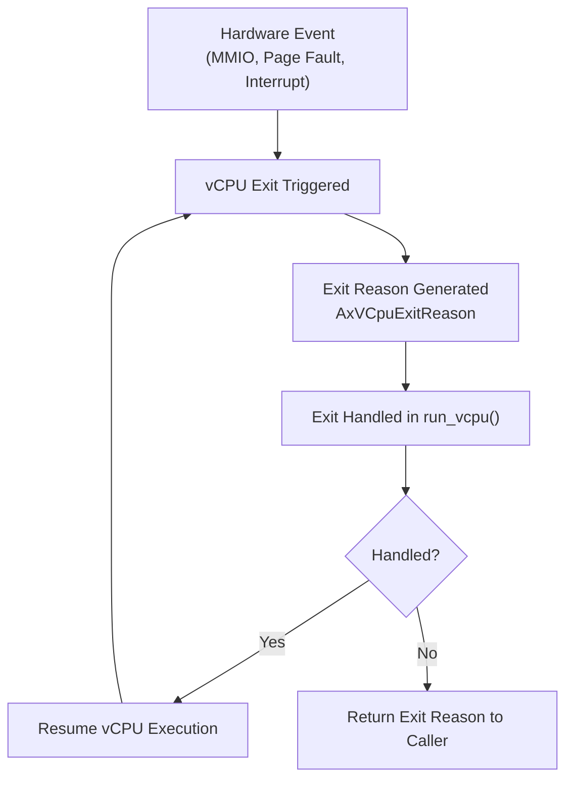
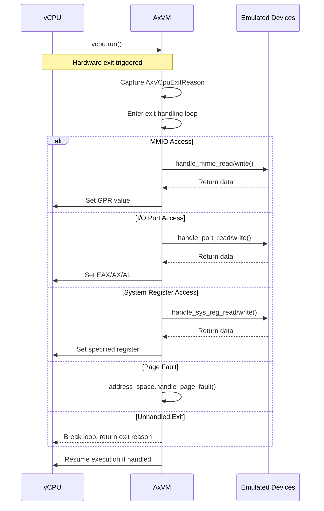
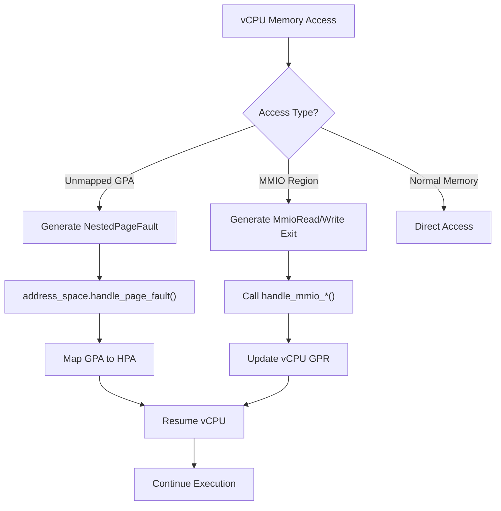

# Exit Handling and Reason Processing

<cite>
**Referenced Files in This Document**   
- [vm.rs](file://src/vm.rs)
- [vcpu.rs](file://src/vcpu.rs)
- [config.rs](file://src/config.rs)
- [hal.rs](file://src/hal.rs)
</cite>

## Table of Contents
1. [Introduction](#introduction)
2. [VCPU Exit Mechanisms Overview](#vcpu-exit-mechanisms-overview)
3. [AxVCpuExitReason Enumeration](#axvcpuexitreason-enumeration)
4. [Exit Propagation and Dispatch Logic](#exit-propagation-and-dispatch-logic)
5. [Architecture-Specific Exit Handling](#architecture-specific-exit-handling)
6. [Memory Access Emulation and Page Faults](#memory-access-emulation-and-page-faults)
7. [Device I/O Interception](#device-io-interception)
8. [Interrupt Injection and Handling](#interrupt-injection-and-handling)
9. [Debugging Exit Issues](#debugging-exit-issues)
10. [Extending Exit Handlers](#extending-exit-handlers)

## Introduction
This document provides comprehensive analysis of vCPU exit handling mechanisms in the AxVM virtualization framework. It details how hardware-generated exits are captured, processed, and dispatched through the execution stack to appropriate handlers based on the AxVCpuExitReason enumeration. The documentation covers the complete lifecycle of exit events from their generation by hardware components such as MMIO access, page faults, and interrupts, through their propagation and handling within the VM architecture.

**Section sources**
- [vm.rs](file://src/vm.rs#L0-L627)
- [vcpu.rs](file://src/vcpu.rs#L0-L30)

## VCPU Exit Mechanisms Overview
The AxVM framework implements a robust vCPU exit handling system that captures various hardware events and routes them to appropriate handlers. When a vCPU encounters an event requiring hypervisor intervention, it triggers an exit that transfers control back to the VM monitor. This mechanism enables the hypervisor to emulate device behavior, handle memory management operations, and manage interrupt delivery.

The exit process begins when the underlying hardware (via architecture-specific extensions like Intel VT-x, AMD-V, or ARM Virtualization Extensions) detects conditions that require hypervisor attention. These conditions include memory access violations, privileged instruction execution, device I/O operations, and interrupt delivery. The hardware saves the vCPU state and transitions control to the hypervisor's exit handler.

**Diagram sources**
- [vm.rs](file://src/vm.rs#L424-L487)

**Section sources**
- [vm.rs](file://src/vm.rs#L424-L487)
- [vcpu.rs](file://src/vcpu.rs#L0-L30)

## AxVCpuExitReason Enumeration
The AxVCpuExitReason enumeration defines the various types of exits that can occur during vCPU execution. Each variant represents a specific condition that requires hypervisor intervention. The enumeration serves as the primary mechanism for communicating the nature of the exit from the architecture-specific vCPU implementation to the VM-level dispatch logic.

Key exit reason variants include:
- MmioRead/MmioWrite: Memory-mapped I/O access
- IoRead/IoWrite: Port I/O operations
- SysRegRead/SysRegWrite: System register access
- NestedPageFault: Memory management unit violations
- Other architecture-specific exit conditions

These exit reasons are generated by the underlying hardware virtualization extensions and translated into the AxVCpuExitReason type by the architecture-specific vCPU implementations. The uniform enumeration allows the VM layer to handle exits consistently across different architectures while still providing detailed information about the specific cause.

**Section sources**
- [vm.rs](file://src/vm.rs#L430-L477)
- [vcpu.rs](file://src/vcpu.rs#L0-L30)

## Exit Propagation and Dispatch Logic
The core exit dispatch logic resides in the `run_vcpu` method of the AxVM structure, which implements a loop that continuously executes the vCPU and handles any resulting exits. When an exit occurs, the reason is matched against various patterns to determine the appropriate handling strategy.

**Diagram sources**
- [vm.rs](file://src/vm.rs#L424-L487)

**Section sources**
- [vm.rs](file://src/vm.rs#L424-L487)

## Architecture-Specific Exit Handling
The AxVM framework supports multiple architectures through conditional compilation and architecture-specific implementations. The vcpu.rs file contains architecture-dependent code that abstracts the differences between x86_64, RISC-V, and AArch64 virtualization features.

For x86_64 targets, the framework uses VMX (Virtual Machine Extensions) with the VmxArchVCpu implementation. RISC-V systems utilize the RISCVVCpu implementation, while AArch64 platforms employ Aarch64VCpu. Despite these architectural differences, the framework presents a unified interface through the AxArchVCpuImpl type alias, allowing the VM layer to interact with vCPUs consistently regardless of the underlying architecture.

The architecture-specific implementations are responsible for:
- Initializing virtualization extensions
- Setting up vCPU state
- Handling architecture-specific exit reasons
- Providing low-level access to virtualization controls

**Section sources**
- [vcpu.rs](file://src/vcpu.rs#L0-L30)
- [vm.rs](file://src/vm.rs#L69-L73)

## Memory Access Emulation and Page Faults
Memory access emulation is a critical component of the exit handling system, particularly for handling MMIO operations and page faults. When a vCPU accesses memory-mapped I/O regions, the hardware generates an exit that is captured and processed by the MMIO handlers.

For MMIO reads and writes, the framework delegates to the emulated devices system via the handle_mmio_read and handle_mmio_write methods. The retrieved or computed values are then written back to the appropriate general-purpose register in the vCPU state.

Page fault handling is implemented through the NestedPageFault variant, which triggers the address space's handle_page_fault method. This allows the VM to resolve guest physical address translations and manage the two-stage address translation required for nested virtualization scenarios.

**Diagram sources**
- [vm.rs](file://src/vm.rs#L430-L445)
- [vm.rs](file://src/vm.rs#L477-L487)

**Section sources**
- [vm.rs](file://src/vm.rs#L430-L445)
- [vm.rs](file://src/vm.rs#L477-L487)

## Device I/O Interception
Device I/O interception enables the VM to emulate hardware devices by trapping and processing I/O operations. The framework supports both memory-mapped I/O (MMIO) and port-based I/O operations, each with dedicated exit reasons and handling mechanisms.

MMIO operations are intercepted when the vCPU accesses regions designated as device memory in the VM configuration. These accesses generate MmioRead or MmioWrite exits, which are handled by querying the emulated devices system. The result is typically stored in a general-purpose register specified in the exit reason.

Port I/O operations use the traditional x86-style IN/OUT instructions and generate IoRead or IoWrite exits. Currently, the framework assumes the result should be placed in the EAX/AX/AL register (register 0), though this may need refinement to properly handle different access widths.

The device emulation system is extensible, allowing new device models to be added by implementing the appropriate handler interfaces and registering them with the VM's device manager.

**Section sources**
- [vm.rs](file://src/vm.rs#L443-L454)
- [vm.rs](file://src/vm.rs#L424-L450)

## Interrupt Injection and Handling
Interrupt handling in the AxVM framework involves both intercepting guest attempts to manipulate interrupt controllers and injecting interrupts from external sources. The system supports interrupt injection through the inject_interrupt_to_vcpu method, which delivers interrupts to specified vCPUs.

When a vCPU accesses system registers related to interrupt controllers, these operations generate SysRegRead or SysRegWrite exits that are handled by the emulated device system. This allows the VM to present virtualized interrupt controller interfaces to the guest operating system.

External interrupts can be injected into the VM using the inject_interrupt_to_vcpu method, which validates that the operation targets the current VM and then delegates to the HAL-provided inject_irq_to_vcpu implementation. This separation allows the underlying hypervisor or