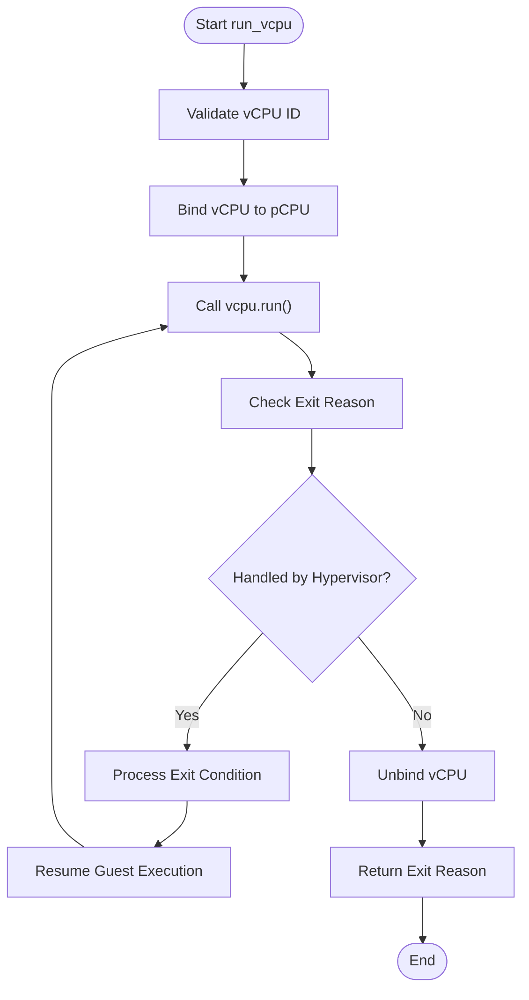
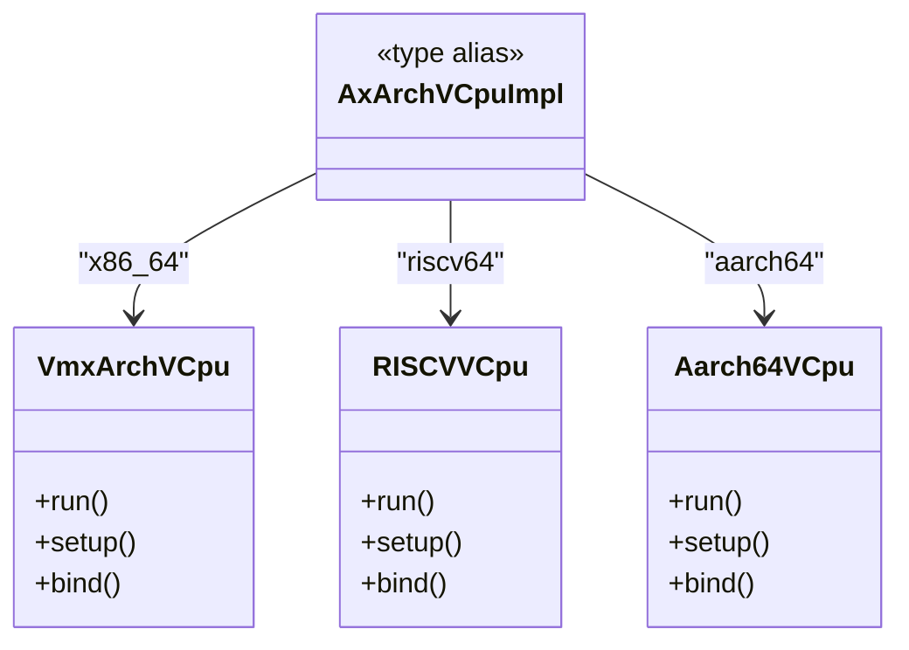
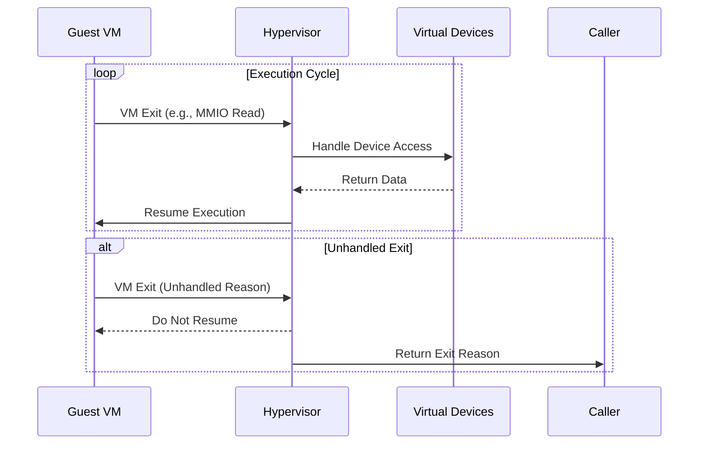

# vCPU Execution Model

<cite>
**Referenced Files in This Document**   
- [vm.rs](file://src/vm.rs)
- [vcpu.rs](file://src/vcpu.rs)
- [config.rs](file://src/config.rs)
- [hal.rs](file://src/hal.rs)
- [lib.rs](file://src/lib.rs)
</cite>

## Table of Contents
1. [Introduction](#introduction)
2. [Execution Loop Structure](#execution-loop-structure)
3. [Context Switching Mechanics](#context-switching-mechanics)
4. [Architecture-Specific Integration](#architecture-specific-integration)
5. [Host-Guest Transition Mechanisms](#host-guest-transition-mechanisms)
6. [VM Exit Resumption Logic](#vm-exit-resumption-logic)
7. [Register State Management](#register-state-management)
8. [Performance Implications](#performance-implications)
9. [Optimization Strategies](#optimization-strategies)

## Introduction
This document provides a comprehensive analysis of the vCPU execution model within the axvm hypervisor framework, focusing on the `run_vcpu()` entry point as the central mechanism for virtual CPU management. The system implements a robust virtualization layer that enables seamless execution of guest operating systems through hardware-assisted virtualization extensions. The architecture supports multiple instruction set architectures (x86_64, riscv64, and aarch64) through an abstraction layer that maintains consistent interfaces while allowing architecture-specific optimizations. The execution model is designed around a cooperative approach between the hypervisor and guest VMs, where the hypervisor manages critical resources and handles privileged operations while allowing the guest to execute most instructions directly on the physical processor.

**Section sources**
- [vm.rs](file://src/vm.rs#L0-L50)
- [lib.rs](file://src/lib.rs#L0-L10)

## Execution Loop Structure
The vCPU execution loop is implemented through the `run_vcpu()` method in the AxVM structure, which serves as the primary entry point for initiating and managing virtual CPU execution. This method follows a structured loop pattern that continuously executes guest code until a non-handled exit condition occurs. The execution begins by validating the requested vCPU ID and binding the vCPU to the current physical CPU context through the `bind()` method. Once bound, the core execution loop commences, calling the architecture-specific `run()` method to enter guest mode. When a VM exit occurs, the hypervisor examines the exit reason and processes it accordingly. For handled exits such as MMIO operations, I/O accesses, or system register interactions, the hypervisor emulates the requested operation and resumes guest execution. The loop continues until encountering an unhandled exit reason, at which point control returns to the caller with the specific exit reason. This design ensures efficient handling of frequent virtualization events while maintaining flexibility for various exit conditions.

**Diagram sources**
- [vm.rs](file://src/vm.rs#L403-L487)

**Section sources**
- [vm.rs](file://src/vm.rs#L403-L487)

## Context Switching Mechanics
Context switching in the axvm framework involves both logical and physical aspects of vCPU management. The logical context switch occurs when the hypervisor transitions control between host and guest modes, while the physical context switch relates to binding a vCPU to a specific physical CPU core. The `bind()` method establishes the physical affinity by associating the vCPU with a particular pCPU, ensuring consistent execution locality. This binding is crucial for maintaining cache efficiency and minimizing cross-core synchronization overhead. The context switch process preserves the architectural state of both the host and guest environments, allowing seamless transitions between execution modes. When a vCPU is bound, the hypervisor prepares the necessary state information, including page table references and device configurations, before initiating guest execution. The unbinding process occurs after a VM exit that cannot be handled internally, releasing the vCPU from its current physical CPU association. This mechanism enables flexible scheduling of vCPUs across available physical cores while maintaining isolation between different VM instances.

**Section sources**
- [vm.rs](file://src/vm.rs#L424-L426)
- [vm.rs](file://src/vm.rs#L487-L489)

## Architecture-Specific Integration
The integration with architecture-specific vCPU implementations is achieved through the `AxArchVCpuImpl` type alias, which resolves to different backend implementations based on the target architecture. For x86_64 systems, the implementation uses `VmxArchVCpu` from the x86_vcpu crate, leveraging Intel's VMX technology. On RISC-V platforms, `RISCVVCpu` provides support for the RISC-V H-extension virtualization features. For ARM64 systems, `Aarch64VCpu` implements the ARM virtualization extensions. This abstraction is managed through conditional compilation directives that select the appropriate implementation at compile time. The `has_hardware_support()` function checks for the presence of required virtualization capabilities on the underlying hardware before allowing VM creation. Configuration parameters are passed through architecture-specific types like `AxVCpuCreateConfig`, which contains fields relevant to each platform (e.g., MPIDR_EL1 for ARM, hart ID for RISC-V). This modular design allows the hypervisor to maintain a consistent interface while adapting to the specific requirements and capabilities of each instruction set architecture.

**Diagram sources**
- [vcpu.rs](file://src/vcpu.rs#L0-L29)

**Section sources**
- [vcpu.rs](file://src/vcpu.rs#L0-L29)
- [vm.rs](file://src/vm.rs#L14)

## Host-Guest Transition Mechanisms
The transition between host and guest execution modes relies on hardware virtualization extensions specific to each architecture. On x86_64 systems, this involves VMX instructions like VMLAUNCH and VMRESUME, which transfer control to the guest while saving the host processor state. For ARM64 platforms, the HVC (Hypervisor Call) instruction facilitates transitions between EL1 (guest) and EL2 (hypervisor) privilege levels. RISC-V systems use the SRET instruction in conjunction with hypervisor trap handling to manage mode transitions. These hardware mechanisms provide secure and efficient context switches with minimal software overhead. The hypervisor configures various control structures before initiating guest execution, including VMCS (Virtual Machine Control Structure) on x86, VTTBR on ARM, or hgatp on RISC-V, which define the guest's execution environment and intercept conditions. When a privileged operation or external interrupt occurs, the hardware automatically traps back to the hypervisor, preserving the guest's execution state and providing detailed exit information for processing.

**Section sources**
- [vcpu.rs](file://src/vcpu.rs#L29)
- [vm.rs](file://src/vm.rs#L419)

## VM Exit Resumption Logic
The resumption logic after VM exits follows a systematic approach to determine whether execution should continue or terminate. When a VM exit occurs, the hypervisor receives an `AxVCpuExitReason` that categorizes the cause of the interruption. For exits related to device emulation (MMIO reads/writes, I/O operations, system register access), the hypervisor handles the request by interacting with the appropriate virtual device and then resumes guest execution by continuing the loop. Memory management operations like nested page faults are handled by the address space manager, which resolves the fault and allows continuation. However, for exits that represent exceptional conditions or require intervention from higher-level management components, the loop breaks and returns the exit reason to the caller. This selective handling enables efficient processing of frequent virtualization events while allowing the hypervisor to delegate complex decisions to external controllers. The resumption mechanism ensures that benign operations (like device access) have minimal impact on guest performance, while significant events (such as shutdown requests) can properly terminate the execution cycle.

**Diagram sources**
- [vm.rs](file://src/vm.rs#L424-L487)

**Section sources**
- [vm.rs](file://src/vm.rs#L424-L487)

## Register State Management
Register state preservation and restoration is implicitly managed by the hardware virtualization extensions rather than explicit software operations in the hypervisor. When a VM exit occurs, the processor automatically saves the guest's architectural state according to the specific architecture's virtualization specification. On x86_64, the VMCS structure maintains copies of general-purpose registers, control registers, and segment selectors. ARM64 systems use banked registers and system registers to preserve state across exception levels. RISC-V implementations leverage the hypervisor extension's ability to automatically save and restore register state during trap handling. The hypervisor only needs to modify specific registers when emulating operations, such as writing return values to general-purpose registers after handling MMIO reads. For example, after processing an MMIO read exit, the hypervisor calls `set_gpr(reg, val)` to place the result in the appropriate register before resuming guest execution. This hardware-assisted approach minimizes the overhead of context switches and ensures atomicity of state transitions, providing both performance benefits and enhanced security through hardware-enforced isolation.

**Section sources**
- [vm.rs](file://src/vm.rs#L430-L435)
- [vm.rs](file://src/vm.rs#L459-L462)

## Performance Implications
Frequent context switches between host and guest modes introduce measurable performance overhead due to several factors. Each VM exit and entry incurs costs associated with hardware state saving and restoration, TLB invalidations, and potential cache pollution. The frequency of exits depends heavily on guest workload characteristics, with I/O-intensive applications typically generating more exits than compute-bound workloads. Memory access patterns also affect performance, as nested page table walks can add latency to memory operations. The current implementation uses a simple mutex for protecting the address space, which may become a bottleneck under high concurrency scenarios. Additionally, the lack of batching for multiple sequential exits means each event requires a full round-trip through the hypervisor, preventing optimization opportunities. The binding mechanism, while ensuring execution locality, may limit load balancing capabilities if vCPU-to-pCPU mappings are not optimized for the specific workload. These factors collectively impact the overall throughput and latency characteristics of virtualized workloads.

**Section sources**
- [vm.rs](file://src/vm.rs#L52-L53)
- [vm.rs](file://src/vm.rs#L424-L487)

## Optimization Strategies
Several strategies can minimize the overhead of vCPU execution and context switching. First, implementing exit batching would allow the hypervisor to handle multiple pending events in a single host-guest transition, reducing the number of expensive mode switches. Second, optimizing the vCPU-to-pCPU affinity settings based on workload characteristics can improve cache utilization and reduce inter-core communication. Third, replacing the current mutex with a more efficient synchronization primitive could enhance scalability in multi-vCPU scenarios. Fourth, implementing interrupt coalescing would reduce the frequency of exits caused by device interrupts. Additionally, leveraging architecture-specific features like posted interrupts (