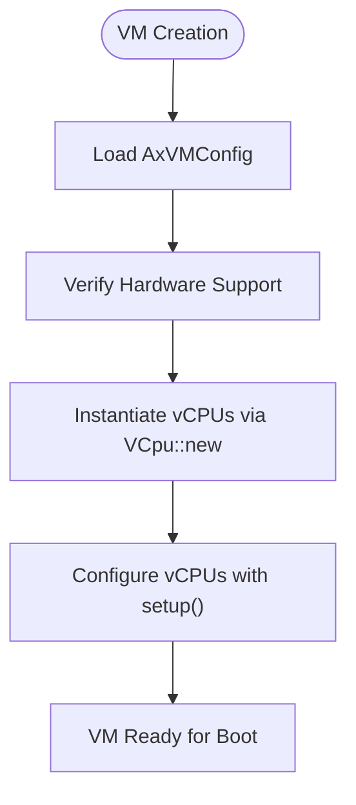
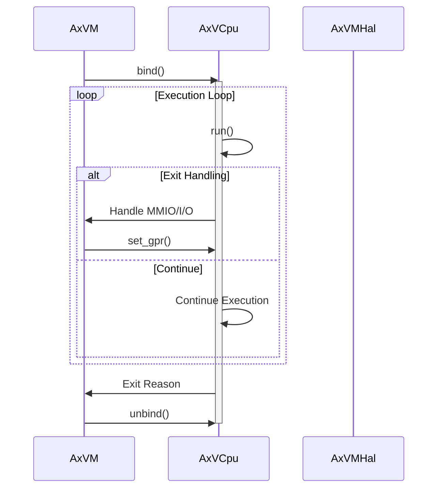
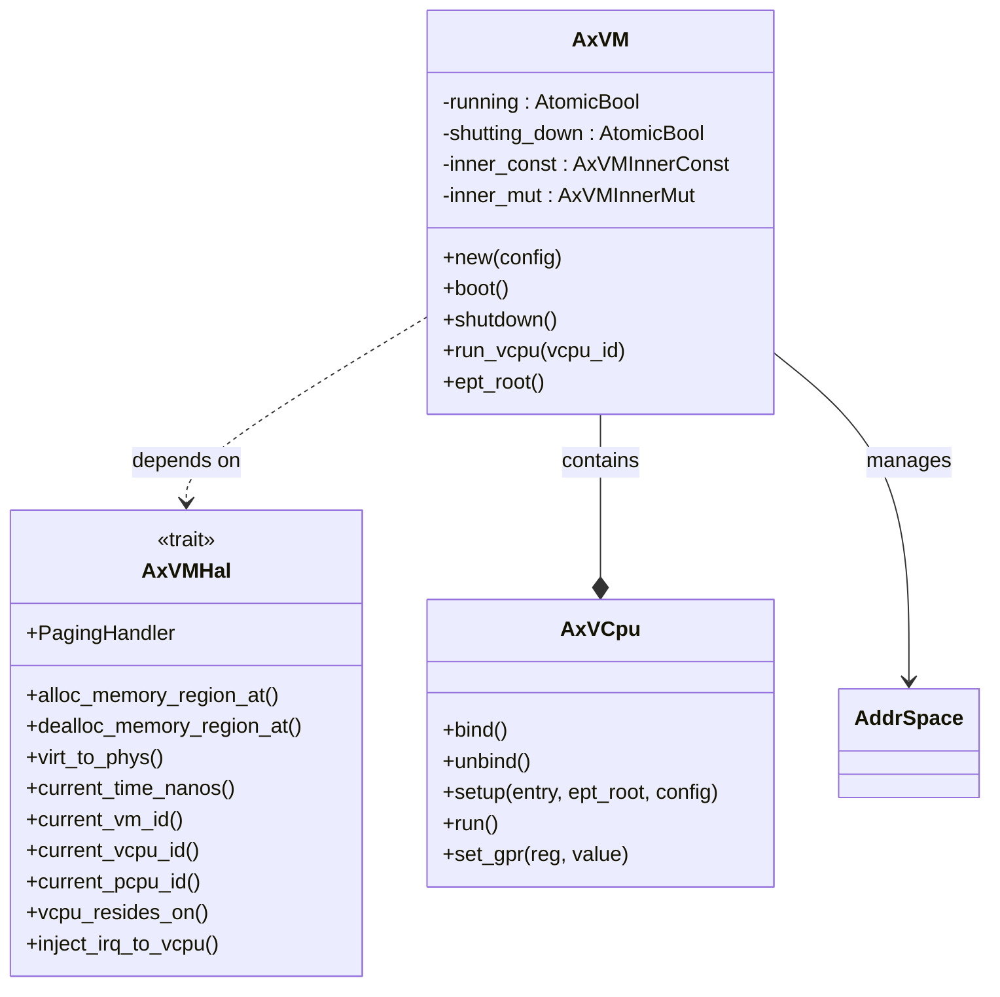

# vCPU Lifecycle Management

<cite>
**Referenced Files in This Document **   
- [vcpu.rs](file://src/vcpu.rs)
- [vm.rs](file://src/vm.rs)
- [config.rs](file://src/config.rs)
- [hal.rs](file://src/hal.rs)
</cite>

## Table of Contents
1. [Introduction](#introduction)
2. [vCPU Creation Process](#vcpu-creation-process)
3. [Reference Counting and Memory Safety](#reference-counting-and-memory-safety)
4. [vCPU Binding and Execution](#vcpu-binding-and-execution)
5. [Initialization Sequence and HAL Integration](#initialization-sequence-and-hal-integration)
6. [Teardown and Cleanup Procedures](#teardown-and-cleanup-procedures)
7. [Common Issues and Best Practices](#common-issues-and-best-practices)

## Introduction
The AxVM framework provides a robust virtual CPU (vCPU) lifecycle management system that enables secure, efficient, and architecture-independent virtualization across x86_64, RISC-V, and AArch64 platforms. This document details the complete lifecycle operations for vCPUs within the AxVM environment, including creation, binding, execution, and teardown. The design emphasizes safety through reference counting, proper resource management, and tight integration with the Hardware Abstraction Layer (HAL). Understanding these mechanisms is essential for developing reliable hypervisor applications using the ArceOS ecosystem.

## vCPU Creation Process

The vCPU creation process begins during VM instantiation via the `AxVM::new` method, which takes an `AxVMConfig` object containing all necessary configuration parameters. The framework uses architecture-specific implementations through conditional compilation (`cfg_if!`), allowing different vCPU backends (x86_vcpu, riscv_vcpu, arm_vcpu) to be selected at compile time based on the target architecture.

During VM creation, the system iterates over the configured number of vCPUs and instantiates each one using `VCpu::new`, passing architecture-specific configuration data encapsulated in `AxVCpuCreateConfig`. For AArch64, this includes MPIDR_EL1 values and DTB addresses; for RISC-V, hart IDs are specified; while x86_64 uses default configuration due to its simpler initialization requirements.

**Diagram sources **
- [vm.rs](file://src/vm.rs#L69-L106)
- [vcpu.rs](file://src/vcpu.rs#L0-L29)

**Section sources**
- [vm.rs](file://src/vm.rs#L69-L106)
- [config.rs](file://src/config.rs#L100-L134)

## Reference Counting and Memory Safety

vCPU instances are managed using atomic reference counting through the `Arc<VCpu<U>>` type alias, defined as `AxVCpuRef<U: AxVCpuHal>`. This design ensures thread-safe sharing of vCPU objects across multiple execution contexts while preventing premature deallocation. The use of `Arc` (Atomically Reference Counted) allows multiple owners of the same vCPU instance, with automatic cleanup occurring only when all references have been dropped.

This approach provides several key benefits:
- Thread safety in multi-threaded environments
- Prevention of use-after-free errors
- Automatic memory management without manual intervention
- Safe sharing between VM control plane and execution threads

The reference counting mechanism works in conjunction with Rust's ownership system to enforce memory safety guarantees at compile time, eliminating entire classes of runtime errors commonly found in virtualization systems.

**Section sources**
- [vm.rs](file://src/vm.rs#L31)
- [vm.rs](file://src/vm.rs#L254-L283)

## vCPU Binding and Execution

The binding mechanism serves as a critical synchronization point between vCPU logical state and physical CPU execution resources. When executing a vCPU through `AxVM::run_vcpu`, the system first calls `bind()` on the target vCPU instance before entering the execution loop, and subsequently calls `unbind()` after execution completes or exits.

Binding establishes the association between a virtual CPU and the underlying physical CPU core, ensuring that all architectural state modifications occur in the correct execution context. This operation is particularly important in multi-core systems where vCPUs may migrate between physical cores. The unbinding operation releases these associations, allowing other vCPUs to utilize the physical core.

**Diagram sources **
- [vm.rs](file://src/vm.rs#L424)
- [vm.rs](file://src/vm.rs#L489)

**Section sources**
- [vm.rs](file://src/vm.rs#L403-L450)
- [vm.rs](file://src/vm.rs#L489-L538)

## Initialization Sequence and HAL Integration

The vCPU initialization sequence integrates closely with both the VM configuration and the Hardware Abstraction Layer (HAL). After vCPU creation, the setup phase configures each vCPU with entry points (BSP/AP), address space mappings, and architecture-specific parameters derived from `AxVMConfig`.

The HAL interface (`AxVMHal`) plays a crucial role in this process by providing OS-dependent services such as physical memory allocation, address translation, interrupt injection, and CPU identification. Key HAL methods like `alloc_memory_region_at`, `virt_to_phys`, and `inject_irq_to_vcpu` enable the VM to interact safely with underlying hardware resources while maintaining isolation.

Address space setup occurs through the `AddrSpace` component, which manages two-stage address translation page tables. The EPT (Extended Page Tables) root is shared among all vCPUs within the VM, establishing a consistent view of guest physical memory. Device passthrough regions are specially marked with `MappingFlags::DEVICE` to ensure proper handling of memory-mapped I/O operations.

**Diagram sources **
- [vm.rs](file://src/vm.rs#L283-L330)
- [hal.rs](file://src/hal.rs#L0-L43)

**Section sources**
- [vm.rs](file://src/vm.rs#L283-L330)
- [config.rs](file://src/config.rs#L131-L168)

## Teardown and Cleanup Procedures

Proper vCPU teardown is essential for preventing resource leaks and ensuring clean VM shutdown. The AxVM framework implements a two-phase shutdown process initiated by calling `shutdown()` on the VM instance. This sets the `shutting_down` flag to prevent further operations while allowing current executions to complete gracefully.

During VM destruction, all vCPU references are automatically cleaned up due to the `Arc` wrapper. However, explicit unbinding via `unbind()` in the `run_vcpu` method ensures that any physical CPU associations are properly released before the reference count reaches zero. The current implementation does not support re-initialization after shutdown, making proper cleanup particularly important.

Critical steps in the teardown sequence include:
1. Setting the shutting_down flag
2. Completing ongoing vCPU executions
3. Unbinding all active vCPU instances
4. Releasing address space resources
5. Dropping device references
6. Finalizing reference counts

**Section sources**
- [vm.rs](file://src/vm.rs#L363-L366)
- [vm.rs](file://src/vm.rs#L617-L626)

## Common Issues and Best Practices

Several common issues can arise during vCPU lifecycle management, primarily related to improper resource handling:

**Resource Leaks**: Occur when vCPU references are not properly dropped or when unbinding fails. Always ensure that `bind()` calls are matched with corresponding `unbind()` operations, preferably using RAII patterns or guaranteed cleanup blocks.

**Premature Reference Dropping**: Can lead to use-after-free scenarios if external code retains references beyond expected lifetimes. Use `Arc