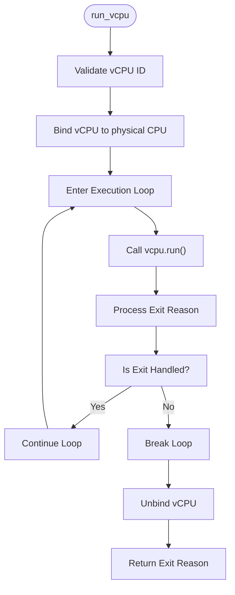
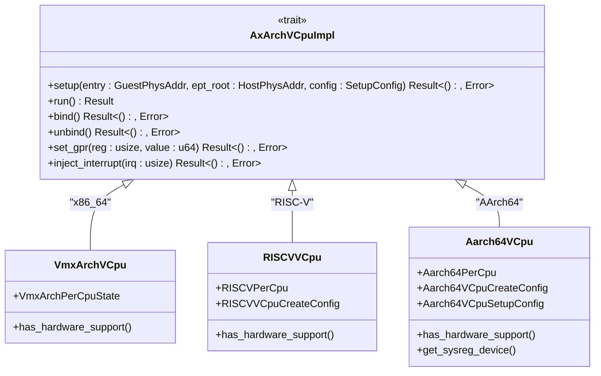
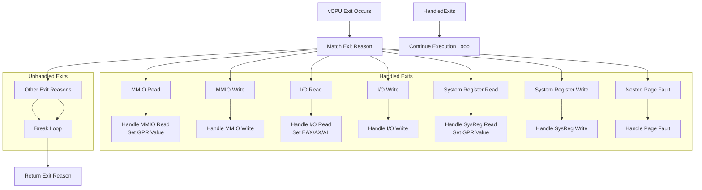

# vCPU Management

<cite>
**Referenced Files in This Document**   
- [vcpu.rs](file://src/vcpu.rs)
- [vm.rs](file://src/vm.rs)
- [config.rs](file://src/config.rs)
- [hal.rs](file://src/hal.rs)
- [lib.rs](file://src/lib.rs)
</cite>

## Table of Contents
1. [Introduction](#introduction)
2. [vCPU Creation and Configuration](#vcpu-creation-and-configuration)
3. [vCPU Execution Model](#vcpu-execution-model)
4. [Architecture-Specific Implementations](#architecture-specific-implementations)
5. [Exit Handling and Resumption Logic](#exit-handling-and-resumption-logic)
6. [Interrupt Injection Mechanisms](#interrupt-injection-mechanisms)
7. [Common Issues and Mitigation Strategies](#common-issues-and-mitigation-strategies)
8. [Performance Considerations](#performance-considerations)

## Introduction
The AxVM hypervisor provides a comprehensive framework for virtual CPU (vCPU) management, enabling efficient virtualization across multiple architectures including x86_64, RISC-V, and AArch64. This document details the vCPU lifecycle from creation through execution, focusing on the core `run_vcpu()` entry point, architecture abstraction mechanisms, and exit handling procedures. The system leverages conditional compilation and trait-based abstractions to provide a unified interface while accommodating architecture-specific requirements.

## vCPU Creation and Configuration
vCPUs are created during VM initialization through the `AxVM::new()` method, which processes configuration data to instantiate the required number of vCPUs based on the VM configuration. The creation process involves several key steps:

1. **Configuration Retrieval**: The VM configuration is obtained via `get_vcpu_affinities_pcpu_ids()`, which returns tuples containing vCPU IDs, physical CPU affinity masks, and physical IDs.
2. **Architecture-Specific Configuration**: Based on the target architecture, different configuration structures are used:
   - **AArch64**: Uses `Aarch64VCpuCreateConfig` with MPIDR_EL1 and DTB address
   - **RISC-V**: Uses `RISCVVCpuCreateConfig` with hart ID and DTB address  
   - **x86_64**: Uses a unit type configuration with default values
3. **vCPU Instantiation**: Each vCPU is created using `VCpu::new()` with parameters including VM ID, vCPU ID, reserved field, physical CPU set, and architecture-specific configuration.

The vCPU creation process ensures proper binding between virtual and physical resources, establishing the foundation for subsequent execution.

**Section sources**
- [vm.rs](file://src/vm.rs#L69-L106)
- [config.rs](file://src/config.rs#L100-L134)
- [vcpu.rs](file://src/vcpu.rs#L0-L29)

## vCPU Execution Model
The vCPU execution model centers around the `run_vcpu()` method, which serves as the primary entry point for vCPU execution. This method implements a structured execution flow that ensures proper resource management and error handling.

**Diagram sources**
- [vm.rs](file://src/vm.rs#L403-L538)

**Section sources**
- [vm.rs](file://src/vm.rs#L403-L538)

The execution sequence begins with vCPU validation and binding, followed by a loop that repeatedly calls the architecture-specific `run()` method until an unhandled exit condition occurs. After processing, the vCPU is unbound from the physical CPU before returning the final exit reason.

## Architecture-Specific Implementations
The AxVM framework abstracts architecture-specific vCPU implementations through the `AxArchVCpuImpl` trait and conditional compilation. This design enables a unified interface while accommodating the unique requirements of each supported architecture.

**Diagram sources**
- [vcpu.rs](file://src/vcpu.rs#L0-L29)
- [vm.rs](file://src/vm.rs#L13)

The architecture-specific implementations are selected at compile time using `cfg_if::cfg_if!` macros, ensuring that only the relevant code for the target architecture is included. Each architecture provides its own implementation of the `AxArchVCpu` trait, along with specific configuration types and helper functions.

**Section sources**
- [vcpu.rs](file://src/vcpu.rs#L0-L29)

## Exit Handling and Resumption Logic
The vCPU exit handling mechanism processes various exit reasons through a comprehensive match statement in the `run_vcpu()` method. The system distinguishes between handled exits, which are processed internally and allow the vCPU to resume execution, and unhandled exits, which terminate the execution loop.

**Diagram sources**
- [vm.rs](file://src/vm.rs#L424-L487)

The exit handling logic processes several types of exits:
- **MM