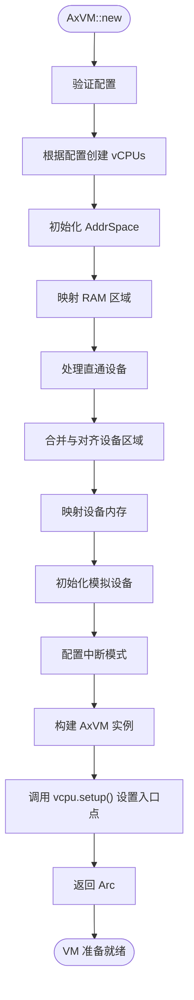
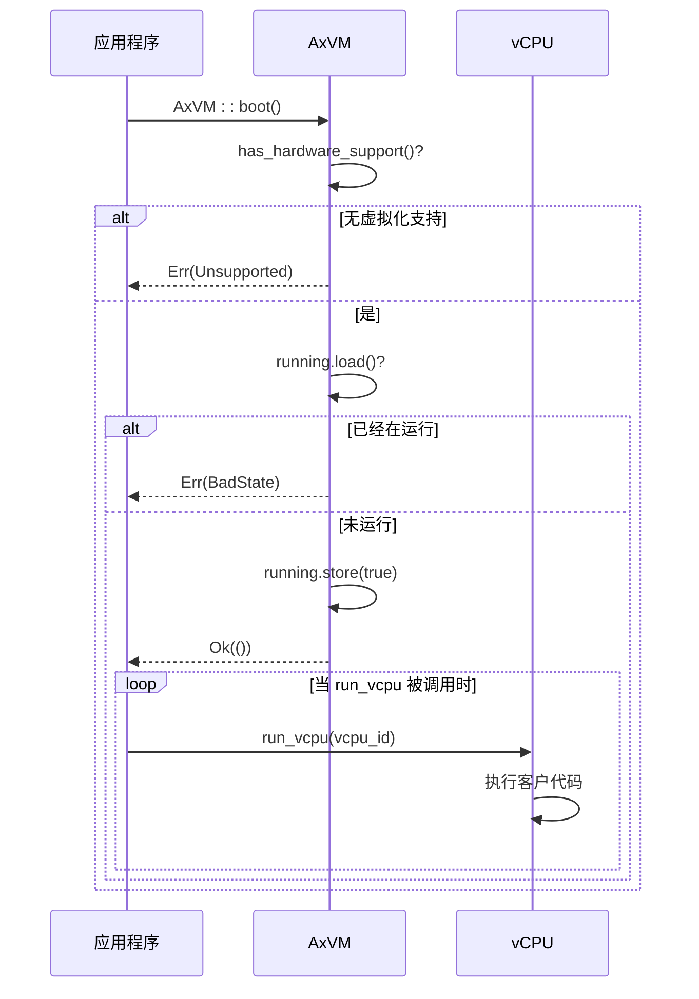
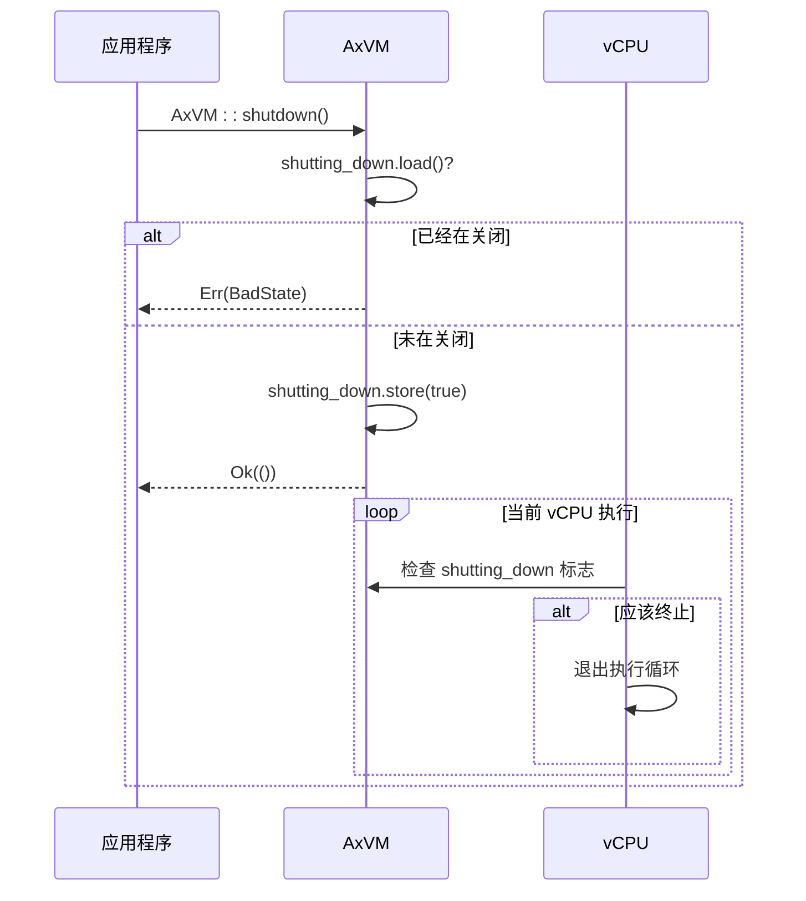
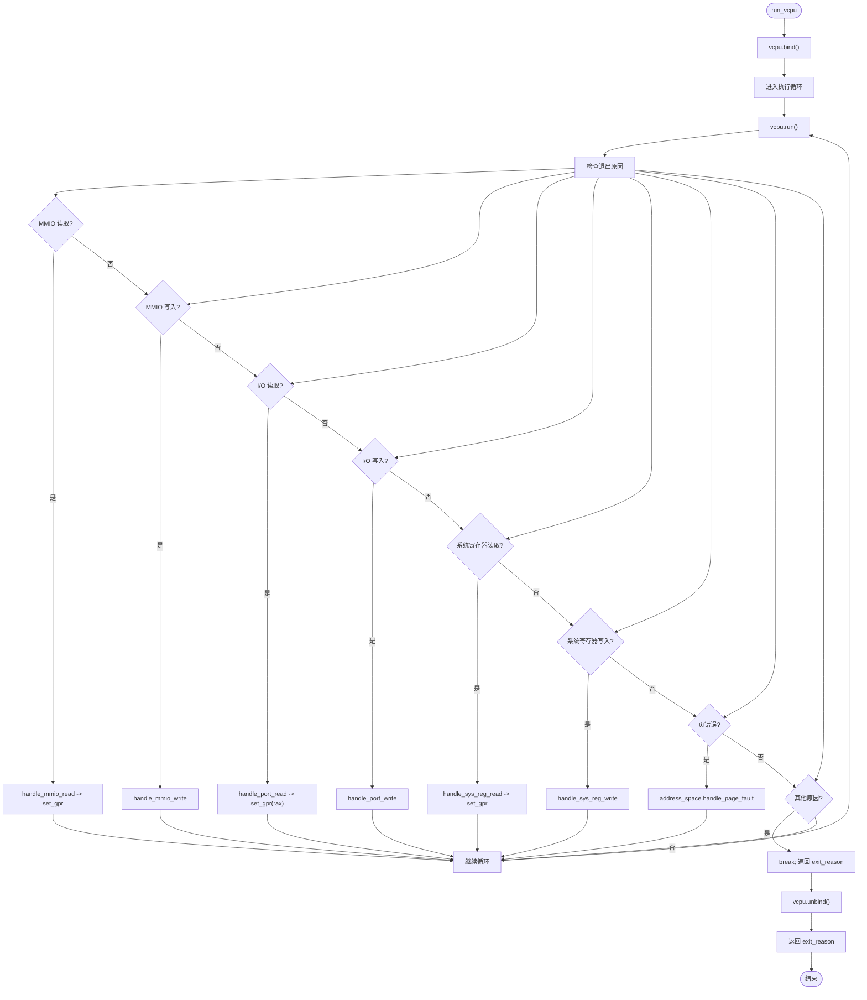

# VM 核心 API

<cite>
**本文档中引用的文件**
- [vm.rs](file://src/vm.rs)
- [config.rs](file://src/config.rs)
- [vcpu.rs](file://src/vcpu.rs)
- [hal.rs](file://src/hal.rs)
- [lib.rs](file://src/lib.rs)
</cite>

## 目录
1. [简介](#简介)
2. [构造函数 AxVM::new()](#构造函数-axvmnew)
3. [生命周期控制方法](#生命周期控制方法)
4. [vCPU 管理接口](#vcpu-管理接口)
5. [内存管理功能](#内存管理功能)
6. [设备交互机制](#设备交互机制)
7. [中断注入机制](#中断注入机制)
8. [查询接口](#查询接口)

## 简介
`AxVM` 结构体是 ArceOS 超级管理程序中虚拟机资源管理的核心组件，负责管理虚拟 CPU（vCPU）、内存和设备等关键资源。该结构体通过 `Arc` 包装实现线程安全的共享所有权，并采用原子布尔值来跟踪运行状态和关机状态。其内部由两个主要部分组成：`inner_const` 存储不可变配置信息（如 ID、配置、vCPU 列表和设备），而 `inner_mut` 使用互斥锁保护可变的地址空间。这种设计确保了在多线程环境中对虚拟机资源的安全并发访问。

**Section sources**
- [vm.rs](file://src/vm.rs#L43-L73)
- [lib.rs](file://src/lib.rs#L0-L32)

## 构造函数 AxVM::new()
`AxVM::new()` 方法用于根据提供的 `AxVMConfig` 配置创建一个新的虚拟机实例。此过程包括设置 vCPU、配置内存区域以及初始化设备。每个 vCPU 都使用从目标平台（aarch64、riscv64、x86_64）派生的特定于架构的配置参数进行创建。内存区域根据其类型进行映射——要么是恒等映射（`MapIdentical`），要么是动态分配（`MapAlloc`）——并带有适当的访问权限。直通设备以 4K 对齐的边界集成到地址空间中，重叠区域被合并以优化映射效率。模拟设备通过 `AxVmDevices` 实例化，处理 MMIO 和端口 I/O 操作。在 aarch64 上，根据 VM 的中断模式配置中断路由，在直通模式下将 SPI 分配给 GIC 分发器，否则设置虚拟定时器。

**Diagram sources**
- [vm.rs](file://src/vm.rs#L78-L267)
- [config.rs](file://src/config.rs#L94-L195)

**Section sources**
- [vm.rs](file://src/vm.rs#L78-L267)
- [config.rs](file://src/config.rs#L94-L195)

## 生命周期控制方法
### 启动 VM (boot())
`AxVM::boot()` 方法通过设置 `running` 原子标志来激活先前创建的 VM。在启动之前，系统会验证硬件虚拟化支持并确保 VM 尚未运行。如果任一检查失败，则返回相应的错误（`Unsupported` 或 `BadState`）。成功后，VM 进入运行状态，允许 vCPU 在调度时开始执行。值得注意的是，调用 `boot()` 不会立即开始指令执行；它只是启用了 vCPU 可以通过后续调用 `run_vcpu()` 来运行的能力。这种分离允许对何时开始执行进行细粒度控制，支持延迟启动或协调多 VM 初始化等用例。

**Diagram sources**
- [vm.rs](file://src/vm.rs#L274-L287)

**Section sources**
- [vm.rs](file://src/vm.rs#L274-L287)

### 优雅关闭 (shutdown())
`AxVM::shutdown()` 方法通过设置 `shutting_down` 原子标志来启动 VM 的受控终止。在此之前，它会检查 VM 是否已经在关闭过程中，如果是，则返回 `BadState` 错误。一旦启动，关闭标志会阻止任何新的 vCPU 执行，并向现有执行发出终止信号。尽管当前实现不会强制正在运行的 vCPU 立即停止，但该标志作为更高级别关闭逻辑的协调机制。关闭后，VM 无法重新启动，因为重新初始化尚未实现。未来的增强功能可能包括挂起/恢复功能和完整的重新初始化能力。

**Diagram sources**
- [vm.rs](file://src/vm.rs#L290-L316)

**Section sources**
- [vm.rs](file://src/vm.rs#L290-L316)

## vCPU 管理接口
### vCPU 访问方法
`AxVM` 提供了多种方法来管理和访问其关联的 vCPU：
- **vcpu(&self, vcpu_id: usize)**: 根据给定的 `vcpu_id` 检索对应的 vCPU 引用。如果 vCPU 不存在，则返回 `None`。
- **vcpu_list(&self)**: 返回指向 VM 关联的 vCPU 列表的引用。
- **vcpu_num(&self)**: 返回对应于 VM 的 vCPU 数量。

这些方法为外部组件提供了安全且高效的途径来与 VM 内部的 vCPU 进行交互。

**Section sources**
- [vm.rs](file://src/vm.rs#L318-L330)

### 执行 vCPU (run_vcpu())
`run_vcpu()` 方法是驱动 vCPU 执行的核心。它首先绑定指定的 vCPU，然后进入一个循环，反复调用底层 vCPU 的 `run()` 方法。每次执行退出都会产生一个 `AxVCpuExitReason`，该原因会被分派处理。对于大多数 I/O 和 MMIO 退出，VM 会通过 `get_devices()` 处理请求并将结果写回寄存器。对于嵌套页错误，它会委托给地址空间进行处理。只有当退出原因无法被自动处理时，循环才会中断，此时 `run_vcpu()` 返回该退出原因。这使得上层逻辑可以决定如何响应特定的退出事件。

**Diagram sources**
- [vm.rs](file://src/vm.rs#L403-L487)

**Section sources**
- [vm.rs](file://src/v