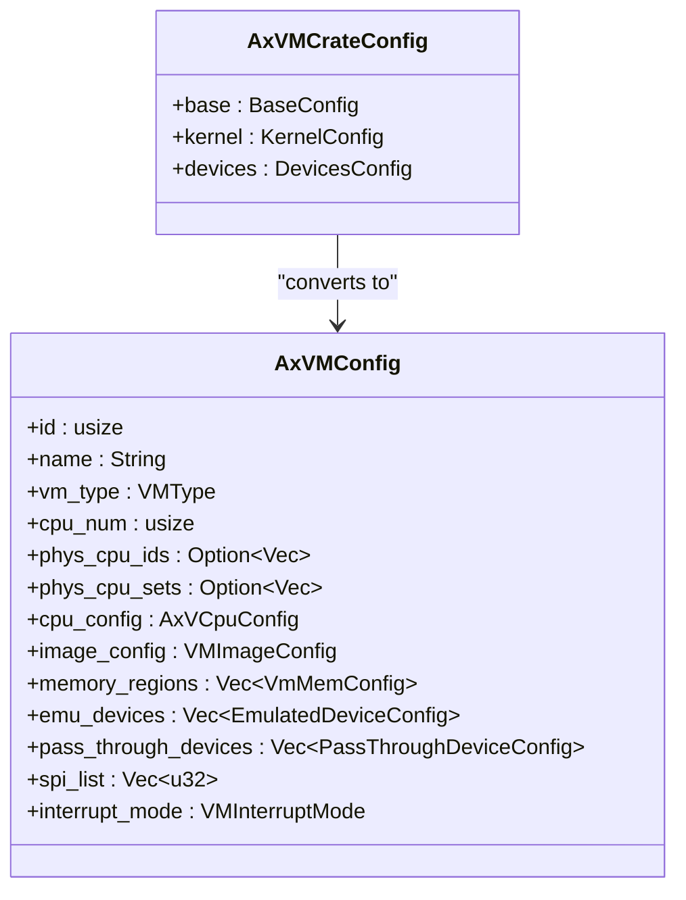
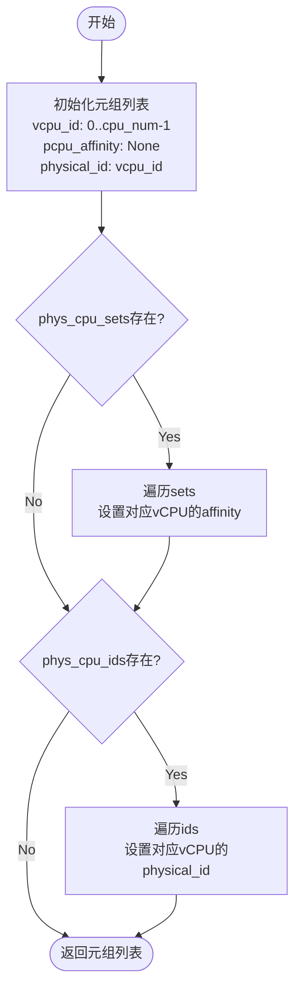

# 配置模型 API

<cite>
**本文档引用的文件**
- [config.rs](file://src/config.rs)
- [vm.rs](file://src/vm.rs)
</cite>

## 目录
1. [简介](#简介)
2. [结构体字段详解](#结构体字段详解)
3. [配置转换过程](#配置转换过程)
4. [核心方法解析](#核心方法解析)
5. [镜像加载地址配置](#镜像加载地址配置)
6. [实际配置示例](#实际配置示例)

## 简介
`AxVMConfig` 是 ArceOS 虚拟机监控器中用于描述虚拟机（VM）运行时配置的核心结构体。它作为从 TOML 配置文件解析出的 `AxVMCrateConfig` 到最终可执行 VM 实例之间的桥梁，承载了所有必要的初始化信息。该结构体定义了虚拟机的身份标识、CPU 核心数、内存布局、设备配置以及中断模式等关键属性，是创建和管理虚拟机实例的蓝图。

**Section sources**
- [config.rs](file://src/config.rs#L0-L31)

## 结构体字段详解
`AxVMConfig` 结构体包含以下字段，每个字段在虚拟机创建过程中扮演特定角色：

| 字段名 | 数据类型 | 默认值/说明 | 业务含义 |
|-------|--------|------------|---------|
| id | usize | 无（必填） | 虚拟机的唯一标识符，由配置文件指定，在系统内必须全局唯一。 |
| name | String | 无（必填） | 虚拟机的名称，用于日志记录和调试，便于用户识别不同实例。 |
| vm_type | VMType | 无（通过转换获得） | 虚拟机的类型枚举，如通用型、安全容器等，影响底层资源分配策略。 |
| cpu_num | usize | 无（必填） | 分配给该虚拟机的虚拟 CPU (vCPU) 数量，决定了其并行处理能力。 |
| phys_cpu_ids | Option<Vec<usize>> | None | 指定每个 vCPU 对应的物理 CPU (pCPU) 的逻辑 ID，用于精确的 CPU 绑定。 |
| phys_cpu_sets | Option<Vec<usize>> | None | 指定每个 vCPU 可以运行的 pCPU 掩码（affinity mask），用于调度亲和性控制。 |
| cpu_config | AxVCpuConfig | 见下文 | 包含 vCPU 架构相关的配置，主要是启动入口地址。 |
| image_config | VMImageConfig | 见下文 | 定义了内核、BIOS、DTB 等镜像在客户机物理地址空间（GPA）中的加载位置。 |
| memory_regions | Vec<VmMemConfig> | 空向量 | 描述虚拟机内存布局的区域列表，包括 GPA、大小和访问权限标志。 |
| emu_devices | Vec<EmulatedDeviceConfig> | 空向量 | 列出需要由 VMM 模拟的设备，如虚拟网卡、磁盘控制器等。 |
| pass_through_devices | Vec<PassThroughDeviceConfig> | 空向量 | 列出需要直通给虚拟机的物理设备，绕过模拟层以获得接近原生性能。 |
| interrupt_mode | VMInterruptMode | 无（必填） | 定义虚拟机的中断处理模式，如虚拟化中断或直通模式。 |

### 子结构体 `AxVCpuConfig`
此结构体封装了与 vCPU 启动相关的关键地址：
- **bsp_entry**: `GuestPhysAddr` 类型，表示 Bootstrap Processor (BSP) 的启动入口地址，即操作系统内核的起始执行点。
- **ap_entry**: `GuestPhysAddr` 类型，表示 Application Processor (AP) 的启动入口地址，所有非主核的 vCPU 均从此处开始执行。

### 子结构体 `VMImageConfig`
此结构体集中管理各类固件和镜像的加载地址：
- **kernel_load_gpa**: `GuestPhysAddr` 类型，内核镜像在 GPA 中的加载基址。
- **bios_load_gpa**: `Option<GuestPhysAddr>` 类型，BIOS 镜像的加载地址，若未使用则为 `None`。
- **dtb_load_gpa**: `Option<GuestPhysAddr>` 类型，设备树二进制文件（DTB）的加载地址，用于传递硬件拓扑信息。
- **ramdisk_load_gpa**: `Option<GuestPhysAddr>` 类型，初始 RAM 磁盘（initrd/initramfs）的加载地址。

**Section sources**
- [config.rs](file://src/config.rs#L33-L64)

## 配置转换过程
`AxVMConfig` 并非直接由用户创建，而是通过 `From<AxVMCrateConfig>` trait 从一个更高级别的配置结构 `AxVMCrateConfig` 转换而来。这一过程将来自 TOML 文件的原始配置数据转化为运行时所需的内部格式。



**Diagram sources**
- [config.rs](file://src/config.rs#L66-L103)

**Section sources**
- [config.rs](file://src/config.rs#L66-L103)

转换过程的关键步骤如下：
1.  **基础信息复制**：`id`、`name` 和 `cpu_num` 等基础字段直接从 `cfg.base` 复制。
2.  **类型转换**：`vm_type` 字段通过 `VMType::from()` 方法从字符串转换为枚举类型。
3.  **CPU 配置构建**：`cpu_config` 字段被初始化，其 `bsp_entry` 和 `ap_entry` 均设置为 `cfg.kernel.entry_point` 的值。
4.  **镜像配置映射**：`image_config` 字段根据 `cfg.kernel` 中的 `*_load_addr` 字段构建，所有地址均转换为 `GuestPhysAddr` 类型。
5.  **设备与内存继承**：`memory_regions`、`emu_devices` 和 `pass_through_devices` 直接从 `cfg.kernel` 和 `cfg.devices` 中获取。
6.  **中断模式设定**：`interrupt_mode` 从 `cfg.devices.interrupt_mode` 获取。
7.  **SPI 列表初始化**：`spi_list` 在转换时初始化为空向量，后续可通过 `add_pass_through_spi` 方法添加。

此转换过程确保了配置数据的有效性和一致性，并完成了从外部输入到内部运行时对象的映射。

## 核心方法解析
`AxVMConfig` 提供了一系列公开方法来访问其内部状态和进行配置修改。

### vCPU 调度亲和性生成
`get_vcpu_affinities_pcpu_ids()` 方法用于生成 vCPU 与 pCPU 之间的调度元组，为虚拟机创建过程提供调度策略。



该方法返回一个 `(vcpu_id, Option<pCpu_affinity_mask>, physical_id)` 元组的向量。首先，为每个 vCPU 初始化一个默认元组。如果 `phys_cpu_sets` 存在，则用其值覆盖相应 vCPU 的亲和性掩码；如果 `phys_cpu_ids` 存在，则用其值覆盖相应 vCPU 的物理 ID。

**Section sources**
- [config.rs](file://src/config.rs#L100-L134)

### 内存布局规划
`add_memory_region()` 和 `contains_memory_range()` 方法共同支持对虚拟机内存布局的动态管理和查询。
- **add_memory_region()**: 将一个新的 `VmMemConfig` 添加到 `memory_regions` 列表末尾。此方法允许在初始配置之外动态扩展内存区域。
- **contains_memory_range()**: 检查给定的地址范围是否完全包含在任何一个已配置的内存区域内。它通过遍历 `memory_regions` 并检查每个区域的 GPA 和大小来实现，对于验证内存分配冲突至关重要。

**Section sources**
- [config.rs](file://src/config.rs#L131-L168)

### 设备透传支持
`add_pass_through_device()` 和 `add_pass_through_spi()` 方法用于配置设备和中断的直通。
- **add_pass_through_device()**: 将一个 `PassThroughDeviceConfig` 添加到 `pass_through_devices` 列表中，指示 VMM 将该物理设备直接暴露给虚拟机。
- **add_pass_through_spi()**: 将一个 SPI (Shared Peripheral Interrupt) 编号添加到 `spi_list` 中。这些 SPI 通常在中断直通模式下被分配给虚拟机，使其能够直接接收来自物理设备的中断。

**Section sources**
- [config.rs](file://src/config.rs#L170-L194)

### 启动入口地址
`bsp_entry()` 和 `ap_entry()` 方法分别返回 BSP 和 AP 的启动入口地址。它们是简单的访问器方法，直接返回 `cpu_config` 结构体中存储的 `GuestPhysAddr` 值。这些地址在虚拟机启动时被用来初始化 vCPU 的程序计数器（PC）。

**Section sources**
- [config.rs](file://src/config.rs#L131-L168)

## 镜像加载地址配置
`image_config()` 方法返回一个指向 `VMImageConfig` 结构体的不可变引用，从而可以访问所有镜像的加载地址。这些地址是在 `From<AxVMCrateConfig>` 转换过程中，从 `cfg.kernel` 的 `*_load_addr` 字段映射而来的。例如，`kernel_load_gpa` 的值来源于 `cfg.kernel.kernel_load_addr`，并通过 `GuestPhysAddr::from()` 进行类型转换。这种设计将所有与镜像加载相关的配置集中管理，简化了虚拟机引导流程的实现。

**Section sources**
- [config.rs](file://src/config.rs#L131-L168)

## 实际配置示例
以下是一个典型的 TOML 配置片段，展示了如何组合各种选项来创建一个具有特定需求的虚拟机：

```toml
[base]
id = 1
name = "web-server-vm"
cpu_num = 4

[kernel]
entry_point = 0x80000000
kernel_load_addr = 0x80000000
dtb_load_addr = 0x83000000
memory_regions = [
    { gpa = 0x80000000, size = 0x10000000, flags = ["READ", "WRITE"], map_type = "MapIdentical" }
]

[devices]
passthrough_devices = [
    { host_bdf = "0000:01:00.0", guest_bdf = "0000:00:03.0" } # GPU直通
]
interrupt_mode = "Passthrough"
```

此配置创建了一个名为 "web-server-vm" 的虚拟机，拥有 4 个 vCPU，内核和 DTB 加载到指定的 GPA 地址，并将一块 256MB 的内存区域映射为可读写。同时，它将一个物理 GPU 设备直通给虚拟机，并启用了中断直通模式以优化 I/O 性能。

**Section sources**
- [config.rs](file://src/config.rs#L66-L103)
- [vm.rs](file://src/vm.rs#L108-L150)
- [vm.rs](file://src/vm.rs#L190-L226)