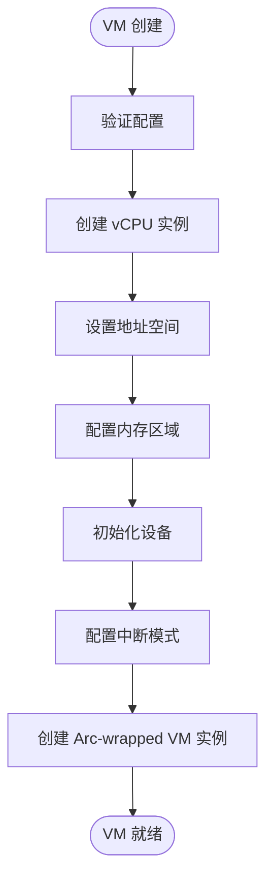

# 快速入门

<cite>
**本文档中引用的文件**
- [main.go](file://src/lib.rs)
- [config.rs](file://src/config.rs)
- [vm.rs](file://src/vm.rs)
- [hal.rs](file://src/hal.rs)
- [Cargo.toml](file://Cargo.toml)
- [README.md](file://README.md)
</cite>

## 目录
1. [简介](#简介)
2. [环境准备](#环境准备)
3. [创建第一个虚拟机](#创建第一个虚拟机)
4. [核心API详解](#核心api详解)
5. [vCPU执行与退出处理](#vcpu执行与退出处理)
6. [常见问题排查](#常见问题排查)
7. [完整代码示例](#完整代码示例)
8. [总结](#总结)

## 简介
`axvm` 是 ArceOS 超级管理器变体中用于虚拟机资源管理的核心组件。本指南旨在帮助新手开发者快速上手，通过 `axvm` 创建并启动他们的第一个虚拟机。我们将详细介绍从环境配置到虚拟机运行的完整流程，并提供实用的代码示例和故障排除建议。

**Section sources**
- [README.md](file://README.md#L0-L7)

## 环境准备
在开始使用 `axvm` 之前，必须正确配置开发环境。这包括安装 Rust 工具链和解析必要的依赖项。

### Rust工具链配置
确保已安装最新版本的 Rust 工具链。推荐使用 `rustup` 进行管理：
```bash
curl --proto '=https' --tlsv1.2 -sSf https://sh.rustup.rs | sh
```
安装完成后，设置目标架构（如 aarch64、riscv64 或 x86_64）以支持交叉编译。

### 依赖项解析
`axvm` 的依赖关系定义在 `Cargo.toml` 文件中。关键依赖包括：
- **系统无关模块**：`axerrno`, `cpumask`, `memory_addr` 等来自 ArceOS 的基础库。
- **系统相关模块**：`axvcpu`, `axaddrspace`, `axdevice` 等由 ArceOS-Hypervisor 提供的硬件抽象层。
- **架构特定依赖**：根据目标架构自动选择 `x86_vcpu`, `riscv_vcpu` 或 `arm_vcpu`。

这些依赖通过 Cargo 自动解析和下载，确保项目能够访问底层虚拟化功能。

```mermaid
classDiagram
class AxVMHal {
<<trait>>
+type PagingHandler : PagingHandler
+alloc_memory_region_at(base : HostPhysAddr, size : usize) bool
+dealloc_memory_region_at(base : HostPhysAddr, size : usize) void
+virt_to_phys(vaddr : HostVirtAddr) HostPhysAddr
+current_time_nanos() u64
+current_vm_id() usize
+current_vcpu_id() usize
+current_pcpu_id() usize
+vcpu_resides_on(vm_id : usize, vcpu_id : usize) AxResult~usize~
+inject_irq_to_vcpu(vm_id : usize, vcpu_id : usize, irq : usize) AxResult
}
AxVM --> AxVMHal : "依赖于"
note right of AxVMHal
必须由底层超级管理器/内核实现
end note
```

**Diagram sources**
- [hal.rs](file://src/hal.rs#L3-L43)

**Section sources**
- [Cargo.toml](file://Cargo.toml#L0-L40)
- [hal.rs](file://src/hal.rs#L3-L43)

## 创建第一个虚拟机
创建虚拟机的过程始于加载 TOML 配置文件并将其转换为 `AxVMConfig` 结构，然后调用 `AxVM::new()` 方法进行实例化。

### 加载TOML配置
`AxVMCrateConfig` 通常从 TOML 文件解析而来，随后通过 `From` 特性转换为运行时所需的 `AxVMConfig`。此过程涉及：
- 基础属性传播（ID、名称）
- VM 类型转换
- CPU 配置（BSP/AP 入口点）
- 内存区域映射
- 设备配置（模拟与直通）

### 调用AxVM::new()
`AxVM::new()` 方法接收 `AxVMConfig` 参数并执行以下初始化步骤：
1. **vCPU 初始化**：基于配置中的 CPU 数量和亲和性设置创建 vCPU 实例。
2. **地址空间设置**：建立空的地址空间，定义基址和大小。
3. **内存配置**：根据映射类型（`MapIdentical` 或 `MapAlloc`）处理内存区域。
4. **设备配置**：初始化模拟和直通设备。
5. **中断模式处理**：根据是否启用直通模式配置中断。

该方法返回一个 `Arc<AxVM>` 引用，允许多个组件安全地共享对 VM 实例的访问。



**Diagram sources**
- [vm.rs](file://src/vm.rs#L69-L283)

**Section sources**
- [vm.rs](file://src/vm.rs#L64-L283)
- [config.rs](file://src/config.rs#L66-L194)

## 核心API详解
理解 `axvm` 的核心 API 是成功创建和管理虚拟机的关键。以下是主要 API 的详细说明。

### AxVMConfig结构
`AxVMConfig` 是虚拟机配置的主要容器，封装了所有必要的参数。其关键字段包括：
- `id`: 虚拟机唯一标识符
- `name`: 人类可读名称
- `cpu_num`: 虚拟 CPU 数量
- `memory_regions`: 内存区域列表及其映射标志
- `emu_devices`: 模拟设备配置
- `pass_through_devices`: 直通设备配置
- `interrupt_mode`: 中断传递模式（直通或虚拟化）

```mermaid
classDiagram
class AxVMConfig {
+id : usize
+name : String
+cpu_num : usize
+phys_cpu_ids : Option~Vec<usize>~
+phys_cpu_sets : Option~Vec<usize>~
+memory_regions : Vec~VmMemConfig~
+emu_devices : Vec~EmulatedDeviceConfig~
+pass_through_devices : Vec~PassThroughDeviceConfig~
+spi_list : Vec~u32~
+interrupt_mode : VMInterruptMode
+get_vcpu_affinities_pcpu_ids() Vec~(usize, Option~usize~, usize)~
+image_config() &VMImageConfig
+bsp_entry() GuestPhysAddr
+ap_entry() GuestPhysAddr
+memory_regions() &Vec~VmMemConfig~
+contains_memory_range(range : &Range~usize~) bool
+emu_devices() &Vec~EmulatedDeviceConfig~
+pass_through_devices() &Vec~PassThroughDeviceConfig~
+pass_through_spis() &Vec~u32~
+interrupt_mode() VMInterruptMode
}
class AxVCpuConfig