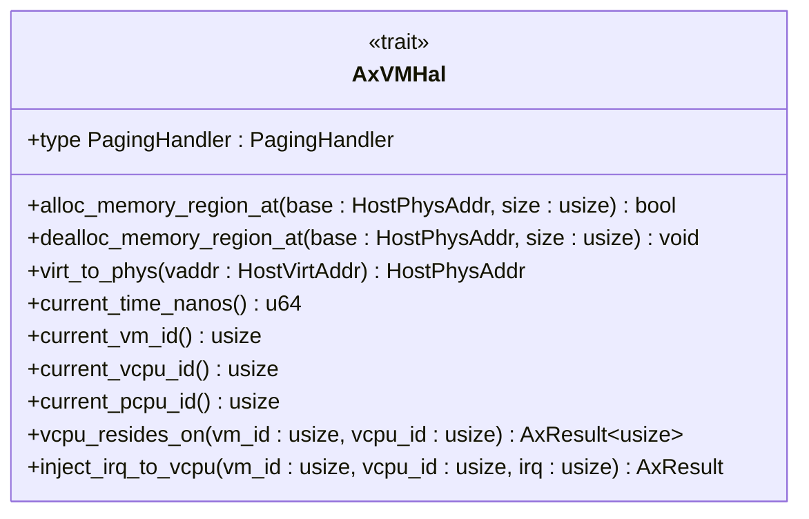

# 扩展点与集成指南

<cite>
**本文档中引用的文件**
- [hal.rs](file://src/hal.rs)
- [vm.rs](file://src/vm.rs)
- [vcpu.rs](file://src/vcpu.rs)
- [lib.rs](file://src/lib.rs)
- [Cargo.toml](file://Cargo.toml)
</cite>

## 目录
1. [引言](#引言)
2. [AxVMHal 特性详解](#axvmhal-特性详解)
3. [HAL 实现示例](#hal-实现示例)
4. [运行时多态与 trait 对象机制](#运行时多态与-trait-对象机制)
5. [实现 HAL 的挑战与最佳实践](#实现-hal-的挑战与最佳实践)
6. [通过 axdevice 集成新设备类型](#通过-axdevice-集成新设备类型)
7. [结论](#结论)

## 引言
`axvm` 是 ArceOS 超级管理程序变体中的虚拟机资源管理 crate，负责管理虚拟 CPU（vCPU）、内存和设备等核心资源。为了实现与底层操作系统或超级管理程序的解耦，`axvm` 通过 `AxVMHal` 特性定义了一组必须由宿主系统实现的接口。本指南将深入探讨这些扩展点，重点分析 `AxVMHal` 特性的要求，并提供一个模拟的 HAL 实现示例。

**Section sources**
- [README.md](file://README.md#L0-L7)

## AxVMHal 特性详解
`AxVMHal` 特性是 `axvm` 与底层软件（内核或超级管理程序）交互的核心契约。它定义了 VMM 运行所必需的一系列低级操作，确保了平台无关性。

### 关联类型
`AxVMHal` 定义了一个关联类型 `PagingHandler`，该类型必须实现 `page_table_multiarch::PagingHandler` trait。此处理程序负责管理第二阶段页表，是实现嵌套分页（如 Intel EPT 或 ARM S2MMU）的关键。



**Diagram sources**
- [hal.rs](file://src/hal.rs#L0-L44)

**Section sources**
- [hal.rs](file://src/hal.rs#L0-L44)

### 必需方法
以下是宿主系统必须实现的方法列表：

- **`alloc_memory_region_at`**: 在指定的物理地址处分配内存区域。这对于为 VM 分配特定的物理内存块至关重要。
- **`dealloc_memory_region_at`**: 释放先前在指定物理地址处分配的内存区域。
- **`virt_to_phys`**: 将主机虚拟地址转换为其对应的物理地址。这是地址空间管理和 I/O 操作的基础。
- **`current_time_nanos`**: 返回以纳秒为单位的当前时间，用于定时器、超时和性能监控。
- **`current_vm_id` / `current_vcpu_id` / `current_pcpu_id`**: 分别返回当前正在执行的 VM ID、vCPU ID 和物理 CPU ID，用于上下文识别和调度决策。
- **`vcpu_resides_on`**: 确定指定 VM 中的给定 vCPU 当前驻留在哪个物理 CPU 上。这对于跨 CPU 核同步和中断路由至关重要。
- **`inject_irq_to_vcpu`**: 向指定的 vCPU 注入中断。该方法需要找到 vCPU 所在的物理 CPU，并使用 `axvcpu::AxVCpu::inject_interrupt` 在该物理 CPU 上注入 IRQ。

**Section sources**
- [hal.rs](file://src/hal.rs#L0-L44)

## HAL 实现示例
以下是一个针对特定操作系统环境的模拟 `AxVMHal` 实现框架：

```rust
struct MyOsHal;

impl AxVMHal for MyOsHal {
    type PagingHandler = MyOsPagingHandler; // 假设已实现

    fn alloc_memory_region_at(base: HostPhysAddr, size: usize) -> bool {
        // 调用操作系统 API 分配物理内存
        my_os_allocate_physical_memory(base.as_usize(), size)
    }

    fn dealloc_memory_region_at(base: HostPhysAddr, size: usize) {
        // 调用操作系统 API 释放物理内存
        my_os_free_physical_memory(base.as_usize(), size);
    }

    fn virt_to_phys(vaddr: HostVirtAddr) -> HostPhysAddr {
        // 使用操作系统提供的页表遍历函数
        let paddr = my_os_translate_vaddr(vaddr.as_usize());
        HostPhysAddr::from(paddr)
    }

    fn current_time_nanos() -> u64 {
        // 获取高精度系统时间
        my_os_get_current_time_ns()
    }

    fn current_vm_id() -> usize {
        // 从当前执行上下文中读取 VM ID
        unsafe { CURRENT_VM_ID.get() }
    }

    fn current_vcpu_id() -> usize {
        // 从当前执行上下文中读取 vCPU ID
        unsafe { CURRENT_VCPU_ID.get() }
    }

    fn current_pcpu_id() -> usize {
        // 获取当前运行的物理 CPU ID
        my_os_get_current_cpu_id()
    }

    fn vcpu_resides_on(vm_id: usize, vcpu_id: usize) -> AxResult<usize> {
        // 查询内部调度表以确定 vCPU 的位置
        MY_SCHEDULER.lock().get_vcpu_location(vm_id, vcpu_id)
            .ok_or_else(|| ax_err!(NotFound, "VCPU not found"))
    }

    fn inject_irq_to_vcpu(vm_id: usize, vcpu_id: usize, irq: usize) -> AxResult {
        let pcpu_id = Self::vcpu_resides_on(vm_id, vcpu_id)?;
        // 切换到目标物理 CPU 并注入中断
        my_os_switch_to_cpu_and_call(pcpu_id, move || {
            if let Some(vcpu) = get_vcpu_handle(vm_id, vcpu_id) {
                vcpu.inject_interrupt(irq);
                Ok(())
            } else {
                Err(ax_err!(NotFound, "VCPU handle not found"))
            }
        })
    }
}
```

**Section sources**
- [hal.rs](file://src/hal.rs#L0-L44)

## 运行时多态与 trait 对象机制
`AxVMHal` 特性利用 Rust 的 trait 对象实现了运行时多态。`AxVM` 结构体被泛型参数化为 `<H: AxVMHal, U: AxVCpuHal>`，这意味着具体的 HAL 实现在编译时是未知的。

当创建 `AxVM` 实例时，可以传入任何实现了 `AxVMHal` 的具体类型。在运行时，通过 trait 对象（例如 `Box<dyn AxVMHal>`），`axvm` 可以调用这些方法而无需知道其具体实现。这允许动态切换不同的 HAL 后端，例如，为不同的硬件平台（x86_64, aarch64, riscv64）或不同的宿主环境（裸机、Linux 内核模块）提供定制化的实现。

这种