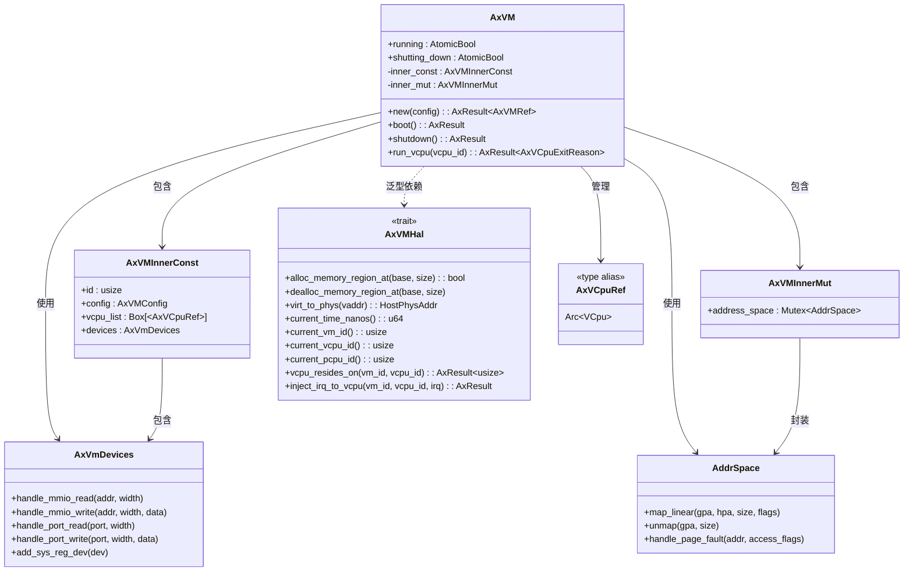

# 架构设计与模块关系

<cite>
**本文档引用的文件**  
- [lib.rs](file://src/lib.rs)
- [vm.rs](file://src/vm.rs)
- [hal.rs](file://src/hal.rs)
- [config.rs](file://src/config.rs)
- [vcpu.rs](file://src/vcpu.rs)
</cite>

## 目录
1. [项目结构](#项目结构)  
2. [核心组件分析](#核心组件分析)  
3. [分层架构与模块化设计](#分层架构与模块化设计)  
4. [AxVM 组件关系图](#axvm-组件关系图)  
5. [策略模式在 AxVMHal 上的应用](#策略模式在-axvmhal-上的应用)  
6. [构建者模式在配置转换中的体现](#构建者模式在配置转换中的体现)  
7. [原子状态机在线程安全设计中的应用](#原子状态机在线程安全设计中的应用)  
8. [跨架构支持的实现方式](#跨架构支持的实现方式)  
9. [可维护性、可测试性与可扩展性优势](#可维护性可测试性与可扩展性优势)  
10. [潜在优化方向](#潜在优化方向)

## 项目结构

**图表来源**  
- [lib.rs](file://src/lib.rs#L0-L32)
- [Cargo.toml](file://Cargo.toml#L0-L39)

## 核心组件分析

`axvm` 模块的核心是 `AxVM` 结构体，它代表一个完整的虚拟机实例。该结构体通过泛型参数 `H: AxVMHal` 和 `U: AxVCpuHal` 实现了对底层平台服务和虚拟 CPU 抽象的依赖解耦。

`AxVM` 包含以下关键组件：
- **vCPU 列表**：由 `vcpu_list` 字段管理，存储所有虚拟 CPU 的引用。
- **地址空间**：由 `address_space` 字段管理，负责虚拟机内存映射和页表管理。
- **设备管理器**：由 `devices` 字段管理，处理 I/O 设备模拟和直通设备。

这些组件共同构成了一个完整的虚拟机实例，并通过 `Arc`（原子引用计数）实现线程安全共享。

**章节来源**  
- [vm.rs](file://src/vm.rs#L43-L73)
- [vm.rs](file://src/vm.rs#L0-L44)

## 分层架构与模块化设计

`axvm` 采用清晰的分层架构设计，各层职责分明，模块间通过接口进行通信，实现了良好的解耦。

上层逻辑（如 `vm.rs`）通过 `AxVMHal` 特征依赖于底层平台服务。`AxVMHal` 定义了一组必须由底层软件（内核或管理程序）实现的接口，包括物理地址管理、时间获取、中断注入等。这种设计使得上层代码无需关心底层具体实现细节，提高了代码的可移植性和可测试性。

例如，在 `vm.rs` 中，`boot` 方法调用 `has_hardware_support()` 来检查硬件虚拟化支持，而该函数实际调用了 `vcpu::has_hardware_support()`，体现了对底层服务的抽象依赖。

**章节来源**  
- [vm.rs](file://src/vm.rs#L363-L404)
- [hal.rs](file://src/hal.rs#L0-L43)

## AxVM 组件关系图

**图表来源**  
- [vm.rs](file://src/vm.rs#L43-L73)
- [hal.rs](file://src/hal.rs#L0-L43)
- [vm.rs](file://src/vm.rs#L0-L44)

## 策略模式在 AxVMHal 上的应用

`AxVMHal` 特征是策略模式的典型应用。它定义了一个算法族（即底层平台服务），并将每个算法封装在独立的实现中。`AxVM` 结构体作为上下文，通过泛型参数接受不同的 `AxVMHal` 实现，从而在运行时选择具体的策略。

这种设计允许 `axvm` 在不同操作系统或管理程序上复用相同的虚拟机管理逻辑，只需提供相应的 `AxVMHal` 实现即可。例如，可以在 Linux 内核中实现一套 `AxVMHal`，也可以在裸机环境中实现另一套，而 `AxVM` 的核心逻辑保持不变。

**章节来源**  
- [hal.rs](file://src/hal.rs#L0-L43)

## 构建者模式在配置转换中的体现

虽然 `AxVM` 本身没有直接使用构建者模式，但其配置系统体现了类似的构造思想。`AxVMConfig` 结构体通过 `From<AxVMCrateConfig>` 实现从外部 TOML 配置文件到内部运行时配置的转换。

这一过程类似于构建者模式中的逐步构建过程：原始配置数据被解析为 `AxVMCrateConfig`，然后通过 `from` 方法逐步填充 `AxVMConfig` 的各个字段，最终形成一个完整且有效的虚拟机配置对象。这种方式分离了配置解析和对象创建，提高了代码的可读性和可维护性。

**章节来源**  
- [config.rs](file://src/config.rs#L66-L103)

## 原子状态机在线程安全设计中的应用

`AxVM` 使用 `AtomicBool` 类型的 `running` 和 `shutting_down` 标志位来表示虚拟机的状态，这是一种轻量级的原子状态机设计。

这两个标志位通过 `Ordering::Relaxed` 内存顺序进行读写操作，确保了多线程环境下的线程安全性。`boot` 和 `shutdown` 方法分别负责设置 `running` 和 `shutting_down` 标志位，同时检查当前状态以防止非法状态转换（如重复启动或重复关闭）。

由于 `AtomicBool` 提供了无锁的原子操作，避免了传统互斥锁带来的性能开销和死锁风险，因此这种设计在高并发场景下具有较好的性能表现。

**章节来源**  
- [vm.rs](file://src/vm.rs#L363-L404)

## 跨架构支持的实现方式

`axvm` 通过条件编译（`#[cfg(target_arch = "...")]`）绑定不同架构的 vCPU 后端，实现了跨架构支持。

在 `vcpu.rs` 文件中，使用 `cfg_if!` 宏根据目标架构选择对应的 vCPU 实现：
- x86_64 架构使用 `x86_vcpu` crate
- RISC-V 架构使用 `riscv_vcpu` crate
- AArch64 架构使用 `arm_vcpu` crate

此外，某些架构特定的功能（如 aarch64 的系统寄存器设备）也通过条件编译进行选择性编译。这种设计使得 `axvm` 能够在不同架构上编译和运行，同时保持代码库的统一性。

**章节来源**  
- [vcpu.rs](file://src/vcpu.rs#L0-L29)
- [Cargo.toml](file://Cargo.toml#L20-L39)

## 可维护性、可测试性与可扩展性优势

`axvm` 的设计带来了显著的可维护性、可测试性和可扩展性优势：

1. **可维护性**：清晰的分层架构和模块化设计使得代码易于理解和修改。每个模块职责单一，降低了代码复杂度。
2. **可测试性**：通过 `AxVMHal` 特征的抽象，可以轻松地为底层服务提供模拟实现，便于单元测试和集成测试。
3. **可扩展性**：新增架构支持只需添加相应的 vCPU 后端依赖和条件编译分支；新增功能可以通过扩展 `AxVMHal` 接口或添加新的模块来实现，不影响现有代码。

这些优势使得 `axvm` 成为一个灵活且易于演进的虚拟机监控器框架。

**章节来源**  
- [lib.rs](file://src/lib.rs#L0-L32)
- [hal.rs](file://src/hal.rs#L0-L43)

## 潜在优化方向

尽管 `axvm` 已经具备良好的设计基础，但仍有一些潜在的优化方向：

1. **锁优化**：`AxVMInnerMut` 中的 `Mutex` 可能成为性能瓶颈，未来可考虑使用更高效的同步原语或无锁数据结构。
2. **内存管理**：`get_image_load_region` 方法返回的 `Vec<&'static mut [u8]>` 存在管理非连续物理内存的局限性，可探索更优雅的解决方案。
3. **生命周期管理**：目前 VM 创建后无法重新初始化，可考虑实现 `suspend/resume` 功能以支持动态资源管理。
4. **错误处理**：部分错误处理逻辑较为简单，可引入更完善的错误传播机制和日志记录。

这些优化将进一步提升 `axvm` 的性能和可用性。

**章节来源**  
- [vm.rs](file://src/vm.rs#L332-L366)
- [vm.rs](file://src/vm.rs#L399-L404)