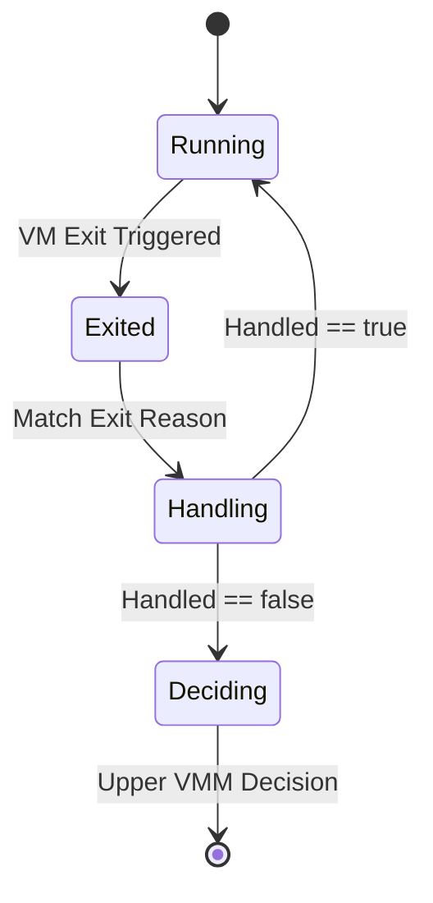

# VM Exit机制与处理流程

<cite>
**本文档中引用的文件**
- [vm.rs](file://src/vm.rs)
- [vcpu.rs](file://src/vcpu.rs)
- [config.rs](file://src/config.rs)
- [lib.rs](file://src/lib.rs)
</cite>

## 目录
1. [简介](#简介)
2. [VM Exit发生条件与分类](#vm-exit发生条件与分类)
3. [AxVCpuExitReason枚举定义](#axvcpuexitreason枚举定义)
4. [VM Exit处理闭环](#vm-exit处理闭环)
5. [状态转换图](#状态转换图)
6. [核心组件分析](#核心组件分析)
7. [结论](#结论)

## 简介
VM Exit是硬件虚拟化扩展（如Intel VT-x、AMD-V）触发的关键控制权转移事件，当客户机操作系统执行某些敏感指令或访问特定资源时，会导致vCPU暂停执行并返回到VMM（虚拟机监视器）。该机制是实现虚拟化的基石，使VMM能够透明地拦截和处理客户机行为。本文详细解析VM Exit的发生条件、分类及处理闭环，重点说明`AxVCpuExitReason`枚举如何统一表示各类退出原因，并描述`AxVM::run_vcpu()`作为中央调度器如何分发处理。

**Section sources**
- [vm.rs](file://src/vm.rs#L0-L44)
- [lib.rs](file://src/lib.rs#L0-L32)

## VM Exit发生条件与分类
VM Exit由底层硬件虚拟化技术自动触发，当vCPU在执行过程中遇到需要VMM介入的敏感操作时，控制权会立即从客户机转移到VMM。常见的触发条件包括：
- **内存访问异常**：如嵌套页表错误（Nested Page Fault），当客户机访问未映射或权限不足的内存区域时发生。
- **I/O操作**：包括对MMIO（Memory-Mapped I/O）地址空间的读写以及对传统端口I/O（Port I/O）的访问。
- **系统寄存器访问**：客户机尝试读写特定的系统级寄存器。
- **其他特权操作**：如中断处理、CPU模式切换等。

这些事件迫使vCPU退出运行状态，将执行流交还给VMM进行模拟或授权处理，从而保证了系统的隔离性和安全性。

**Section sources**
- [vm.rs](file://src/vm.rs#L424-L487)

## AxVCpuExitReason枚举定义
`AxVCpuExitReason`是一个关键的枚举类型，用于统一表示所有可能的VM Exit原因。它抽象了不同架构下的具体实现细节，为上层VMM提供了一致的接口。该枚举涵盖了多种退出场景，主要包括：
- `MmioRead` / `MmioWrite`：表示对内存映射I/O的读写操作。
- `IoRead` / `IoWrite`：表示对传统I/O端口的读写操作。
- `SysRegRead` / `SysRegWrite`：表示对系统寄存器的访问。
- `NestedPageFault`：表示发生了嵌套页表故障，需要内存管理单元介入。
- 其他未明确处理的退出原因则通过默认分支 `_ => false` 返回，交由上层决策。

此枚举的设计使得VMM可以基于单一的退出原因进行条件匹配和分发处理，极大地简化了控制逻辑。

**Section sources**
- [vm.rs](file://src/vm.rs#L424-L487)

## VM Exit处理闭环
`AxVM::run_vcpu()`函数是整个VM Exit处理机制的核心调度器。其工作流程如下：

1.  **启动vCPU**：调用`vcpu.run()`进入客户机执行模式。
2.  **等待退出**：当发生VM Exit时，`vcpu.run()`返回一个`AxVCpuExitReason`实例。
3.  **原因匹配与处理**：通过`match`表达式对退出原因进行分类处理：
    - **I/O请求**：MMIO和Port I/O操作被转发给`AxVmDevices`设备管理模块，由其内部的`handle_mmio_read/write`和`handle_port_read/write`方法处理。
    - **系统寄存器访问**：同样交由`AxVmDevices`通过`handle_sys_reg_read/write`进行处理。
    - **内存错误**：`NestedPageFault`类型的退出被委托给`AddrSpace`地址空间管理模块的`handle_page_fault`方法解决，通常涉及页表更新或内存分配。
    - **未处理的退出**：对于上述未覆盖的退出原因，`handled`标志为`false`，循环结束，`exit_reason`被直接返回给上层VMM进行最终决策。
4.  **循环处理**：只要退出被成功处理（`handled`为`true`），循环将继续，vCPU重新进入运行状态；否则，处理流程结束。

这种设计实现了清晰的关注点分离，确保了VMM能高效、可靠地响应各种虚拟化事件。

```mermaid
flowchart TD
A[开始] --> B[vcpu.run()]
B --> C{发生VM Exit?}
C --> |是| D[获取AxVCpuExitReason]
D --> E{退出原因}
E --> |Mmio/Io/SysReg| F[转发给AxVmDevices处理]
E --> |NestedPageFault| G[交由AddrSpace处理]
E --> |其他| H[返回上层VMM决策]
F --> I[设置GPR/完成操作]
G --> J[解决页错误]
I --> K[handled = true]
J --> K
H --> L[handled = false]
K --> M{handled?}
M --> |true| B
M --> |false| N[返回exit_reason]
N --> O[结束]
```

**Diagram sources**
- [vm.rs](file://src/vm.rs#L424-L487)

**Section sources**
- [vm.rs](file://src/vm.rs#L403-L487)

## 状态转换图
下图展示了vCPU在运行与退出之间的状态转换过程。



**Diagram sources**
- [vm.rs](file://src/vm.rs#L424-L487)

## 核心组件分析
### AxVM 结构体
`AxVM<H: AxVMHal, U: AxVCpuHal>` 是代表一个完整虚拟机的核心结构体。它封装了vCPU列表、设备管理、地址空间等关键资源，并提供了`run_vcpu`这一核心方法来驱动虚拟机执行。

### AxVmDevices 模块
该模块负责管理虚拟机的所有I/O设备，无论是模拟设备还是直通设备。它是处理MMIO、Port I/O和系统寄存器访问请求的终点。

### AddrSpace 模块
`AddrSpace`负责管理客户机的物理地址空间和两阶段地址转换（EPT/NPT）。当发生`NestedPageFault`时，正是该模块负责解析错误并建立正确的页表映射。

**Section sources**
- [vm.rs](file://src/vm.rs#L43-L106)
- [vm.rs](file://src/vm.rs#L254-L283)

## 结论
VM Exit机制是现代硬件辅助虚拟化的核心。通过`AxVCpuExitReason`枚举的统一建模和`AxVM::run_vcpu()`的集中调度，该系统实现了对各类敏感操作的精确拦截与高效处理。内存访问、I/O操作和系统寄存器访问等请求被分别路由至`AddrSpace`和`AxVmDevices`进行专业化处理，而未预见的退出则保留给上层VMM决策，形成了一个健壮且可扩展的处理闭环。这一设计充分体现了模块化和职责分离的原则，是构建高性能、高可靠性VMM的基础。