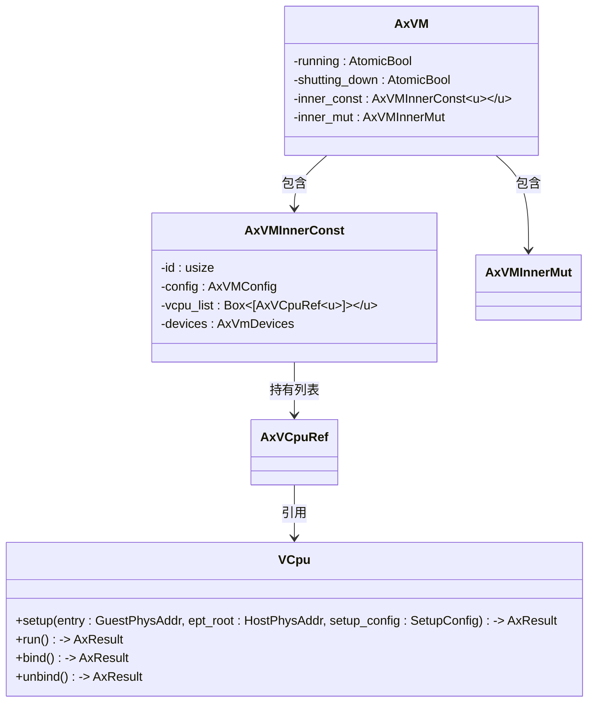
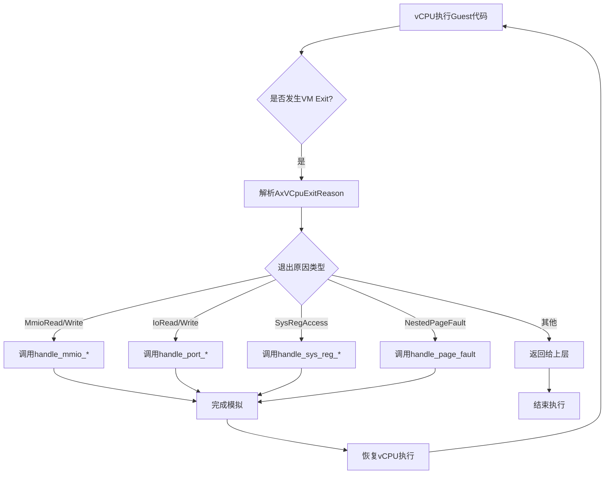

# vCPU管理与执行模型

<cite>
**本文档引用的文件**   
- [vcpu.rs](file://src/vcpu.rs)
- [vm.rs](file://src/vm.rs)
- [config.rs](file://src/config.rs)
- [lib.rs](file://src/lib.rs)
- [hal.rs](file://src/hal.rs)
</cite>

## 目录
1. [vCPU共享与安全机制](#vcpu共享与安全机制)
2. [多vCPU实例管理](#多vcpu实例管理)
3. [vCPU执行流程分析](#vcpu执行流程分析)
4. [关键退出原因详解](#关键退出原因详解)
5. [vCPU入口地址配置](#vcpu入口地址配置)
6. [数据流闭环过程](#数据流闭环过程)

## vCPU共享与安全机制

在axvm中，`AxVCpuRef`类型被定义为`Arc<VCpu<U>>`，即对`VCpu`结构体的原子引用计数指针。这种设计允许在多个上下文中安全地共享同一个vCPU实例，而无需担心内存泄漏或悬空指针问题。

通过使用`Arc`（Atomically Reference Counted），每个克隆的`AxVCpuRef`都持有对底层`VCpu`对象的引用，并在所有引用被释放后自动清理资源。这确保了即使在并发环境中，vCPU的状态也能保持一致和安全。

**Section sources**
- [vm.rs](file://src/vm.rs#L0-L44)

## 多vCPU实例管理

`AxVM`结构体通过其内部字段`inner_const.vcpu_list`来管理多个vCPU实例。该字段是一个包含`AxVCpuRef<U>`类型的固定大小数组，其中每个元素代表一个虚拟CPU。

在创建VM时，系统会根据配置中的CPU数量初始化这个列表。具体来说，在`AxVM::new()`方法中，遍历从`config.get_vcpu_affinities_pcpu_ids()`获取的vCPU ID及其对应的物理CPU集合，并为每一个vCPU调用`VCpu::new()`构造函数生成新的vCPU实例并加入到`vcpu_list`中。



**Diagram sources**
- [vm.rs](file://src/vm.rs#L43-L73)
- [vm.rs](file://src/vm.rs#L69-L106)

**Section sources**
- [vm.rs](file://src/vm.rs#L69-L106)

## vCPU执行流程分析

`run_vcpu(vcpu_id)`方法是启动特定vCPU执行的核心接口。它首先验证提供的`vcpu_id`是否有效，然后绑定当前物理CPU到目标vCPU上以保证执行环境的一致性。

接下来，进入一个循环处理由底层`VCpu::run()`调用产生的`AxVCpuExitReason`枚举值。对于每种可处理的退出原因，如MMIO读写、I/O操作等，都会进行相应的模拟处理；而对于无法处理的情况，则跳出循环并将退出原因返回给调用者。

此机制实现了高效的异常处理与恢复能力，使得VMM能够透明地拦截并响应guest OS的各种请求。

```mermaid
sequenceDiagram
participant VMM as 虚拟机监视器
participant VM as AxVM
participant vCPU as AxVCpu
VMM->>VM : run_vcpu(vcpu_id)
VM->>VM : vcpu(vcpu_id).ok_or_else()
VM->>vCPU : bind()
loop 执行与退出循环
vCPU->>vCPU : run()
vCPU-->>VM : 返回 AxVCpuExitReason
alt 可处理的退出原因
VM->>VM : handle_mmio_read/write
VM->>VM : handle_port_read/write
VM->>VM : handle_sys_reg_read/write
VM->>VM : handle_page_fault
VM->>vCPU : 继续执行
else 不可处理的退出原因
break 返回退出原因
end
end
VM->>vCPU : unbind()
VM-->>VMM : 返回 AxVCpuExitReason
```

**Diagram sources**
- [vm.rs](file://src/vm.rs#L403-L491)

**Section sources**
- [vm.rs](file://src/vm.rs#L403-L491)

## 关键退出原因详解

`AxVCpuExitReason`枚举列出了可能导致vCPU停止执行的各种情况，主要包括：

- **MmioRead/Write**: 当guest尝试访问内存映射I/O区域时触发。
- **IoRead/Write**: 对传统I/O端口的操作引发此类退出。
- **SysRegAccess**: 访问某些敏感系统寄存器时发生。
- **NestedPageFault**: 在二级页表转换过程中出现页面错误。

这些退出原因的设计具有架构无关性优势，意味着无论底层硬件平台如何变化，高层VMM逻辑都可以统一处理这些事件，从而提高了代码的可移植性和维护性。

**Section sources**
- [vm.rs](file://src/vm.rs#L430-L487)

## vCPU入口地址配置

vCPU的入口地址（BSP/AP）是在`AxVMConfig`结构体中定义的。具体而言，`AxVCpuConfig`包含了两个字段：`bsp_entry`用于指定引导处理器(BSP)的起始地址，而`ap_entry`则用于应用处理器(AP)。

当创建新的VM实例时，这些配置信息会被传递给各个vCPU的`setup()`方法，以便正确设置初始执行位置。例如，在`AxVM::new()`函数中可以看到如下逻辑：
```rust
let entry = if vcpu.id() == 0 {
    result.inner_const.config.bsp_entry()
} else {
    result.inner_const.config.ap_entry()
};
vcpu.setup(entry, result.ept_root(), setup_config)?;
```

这种方式确保了不同角色的vCPU可以从正确的地址开始执行。

**Section sources**
- [config.rs](file://src/config.rs#L33-L64)
- [vm.rs](file://src/vm.rs#L283-L330)

## 数据流闭环过程

从vCPU执行到VM Exit再到VMM处理形成一个完整的闭环过程。整个流程可以概括为以下几个步骤：

1. vCPU开始执行guest代码；
2. 遇到需要特权权限的操作时产生VM Exit；
3. 控制权转移至VMM，解析`AxVCpuExitReason`；
4. 根据不同的退出原因调用相应设备处理程序；
5. 完成模拟后恢复vCPU执行；
6. 若遇到不可恢复错误，则终止执行并报告状态。

这一系列动作构成了虚拟化环境中典型的控制流转路径，体现了现代VMM高效且灵活的工作模式。



**Diagram sources**
- [vm.rs](file://src/vm.rs#L403-L491)

**Section sources**
- [vm.rs](file://src/vm.rs#L403-L491)