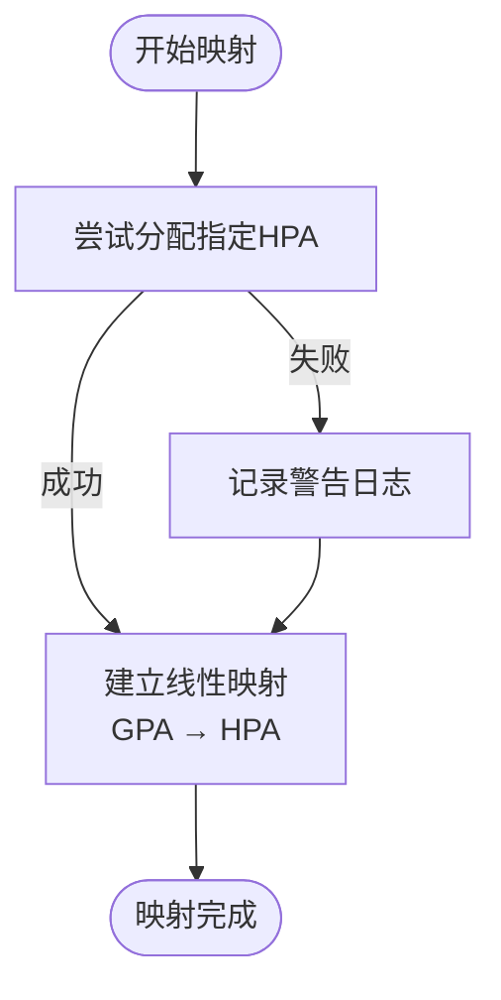
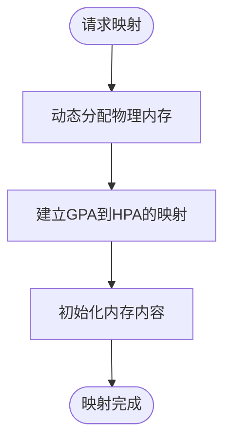
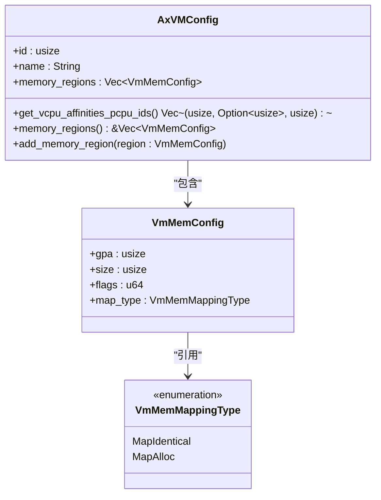
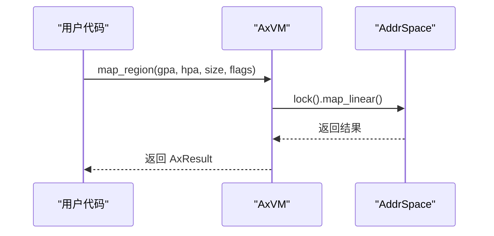
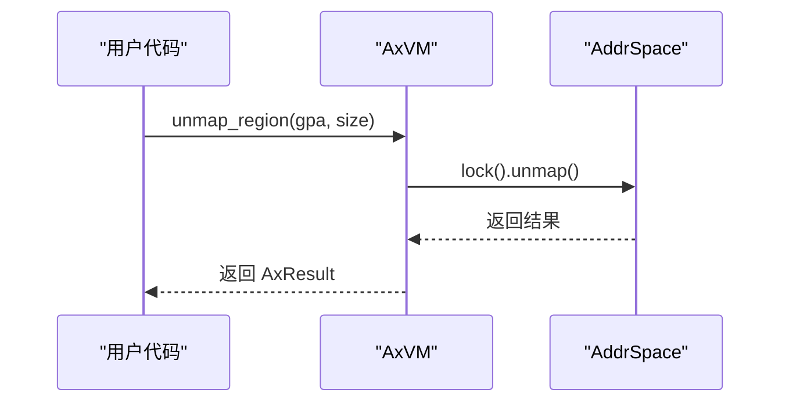

# 内存映射模式详解

<cite>
**本文档引用的文件**
- [config.rs](file://src/config.rs)
- [hal.rs](file://src/hal.rs)
- [vm.rs](file://src/vm.rs)
</cite>

## 目录
1. [简介](#简介)
2. [内存映射模式概述](#内存映射模式概述)
3. [MapIdentical 模式分析](#mapidentical-模式分析)
4. [MapAlloc 模式分析](#mapalloc-模式分析)
5. [内存映射配置机制](#内存映射配置机制)
6. [API 接口与操作流程](#api-接口与操作流程)
7. [地址对齐与权限管理](#地址对齐与权限管理)
8. [系统架构与协作模块](#系统架构与协作模块)

## 简介
axvm 提供了两种核心内存映射模式：`MapIdentical` 和 `MapAlloc`，用于在虚拟机（VM）中建立客户机物理地址（GPA）与主机物理地址（HPA）之间的映射关系。这两种模式分别适用于不同的应用场景，通过配置驱动的方式实现灵活的内存管理策略。

## 内存映射模式概述
axvm 支持两种主要的内存映射策略：
- **MapIdentical**：实现 GPA 与 HPA 的恒等映射，即客户机看到的物理地址与宿主机上的物理地址完全相同。
- **MapAlloc**：通过动态分配方式建立映射，允许 GPA 与 HPA 不一致，提供更大的灵活性。

这些映射策略在虚拟机创建时根据配置自动应用，并由底层的地址空间管理模块和硬件抽象层协同完成。

**Section sources**
- [vm.rs](file://src/vm.rs#L108-L150)
- [config.rs](file://src/config.rs#L0-L31)

## MapIdentical 模式分析
`MapIdentical` 模式实现了客户机物理地址（GPA）与主机物理地址（HPA）的直接恒等映射。在这种模式下，GPA 和 HPA 具有相同的数值，从而避免了地址转换开销，提升了访问性能。

该模式特别适用于需要预分配固定内存区域的场景，例如内核镜像加载、设备保留区等。其工作原理如下：
1. 尝试调用 `H::alloc_memory_region_at()` 在指定 HPA 处预留物理内存。
2. 若预留成功，则使用 `map_linear()` 建立 GPA 到 HPA 的线性映射。
3. 若预留失败，仍会尝试建立映射，但会发出警告日志。

这种模式的优势在于：
- 零地址转换延迟
- 更高的内存访问效率
- 适合确定性内存布局需求

**Diagram sources**
- [vm.rs](file://src/vm.rs#L108-L150)
- [hal.rs](file://src/hal.rs#L10-L15)

**Section sources**
- [vm.rs](file://src/vm.rs#L108-L150)
- [hal.rs](file://src/hal.rs#L10-L15)

## MapAlloc 模式分析
`MapAlloc` 模式采用动态内存分配机制来实现 GPA 到 HPA 的映射。与 `MapIdentical` 不同，它不要求 HPA 与 GPA 相同，而是由系统自动分配合适的物理内存块。

该模式适用于需要灵活内存管理的场景，如运行时动态分配的内存区域。其实现特点包括：
- 使用 `map_alloc()` 方法进行内存分配和映射
- 分配的物理内存可能不连续（以页帧为单位）
- 提供更高的内存利用率和灵活性

虽然相比恒等映射有一定性能开销，但其灵活性使其成为通用内存分配的理想选择。

**Diagram sources**
- [vm.rs](file://src/vm.rs#L159-L188)
- [config.rs](file://src/config.rs#L0-L31)

**Section sources**
- [vm.rs](file://src/vm.rs#L159-L188)

## 内存映射配置机制
内存映射的定义通过 `AxVMConfig` 结构体中的 `memory_regions` 字段进行配置驱动。每个内存区域由 `VmMemConfig` 结构描述，包含以下关键属性：
- `gpa`：客户机物理地址
- `size`：区域大小
- `flags`：映射标志（读/写/执行权限等）
- `map_type`：映射类型（`MapIdentical` 或 `MapAlloc`）

配置流程如下：
1. 从 TOML 配置文件生成 `AxVMCrateConfig`
2. 转换为运行时使用的 `AxVMConfig`
3. 在 VM 创建过程中遍历 `memory_regions` 并应用相应映射策略

这种方式实现了声明式配置与实际映射操作的解耦，提高了系统的可配置性和可维护性。

**Diagram sources**
- [config.rs](file://src/config.rs#L66-L103)
- [vm.rs](file://src/vm.rs#L108-L150)

**Section sources**
- [config.rs](file://src/config.rs#L66-L103)

## API 接口与操作流程
axvm 提供了 `map_region()` 和 `unmap_region()` 两个核心 API 来管理内存映射：

### 映射操作 API

### 取消映射操作 API

这些 API 最终由 `AddrSpace` 模块和 `AxVMHal` 的页表处理器协同完成，确保映射操作的安全性和正确性。

**Diagram sources**
- [vm.rs](file://src/vm.rs#L522-L538)
- [vm.rs](file://src/vm.rs#L43-L73)

**Section sources**
- [vm.rs](file://src/vm.rs#L522-L538)

## 地址对齐与权限管理
在进行内存映射时，必须注意地址对齐和权限标记的重要性：

### 地址对齐要求
- 所有映射操作应遵循 4KB 页面对齐规则
- 使用 `align_down_4k()` 和 `align_up_4k()` 辅助函数确保对齐
- 设备内存区域尤其需要注意对齐要求

### 权限标记管理
- 使用 `MappingFlags` 枚举定义访问权限
- 常见权限组合：
  - 只读：`READ`
 