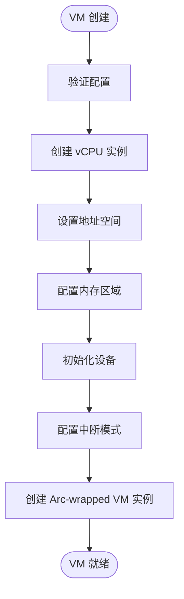
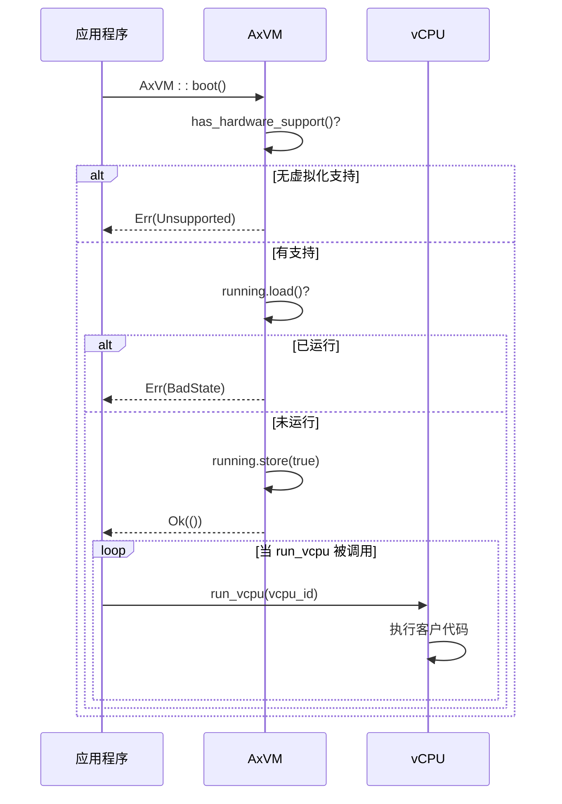
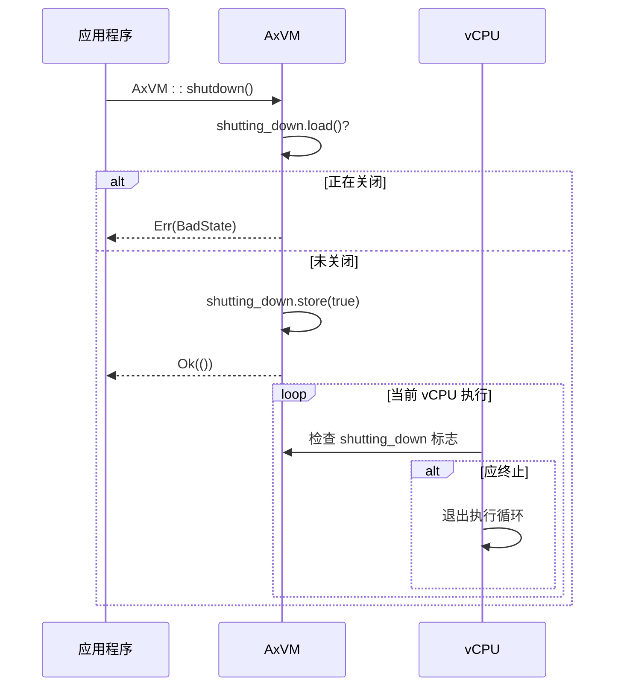
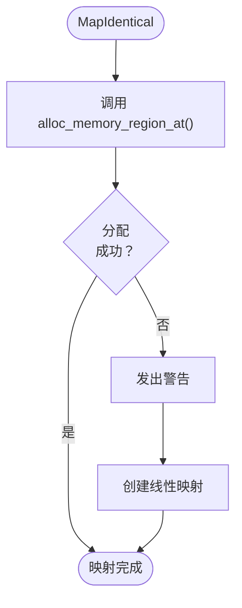

# 核心概念详解

<cite>
**本文档中引用的文件**
- [vm.rs](file://src/vm.rs)
- [vcpu.rs](file://src/vcpu.rs)
- [config.rs](file://src/config.rs)
- [hal.rs](file://src/hal.rs)
- [lib.rs](file://src/lib.rs)
</cite>

## 目录
1. [虚拟机生命周期管理](#虚拟机生命周期管理)
2. [vCPU工作原理与统一接口](#vcpu工作原理与统一接口)
3. [内存映射模式：MapIdentical与MapAlloc](#内存映射模式mapidentical与mapalloc)
4. [设备I/O处理流程](#设备io处理流程)
5. [VM Exit机制分析](#vm-exit机制分析)
6. [中断注入与地址空间转换](#中断注入与地址空间转换)

## 虚拟机生命周期管理

AxVM通过`AxVM::new()`、`boot()`和`shutdown()`方法实现完整的虚拟机生命周期控制。创建阶段完成资源配置，启动阶段激活运行状态，关闭阶段终止执行。



**图示来源**
- [vm.rs](file://src/vm.rs#L69-L283)

### 启动流程：AxVM::boot()

`AxVM::boot()`方法通过设置`running`原子标志位来激活已创建的虚拟机。在启动前会检查硬件虚拟化支持并确保虚拟机未处于运行状态。若任一检查失败，则返回相应错误（`Unsupported`或`BadState`）。成功后，虚拟机进入运行状态，允许vCPU在被调度时开始执行。值得注意的是，调用`boot()`不会立即开始指令执行，而是启用vCPU通过后续`run_vcpu()`调用运行的能力。



**图示来源**
- [vm.rs](file://src/vm.rs#L274-L287)

**本节来源**
- [vm.rs](file://src/vm.rs#L274-L287)

### 关闭流程：AxVM::shutdown()

`AxVM::shutdown()`方法通过设置`shutting_down`原子标志位来启动虚拟机的受控终止。在此之前，它会检查虚拟机是否已处于关闭阶段，若是则返回`BadState`错误。一旦启动，关闭标志将阻止任何新的vCPU执行，并向现有执行发出终止信号。尽管当前实现不会强制正在运行的vCPU立即停止，但该标志为高层关闭逻辑提供了协调机制。关闭后，虚拟机无法重新启动，因为不支持重新初始化。



**图示来源**
- [vm.rs](file://src/vm.rs#L290-L316)

**本节来源**
- [vm.rs](file://src/vm.rs#L290-L316)

## vCPU工作原理与统一接口

vCPU的执行模型基于架构特定的底层实现，但在上层提供统一接口。`AxArchVCpuImpl`根据目标架构（x86_64、riscv64、aarch64）选择具体实现。

### 架构无关的执行入口

`AxVM::run_vcpu`是执行vCPU的主要方法，它检索指定ID的vCPU并调用其`bind`和`run`方法。`bind`方法将vCPU与当前物理CPU线程关联，建立执行上下文。`run`方法进入低级VM执行循环（如x86上的`VMLAUNCH`/`VMRESUME`，RISC-V上的`VMSAVE`/`VMLOAD`，AArch64上的`HVC`），直到发生VM退出。

```mermaid
flowchart TD
Start([run_vcpu(vcpu_id)]) --> Bind["vcpu.bind()"]
Bind --> RunLoop["循环:"]
RunLoop --> Run["vcpu.run()"]
Run --> Exit{"VM 退出?"}
Exit --> |是| Handle["匹配 exit_reason"]
Handle --> MmioRead["MMIO 读取?"]
MmioRead --> |是| EmulateRead["get_devices().handle_mmio_read()"]
EmulateRead --> SetGPR["vcpu.set_gpr(reg, val)"]
SetGPR --> Continue["继续循环"]
Handle --> MmioWrite["MMIO 写入?"]
MmioWrite --> |是| EmulateWrite["get_devices().handle_mmio_write()"]
EmulateWrite --> CompleteWrite["完成写入"]
CompleteWrite --> Continue
Handle --> IoRead["端口 I/O 读取?"]
IoRead --> |是| PortRead["get_devices().handle_port_read()"]
PortRead --> SetReg["vcpu.set_gpr(0, val)"]
SetReg --> Continue
Handle --> SysReg["系统寄存器访问?"]
SysReg --> |是| HandleSysReg["get_devices().handle_sys_reg_*()"]
HandleSysReg --> UpdateReg["更新 GPR"]
UpdateReg --> Continue
Handle --> PageFault["嵌套页错误?"]
PageFault --> |是| FixPageTable["address_space.handle_page_fault()"]
FixPageTable --> Continue
Handle --> Unhandled["其他原因"]
Unhandled --> BreakLoop["跳出循环"]
BreakLoop --> ReturnReason["返回 exit_reason"]
```

**图示来源**
- [vm.rs](file://src/vm.rs#L403-L487)

**本节来源**
- [vm.rs](file://src/vm.rs#L403-L487)
- [vcpu.rs](file://src/vcpu.rs#L0-L30)

## 内存映射模式MapIdentical与MapAlloc

axvm支持两种不同的内存区域映射策略：`MapIdentical`和`MapAlloc`，分别适用于不同场景。

### MapIdentical 策略

`MapIdentical`策略尝试在与客户物理地址相同的地址处分配主机物理内存。它首先通过HAL接口调用`H::alloc_memory_region_at()`来保留物理内存。如果分配失败，它仍会继续进行映射，只是发出警告。这种方法实现了客户机与主机之间的直接物理地址对应。



**图示来源**
- [vm.rs](file://src/vm.rs#L108-L150)
- [hal.rs](file://src/hal.rs#L15-L18)

### MapAlloc 策略

`MapAlloc`策略在不需要特定地址的情况下分配物理内存。它使用`map_alloc()`将连续的客户虚拟地址映射到非连续的物理页面，提供了更大的内存管理灵活性，但由于缺乏物理连续性可能会牺牲性能。

这两种策略的选择取决于系统需求：当需要物理地址一致性时（例如DMA操作），优先使用`MapIdentical`；而在资源受限环境中，`MapAlloc`能提供更好的内存利用率。

**本节来源**
- [vm.rs](file://src/vm.rs#L152-L188)

## 设备I/O处理流程

AxVM将所有I/O操作委托给`AxVmDevices`，该组件同时支持模拟设备和直通设备。当vCPU因MMIO、PIO或系统寄存器访问而退出时，控制权返回到VMM。

### MM