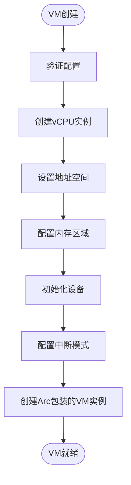
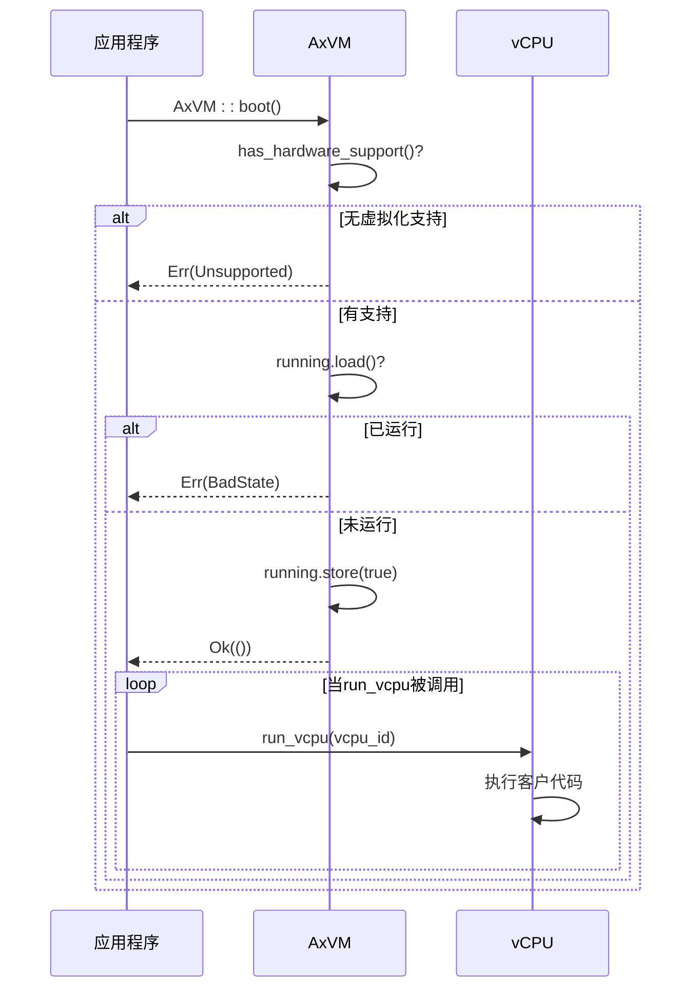
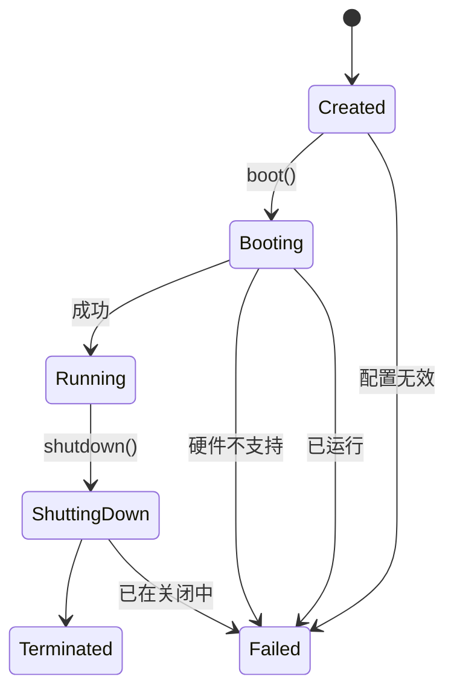

<cite>
**Referenced Files in This Document**
- [vm.rs](file://src/vm.rs)
- [config.rs](file://src/config.rs)
- [vcpu.rs](file://src/vcpu.rs)
- [hal.rs](file://src/hal.rs)
- [lib.rs](file://src/lib.rs)
</cite>

# 虚拟机生命周期管理

## Table of Contents
1. [虚拟机生命周期概述](#虚拟机生命周期概述)
2. [创建阶段：AxVM::new()](#创建阶段axvmnew)
3. [启动阶段：boot()](#启动阶段boot)
4. [运行阶段：run_vcpu()](#运行阶段run_vcpu)
5. [关闭阶段：shutdown()](#关闭阶段shutdown)
6. [生命周期序列图](#生命周期序列图)
7. [错误码分析](#错误码分析)
8. [完整生命周期代码示例](#完整生命周期代码示例)

## 虚拟机生命周期概述

AxVM虚拟机的完整生命周期包含四个关键阶段：创建、启动、运行和关闭。每个阶段都有明确的状态转换和安全检查机制，确保虚拟机在受控环境下执行。整个生命周期由`AxVM`结构体管理，通过原子标志位协调状态转换，防止并发访问导致的状态不一致。

**Section sources**
- [vm.rs](file://src/vm.rs#L69-L283)
- [vm.rs](file://src/vm.rs#L274-L287)
- [vm.rs](file://src/vm.rs#L290-L316)

## 创建阶段：AxVM::new()

`AxVM::new()`构造函数负责初始化虚拟机实例，基于提供的`AxVMConfig`配置参数完成一系列关键设置：

1. **vCPU初始化**：根据配置中的CPU数量和亲和性设置创建vCPU实例
2. **地址空间建立**：使用预定义的基址和大小参数创建空的地址空间
3. **内存区域处理**：根据映射类型（MapIdentical或MapAlloc）配置内存区域
4. **设备初始化**：基于配置初始化模拟设备和直通设备
5. **中断模式配置**：根据是否启用直通模式配置中断处理

该过程返回一个`Arc<AxVM>`引用，允许多个组件共享所有权的同时确保对VM实例的线程安全访问。



**Diagram sources**
- [vm.rs](file://src/vm.rs#L69-L283)

**Section sources**
- [vm.rs](file://src/vm.rs#L69-L283)
- [config.rs](file://src/config.rs#L94-L195)

## 启动阶段：boot()

`boot()`方法通过设置`running`原子标志来激活先前创建的虚拟机。在启动前，系统会验证硬件虚拟化支持并确保虚拟机尚未运行。如果任一检查失败，则返回相应的错误（Unsupported或BadState）。成功后，虚拟机进入运行状态，允许vCPU在被调度时开始执行。

值得注意的是，调用`boot()`并不会立即开始指令执行；它只是启用了vCPU通过后续调用`run_vcpu()`运行的能力。这种分离设计允许对何时开始执行进行细粒度控制，支持延迟启动或多虚拟机协调初始化等用例。



**Diagram sources**
- [vm.rs](file://src/vm.rs#L274-L287)

**Section sources**
- [vm.rs](file://src/vm.rs#L274-L287)

## 运行阶段：run_vcpu()

`run_vcpu()`方法在虚拟机运行期间负责执行vCPU的指令循环。当被调用时，指定ID的vCPU将开始执行客户机代码，直到遇到退出条件。该方法实现了对各种退出原因的处理，包括MMIO读写、I/O操作、系统寄存器访问和页错误等。

对于需要模拟的设备访问，`run_vcpu()`会调用`get_devices()`获取设备管理器，并委托其处理相应的读写请求。处理完成后，控制权返回给vCPU继续执行。这种设计实现了硬件虚拟化与设备模拟的清晰分离。

**Section sources**
- [vm.rs](file://src/vm.rs#L318-L361)

## 关闭阶段：shutdown()

`shutdown()`方法通过设置`shutting_down`原子标志来启动虚拟机的优雅终止。首先，它会检查虚拟机是否已经在关闭过程中，如果是则返回`BadState`错误。一旦启动，关闭标志会阻止任何新的vCPU执行，并向现有执行发出终止信号。

当前实现的一个关键限制是不支持重启功能。文档明确指出"re-init"过程尚未实现，这意味着虚拟机只能启动一次。关闭后无法重新启动，强制执行单次使用生命周期模式。这一设计决策简化了状态管理，但在需要虚拟机重用的应用中需要特别注意。



**Diagram sources**
- [vm.rs](file://src/vm.rs#L290-L316)

**Section sources**
- [vm.rs](file://src/vm.rs#L290-L316)

## 生命周期序列图

以下序列图展示了从应用程序调用到内部状态转换的完整生命周期过程：

```mermaid
sequenceDiagram
participant App as 应用程序
participant VM as AxVM
participant CPU as vCPU
participant HAL as HAL
App->>VM : AxVM::new(config)
VM->>HAL : has_hardware_support()
HAL-->>VM : true/false
alt 硬件支持
VM->>VM : 初始化vCPU列表
VM->>VM : 设置地址空间
VM->>VM : 配置内存区域
VM->>VM : 初始化设备
VM->>VM : 配置中断模式
VM-->>App : Arc<AxVM>
App->>VM : vm.boot()
VM->>VM : running.load()?
alt 未运行
VM->>VM : running.store(true)
VM-->>App : Ok(())
else