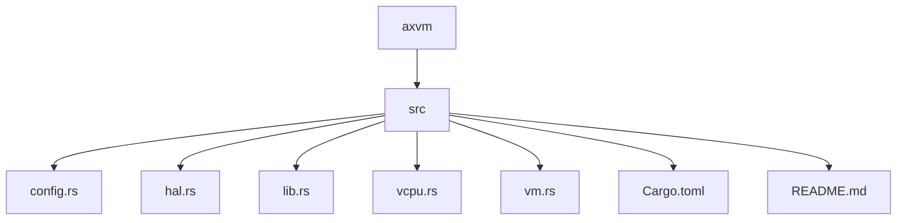
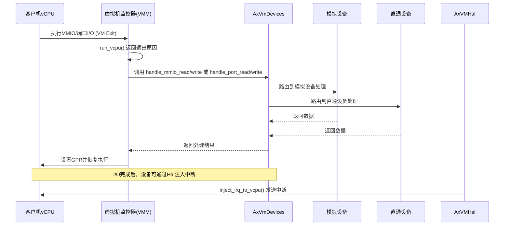
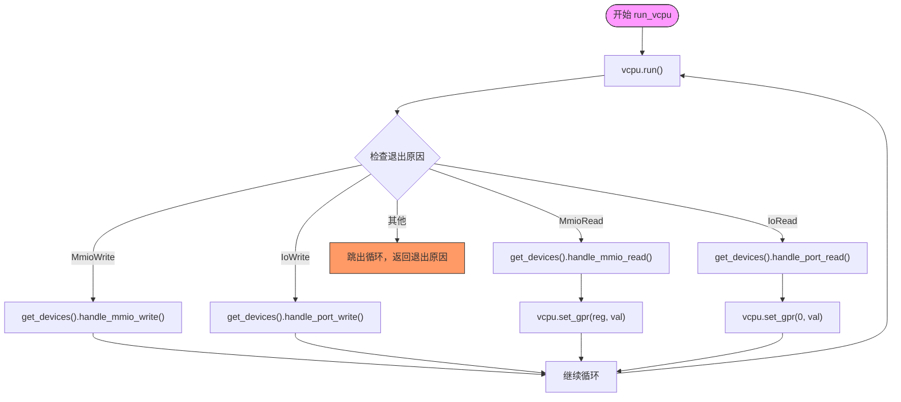
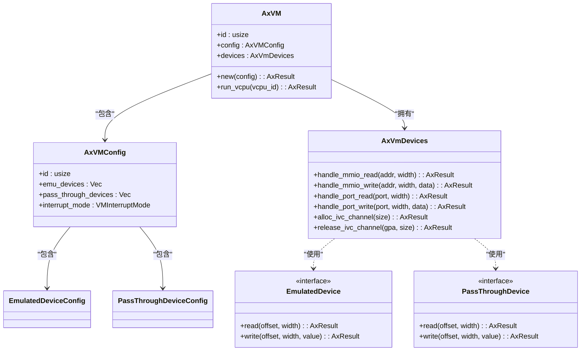
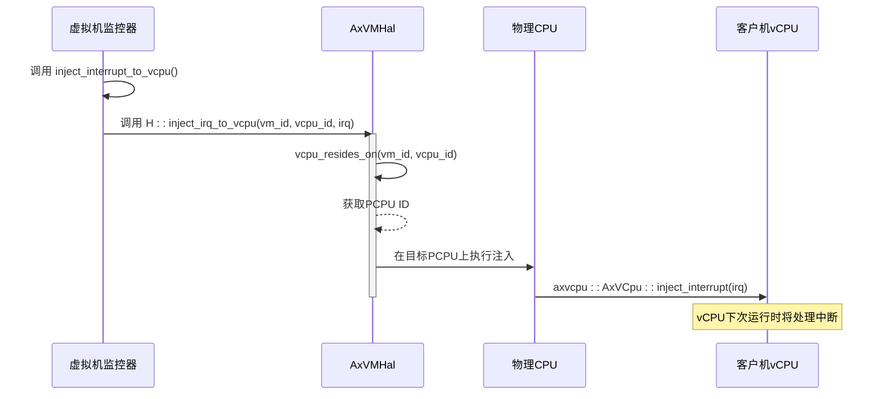

# 设备I/O处理机制

<cite>
**本文档引用的文件**
- [vm.rs](file://src/vm.rs)
- [hal.rs](file://src/hal.rs)
- [config.rs](file://src/config.rs)
</cite>

## 目录
1. [简介](#简介)
2. [项目结构](#项目结构)
3. [核心组件](#核心组件)
4. [架构概述](#架构概述)
5. [详细组件分析](#详细组件分析)
6. [依赖分析](#依赖分析)
7. [性能考虑](#性能考虑)
8. [故障排除指南](#故障排除指南)
9. [结论](#结论)

## 简介
本文档系统阐述了axvm中设备I/O的截获与响应机制。重点说明当vCPU访问MMIO或端口I/O时触发VM Exit，`run_vcpu()`返回`MmioRead/Write`或`IoRead/Write`退出原因，VMM需调用`get_devices().handle_mmio_read()`等方法进行处理。解释`AxVmDevices`组件如何路由请求至相应的模拟设备或透传设备。结合`AxVMHal`中的中断注入接口`inject_irq_to_vcpu()`，说明设备完成I/O后如何向目标vCPU发送中断通知。区分模拟设备（emu_devices）与直通设备（pass_through_devices）在配置和运行时的不同处理路径。

## 项目结构
axvm项目采用模块化设计，主要包含虚拟机管理、vCPU调度、设备管理和硬件抽象层等核心模块。其目录结构清晰地反映了功能划分。

**图示来源**
- [vm.rs](file://src/vm.rs#L0-L44)
- [config.rs](file://src/config.rs#L0-L33)

**本节来源**
- [vm.rs](file://src/vm.rs#L0-L44)
- [config.rs](file://src/config.rs#L0-L33)

## 核心组件
axvm的核心组件包括虚拟机实例（AxVM）、vCPU管理、设备管理（AxVmDevices）以及硬件抽象层（AxVMHal）。这些组件协同工作，实现对客户机I/O操作的截获和响应。

**本节来源**
- [vm.rs](file://src/vm.rs#L73-L152)
- [hal.rs](file://src/hal.rs#L0-L43)

## 架构概述
axvm的I/O处理架构围绕虚拟机监控器（VMM）与客户机之间的交互构建。当客户机vCPU执行I/O指令时，会触发VM Exit，控制权交还给VMM，由VMM负责处理该I/O请求。

**图示来源**
- [vm.rs](file://src/vm.rs#L424-L450)
- [hal.rs](file://src/hal.rs#L40-L43)

## 详细组件分析

### I/O截获与处理流程分析
当vCPU访问MMIO或端口I/O时，硬件虚拟化扩展会强制产生VM Exit，将控制权交还给VMM。`run_vcpu()`函数是处理这一过程的核心。

#### I/O处理循环

**图示来源**
- [vm.rs](file://src/vm.rs#L424-L450)

**本节来源**
- [vm.rs](file://src/vm.rs#L403-L487)

### AxVmDevices设备路由机制
`AxVmDevices`组件负责根据I/O地址将请求路由到正确的设备驱动进行处理。它在虚拟机创建时根据配置初始化，并管理所有模拟和直通设备。

#### 设备初始化与配置

**图示来源**
- [vm.rs](file://src/vm.rs#L190-L226)
- [config.rs](file://src/config.rs#L66-L103)

**本节来源**
- [vm.rs](file://src/vm.rs#L152-L226)
- [config.rs](file://src/config.rs#L33-L64)

### 中断注入机制分析
当设备完成I/O操作后，需要通知客户机vCPU。这通过`AxVMHal`提供的`inject_irq_to_vcpu()`接口实现，该接口是连接VMM与底层硬件的关键桥梁。

#### 中断注入流程

**图示来源**
- [vm.rs](file://src/vm.rs#L489-L538)
- [hal.rs](file://src/hal.rs#L40-L43)

**本节来源**
- [vm.rs](file