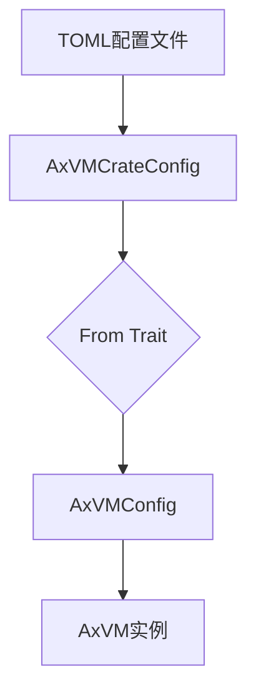
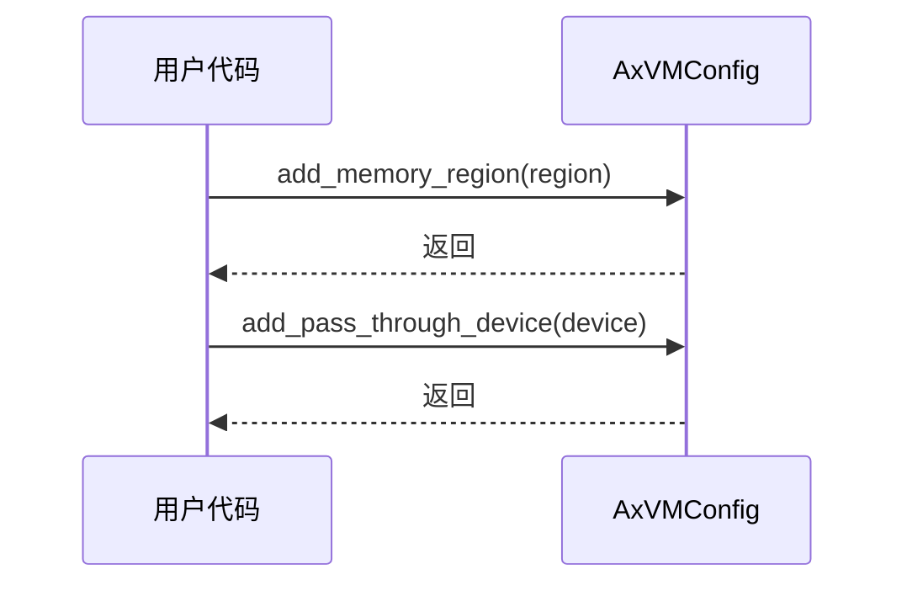
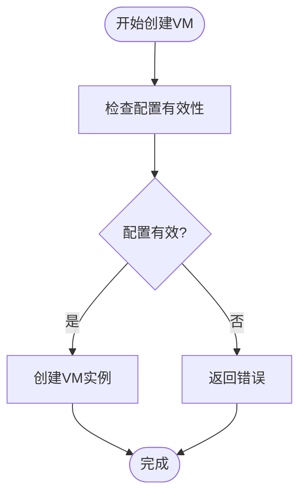

# 配置管理

<cite>
**本文档中引用的文件**
- [config.rs](file://src/config.rs)
- [vm.rs](file://src/vm.rs)
</cite>

## 目录
1. [引言](#引言)
2. [配置转换流程](#配置转换流程)
3. [AxVMConfig结构体字段详解](#axvmconfig结构体字段详解)
4. [配置构建方法](#配置构建方法)
5. [合法配置文件示例](#合法配置文件示例)
6. [常见配置错误](#常见配置错误)
7. [配置验证逻辑](#配置验证逻辑)
8. [配置驱动设计的优势](#配置驱动设计的优势)

## 引言
axvm的配置管理系统负责将TOML格式的`AxVMCrateConfig`转换为运行时使用的`AxVMConfig`。该系统通过清晰的结构化配置，实现了虚拟机资源（CPU、内存、设备等）的灵活定义和管理。本文档详细说明了配置转换过程、各字段含义、构建方法使用方式以及验证机制。

**Section sources**
- [config.rs](file://src/config.rs#L0-L31)

## 配置转换流程
配置转换从TOML文件中的`AxVMCrateConfig`开始，在创建虚拟机实例时自动转换为`AxVMConfig`。这一转换通过`From<AxVMCrateConfig> for AxVMConfig`实现，确保所有配置项被正确映射到运行时结构中。转换后的`AxVMConfig`用于初始化`AxVM`实例，并在虚拟机生命周期内提供只读访问。



**Diagram sources**
- [config.rs](file://src/config.rs#L66-L103)
- [vm.rs](file://src/vm.rs#L43-L73)

**Section sources**
- [config.rs](file://src/config.rs#L66-L103)

## AxVMConfig结构体字段详解
`AxVMConfig`结构体包含虚拟机的所有配置信息：

- **id**: 虚拟机唯一标识符，从配置文件中获取。
- **name**: 虚拟机名称，便于识别和管理。
- **cpu_num**: 分配给虚拟机的vCPU数量。
- **phys_cpu_ids**: 可选的物理CPU ID列表，用于指定vCPU与pCPU的绑定关系。
- **phys_cpu_sets**: 可选的CPU亲和性掩码，控制vCPU调度策略。
- **memory_regions**: 内存区域列表，每个区域包含GPA地址和大小。
- **emu_devices**: 模拟设备列表，定义由VMM提供的虚拟设备。
- **pass_through_devices**: 直通设备列表，允许虚拟机直接访问物理设备。
- **spi_list**: 直通SPI中断列表，用于中断传递。
- **interrupt_mode**: 中断模式，决定虚拟机处理中断的方式。

**Section sources**
- [config.rs](file://src/config.rs#L33-L64)

## 配置构建方法
### add_memory_region
此方法用于向虚拟机配置中添加新的内存区域。调用时需传入一个`VmMemConfig`对象，包含GPA地址和内存大小。新区域会被追加到现有内存区域列表末尾。

### add_pass_through_device
该方法用于添加直通设备到虚拟机配置。接受一个`PassThroughDeviceConfig`参数，配置完成后设备可被虚拟机直接访问，提升I/O性能。



**Diagram sources**
- [config.rs](file://src/config.rs#L131-L168)
- [config.rs](file://src/config.rs#L170-L194)

**Section sources**
- [config.rs](file://src/config.rs#L131-L194)

## 合法配置文件示例
以下是一个合法的TOML配置文件模板：
```toml
[base]
id = 1
name = "example_vm"
vm_type = "Standard"
cpu_num = 4

[kernel]
entry_point = 0x80000000
kernel_load_addr = 0x80200000
memory_regions = [
  { gpa = 0x80000000, size = 0x10000000 },
]

[devices]
interrupt_mode = "Legacy"
emu_devices = []
passthrough_devices = []
```

## 常见配置错误
- **重叠内存区域**: 多个内存区域的GPA范围发生重叠，可能导致数据冲突。
- **无效设备地址**: 设备配置中使用了不存在或不可访问的物理地址。
- **超出范围的CPU数量**: 请求的vCPU数量超过宿主机支持的最大值。
- **缺失必要字段**: 如未指定入口点地址或内存区域，导致虚拟机无法启动。

## 配置验证逻辑
配置验证在`AxVM::new`方法中执行，当传入`AxVMConfig`创建虚拟机实例时进行。如果配置无效（如硬件不支持虚拟化或状态错误），会返回相应的错误码。验证失败将阻止虚拟机创建，确保系统稳定性。



**Diagram sources**
- [vm.rs](file://src/vm.rs#L43-L73)

**Section sources**
- [vm.rs](file://src/vm.rs#L43-L73)

## 配置驱动设计的优势
配置驱动的设计显著提升了系统的灵活性和可部署性。通过外部化配置，无需修改代码即可调整虚拟机资源分配。这种解耦设计使得同一二进制文件可在不同环境中部署，只需更换配置文件。同时，配置的清晰结构便于自动化工具生成和验证，提高了运维效率。