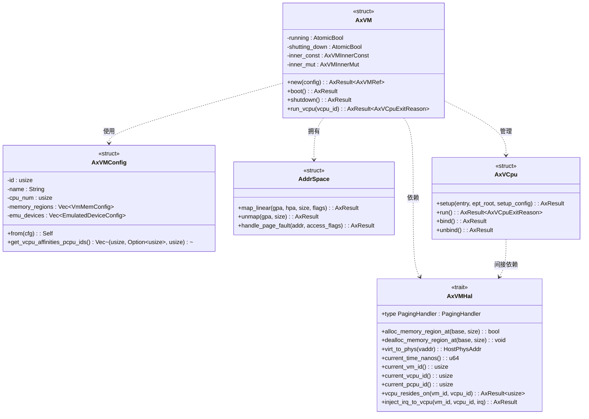
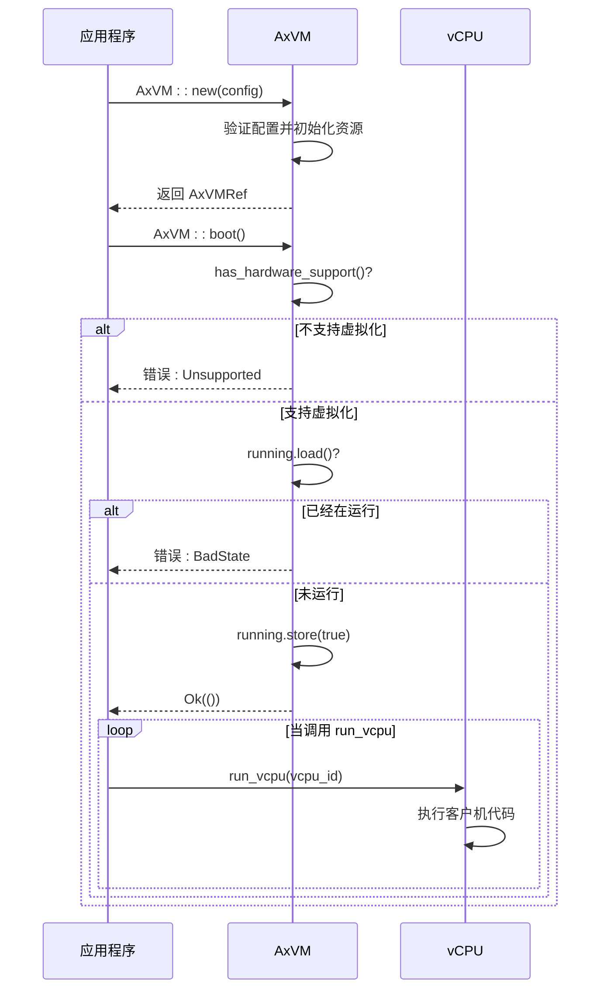
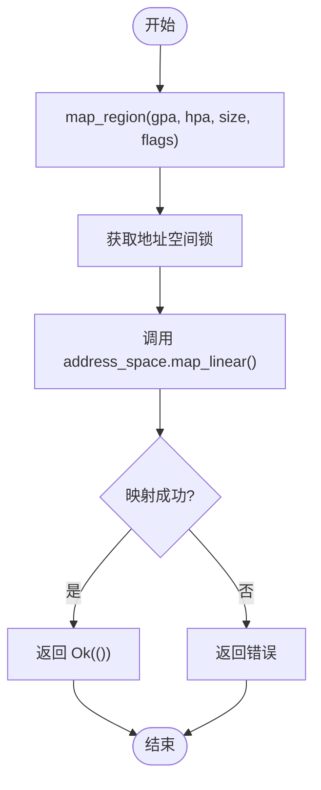

# 项目概述

<cite>
**本文档中引用的文件**  
- [README.md](file://README.md)
- [Cargo.toml](file://Cargo.toml)
- [src/lib.rs](file://src/lib.rs)
- [src/vm.rs](file://src/vm.rs)
- [src/config.rs](file://src/config.rs)
- [src/hal.rs](file://src/hal.rs)
- [src/vcpu.rs](file://src/vcpu.rs)
</cite>

## 目录
1. [简介](#简介)
2. [项目结构](#项目结构)
3. [核心组件分析](#核心组件分析)
4. [架构概览](#架构概览)
5. [详细组件分析](#详细组件分析)
6. [硬件抽象层（HAL）设计](#硬件抽象层hal设计)
7. [生命周期管理](#生命周期管理)
8. [跨平台支持与条件编译](#跨平台支持与条件编译)
9. [实际应用场景](#实际应用场景)
10. [结论](#结论)

## 简介
axvm 是 ArceOS 生态系统中的一个轻量级虚拟机监控器（VMM）资源管理库，旨在为运行客户虚拟机提供跨架构的资源管理能力。该项目支持 x86_64、RISC-V 和 AArch64 平台，并通过 AxVMHal 抽象层与底层操作系统或超级管理程序集成。其核心价值主张在于模块化、可扩展且高性能的设计，作为 VMM 基础库服务于更复杂的虚拟化应用。

本项目专注于虚拟机的核心资源管理功能，包括 vCPU 调度、内存地址空间管理和设备 I/O 处理。它利用 Rust 的类型安全和零成本抽象特性，构建了一个高效且安全的虚拟化基础框架。通过 trait 对象实现 HAL 解耦，使得上层 VMM 可以灵活适配不同的宿主环境，而无需修改核心逻辑。

## 项目结构
axvm 项目的目录结构简洁明了，体现了关注点分离的设计原则。所有核心源码位于 `src/` 目录下，按功能划分为多个模块。

```mermaid
graph TB
src[src/] --> lib[lib.rs]
src --> config[config.rs]
src --> hal[hal.rs]
src --> vm[vm.rs]
src --> vcpu[vcpu.rs]
lib --> "AxVM: 核心虚拟机构造"
config --> "AxVMConfig: VM配置解析"
hal --> "AxVMHal: 硬件抽象接口"
vm --> "AxVM: 虚拟机状态与控制"
vcpu --> "vCPU 架构特定实现"
```

**图示来源**
- [src/lib.rs](file://src/lib.rs#L0-L32)
- [src/vm.rs](file://src/vm.rs#L0-L44)
- [src/config.rs](file://src/config.rs#L0-L31)
- [src/hal.rs](file://src/hal.rs#L0-L43)
- [src/vcpu.rs](file://src/vcpu.rs#L0-L29)

**章节来源**
- [src/lib.rs](file://src/lib.rs#L0-L32)
- [src/vm.rs](file://src/vm.rs#L0-L44)

## 核心组件分析
axvm 的核心由五个主要部分构成：`lib.rs` 提供公共接口，`vm.rs` 实现虚拟机主体逻辑，`config.rs` 处理配置数据，`hal.rs` 定义硬件抽象层，`vcpu.rs` 封装架构相关的 vCPU 行为。这些组件协同工作，形成一个完整的虚拟机监控器基础库。

各模块职责明确：
- **lib.rs**: 导出公共 API，定义全局类型别名。
- **vm.rs**: 管理虚拟机生命周期、内存映射和 vCPU 执行循环。
- **config.rs**: 将外部 TOML 配置转换为内部可用的数据结构。
- **hal.rs**: 提供与宿主系统交互的标准接口。
- **vcpu.rs**: 根据目标架构选择合适的 vCPU 实现。

这种模块化设计确保了代码的可维护性和可测试性，同时也便于未来功能的扩展。

**章节来源**
- [src/lib.rs](file://src/lib.rs#L0-L32)
- [src/vm.rs](file://src/vm.rs#L0-L44)
- [src/config.rs](file://src/config.rs#L0-L31)
- [src/hal.rs](file://src/hal.rs#L0-L43)
- [src/vcpu.rs](file://src/vcpu.rs#L0-L29)

## 架构概览
axvm 的整体架构采用分层设计，清晰地划分了不同层次的关注点。最上层是虚拟机实例（AxVM），它依赖于配置对象（AxVMConfig）进行初始化，并通过硬件抽象层（AxVMHal）与底层系统通信。在内部，虚拟机管理一组 vCPU 实例和一个地址空间对象，用于处理客户机的执行和内存访问。



**图示来源**
- [src/vm.rs](file://src/vm.rs#L43-L73)
- [src/config.rs](file://src/config.rs#L33-L64)
- [src/hal.rs](file://src/hal.rs#L0-L43)
- [src/vm.rs](file://src/vm.rs#L108-L150)
- [src/vm.rs](file://src/vm.rs#L403-L424)

**章节来源**
- [src/vm.rs](file://src/vm.rs#L43-L73)
- [src/config.rs](file://src/config.rs#L33-L64)
- [src/hal.rs](file://src/hal.rs#L0-L43)

## 详细组件分析
### AxVM 结构体分析
`AxVM` 是整个库的核心数据结构，代表一个正在运行的虚拟机实例。它包含两个内部结构体：`AxVMInnerConst` 存储不可变配置和静态资源列表，`AxVMInnerMut` 包含需要并发访问保护的可变状态，如地址空间。

#### 生命周期方法
`AxVM` 提供了完整的虚拟机生命周期管理方法，包括创建、启动、运行和关闭。



**图示来源**
- [src/vm.rs](file://src/vm.rs#L66-L318)
- [src/vm.rs](file://src/vm.rs#L363-L380)

**章节来源**
- [src/vm.rs](file://src/vm.rs#L66-L318)

#### 内存管理方法
`AxVM` 提供了对客户机内存的精细控制，允许动态映射和取消映射物理内存区域。



**图示来源**
- [src/vm.rs](file://src/vm.rs#L522-L534)
- [src/vm.rs](file://src/vm.rs#L536-L539)

**章节来源**
- [src/vm.rs](file://src/vm.rs#L522-L539)

### AxVMConfig 配置解析
`AxVMConfig` 结构体封装了创建虚拟机所需的所有参数，从 ID、名称到 CPU 数量、内存布局和设备配置。它通过 `From<AxVMCrateConfig>` 特性从外部 TOML 文件生成的配置对象转换而来，实现了配置格式与内部表示的解耦。

```mermaid
erDiagram
    AXVMCONFIG {
        usize