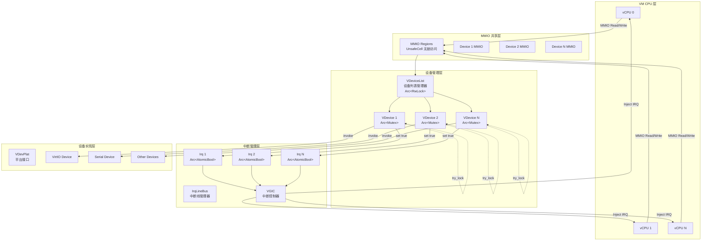
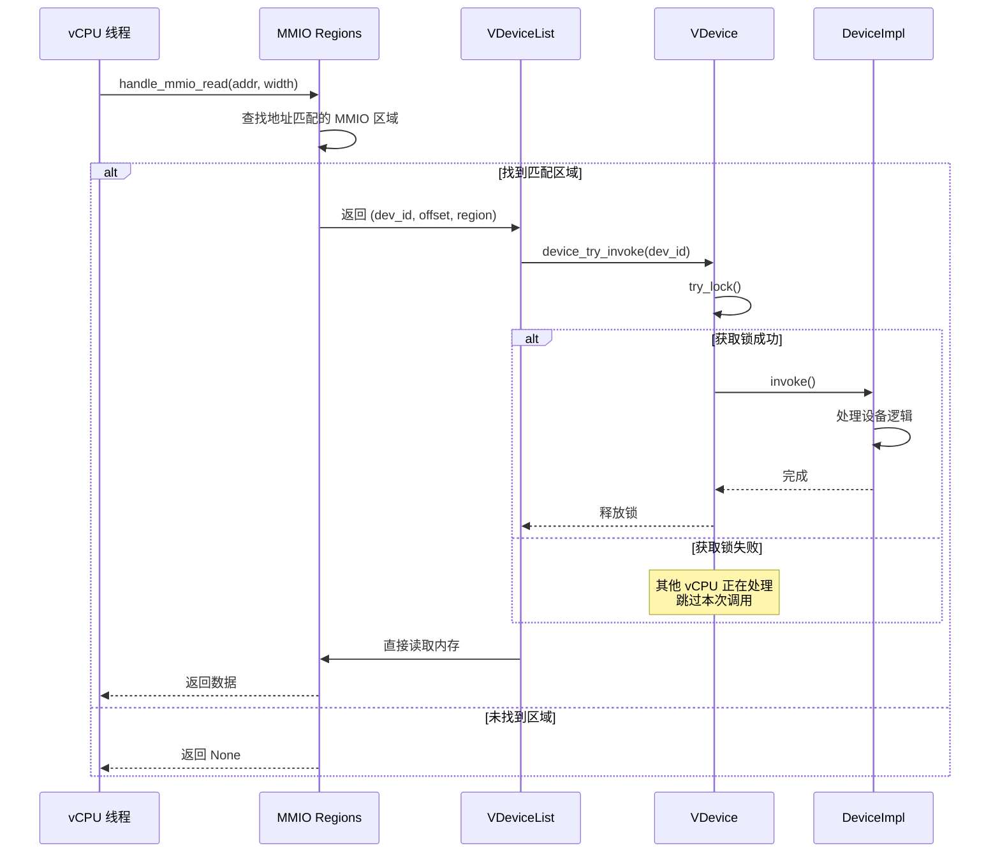
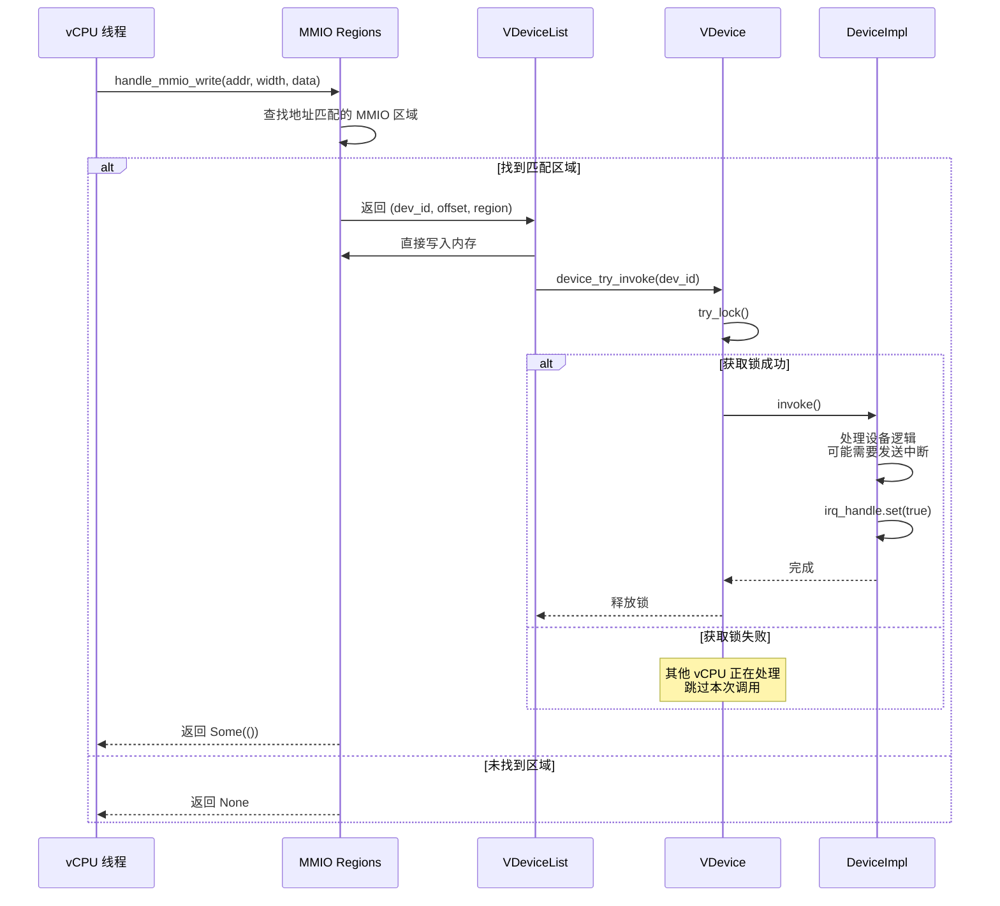
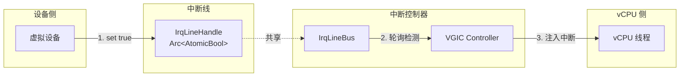
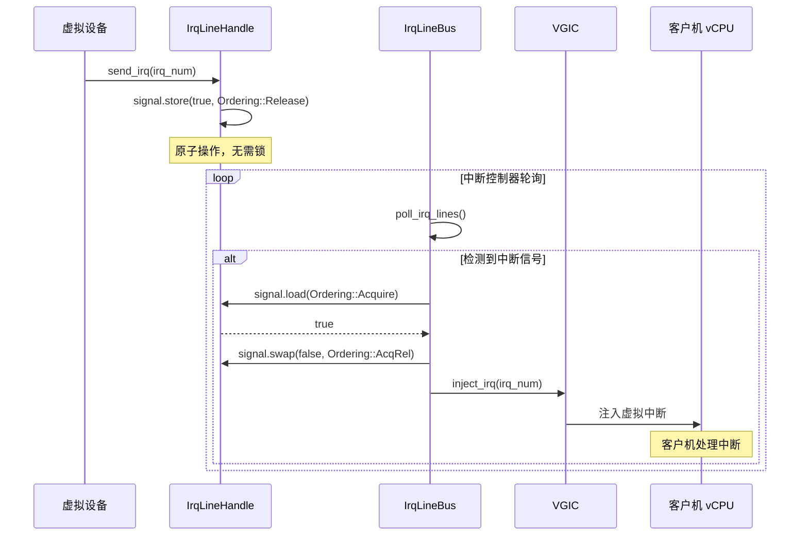
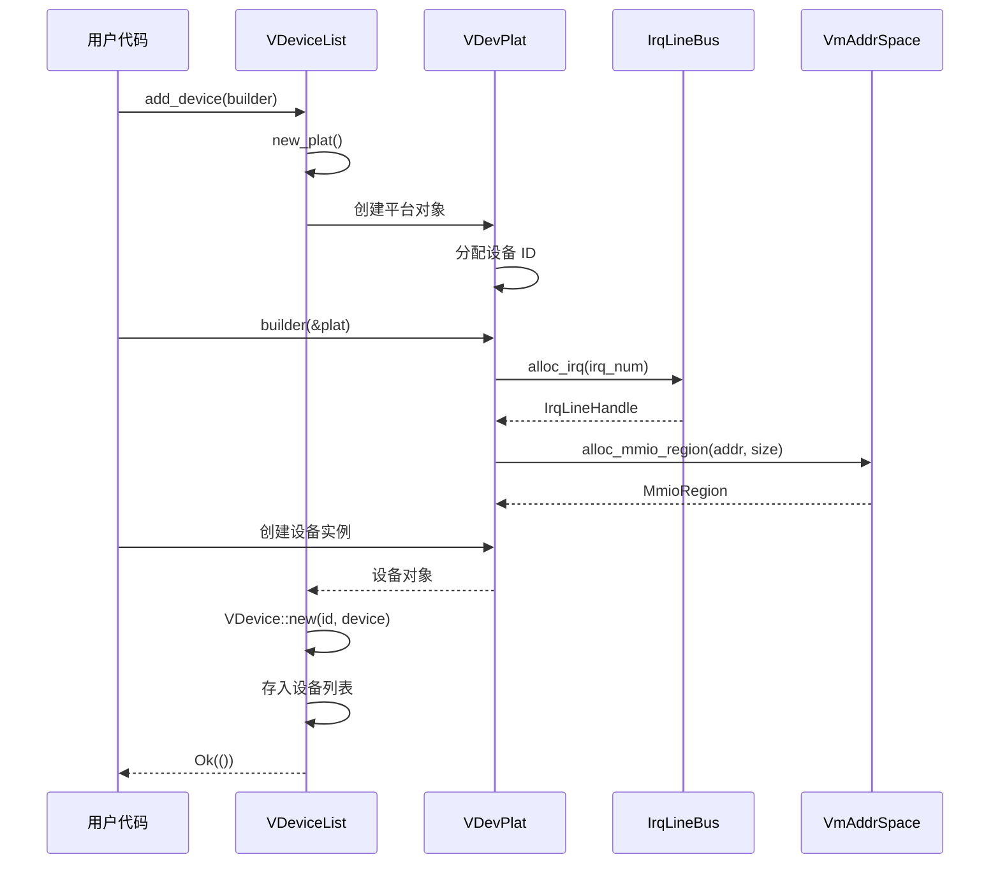

# 虚拟设备管理设计方案

## 1. 概述

本文档描述 ArceOS axvisor 虚拟机管理器的虚拟设备管理子系统的设计方案。该系统旨在为虚拟机提供高效、可扩展的虚拟设备管理能力，支持多 vCPU 并发访问和无锁 MMIO 操作。

### 1.1 设计目标

- **高性能并发**: 支持多 vCPU 无锁共享 MMIO 区域
- **设备隔离**: 每个设备独立锁机制，避免全局锁竞争
- **异步中断**: 基于中断线模型的异步中断通知机制
- **可扩展性**: 支持动态设备添加和热插拔
- **类型安全**: 利用 Rust 类型系统确保内存安全

## 2. 系统架构

### 2.1 核心组件



### 2.2 数据结构

#### 2.2.1 虚拟设备 (VDevice)

```rust
#[derive(Clone)]
pub struct VDevice {
    id: u32,
    raw: Arc<Mutex<Box<dyn VirtDeviceOp>>>,
    irq_lines: Vec<IrqLineHandle>,  // 新增：中断线句柄
}
```

#### 2.2.2 设备列表 (VDeviceList)

```rust
#[derive(Clone)]
pub struct VDeviceList {
    inner: Arc<RwLock<Inner>>,
    vmspace: VmAddrSpace,
    mmio: MmioRegions,           // 无锁 MMIO 区域
    irq_bus: IrqLineBus,         // 新增：中断线管理器
}

struct Inner {
    id_alloc: IdAllocator,
    devices: BTreeMap<u32, VDevice>,
}
```

#### 2.2.3 中断线 (IrqLine)

```rust
/// 中断线句柄
#[derive(Clone)]
pub struct IrqLineHandle {
    irq: IrqNum,
    signal: Arc<AtomicBool>,
}

/// 中断线管理器
pub struct IrqLineBus {
    lines: BTreeMap<IrqNum, Arc<AtomicBool>>,
    irq_chip: Arc<dyn IrqChipOp>,
}
```

## 3. MMIO 处理流程

### 3.1 读操作流程



### 3.2 写操作流程



### 3.3 MMIO 并发控制设计

**关键特性**:

1. **无锁 MMIO 访问**: MMIO 区域使用 `UnsafeCell` 存储，vCPU 可以直接读写，无需加锁
2. **设备级锁**: 每个设备有独立的 `Mutex`，互不影响
3. **非阻塞调用**: 使用 `try_lock()` 而非 `lock()`，避免 vCPU 互相阻塞
4. **读写一致性**: 通过设备实现保证内存顺序

```rust
pub fn handle_mmio_read(&self, addr: GuestPhysAddr, width: AccessWidth) -> Option<usize> {
    // 无锁读取 MMIO 区域
    for (&id, region) in unsafe { &(*self.mmio.inner.get()).regions } {
        if addr >= region.gpa() && addr.as_usize() + width.size() <= region.gpa().as_usize() + region.size() {
            // 触发设备处理（非阻塞）
            self.device_try_invoke(id);

            // 直接内存读取（无锁）
            let offset = addr.as_usize() - region.gpa().as_usize();
            let access_ptr = unsafe { region.hva().as_ptr().add(offset) };
            let value = match width {
                AccessWidth::Byte => unsafe { *(access_ptr as *const u8) as usize },
                AccessWidth::Word => unsafe { *(access_ptr as *const u16) as usize },
                AccessWidth::Dword => unsafe { *(access_ptr as *const u32) as usize },
                AccessWidth::Qword => unsafe { *(access_ptr as *const u64) as usize },
            };
            return Some(value);
        }
    }
    None
}
```

## 4. 中断处理流程

### 4.1 中断线模型



### 4.2 中断发送流程



### 4.3 中断线管理器实现

```rust
impl IrqLineBus {
    /// 分配中断线
    pub fn alloc_irq(&mut self, irq: Option<IrqNum>) -> Option<IrqLineHandle> {
        let irq_num = irq.unwrap_or_else(|| {
            // 自动分配可用中断号
            (1..=self.max_irq)
                .find(|&n| !self.lines.contains_key(&n))
                .map(IrqNum)
                .unwrap()
        });

        let signal = Arc::new(AtomicBool::new(false));
        self.lines.insert(irq_num, signal.clone());

        Some(IrqLineHandle {
            irq: irq_num,
            signal,
        })
    }

    /// 轮询中断线（由中断控制器调用）
    pub fn poll_irq_lines(&self) -> Vec<IrqNum> {
        self.lines
            .iter()
            .filter(|(_, signal)| signal.load(Ordering::Acquire))
            .map(|(&irq, _)| irq)
            .collect()
    }

    /// 清除中断线
    pub fn clear_irq(&self, irq: IrqNum) -> bool {
        if let Some(signal) = self.lines.get(&irq) {
            signal.swap(false, Ordering::AcqRel)
        } else {
            false
        }
    }
}
```

### 4.4 设备发送中断

```rust
impl IrqLineHandle {
    /// 设备发送中断（无锁）
    pub fn raise(&self) {
        self.signal.store(true, Ordering::Release);
    }
}

// 在设备实现中使用
impl MyDevice {
    fn handle_write(&mut self, reg: u32, value: u32) {
        match reg {
            REG_IRQ_STATUS => {
                // 完成处理，发送中断
                self.irq_handle.raise();
            }
            _ => {...}
        }
    }
}
```

## 5. 设备注册和管理

### 5.1 设备注册流程



### 5.2 平台接口实现

```rust
impl VirtPlatformOp for VDevPlat {
    fn alloc_mmio_region(
        &self,
        addr: Option<axvdev::GuestPhysAddr>,
        size: usize,
    ) -> Option<MmioRegion> {
        self.vdevs
            .vmspace
            .new_mmio(
                self.id,
                addr.map(|addr| {
                    let raw: usize = addr.into();
                    raw.into()
                }),
                size,
            )
            .ok()
    }

    fn alloc_irq(&self, irq: Option<IrqNum>) -> Option<IrqNum> {
        // TODO: 从 IrqLineBus 分配中断线
        self.vdevs.irq_bus.alloc_irq(irq).map(|handle| handle.irq())
    }

    fn send_irq(&self, irq: IrqNum) {
        // TODO: 通过中断线发送中断
        if let Some(handle) = self.vdevs.irq_bus.get_handle(irq) {
            handle.raise();
        }
    }
}
```

## 6. 并发控制和性能优化

### 6.1 锁策略

| 组件 | 锁类型 | 粒度 | 阻塞策略 |
|------|--------|------|----------|
| VDeviceList | RwLock | 列表级 | 写操作阻塞 |
| VDevice | Mutex | 设备级 | try_lock 非阻塞 |
| MMIO Regions | UnsafeCell | 无锁 | 手动同步 |
| IrqLine | AtomicBool | 中断线级 | 无锁原子操作 |

### 6.2 并发场景分析

**场景 1: 多 vCPU 同时读取不同设备**

```
vCPU0 → Device1 (try_lock 成功) → 执行
vCPU1 → Device2 (try_lock 成功) → 执行
结果: 完全并行，无竞争
```

**场景 2: 多 vCPU 同时读取同一设备**

```
vCPU0 → Device1 (try_lock 成功) → 执行
vCPU1 → Device1 (try_lock 失败) → 跳过
结果: vCPU1 跳过设备调用，仅完成 MMIO 读写
```

**场景 3: 多 vCPU 读写不同 MMIO 区域**

```
vCPU0 → MMIO Region1 (无锁读取)
vCPU1 → MMIO Region2 (无锁读取)
结果: 完全并行，无锁竞争
```

### 6.3 性能优化要点

1. **MMIO 无锁访问**: vCPU 直接读写内存，避免锁开销
2. **设备调用异步化**: 使用 `try_lock` 避免 vCPU 互相阻塞
3. **中断线无锁操作**: `AtomicBool` 保证无锁中断通知
4. **读多写少优化**: 设备列表使用 `RwLock`
5. **缓存友好**: MMIO 区域连续映射，提高缓存命中率

## 7. 可行性分析

### 7.1 技术可行性

✅ **已验证组件**:
- MMIO 无锁访问: 现有实现已使用 `UnsafeCell`
- 设备级锁: 现有 `VDevice` 已使用 `Arc<Mutex>`
- 非阻塞调用: 现有 `try_invoke()` 已实现 `try_lock()`
- 中断控制器: arm_vgic 模块已完整实现

⚠️ **需要实现**:
- `IrqLineBus` 中断线管理器
- `IrqLineHandle` 中断线句柄
- `VirtPlatformOp` 的中断方法
- 中断轮询机制

### 7.2 性能预期

| 操作 | 当前实现 | 优化后预期 | 提升 |
|------|----------|------------|------|
| MMIO 读 | RwLock + 设备 Mutex | 无锁 + try_lock | 2-5x |
| MMIO 写 | RwLock + 设备 Mutex | 无锁 + try_lock | 2-5x |
| 中断发送 | 未实现 | AtomicBool | N/A |
| 设备查找 | BTreeMap | BTreeMap | 无变化 |

### 7.3 内存安全

**Rust 类型系统保证**:
- ✅ `Arc` 确保线程安全的引用计数
- ✅ `Mutex` 确保设备状态的独占访问
- ✅ `AtomicBool` 确保中断线的原子操作
- ✅ `unsafe` 块封装在安全接口内

**需要额外注意**:
- ⚠️ `UnsafeCell` 需要手动同步保证
- ⚠️ MMIO 内存顺序需要设备实现保证

## 8. 潜在风险和缓解措施

### 8.1 并发风险

| 风险 | 描述 | 影响 | 缓解措施 |
|------|------|------|----------|
| MMIO 竞态 | 多 vCPU 同时写同一寄存器 | 数据不一致 | 设备实现使用原子操作 |
| 设备饥饿 | 热点设备频繁被锁 | 其他 vCPU 总是跳过 | 设备内部细分锁 |
| 中断丢失 | 中断信号被覆盖 | 客户机未收到中断 | 使用边沿触发 + Pend 位 |

### 8.2 性能风险

| 风险 | 描述 | 影响 | 缓解措施 |
|------|------|------|----------|
| 轮询开销 | 中断轮询消耗 CPU | 整体性能下降 | 事件驱动 + 休眠 |
| 锁竞争 | 热点设备锁竞争 | 吞吐量下降 | 设备内部无锁设计 |
| 缓存失效 | MMIO 区域缓存失效 | 延迟增加 | 优化内存布局 |

### 8.3 正确性风险

| 风险 | 描述 | 影响 | 缓解措施 |
|------|------|------|----------|
| 内存顺序 | AtomicBool 内存顺序错误 | 中断丢失 | 使用 Release-Acquire |
| 设备状态 | try_lock 跳过导致状态不一致 | 功能错误 | 设备实现幂等性 |
| 中断注入 | VGIC 注入时序错误 | 中断处理异常 | 严格遵循 GIC 规范 |

## 9. 实施计划

### 9.1 实施阶段

**Phase 1: 中断线基础设施**
- [ ] 实现 `IrqLineHandle`
- [ ] 实现 `IrqLineBus`
- [ ] 添加单元测试

**Phase 2: 平台接口完善**
- [ ] 实现 `VirtPlatformOp::alloc_irq`
- [ ] 实现 `VirtPlatformOp::send_irq`
- [ ] 集成到 `VDevPlat`

**Phase 3: 中断控制器集成**
- [ ] 实现中断轮询机制
- [ ] 集成 VGIC 中断注入
- [ ] 添加集成测试

**Phase 4: 优化和测试**
- [ ] 性能基准测试
- [ ] 压力测试
- [ ] 文档完善

### 9.2 测试策略

**单元测试**:
- `IrqLineBus` 并发测试
- `IrqLineHandle` 原子性测试
- MMIO 访问正确性测试

**集成测试**:
- 多 vCPU 并发 MMIO 访问
- 中断发送和注入流程
- 设备热插拔测试

**压力测试**:
- 100+ vCPU 并发访问
- 高频中断发送（1M+ interrupts/sec）
- 长时间稳定性测试（24h+）

## 10. 附录

### 10.1 相关文件

- [modules/axvm/src/vm/vdev.rs](../modules/axvm/src/vm/vdev.rs) - 虚拟设备管理实现
- [modules/vdev-if/src/lib.rs](../modules/vdev-if/src/lib.rs) - 虚拟设备接口定义
- [modules/arm_vgic](../modules/arm_vgic) - ARM GIC 中断控制器实现

### 10.2 参考资料

- [ARM GICv3 Architecture Specification](https://developer.arm.com/documentation/ihi0069/latest/)
- [VirtIO Specification](https://docs.oasis-open.org/virtio/virtio/v1.2/cs01/virtio-v1.2-cs01.html)
- [Rust Atomic Ordering](https://doc.rust-lang.org/std/sync/atomic/enum.Ordering.html)
